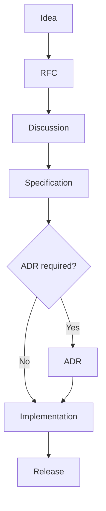

# Contributing to DevOS

## Welcome

Thank you for helping build the open workspace standard.
DevOS starts as a specification, and every contribution — a sentence, a schema, a diagram, an RFC — moves it forward.
This document explains how to contribute effectively.

## Ways to Contribute

There are many ways to help:

- **Specifications** — write, extend, or refine documents in [specification/](specification/).
- **Schemas** — improve the canonical JSON contracts in [schemas/](schemas/).
- **RFCs** — propose significant features in [rfcs/](rfcs/) using the provided template.
- **ADRs** — record architectural decisions in [adr/](adr/).
- **Diagrams** — add Mermaid, C4, or UML diagrams to [diagrams/](diagrams/).
- **Examples** — provide sample workspaces, plugins, providers, and templates in [examples/](examples/).
- **Tools** — build generators, validators, and scripts in [tools/](tools/).
- **Edits** — fix typos, clarify wording, align tables, repair links.

## The Golden Rule — Specification First

No feature may be implemented before it exists in the specification (Rule 1 of [SPECIFICATION_RULES.md](SPECIFICATION_RULES.md)).

Implementation without specification is not permitted.
When in doubt, open an issue describing the idea before writing anything else.

## Before You Open an Issue

Please check that:

1. The idea is not already covered by an existing specification. Search the [specification map](README.md#specification-map) first.
2. It does not duplicate another document's canonical content (Rule 10: one source of truth).
3. It respects the v0.1 scope; Enterprise and Future topics belong in their own ranges and require an ADR to activate.
4. You can state which rule or document your change affects.

A good issue names the affected DEVOS-SPEC number or schema and describes the developer problem being solved.

## Writing Specifications

Specifications live under `specification/<NN-range>/` and follow strict conventions.

### File Naming

- Files use `NNN-name.md` with lowercase hyphenated names, for example `020-workspace-specification.md`.
- Document numbers are permanent (Rule 11). They never change; only content evolves.
- New documents take the next free number in the appropriate range.

### Document Header

Every specification begins with the standard header block:

- Title as `NNN – Name`
- **Document ID:** `DEVOS-SPEC-NNN`
- **Version**, **Status**, and **Category**
- **Depends On:** and **Referenced By:** lists using en-dash entries

### Required Sections

Per Rule 15, every specification must include:

1. Purpose
2. Background
3. Goals
4. Non Goals
5. Architecture
6. Components
7. Interfaces
8. Security
9. Performance
10. Examples
11. Future Work
12. References
13. Revision History

Start from [templates/specification-template.md](templates/specification-template.md).

### Style Rules

- Use RFC-2119 keywords in uppercase: MUST, MUST NOT, SHOULD, MAY.
- Write short declarative sentences, one per line, with a blank line between sentences.
- Include Mermaid diagrams for major specifications (Rule 16): class diagrams for structure, flow graphs for composition, state diagrams for lifecycle, sequence diagrams for interactions.
- Align pipe tables with padded columns.
- Keep implementation details out; the specification is conceptual and vendor-neutral.
- Never duplicate another document's content; reference it instead.
- End every document with the revision history footer:

| Version | Date | Author             | Notes         |
| ------- | ---- | ------------------ | ------------- |
| 0.1     | TBD  | DevOS Contributors | Initial Draft |

## Changing Schemas

Schemas in [schemas/](schemas/) are the single source of truth (Rule 17).

- The schema defines the specification; documentation explains the schema; implementations validate against it.
- Schema changes require an accepted RFC **and** an ADR when they alter structure or semantics.
- Breaking changes additionally require a migration strategy, a SemVer version bump, and a deprecation notice (Rules 18 and 19).
- Update all affected specifications in the same change set so documents never drift from schemas.

## Commit & PR Guidelines

- Keep pull requests small and focused; one concept per PR.
- Link the relevant RFC, ADR, or issue in the description.
- Follow the existing style: short lines, one sentence per line in prose documents, aligned tables.
- Add or update diagrams whenever behavior or structure changes.
- Update [CHANGELOG.md](CHANGELOG.md) under the `Unreleased` section for every user-visible change.
- Do not modify document numbers, top-level directories, or other documents' canonical content.

## Review Process

1. A maintainer or reviewer triages new issues and pull requests.
2. Specification and schema changes require at least one review from a maintainer of the relevant area.
3. Significant features follow the full flow above: RFC, discussion, acceptance, then implementation.
4. Reviews focus on correctness, consistency with the rules, portability, security, and simplicity.
5. Changes are merged once reviews resolve and checks pass.

Expect honest, direct, kind feedback. Disagreement is resolved through discussion and evidence, not volume.

## Quick Checklist

Before opening a pull request, verify:

- [ ] The change follows Specification First (RFC exists if significant).
- [ ] File naming is `NNN-name.md` and numbers are untouched.
- [ ] All required sections from Rule 15 are present.
- [ ] RFC-2119 keywords are uppercase and used correctly.
- [ ] Prose uses one declarative sentence per line.
- [ ] Major specs include Mermaid diagrams.
- [ ] Tables are aligned and valid.
- [ ] Revision history footer is present and correct.
- [ ] Schemas and documents are consistent with each other.
- [ ] CHANGELOG.md has an entry under Unreleased.
- [ ] No unrelated files were modified.
