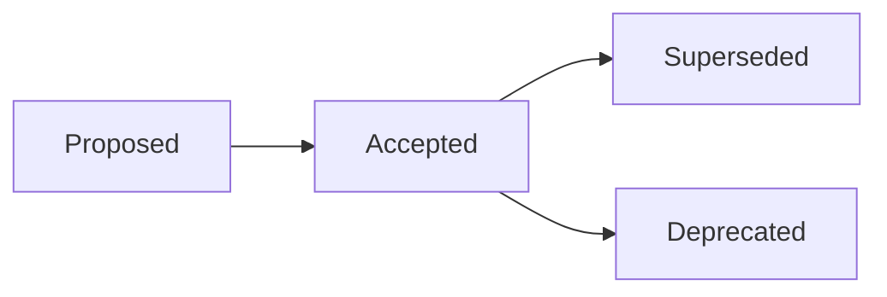

# Architecture Decision Records (ADR)

This directory records the significant architectural decisions of the DevOS specification.

An ADR is the durable memory of *why* the specification is shaped the way it is.

Specifications state what is normative.

ADRs explain why that normative content is correct.

---

## What Is an ADR

An Architecture Decision Record captures one significant architectural decision in a single file:

- The context and forces that made a decision necessary.
- The options considered.
- The outcome and its justification.
- The consequences, positive and negative, and how the decision will be validated.

ADRs complement specifications; they never replace them.

An ADR must not duplicate the canonical content of a specification (Rule 10); it references it.

---

## When an ADR Is Required

Per Rule 14 of [SPECIFICATION_RULES.md](../SPECIFICATION_RULES.md), major architectural changes require an ADR.

An ADR is required at minimum for:

- Changing the configuration or workspace manifest format.
- Changing the plugin model: how plugins register, extend, or integrate with the core.
- Changing the Workspace lifecycle: states, transitions, or ownership rules of the aggregate.
- Changing the storage architecture: where and how workspace data persists.
- Introducing or changing top-level repository structure (an RFC is also required).
- Any breaking change to schemas or established specifications; Rule 18 requires an RFC **and** an ADR plus a migration strategy, version bump, and deprecation notice.

When unsure, open an issue and ask first.

Smaller, reversible calls may use the lightweight [templates/decision-template.md](../templates/decision-template.md) instead of a full ADR.

---

## Lifecycle

Every ADR carries exactly one status.

| Status     | Meaning                                                        |
| ---------- | -------------------------------------------------------------- |
| Proposed   | Under discussion; not yet binding                              |
| Accepted   | Binding decision recorded; implementation work may proceed      |
| Superseded | Replaced by a later ADR, which is named in the Links section    |
| Deprecated | No longer applies; retained for historical context              |

A proposal that fails to reach consensus either remains Proposed or is withdrawn by its author.

Withdrawn proposals keep their numbers; numbers are never recycled.

---

## File Naming

ADR files are named `ADR-NNN-short-title.md`, for example `ADR-001-declarative-config-format.md`.

- `NNN` is a zero-padded, three-digit sequential number starting at `001`.
- Numbers are permanent and never reused, even when an ADR is withdrawn or superseded.
- `short-title` is lowercase and hyphenated.
- Only the content evolves after acceptance; the number never changes.

---

## Where They Live

Active records live at the root of this directory.

Status subfolders organize records that reached a terminal stage.

| Path                | Contents                                            |
| ------------------- | --------------------------------------------------- |
| `adr/ADR-NNN-*.md`  | Current record, Proposed or Accepted                |
| `adr/proposed/`     | Optional staging while feedback is gathered         |
| `adr/accepted/`     | Records moved here once accepted                    |
| `adr/superseded/`   | Records replaced by a newer ADR                     |
| `adr/deprecated/`   | Records that no longer apply                        |

Whenever a record moves between folders, update its Status field and the index table below in the same pull request.

---

## How to Propose One

1. Copy [templates/adr-template.md](../templates/adr-template.md) to `adr/ADR-NNN-short-title.md`, taking the next free number.
2. Fill every section; do not delete any.
3. Set Status to `Proposed` and open a pull request.
4. Link related RFCs, issues, and specifications in the Links section.
5. Address review feedback by editing the proposal; record substantive changes in the revision note.

Implementation of an architectural change may begin only after the ADR reaches Accepted.

---

## Index

| ADR     | Title    | Status   | Date |
| ------- | -------- | -------- | ---- |
| ADR-000 | Template | Template | TBD  |
