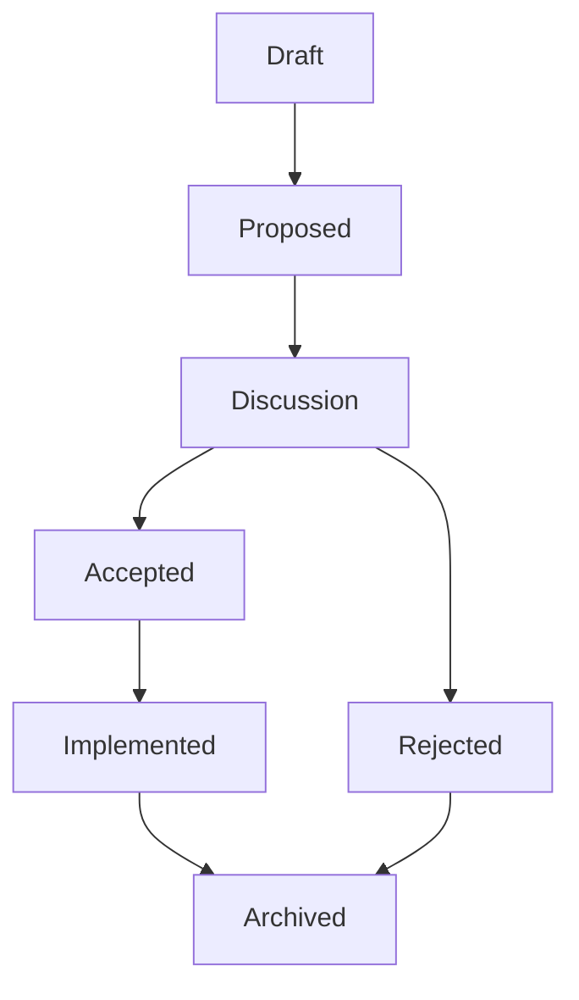

# Requests for Comments (RFC)

This directory holds design proposals for significant features and normative changes to the DevOS specification.

An RFC is how ideas become specifications in the open: written down, discussed publicly, and either adopted with a recorded rationale or rejected with one.

---

## What Is an RFC

A Request for Comments is a public design document proposing a significant feature before any implementation exists.

Per Rule 1 of [SPECIFICATION_RULES.md](../SPECIFICATION_RULES.md), the mandatory flow is:

> Idea → RFC → Discussion → Specification → ADR (if required) → Implementation → Release

Implementation without specification is not permitted; a significant change without an RFC is likewise not permitted.

---

## When an RFC Is Required

Every significant feature starts as an RFC (Rule 13).

A change is significant when it does at least one of the following:

- Changes schemas in [schemas/](../schemas/), which are the single source of truth (Rule 17).
- Adds engines, specifications, or top-level repository structure (top-level folders additionally require an approved ADR per Rule 12).
- Breaks backward compatibility of a published contract (Rule 18).
- Affects the security posture: secrets handling, redaction, validation, or permissions.
- Introduces normative behavior that tools and implementations must honor.

Small edits — wording fixes, clarifications, examples — follow normal pull request review instead.

---

## Lifecycle

| Status      | Meaning                                                                  |
| ----------- | ------------------------------------------------------------------------ |
| Draft       | The author is still writing; early feedback is welcome                    |
| Proposed    | Complete enough for formal review                                         |
| Discussion  | Open comment window; must last at least one full review cycle             |
| Accepted    | Consensus reached; specification work may proceed                         |
| Rejected    | Not adopted; the rationale is recorded in the RFC                         |
| Implemented | Accompanying specification and schema changes are merged                  |
| Archived    | Historical record; no further changes expected                            |

The subfolders `accepted/`, `rejected/`, `implemented/`, and `archived/` mirror these terminal stages.

Move files between folders and update the index table below in the same pull request.

---

## Numbering Rules

- RFCs take sequential numbers in the form `RFC-NNN`; the first real proposal is RFC-001.
- Numbers are never reused.
- Drafts keep their assigned number even if the RFC is rejected; history stays intact.

---

## Review Windows

Every RFC remains in Discussion for at least one full review cycle before acceptance.

Review cycles are announced by maintainers; no fixed calendar dates apply here.

Fast-tracking past Discussion requires maintainer consensus and is reserved for corrections, not features.

---

## Acceptance Criteria

An RFC may move from Discussion to Accepted when all of the following hold:

- [ ] The motivation is clear and tied to a real developer problem.
- [ ] Alternatives were considered with reasons for rejecting each.
- [ ] Breaking changes include a migration path per Rule 18.
- [ ] All affected specifications (DEVOS-SPEC numbers) and schemas are identified.
- [ ] Guide-level and reference-level explanations are complete.
- [ ] Unresolved questions are answered or explicitly deferred as Future Possibilities.

---

## How to Submit

1. Copy [templates/rfc-template.md](../templates/rfc-template.md) to `rfcs/RFC-NNN-title.md`.
2. Reserve the next free number when the document leaves Draft.
3. Open a pull request and link related issues and prior discussions.
4. Respond to review comments by editing the RFC; record substantive changes in its Revision History.

---

## Index

| RFC     | Title    | Status   |
| ------- | -------- | -------- |
| RFC-000 | Template | Template |
