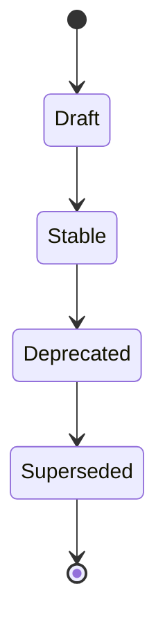
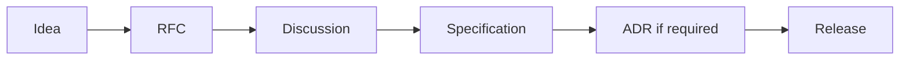

# 000 – Specification Governance

**Document ID:** DEVOS-SPEC-000

**Version:** 0.1

**Status:** Draft

**Category:** Overview

**Depends On:**

None.

**Referenced By:**

All DevOS Specifications

---

# Abstract

This document defines how the DevOS specification itself is governed.

It establishes permanent document numbering, the frozen repository structure, the document status model, and the normative conformance language used by every other specification.

It defines semantic versioning semantics, the mandatory change process, the deprecation policy, and the precedence rules that keep schemas canonical.

Every DevOS specification relies on the rules defined here.

This document is itself subject to those rules.

---

# Purpose

This specification exists to answer one question:

> **How does the DevOS specification evolve without losing stability, consistency, or trust?**

It evolves through permanent identifiers that never change, explicit statuses that make maturity visible, and semantic versioning that makes breaking changes loud.

It evolves through a single change path from idea to release, a deliberate deprecation policy, and strict precedence rules that guarantee one source of truth for every concept.

---

# Goals

This document aims to:

- Make document identity permanent.
- Keep the repository structure frozen and predictable.
- Define the shared conformance language for all specifications.
- Define unambiguous versioning semantics.
- Provide a single change path from idea to release.
- Make deprecation deliberate and safe.
- Guarantee one source of truth for every concept.
- Keep schemas as the canonical definition of the platform.

---

# Non Goals

This document does not define:

- The content of any other specification.
- Community conduct or membership rules.
- Implementation processes or internal tooling.
- Release calendars or schedules.
- Legal licensing terms.

These concerns are owned elsewhere in the repository.

---

# Document Numbering

Specification numbers are permanent.

Once assigned, a number MUST NOT be reused, reassigned, or changed.

Only the content of a document evolves over time.

Files are named `NNN-name.md`, where `NNN` is the document number.

Number ranges group documents into categories:

| Range   | Category          | Content                                                        |
| ------- | ----------------- | -------------------------------------------------------------- |
| 000–010 | Overview          | Governance, story, vision, problem, philosophy, principles     |
| 011–015 | Domain Model      | Objects, relationships, lifecycle, states, ownership           |
| 020–029 | Foundation        | Workspace, Project, Profile, Environment, Provider, Connection, Plugin, Template, Secret, Manifest |
| 030–039 | Core Architecture | Engines, event system, AI router                               |
| 040–049 | Platform          | CLI, dashboard, import, detection, configuration, operations    |
| 050–059 | SDK               | SDKs, APIs, hooks, events, versioning policy                    |
| 060–069 | Enterprise        | Organizations, teams, RBAC, policy, sync, audit, remote agents  |
| 070–079 | Future            | Forward-looking extensions excluded from Version 0.1           |

New documents MUST use the next free number inside their category range.

Numbers MUST NOT encode priority, maturity, or implementation order.

## Repository Structure Freeze

Top-level directories are frozen.

No contributor MAY introduce a new top-level directory without an approved ADR.

Directory layout changes require both an RFC and an approved ADR.

This freeze keeps cross-references stable for implementers.

---

# Document Status Model

Every specification carries exactly one status at all times.

| Status     | Description                                                              |
| ---------- | ------------------------------------------------------------------------ |
| Draft      | Under active development; any part of the content may still change       |
| Stable     | Accepted normative baseline; changes follow the Change Process           |
| Deprecated | Retained for reference only; MUST NOT be extended with new capabilities  |
| Superseded | Fully replaced by another Stable specification named in its References   |

Transitions between statuses follow this model:

A document MUST reach Stable before implementations are expected to conform to it.

A Deprecated document MUST identify its replacement or state explicitly that none exists.

---

# Conformance Language

The key words MUST, MUST NOT, REQUIRED, SHALL, SHALL NOT, SHOULD, SHOULD NOT, RECOMMENDED, MAY, and OPTIONAL in this specification set are interpreted normatively as follows.

| Keyword                          | Meaning                                                            |
| -------------------------------- | ------------------------------------------------------------------ |
| MUST / SHALL / REQUIRED          | Absolute requirement of the specification                          |
| MUST NOT / SHALL NOT             | Absolute prohibition of the specification                          |
| SHOULD / RECOMMENDED             | Strong recommendation; ignoring it requires valid documented cause |
| SHOULD NOT / NOT RECOMMENDED     | Strong discouragement; doing it requires valid documented cause    |
| MAY / OPTIONAL                   | Truly optional behavior with no conformance impact                 |

An implementation claiming conformance MUST satisfy every MUST-level requirement of each Stable specification it implements.

Deviations from SHOULD-level requirements MUST be documented by the implementation.

MAY-level features impose no conformance obligations.

This section is the single normative definition of conformance language for all DevOS specifications.

---

# Specification Versioning

The specification set follows semantic versioning with the form MAJOR.MINOR.PATCH.

| Increment | Meaning                                                                  |
| --------- | ------------------------------------------------------------------------ |
| MAJOR     | Breaking changes to the domain model, schema contracts, or normative behavior |
| MINOR     | New specifications or backward-compatible additive capabilities           |
| PATCH     | Editorial corrections, clarifications, formatting, and reference fixes    |

Every document carries its own version number starting at 0.1.

Breaking changes bump the MAJOR version and additionally require the Deprecation Policy steps defined below.

While the overall specification set remains at version 0.x, any part of it may still change.

Version 0.x is an explicit signal of pre-stability.

Everything versionable carries a version: specifications, schemas, workspace formats, plugin APIs, and platform APIs.

---

# Change Process

Specification always precedes implementation.

The mandatory flow is Idea → RFC → Discussion → Specification → ADR → Release.

Each stage has clear entry criteria.

| Stage         | Entry Criteria                                                     |
| ------------- | ------------------------------------------------------------------ |
| Idea          | A real developer problem is named                                   |
| RFC           | The idea is written as a request for comments                       |
| Discussion    | The RFC is open for community review                                |
| Specification | Accepted RFC content is merged into a numbered specification        |
| ADR           | Architecturally significant decisions are recorded                  |
| Release       | Updated specifications and schemas are published together           |

Implementation without specification is not permitted.

An ADR is required when a change affects architecture, contracts, formats, or the domain model.

Editorial corrections MAY skip the RFC stage but MUST remain traceable through normal review.

---

# Deprecation Policy

Deprecation is deliberate, never accidental.

Any breaking change or retirement requires all of the following:

- An RFC describing motivation and impact
- An ADR recording the architectural decision
- A migration strategy for affected users
- A version bump reflecting the breaking nature
- A deprecation notice in the affected documents

Deprecated content MUST remain readable during the migration window.

Silent removal of specified behavior is prohibited.

Documents marked Deprecated MUST point to their replacement or state that none exists.

Restoration of deprecated concepts follows the full Change Process again.

---

# Canonicality and Precedence

One source of truth governs the entire specification set.

Every concept has exactly one canonical document.

Other documents MUST reference canonical definitions instead of duplicating them.

Schemas are canonical.

Schemas define the specification, documentation explains the schemas, and implementations validate against the schemas.

When sources appear to conflict, precedence is resolved in this order:

| Precedence | Artifact Type  | Role                                        |
| ---------- | -------------- | ------------------------------------------- |
| 1 Highest  | Schemas        | Canonical machine-readable definitions      |
| 2          | Specifications | Normative prose explaining the schemas      |
| 3          | Guides         | Non-normative explanations and tutorials    |
| 4 Lowest   | Examples       | Illustrations only; never normative         |

Conflicts within the same tier MUST be treated as defects and fixed through the editorial process.

Ambiguity that survives review MUST be resolved toward the simpler, more portable interpretation.

---

# Governance Roles

Decision rights, review responsibilities, and maintainer roles are defined in the repository root document `../../GOVERNANCE.md`.

That document defines who may approve RFCs, merge specifications, and accept ADRs.

In summary:

- Contributors propose ideas and RFCs.
- Reviewers drive discussion and consensus.
- Maintainers approve specifications and ADRs.
- Editors guard consistency, numbering, and precedence across the set.

Governance roles MUST NOT bypass the Change Process defined above.

---

# References

- DEVOS-SPEC-001 – Executive Summary
- DEVOS-SPEC-005 – Guiding Principles
- DEVOS-SPEC-011 – Domain Model
- DEVOS-SPEC-029 – Workspace Manifest
- SPECIFICATION_RULES.md – Repository rule set (root document)
- GOVERNANCE.md – Roles and decision rights (root document)
- RFC 2119 – Key words for use in RFCs to Indicate Requirement Levels

---

# Revision History

| Version | Date | Author             | Notes         |
| ------- | ---- | ------------------ | ------------- |
| 0.1     | TBD  | DevOS Contributors | Initial Draft |
