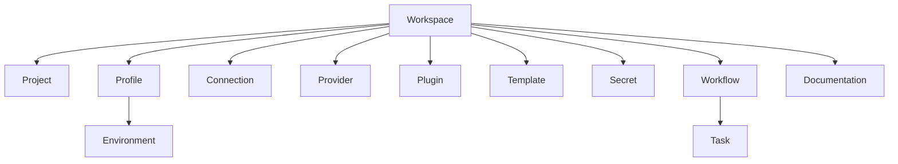

# 001 – Executive Summary

**Document ID:** DEVOS-SPEC-001

**Version:** 0.1

**Status:** Draft

**Category:** Overview

**Depends On:**

- DEVOS-SPEC-002 – Vision
- DEVOS-SPEC-003 – Problem Statement

**Referenced By:**

All readers; entry point document.

---

# Abstract

This document tells the one-page story of DevOS.

It summarizes the problem, the idea, the scope of the specification, and the intended long-term outcome.

It provides the document map for Version 0.1 and the recommended reading order.

This document is an overview; it defines no normative behavior itself.

---

# Purpose

This specification exists to answer one question:

> **What is DevOS in one page?**

DevOS is an open specification for AI-ready development workspaces.

It turns the Workspace into a portable, reproducible, secure unit that any tool can understand.

Everything else in this specification set expands on that single sentence.

---

# The Problem in Brief

Modern software development is fragmented.

A developer must configure AI coding assistants, IDEs, cloud providers, databases, containers, Kubernetes, Git providers, secrets, documentation tooling, research tools, templates, MCP servers, and environment variables.

None of this is project logic, yet all of it gates productivity.

The same setup repeats for every project, every laptop, every teammate, and every company.

Configuration ends up scattered across hidden application state tied to one machine, one editor, or one vendor.

Vendors benefit from that lock-in; developers do not.

---

# The Idea in Brief

DevOS is a specification, not another IDE, assistant, or cloud platform.

It is the layer that connects them all.

The Workspace is the portable unit of DevOS.

A Workspace carries everything a development environment needs:

- Project configuration
- Profiles with their Environments
- Connections to external systems
- Providers implementing capabilities
- Plugins extending the platform
- Templates for reuse
- Secrets held securely
- Workflows automating tasks
- Documentation as a first-class resource

The Workspace belongs to the project, not to a machine or an application.

Build once. Work anywhere. Own your development environment.

---

# What the Specification Defines vs Leaves Open

| The Specification Defines                    | The Specification Leaves Open          |
| -------------------------------------------- | -------------------------------------- |
| Domain objects and ownership boundaries      | Programming languages and frameworks   |
| Lifecycle and state models                   | Storage backends and databases         |
| Workspace manifest and schema contracts      | User interface designs                 |
| Engine responsibilities and boundaries       | Provider-specific integrations         |
| SDK and API surfaces at a conceptual level   | Internal algorithms and performance tricks |

Anything marked Enterprise or Future is intentionally excluded from Version 0.1.

Those specifications activate only through an approved ADR.

---

# Who This Is For

- Developers who want to own portable, reproducible environments instead of rebuilding them.
- Teams who want consistent onboarding and reviewable configuration.
- Tool builders who want to implement once against an open standard and reach every compliant workspace.

If you build tools for developers, this specification is written for you too.

---

# What Ships in v0.1

The specification set is organized into numbered ranges by theme.

| Range   | Theme             | Purpose                                                                 |
| ------- | ----------------- | ----------------------------------------------------------------------- |
| 000–010 | Overview          | Governance, story, vision, problem, philosophy, principles, terminology |
| 011–015 | Domain Model      | Objects, relationships, lifecycle, states, ownership                     |
| 020–029 | Foundation        | Workspace, Project, Profile, Environment, Provider, Connection, Plugin, Template, Secret, Manifest |
| 030–039 | Core Architecture | Workspace engine, plugin engine, provider engine, security, events, AI router |
| 040–049 | Platform          | CLI, dashboard, import, detection, lifecycle, configuration, operations  |
| 050–059 | SDK               | SDKs, APIs, hooks, events, versioning policy                             |
| 060–069 | Enterprise        | Organizations, teams, RBAC, policy, sync, audit, sharing, remote agents  |
| 070–079 | Future            | Marketplace, agents, extra platforms, ecosystem, roadmap                 |

Enterprise and Future ranges are forward-looking and require an ADR to activate.

They MUST NOT break the single-Workspace aggregate model if activated.

---

# Design Tenets

Each tenet is expanded elsewhere; here it is one line.

- Build once. Work anywhere. Own your development environment.
- Specification before implementation.
- Workspace first.
- Provider agnostic.
- Plugin first.
- Offline first.
- Configuration as code.
- Security by default.
- Simplicity over features.
- Human first.

---

# Long-Term Outcome

Open standards win.

Git standardized version control.

Docker standardized containers.

DevOS aims to make the Workspace the universal contract between projects and tools.

When every repository carries a workspace definition that every IDE, assistant, cloud, and tool understands, changing tools becomes effortless.

That outcome is the measure of success.

---

# How to Read This Specification

Recommended reading order:

1. 000–005 Overview: governance, this summary, vision, problem statement, design philosophy, guiding principles.
2. 006 Terminology to learn the shared vocabulary.
3. 011–015 Domain Model to understand objects, relationships, lifecycle, states, and ownership.
4. 020–029 Foundation for each core object specification and the Workspace Manifest.
5. 030–039 Core Architecture for engines, the event system, and the AI router.
6. 040–049 Platform for CLI, dashboard, import, detection, and operational systems.
7. 050–059 SDK for programmatic surfaces and versioning policy.
8. 060–069 Enterprise, optional, forward-looking beyond v0.1.
9. 070–079 Future, optional, forward-looking beyond v0.1.

Readers new to DevOS should stop after step 5 on a first pass.

---

# References

- DEVOS-SPEC-000 – Specification Governance
- DEVOS-SPEC-002 – Vision
- DEVOS-SPEC-003 – Problem Statement
- DEVOS-SPEC-004 – Design Philosophy
- DEVOS-SPEC-005 – Guiding Principles
- DEVOS-SPEC-011 – Domain Model

---

# Revision History

| Version | Date | Author             | Notes         |
| ------- | ---- | ------------------ | ------------- |
| 0.1     | TBD  | DevOS Contributors | Initial Draft |
