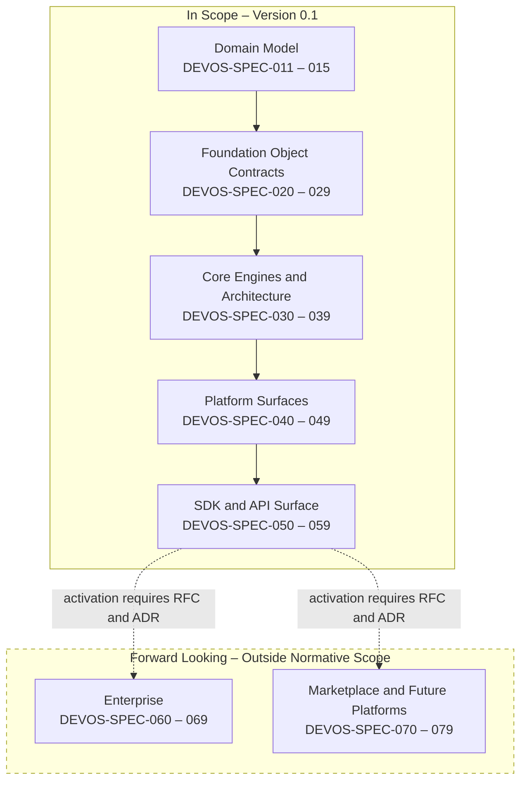

# 007 – Scope

**Document ID:** DEVOS-SPEC-007

**Version:** 0.1

**Status:** Draft

**Category:** Overview

**Depends On:**

- DEVOS-SPEC-001 – Executive Summary
- DEVOS-SPEC-006 – Terminology

**Referenced By:**

All DevOS Specifications

---

# Abstract

This document defines the normative scope of DevOS Specification Version 0.1.

It declares which parts of the platform the specification set covers, which parts it deliberately excludes, and which documents belong to each region.

It also defines what it means for a product to claim compatibility with Version 0.1.

Scope decisions made here bind every other specification in the set.

---

# Purpose

This document answers the following question:

> **What does DevOS Version 0.1 cover, and what does it deliberately leave out?**

Version 0.1 defines the complete core of the platform: the domain model, the foundation object contracts, the core engines and architecture, the platform surfaces, and the SDK and API surface.

Enterprise capabilities and future platforms are specified as forward-looking documents.

They guide long-term direction but impose no obligations until activated through the governance process.

---

# Goals

This document aims to:

- Declare the normative scope of Version 0.1.
- Identify every document range that is forward-looking only.
- Draw explicit boundaries across technical dimensions.
- Preserve implementation independence.
- Define conformance targets for Version 0.1.
- Prevent silent scope growth.

---

# Non Goals

This document does not define:

- The behavior of individual objects (DEVOS-SPEC-020 – 029)
- Architecture internals (DEVOS-SPEC-030 – 039)
- Platform command surfaces (DEVOS-SPEC-040 – 049)
- SDK interfaces (DEVOS-SPEC-050 – 059)
- Enterprise features (DEVOS-SPEC-060 – 069)
- Marketplace and future platforms (DEVOS-SPEC-070 – 079)

This document draws boundaries.

Other documents fill them.

---

# Normative Scope of Version 0.1

Version 0.1 covers five layers.

Together they form the minimum complete platform.

A product MAY implement a subset for its own purposes.

A product MUST implement the full set to claim Version 0.1 conformance.

## Domain Model (DEVOS-SPEC-011 – 015)

Defines the canonical objects, relationships, lifecycles, states, and ownership rules of the platform.

This layer is the semantic foundation of the entire specification set.

## Foundation Object Contracts (DEVOS-SPEC-020 – 029)

Defines the normative behavior of each core object:

- Workspace
- Project
- Profile
- Environment
- Provider
- Connection
- Plugin
- Template
- Secret
- Workspace Manifest

## Core Engines and Architecture (DEVOS-SPEC-030 – 039)

Defines the subsystems that operate on the domain.

These include the Workspace Engine, Plugin Engine, Provider Engine, Connection Engine, Template Engine, Security Engine, Event System, Memory Engine, and AI Router.

## Platform Surfaces (DEVOS-SPEC-040 – 049)

Defines the user-facing surfaces of the platform, including the CLI and the Dashboard.

Both surfaces expose equivalent capabilities.

Neither owns platform logic.

## SDK and API Surface (DEVOS-SPEC-050 – 059)

Defines the public extension contracts of the platform.

These include the Plugin SDK, Provider SDK, Template SDK, Workspace SDK, the API specification, hooks, events, and the versioning policy.

---

# Forward Looking Scope

Two document ranges sit outside normative scope in Version 0.1.

They are written down so the destination is known.

They impose no conformance obligations.

## Enterprise (DEVOS-SPEC-060 – 069)

Covers Organizations, Teams, RBAC, Policy Engine, Cloud Sync, Audit System, Workspace Sharing, License Management, Remote Agents, and the Enterprise Roadmap.

These concepts extend the domain beyond the single-Workspace aggregate.

## Marketplace and Future Platforms (DEVOS-SPEC-070 – 079)

Covers the Marketplace, AI Agents, Research Platform, Desktop Platform, Web Platform, Mobile Platform, Cloud Platform, Ecosystem, and the V2 Roadmap.

## Activation Requirements

Forward-looking concepts MUST NOT enter normative scope silently.

Activation requires ALL of the following:

- an accepted RFC, and
- an accepted ADR.

Activated extensions MUST NOT break the single-Workspace aggregate model.

Until activation, these documents are informative only.

---

# Scope Boundaries

The table below draws the boundary across technical dimensions.

| Dimension    | In Scope                                                        | Out of Scope                                     |
| ------------ | --------------------------------------------------------------- | ------------------------------------------------ |
| Domain       | Objects, relationships, lifecycle, state, ownership             | Organization, Team, Federation, Policy           |
| Storage      | Manifest semantics, schema contracts, portability guarantees    | Concrete storage engines, database schemas       |
| Networking   | Conceptual Connection and Provider contracts                    | Wire protocols, ports, transport implementations |
| Identity     | Local Actor-to-Workspace ownership                              | Accounts, Organizations, Teams, RBAC             |
| Execution    | Workflow and Task semantics                                     | Concrete runtimes, schedulers, process models    |
| Distribution | Workspace Packages, import/export semantics                     | Marketplace, hosted catalogs, app stores         |
| Licensing    | Open specification, open schemas, open plugin interfaces        | Commercial license management                    |

Entries marked Out of Scope are either implementation freedom or forward-looking scope.

Neither is unspecified by accident.

---

# Implementation Independence

The specification constrains WHAT the platform does.

It does not constrain HOW a product implements it.

Implementations are free to choose:

- programming languages
- frameworks
- storage engines
- process models
- operating systems

No part of this specification requires a particular technology.

Where an implementation and the specification disagree, the specification wins.

---

# Conformance

A product MAY claim compatibility with DevOS Specification Version 0.1 only if it satisfies ALL of the following:

- It implements Workspace Manifest semantics as defined in DEVOS-SPEC-029.
- It validates Workspace configuration against the canonical schemas.
- It supports Workspace import and export as distributable Workspace Packages.
- It implements the Provider abstraction such that providers are replaceable without domain change.
- It preserves every architectural invariant of the Domain Model.
- Its manifest documents pass schema validation under the reserved namespace https://devos.dev/schemas/v0/.

Products SHOULD document any deviation explicitly.

Products MUST NOT claim conformance while hiding incomplete areas behind undocumented behavior.

Conformance applies to whole products, not to isolated features.

---

# Scope Diagram

---

# Scope Invariants

The following rules MUST always hold.

## Bounded Core

Normative scope is exactly the five layers defined above.

## No Silent Growth

New concepts enter scope only through the governance process.

## Forward Documents Are Non-Normative

Documents DEVOS-SPEC-060 through 079 MUST NOT impose conformance obligations in Version 0.1.

## Aggregate Preservation

Any activated extension MUST NOT break the single-Workspace aggregate model.

---

# Future Extensions

Future versions of this specification MAY:

- activate Enterprise documents through RFC and ADR,
- promote forward-looking platforms into normative scope,
- introduce graded conformance levels,
- define certification procedures.

Such changes MUST preserve the invariants of this document.

---

# References

- DEVOS-SPEC-001 – Executive Summary
- DEVOS-SPEC-006 – Terminology
- DEVOS-SPEC-011 – Domain Model
- DEVOS-SPEC-020 – Workspace Specification
- DEVOS-SPEC-029 – Workspace Manifest
- DEVOS-SPEC-030 – System Architecture
- DEVOS-SPEC-050 – SDK Overview
- DEVOS-SPEC-069 – Enterprise Roadmap
- DEVOS-SPEC-078 – V2 Roadmap

---

# Revision History

| Version | Date | Author             | Notes         |
| ------- | ---- | ------------------ | ------------- |
| 0.1     | TBD  | DevOS Contributors | Initial Draft |
