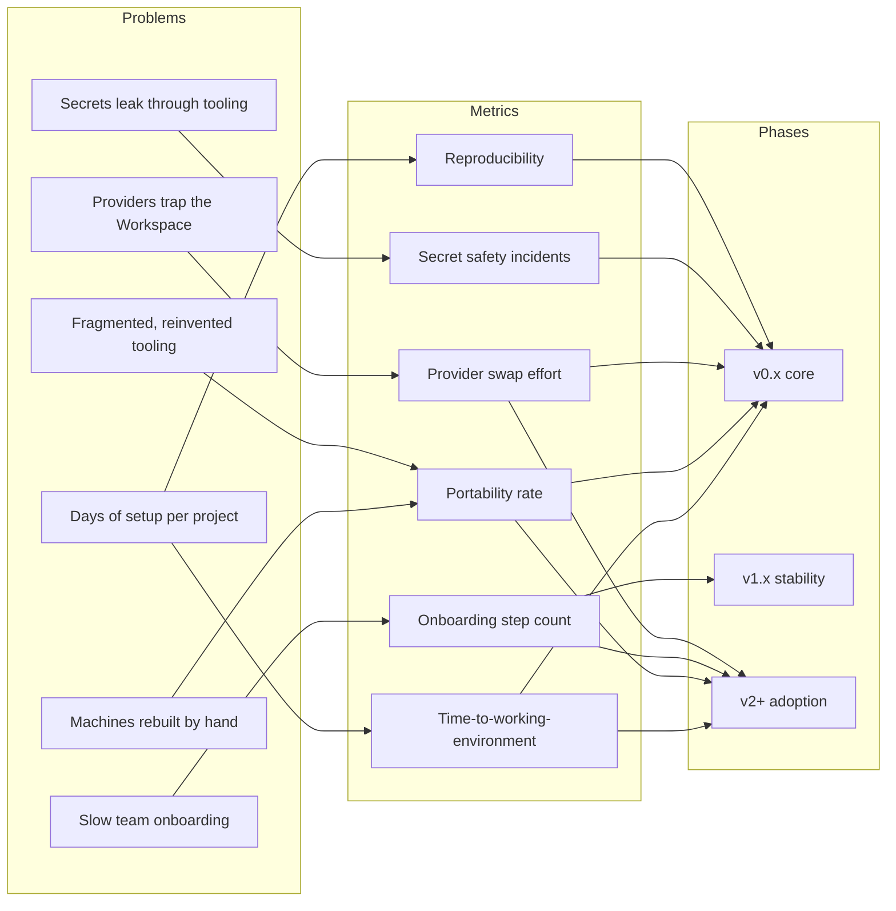

# 009 – Success Metrics

**Document ID:** DEVOS-SPEC-009

**Version:** 0.1

**Status:** Draft

**Category:** Overview

**Depends On:**

- DEVOS-SPEC-002 – Vision
- DEVOS-SPEC-007 – Scope

**Referenced By:**

- DEVOS-SPEC-069 – Enterprise Roadmap
- DEVOS-SPEC-078 – V2 Roadmap

---

# Abstract

This document defines how the success of DevOS is measured.

It establishes qualitative targets for Version 0.x, the method by which each metric is observed, and the direction in which each target must move.

This document intentionally contains no numeric benchmarks.

Numbers belong to roadmaps and measurements, not to the specification.

---

# Purpose

This document answers the following question:

> **How will we know DevOS is succeeding?**

DevOS succeeds when developers stop paying the setup tax.

Environments move between machines unchanged, onboarding shrinks to minutes, providers swap freely, imports reproduce exactly, and secrets never leak.

Each metric below ties one observable property of real usage to one promise of the Vision.

---

# Goals

This document aims to:

- Bind success to developer outcomes rather than feature output.
- Define an observation method for every metric.
- State a target direction for every metric.
- Name explicit anti-metrics the project refuses to optimize.
- Give roadmaps a stable yardstick across versions.

---

# Non Goals

This document does not:

- publish numeric performance benchmarks,
- define telemetry mechanisms or data collection,
- certify or rank implementations,
- define enterprise reporting features.

Measurement methods are described conceptually.

Concrete instrumentation is an implementation concern.

---

# Measurement Principles

Metrics in this document are qualitative targets.

They define direction, not quotas.

The following principles MUST hold:

- Every metric MUST state which question it answers.
- Every metric MUST define an observation method anyone can repeat.
- Targets are expressed as directions, never as fabricated figures.
- No metric may incentivize collecting more user data.
- Metrics measure what developers experience, not internal code quality alone.

## Phases

Metric phases align with specification maturity.

| Phase | Meaning                                                 |
| ----- | ------------------------------------------------------- |
| v0.x  | Current specification and core implementation cycle     |
| v1.x  | Stable standard with multiple independent implementations |
| v2+   | Ecosystem scale and adoption beyond the core community  |

---

# Metrics

## Time-to-Working-Environment

Question answered: Does moving from idea to working environment take minutes instead of days?

Definition: elapsed time from cloning a repository to running the project inside an imported, validated Workspace.

Observation: performed on a clean machine using only public documentation, recorded during release validation runs.

Target: minutes rather than hours or days.

Direction: downward across releases.

| Metric                       | Question Answered                              | Measurement                                     | Target Direction      | Phase |
| ---------------------------- | ---------------------------------------------- | ----------------------------------------------- | --------------------- | ----- |
| Time-to-working-environment  | Does clone-to-running take minutes, not days? | Clean-machine timing of clone, import, run      | Minutes, trending down | v0.x  |

## Portability Rate

Question answered: Can Workspaces move to a new machine without manual fixes?

Definition: share of Workspaces importable on a fresh machine with no hand editing of configuration.

Observation: automated export-import round trips across supported platforms during release validation.

Target: near all Workspaces import untouched.

Direction: upward toward completeness.

| Metric           | Question Answered                            | Measurement                                    | Target Direction       | Phase |
| ---------------- | -------------------------------------------- | ---------------------------------------------- | ---------------------- | ----- |
| Portability rate | Do imports work on new machines untouched?   | Export-import round trip success without edits | Near complete, upward  | v0.x  |

## Provider Swap Effort

Question answered: Is switching AI or cloud providers free of workspace redesign?

Definition: number of Workspace Manifest changes required to replace one provider with another in the same category.

Observation: provider-swap exercise on sample Workspaces each release, counting and categorizing changes.

Target: zero manifest changes beyond the provider block itself.

Direction: downward to zero.

| Metric              | Question Answered                          | Measurement                                  | Target Direction            | Phase |
| ------------------- | ------------------------------------------ | -------------------------------------------- | --------------------------- | ----- |
| Provider swap effort | Does provider replacement require redesign? | Counted manifest changes in swap exercises  | Zero changes beyond provider block | v0.x |

## Reproducibility

Question answered: Do two imports produce the same environment?

Definition: whether importing the same Workspace Package twice yields equivalent, validated Workspaces.

Observation: deterministic validation comparing resulting manifests and resolved configurations.

Target: equivalence in every case; any deviation is a defect.

Direction: held at equivalence, never regressing.

| Metric          | Question Answered                        | Measurement                             | Target Direction         | Phase |
| --------------- | ---------------------------------------- | --------------------------------------- | ------------------------ | ----- |
| Reproducibility | Are repeated imports equivalent?         | Deterministic comparison of import results | Equivalence, no deviations | v0.x |

## Secret Safety Incidents

Question answered: Do secrets ever leak through the platform?

Definition: occurrences of plaintext secret values appearing in logs, exports, or persisted state.

Observation: security review combined with automated scanning of every artifact produced by validation runs.

Target: zero incidents.

Direction: this is a hard requirement, not a trend.

| Metric                  | Question Answered                     | Measurement                                   | Target Direction | Phase |
| ----------------------- | ------------------------------------- | --------------------------------------------- | ---------------- | ----- |
| Secret safety incidents | Do secrets appear outside vaults?     | Scanning of logs, exports, and state artifacts | Zero             | v0.x  |

## Onboarding Step Count

Question answered: How much must a new team member do before building?

Definition: number of discrete steps from joining a team to a running environment.

Observation: walkthrough by a participant unfamiliar with the project, steps counted against the documented checklist.

Target: a small constant, independent of project complexity.

Direction: flat or downward over time.

| Metric                 | Question Answered                         | Measurement                                | Target Direction        | Phase |
| ---------------------- | ----------------------------------------- | ------------------------------------------ | ----------------------- | ----- |
| Onboarding step count  | Is joining a team nearly effortless?      | Counted checklist steps in guided walkthroughs | Small constant, flat or down | v1.x |

## Spec Adoption Signals

Question answered: Is DevOS becoming a standard?

Definition: evidence that parties beyond the core project build on the specification.

Observation: public enumeration of independent implementations, community plugins, and community templates.

Target: present and growing.

Direction: upward.

Forward-looking signals impose no conformance obligation on Version 0.1.

| Metric               | Question Answered                    | Measurement                                       | Target Direction | Phase |
| -------------------- | ------------------------------------ | ------------------------------------------------- | ---------------- | ----- |
| Spec adoption signals | Do others build on the spec independently? | Counted independent implementations, community plugins and templates | Present, growing | v1.x – v2+ |

---

# Anti-Metrics

Some quantities look like success but are not.

The project refuses to optimize them.

| Anti Metric                | Why Refused                                            | Watched Instead                   |
| -------------------------- | ------------------------------------------------------ | --------------------------------- |
| Feature count              | Features without developer value violate Simplicity Over Features | Time-to-working-environment |
| Vendor integrations count  | Breadth without replaceability invites lock-in         | Provider swap effort              |
| Telemetry volume           | Collecting more data erodes trust                      | Privacy-preserving validation runs |

A rising feature count is not progress.

A longer integration list is not progress.

More collected data is never a success signal.

---

# Metric Flow

---

# Future Extensions

Future versions of this document MAY:

- promote a metric from observational to normative,
- add metrics for activated Enterprise capabilities,
- define certification thresholds derived from these directions.

Any such change MUST preserve the anti-metrics section unchanged in spirit.

---

# References

- DEVOS-SPEC-002 – Vision
- DEVOS-SPEC-003 – Problem Statement
- DEVOS-SPEC-005 – Guiding Principles
- DEVOS-SPEC-007 – Scope
- DEVOS-SPEC-069 – Enterprise Roadmap
- DEVOS-SPEC-078 – V2 Roadmap

---

# Revision History

| Version | Date | Author             | Notes         |
| ------- | ---- | ------------------ | ------------- |
| 0.1     | TBD  | DevOS Contributors | Initial Draft |
