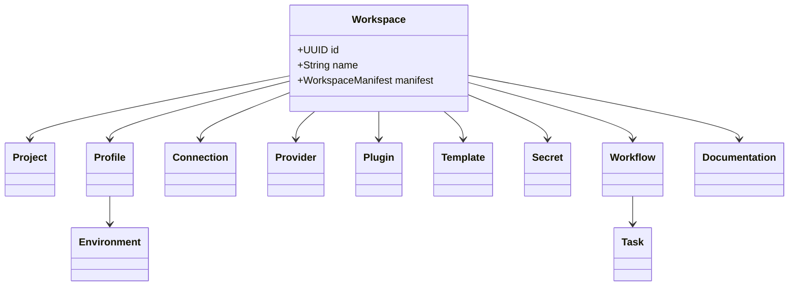

# 011 – Domain Model

**Document ID:** DEVOS-SPEC-011

**Version:** 0.1

**Status:** Draft

**Category:** Domain Model

**Depends On:**

- DEVOS-SPEC-005 – Guiding Principles
- DEVOS-SPEC-006 – Terminology

**Referenced By:**

All DevOS Specifications

---

# Abstract

The Domain Model defines the fundamental concepts that make up the DevOS platform.

It establishes the canonical representation of every core object, their responsibilities, ownership boundaries, and relationships.

The Domain Model is implementation independent and serves as the foundation for every specification, API, SDK, plugin, dashboard, and reference implementation.

All future specifications must conform to this model.

---

# Purpose

This specification exists to answer one question:

> **What are the fundamental objects that exist inside DevOS?**

Rather than describing implementation details, this document defines the conceptual model of the platform.

Every implementation MUST preserve these concepts regardless of programming language, framework, operating system, or deployment model.

---

# Goals

This specification aims to:

- Define the canonical DevOS domain.
- Establish the Aggregate Root.
- Define object boundaries.
- Define object responsibilities.
- Define ownership relationships.
- Minimize coupling.
- Maximize extensibility.
- Remain provider independent.
- Remain implementation independent.

---

# Non Goals

This document does not define:

- APIs
- Database schemas
- File formats
- CLI commands
- Dashboard UI
- Plugin APIs
- Network protocols
- Serialization

These are specified elsewhere.

---

# Design Philosophy

The DevOS Domain Model follows several architectural principles.

- Workspace First
- Aggregate Root Pattern
- Domain-Driven Design
- Composition over Inheritance
- Provider Agnostic
- Plugin First
- Configuration as Code
- Separation of Concerns

The domain model intentionally avoids implementation-specific details.

---

# Aggregate Root

DevOS follows the Aggregate Root pattern.

The Workspace is the single Aggregate Root.

Every persistent object within DevOS belongs to exactly one Workspace.

No object may exist independently of a Workspace.

This invariant simplifies:

- ownership
- permissions
- synchronization
- import/export
- backups
- collaboration
- lifecycle management

---

# Canonical Domain Model

---

# Domain Objects

## Workspace

### Definition

The Workspace is the primary object of DevOS.

Everything inside DevOS belongs to exactly one Workspace.

### Responsibilities

The Workspace owns:

- Project
- Profiles
- Connections
- Providers
- Plugins
- Templates
- Secrets
- Workflows
- Documentation
- Metadata

### Invariants

A Workspace:

- has one identifier
- has one manifest
- owns every child object
- defines the lifecycle of all owned objects

---

## Project

Represents the software system managed by the Workspace.

A Workspace contains exactly one Project.

A Project cannot exist outside a Workspace.

---

## Profile

Represents one logical configuration environment.

Examples include:

- Development
- Testing
- Staging
- Production
- Research

Each Profile owns one Environment.

---

## Environment

Represents runtime configuration.

Includes:

- environment variables
- feature flags
- runtime configuration

An Environment belongs to exactly one Profile.

---

## Connection

Represents connectivity to an external system.

Examples:

- PostgreSQL
- Redis
- GitHub
- AWS
- Docker
- Kubernetes

Connections are reusable across modules but owned by one Workspace.

---

## Provider

Represents an implementation of a capability.

Examples:

Cloud Providers

- AWS
- Azure
- GCP

AI Providers

- OpenAI
- Anthropic
- Gemini
- Ollama

Providers are replaceable.

---

## Plugin

Represents an extension to DevOS.

Plugins never modify the core platform.

Plugins extend functionality through public interfaces.

---

## Template

Represents reusable project definitions.

Templates accelerate Workspace creation.

---

## Secret

Represents confidential configuration.

Examples:

- API Keys
- Passwords
- Tokens
- Certificates

Secrets must never be logged.

---

## Workflow

Represents an executable automation.

A Workflow contains Tasks.

---

## Task

Represents one atomic executable operation.

Tasks are:

- repeatable
- observable
- deterministic

---

## Documentation

Represents project documentation managed by the Workspace.

Documentation is considered a first-class resource.

---

# Domain Boundaries

The Workspace defines the boundary of the domain.

External systems interact with DevOS through Connections and Providers.

External systems are **not** considered part of the DevOS Domain.

Examples include:

- GitHub
- AWS
- Docker
- PostgreSQL
- Kubernetes
- OpenAI

These systems remain external dependencies.

---

# Architectural Invariants

The following rules MUST always hold.

## Workspace Ownership

Every object belongs to exactly one Workspace.

---

## Aggregate Root

The Workspace is the only Aggregate Root.

---

## Provider Independence

Providers may be replaced without changing the domain.

---

## Plugin Isolation

Plugins cannot modify the core domain model.

---

## Configuration as Code

Configuration must remain declarative.

---

## Explicit Ownership

Every object has one owner.

---

## Single Responsibility

Each object represents exactly one concept.

---

# Design Decisions

| Decision                     | Rationale                                     |
| ---------------------------- | --------------------------------------------- |
| Workspace as Aggregate Root  | Simplifies ownership and lifecycle management |
| Provider abstraction         | Prevents vendor lock-in                       |
| Plugin-first architecture    | Keeps the core platform minimal               |
| Configuration as Code        | Enables reproducibility                       |
| Composition over inheritance | Improves extensibility                        |
| Explicit ownership           | Simplifies synchronization and permissions    |

---

# Future Extensions

Future versions may introduce:

- Organization
- Team
- Policy
- Marketplace
- Workspace Federation
- Remote Execution
- AI Agents
- Knowledge Graph
- Analytics

These concepts are intentionally excluded from Version 0.1.

---

# References

- DEVOS-SPEC-005 – Guiding Principles
- DEVOS-SPEC-006 – Terminology
- DEVOS-SPEC-012 – Domain Relationships
- DEVOS-SPEC-013 – Object Lifecycle
- DEVOS-SPEC-014 – State Model
- DEVOS-SPEC-015 – Object Ownership

---

# Revision History

| Version | Date | Author             | Notes         |
| ------- | ---- | ------------------ | ------------- |
| 0.1     | TBD  | DevOS Contributors | Initial Draft |
