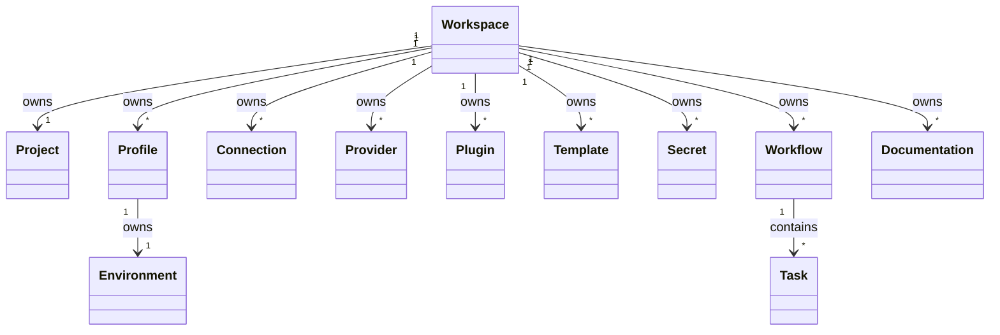
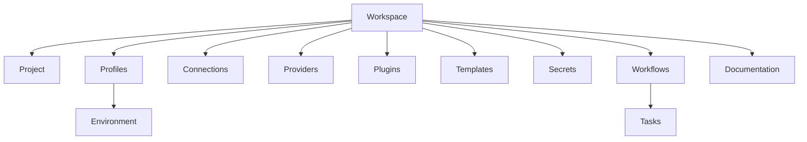
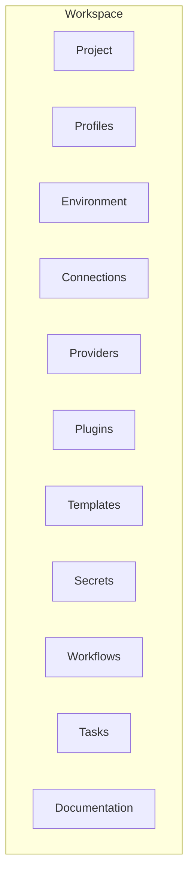
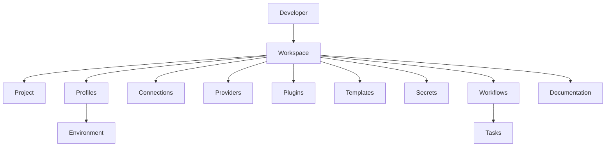

# 012 – Domain Relationships

**Document ID:** DEVOS-SPEC-012

**Version:** 0.1

**Status:** Draft

**Category:** Domain Model

**Depends On:**

- DEVOS-SPEC-006 – Terminology
- DEVOS-SPEC-011 – Domain Model

**Referenced By:**

All Core Specifications

---

# Abstract

This document defines the canonical relationships between the core domain objects of DevOS.

While the Domain Model defines _what_ objects exist, this specification defines _how_ those objects interact.

No implementation-specific behavior is described here.

---

# Purpose

This specification answers the following question:

> **How are DevOS domain objects related?**

The relationships defined here are considered canonical.

All implementations MUST preserve these relationships.

---

# Goals

This specification aims to:

- Define ownership relationships.
- Define composition relationships.
- Define dependency relationships.
- Define object cardinality.
- Define aggregate boundaries.
- Prevent ambiguous object interactions.

---

# Non Goals

This specification does not define:

- Object behavior
- APIs
- Persistence
- Database schemas
- Network communication
- File formats
- User interfaces

---

# Relationship Types

DevOS defines five canonical relationship types.

| Relationship | Description                                               |
| ------------ | --------------------------------------------------------- |
| Owns         | Parent controls the child's lifecycle.                    |
| Contains     | Parent logically groups child objects.                    |
| Uses         | Parent depends on another object without owning it.       |
| References   | Parent links to another object without lifecycle control. |
| Registers    | Parent makes an object available for discovery.           |

These relationship names are reserved throughout the DevOS specification.

---

# Ownership Rules

The following ownership rules MUST always hold.

- Every object belongs to exactly one Workspace.
- Child objects cannot outlive their owner.
- Ownership is transitive.
- Circular ownership is prohibited.
- Ownership defines lifecycle.
- Ownership defines permissions.
- Ownership defines import/export boundaries.

---

# Cardinality Rules

| Parent    | Child         | Cardinality |
| --------- | ------------- | ----------- |
| Workspace | Project       | 1 → 1       |
| Workspace | Profile       | 1 → Many    |
| Profile   | Environment   | 1 → 1       |
| Workspace | Connection    | 1 → Many    |
| Workspace | Provider      | 1 → Many    |
| Workspace | Plugin        | 1 → Many    |
| Workspace | Template      | 1 → Many    |
| Workspace | Secret        | 1 → Many    |
| Workspace | Workflow      | 1 → Many    |
| Workflow  | Task          | 1 → Many    |
| Workspace | Documentation | 1 → Many    |

---

# Relationship Diagram

---

# Workspace Composition

---

# Aggregate Boundary

The Workspace is the Aggregate Root.

Every persistent object exists inside the Workspace boundary.

---

# Ownership Hierarchy

---

# Aggregate Rules

The Workspace is the only Aggregate Root.

The following rules MUST always hold.

- Every object belongs to exactly one Workspace.
- Objects cannot have multiple owners.
- Objects cannot exist outside a Workspace.
- Aggregate boundaries cannot overlap.
- Aggregate boundaries define synchronization.
- Aggregate boundaries define serialization.
- Aggregate boundaries define backup units.

---

# Relationship Constraints

The following constraints apply to every implementation.

## Workspace

A Workspace:

- owns exactly one Project.
- owns one or more Profiles.
- owns zero or more Plugins.
- owns zero or more Providers.
- owns zero or more Connections.
- owns zero or more Templates.
- owns zero or more Secrets.
- owns zero or more Workflows.
- owns zero or more Documentation objects.

---

## Profile

A Profile:

- belongs to exactly one Workspace.
- owns exactly one Environment.

---

## Environment

An Environment:

- belongs to exactly one Profile.
- cannot be shared.

---

## Workflow

A Workflow:

- belongs to exactly one Workspace.
- contains one or more Tasks.

---

## Task

A Task:

- belongs to exactly one Workflow.
- cannot exist independently.

---

# Architectural Invariants

The following invariants MUST always hold.

- Workspace is the Aggregate Root.
- Every object has exactly one owner.
- Ownership is explicit.
- Composition is preferred over inheritance.
- Circular dependencies are prohibited.
- Circular ownership is prohibited.
- Every relationship is directional.
- Aggregate boundaries cannot overlap.

---

# Future Extensions

Future specifications may introduce relationships involving:

- Organizations
- Teams
- Policies
- Marketplace Packages
- Remote Agents
- Knowledge Graph
- Cloud Synchronization

These relationships are intentionally excluded from Version 0.1.

---

# References

- DEVOS-SPEC-006 – Terminology
- DEVOS-SPEC-011 – Domain Model
- DEVOS-SPEC-013 – Object Lifecycle
- DEVOS-SPEC-014 – State Model
- DEVOS-SPEC-015 – Object Ownership

---

# Revision History

| Version | Date | Author             | Notes         |
| ------- | ---- | ------------------ | ------------- |
| 0.1     | TBD  | DevOS Contributors | Initial Draft |
