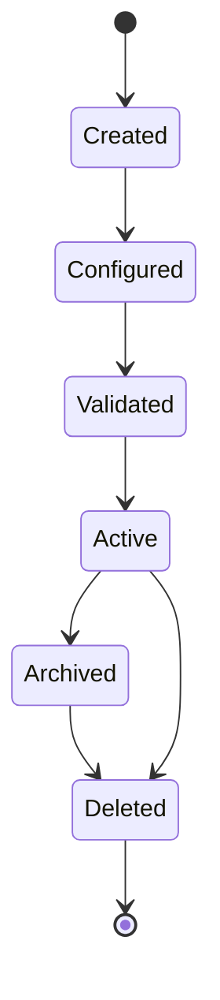
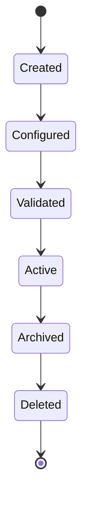
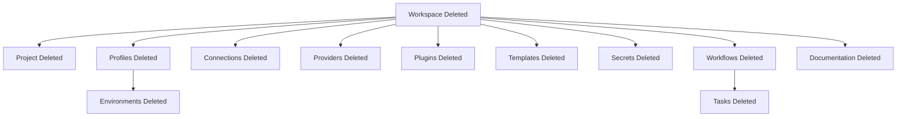

# 013 – Object Lifecycle

**Document ID:** DEVOS-SPEC-013

**Version:** 0.1

**Status:** Draft

**Category:** Domain Model

**Depends On:**

- DEVOS-SPEC-006 – Terminology
- DEVOS-SPEC-011 – Domain Model
- DEVOS-SPEC-012 – Domain Relationships

**Referenced By:**

- DEVOS-SPEC-014 – State Model
- DEVOS-SPEC-015 – Object Ownership
- DEVOS-SPEC-020 – Workspace Specification
- DEVOS-SPEC-044 – Workspace Lifecycle

---

# Abstract

This document defines the canonical lifecycle of DevOS domain objects.

The lifecycle describes how an object comes into existence, becomes usable, is retired, and is removed.

This specification is implementation independent. It does not define APIs, storage formats, background workers, or user interface behavior.

---

# Purpose

This specification answers the following question:

> **What lifecycle stages can a DevOS domain object pass through?**

The lifecycle model prevents each implementation from inventing incompatible creation, validation, archival, and deletion behavior.

---

# Goals

This specification aims to:

- Define lifecycle stages for all core domain objects.
- Define valid lifecycle transitions.
- Define lifecycle invariants.
- Separate lifecycle from runtime state.
- Preserve Workspace ownership across every lifecycle stage.
- Provide a foundation for platform lifecycle behavior.

---

# Non Goals

This specification does not define:

- Runtime state machines
- API endpoints
- Database schemas
- Deletion implementation details
- Recovery mechanisms
- User interface flows
- Provider-specific lifecycle behavior

---

# Lifecycle vs State

Lifecycle and state are different concepts.

Lifecycle describes whether an object exists and whether it is usable.

State describes what an existing object is currently doing.

Example:

- A Plugin lifecycle may be Active.
- The same Plugin state may be Enabled, Disabled, Updating, or Failed.

Runtime states are defined in DEVOS-SPEC-014.

---

# Canonical Lifecycle

All persistent DevOS domain objects follow this canonical lifecycle unless a later specification explicitly narrows it.

---

# Lifecycle Stages

## Created

The object has been created inside a Workspace boundary.

At this stage the object has identity but may not yet be usable.

A Created object MUST:

- have an identifier.
- belong to exactly one owner.
- remain inside one Workspace aggregate.

---

## Configured

The object has enough declared configuration to be evaluated.

A Configured object MAY still be invalid.

A Configured object MUST:

- preserve its owner.
- expose its declared configuration.
- be eligible for validation.

---

## Validated

The object has passed domain validation.

Validation confirms that required fields, ownership rules, and relationship constraints are satisfied.

A Validated object MUST:

- satisfy DEVOS-SPEC-012 relationship rules.
- satisfy object-specific invariants.
- be eligible to become Active.

---

## Active

The object is usable by the Workspace.

Active does not imply that the object is currently running or executing.

An Active object MUST:

- remain valid.
- remain owned.
- be visible to the Workspace systems that are allowed to use it.

---

## Archived

The object is retained but no longer participates in normal Workspace operation.

Archived objects are preserved for history, audit, rollback, or reference.

An Archived object MUST:

- remain owned by its Workspace.
- be excluded from normal execution.
- be immutable unless an explicit restore or migration operation applies.

---

## Deleted

The object has been removed from the active domain.

Deleted is terminal.

A Deleted object MUST NOT:

- be restored without creating a new lifecycle event.
- be referenced by Active objects.
- participate in Workspace execution.

---

# Valid Transitions

| From       | To         | Meaning                         |
| ---------- | ---------- | ------------------------------- |
| Created    | Configured | Required configuration added.    |
| Configured | Validated  | Domain validation passed.        |
| Validated  | Active     | Object is made usable.           |
| Active     | Archived   | Object is retired but retained.  |
| Archived   | Deleted    | Object is permanently removed.   |
| Active     | Deleted    | Object is directly removed.      |

Implementations MUST reject lifecycle transitions not listed here unless a later specification extends the lifecycle for a specific object.

---

# Workspace Lifecycle

Workspace is the Aggregate Root.

A Workspace controls the lifecycle of all owned objects.

A Workspace MUST NOT become Active unless its Project and at least one Profile are valid.

When a Workspace is Archived, its owned objects are archived with it unless explicitly retained by a future export or migration specification.

When a Workspace is Deleted, all owned objects are deleted with it.

---

# Object Lifecycle Matrix

| Object        | Required Owner | Can Be Archived | Can Be Deleted Independently | Notes                         |
| ------------- | -------------- | --------------- | ---------------------------- | ----------------------------- |
| Workspace     | Developer      | Yes             | Yes                          | Deletes aggregate boundary.   |
| Project       | Workspace      | No              | No                           | Tied to Workspace lifecycle.  |
| Profile       | Workspace      | Yes             | Yes                          | Must preserve at least one Profile. |
| Environment   | Profile        | No              | No                           | Tied to Profile lifecycle.    |
| Connection    | Workspace      | Yes             | Yes                          | Must not be used by Active objects before deletion. |
| Provider      | Workspace      | Yes             | Yes                          | Provider-specific behavior is defined later. |
| Plugin        | Workspace      | Yes             | Yes                          | Runtime state is defined in DEVOS-SPEC-014. |
| Template      | Workspace      | Yes             | Yes                          | Archived templates cannot create new Workspaces. |
| Secret        | Workspace      | Yes             | Yes                          | Deletion must prevent future resolution. |
| Workflow      | Workspace      | Yes             | Yes                          | Active runs are outside this document. |
| Task          | Workflow       | No              | No                           | Tied to Workflow lifecycle.   |
| Documentation | Workspace      | Yes             | Yes                          | Can be retained for history.  |

---

# Lifecycle Invariants

The following invariants MUST always hold.

- Every lifecycle transition occurs inside one Workspace aggregate.
- Ownership does not change during a lifecycle transition.
- Deleted objects are terminal.
- Active objects must be valid.
- Archived objects must not participate in normal execution.
- Child objects cannot outlive their owner.
- Circular lifecycle dependencies are prohibited.

---

# Deletion Rules

Deletion follows ownership.

If an owner is deleted, all owned children are deleted.

If a child is deleted independently, all Active references to that child MUST be removed or rejected before deletion completes.

---

# Future Extensions

Future specifications may define lifecycle extensions for:

- Organization-owned Workspaces
- Shared Workspaces
- Remote Agents
- Cloud Synchronization
- Marketplace Packages
- Long-running Workflow Runs

These extensions MUST preserve the Workspace aggregate boundary unless an ADR explicitly changes the model.

---

# References

- DEVOS-SPEC-006 – Terminology
- DEVOS-SPEC-011 – Domain Model
- DEVOS-SPEC-012 – Domain Relationships
- DEVOS-SPEC-014 – State Model
- DEVOS-SPEC-015 – Object Ownership

---

# Revision History

| Version | Date | Author             | Notes         |
| ------- | ---- | ------------------ | ------------- |
| 0.1     | TBD  | DevOS Contributors | Initial Draft |
