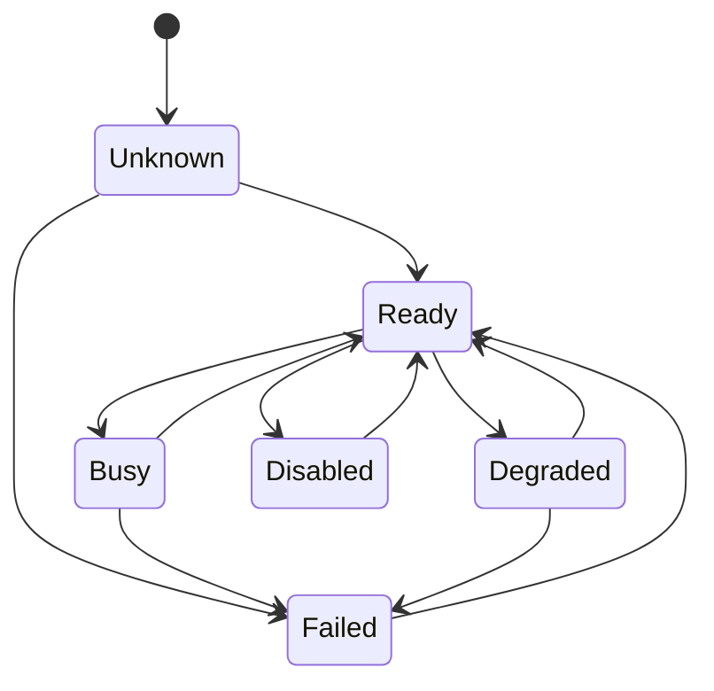
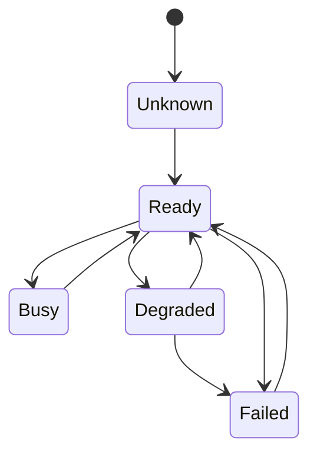
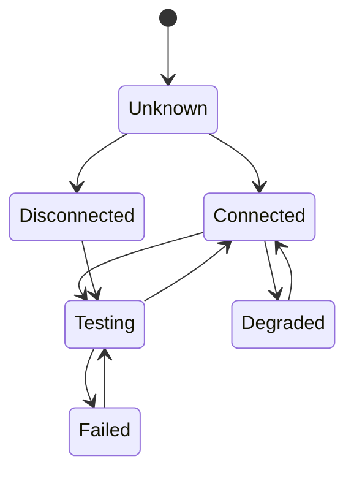
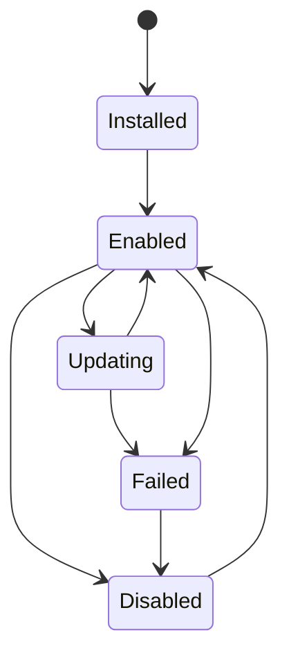

# 014 – State Model

**Document ID:** DEVOS-SPEC-014

**Version:** 0.1

**Status:** Draft

**Category:** Domain Model

**Depends On:**

- DEVOS-SPEC-006 – Terminology
- DEVOS-SPEC-011 – Domain Model
- DEVOS-SPEC-012 – Domain Relationships
- DEVOS-SPEC-013 – Object Lifecycle

**Referenced By:**

- DEVOS-SPEC-020 – Workspace Specification
- DEVOS-SPEC-026 – Plugin Specification
- DEVOS-SPEC-033 – Provider Engine
- DEVOS-SPEC-034 – Connection Engine
- DEVOS-SPEC-046 – Health System

---

# Abstract

This document defines the canonical runtime state model for DevOS domain objects.

State describes the current operational condition of an object that already exists in the domain lifecycle.

Lifecycle answers whether an object exists and is usable. State answers what that usable object is currently doing or whether it is currently healthy.

---

# Purpose

This specification answers the following question:

> **What runtime states can DevOS domain objects report?**

The State Model gives the CLI, dashboard, SDK, health system, and automation engines a shared vocabulary for object status.

---

# Goals

This specification aims to:

- Define shared runtime states.
- Define object-specific state sets.
- Define valid state transitions.
- Separate lifecycle from runtime condition.
- Keep state observable and deterministic.
- Provide a foundation for health reporting.

---

# Non Goals

This specification does not define:

- Lifecycle stages
- API endpoints
- Database schemas
- Event transport
- UI rendering
- Provider-specific health checks
- Workflow execution internals

---

# State Principles

DevOS state MUST follow these principles.

- State is observable.
- State is derived from known facts.
- State does not change ownership.
- State does not change lifecycle.
- State transitions must be directional and explicit.
- Failed states must preserve enough context for diagnosis.
- Unknown is allowed only when the system cannot determine a state yet.

---

# Global States

The following states may be used by any runtime-observable object.

| State    | Meaning                                      |
| -------- | -------------------------------------------- |
| Unknown  | The current state has not been determined.   |
| Ready    | The object is usable and healthy.            |
| Busy     | The object is performing an operation.       |
| Degraded | The object is usable with reduced capability. |
| Failed   | The object cannot complete its expected role. |
| Disabled | The object is intentionally inactive.        |

---

# Global State Diagram

---

# Workspace State

A Workspace reports the aggregate operational state of its owned objects.

A Workspace is:

- Ready when required child objects are valid and healthy.
- Busy when a Workspace-level operation is running.
- Degraded when optional child objects are failing.
- Failed when required child objects are failing.

A Workspace MUST NOT be Ready if its Project or required Profile is Failed.

---

# Project State

A Project reports the status of the managed codebase or project definition.

| State    | Meaning                                      |
| -------- | -------------------------------------------- |
| Unknown  | Project status has not been inspected.       |
| Ready    | Project metadata is readable and valid.      |
| Busy     | Project detection, import, or analysis is running. |
| Failed   | Project metadata is unreadable or invalid.   |

---

# Profile State

A Profile reports whether its Environment is usable.

| State    | Meaning                                      |
| -------- | -------------------------------------------- |
| Unknown  | Profile has not been evaluated.              |
| Ready    | Profile and Environment are valid.           |
| Degraded | Optional configuration is missing or invalid. |
| Failed   | Required Environment configuration is invalid. |
| Disabled | Profile is intentionally unavailable.        |

---

# Environment State

An Environment reports configuration health.

| State   | Meaning                                      |
| ------- | -------------------------------------------- |
| Unknown | Environment has not been evaluated.          |
| Ready   | Required configuration is present.           |
| Failed  | Required configuration is missing or invalid. |

---

# Connection State

A Connection reports connectivity to an external system.

| State        | Meaning                                      |
| ------------ | -------------------------------------------- |
| Unknown      | Connection has not been checked.             |
| Connected    | External system is reachable.                |
| Testing      | Connectivity check is running.               |
| Degraded     | External system is reachable with warnings.  |
| Disconnected | External system is intentionally offline or unreachable. |
| Failed       | Connectivity failed unexpectedly.            |

---

# Provider State

A Provider reports availability of a capability implementation.

| State        | Meaning                                      |
| ------------ | -------------------------------------------- |
| Unknown      | Provider has not been evaluated.             |
| Available    | Provider can be used.                        |
| Unavailable  | Provider cannot currently be used.           |
| AuthRequired | Provider requires credentials or authorization. |
| Degraded     | Provider is available with reduced capability. |
| Failed       | Provider evaluation failed.                  |
| Disabled     | Provider is intentionally disabled.          |

Provider-specific states belong in provider specifications, not in this document.

---

# Plugin State

A Plugin reports whether it can extend the Workspace.

| State     | Meaning                                      |
| --------- | -------------------------------------------- |
| Installed | Plugin exists but is not yet enabled.        |
| Enabled   | Plugin can contribute behavior.              |
| Disabled  | Plugin is intentionally inactive.            |
| Updating  | Plugin update is in progress.                |
| Failed    | Plugin cannot be loaded or used.             |

Plugin removal is lifecycle deletion, not runtime state.

---

# Template State

A Template reports whether it can be used to create or configure a Workspace.

| State    | Meaning                                      |
| -------- | -------------------------------------------- |
| Unknown  | Template has not been validated.             |
| Ready    | Template can be used.                        |
| Failed   | Template is invalid.                         |
| Disabled | Template is intentionally unavailable.       |

---

# Secret State

A Secret reports whether it can be resolved.

| State      | Meaning                                      |
| ---------- | -------------------------------------------- |
| Unknown    | Secret has not been checked.                 |
| Available  | Secret can be resolved by authorized systems. |
| Unavailable | Secret cannot currently be resolved.        |
| Expired    | Secret is no longer valid.                   |
| Rotating   | Secret rotation is in progress.              |
| Failed     | Secret resolution failed unexpectedly.       |

Secret values MUST NOT appear in state messages, logs, or diagnostics.

---

# Workflow State

A Workflow reports whether it can be executed.

| State    | Meaning                                      |
| -------- | -------------------------------------------- |
| Unknown  | Workflow has not been evaluated.             |
| Ready    | Workflow can be executed.                    |
| Running  | Workflow execution is active.                |
| Succeeded | Last execution completed successfully.      |
| Failed   | Last execution failed or workflow is invalid. |
| Disabled | Workflow is intentionally unavailable.       |

Detailed execution history belongs to a future Workflow Run specification.

---

# Task State

A Task reports the condition of one executable operation.

| State     | Meaning                                     |
| --------- | ------------------------------------------- |
| Pending   | Task is waiting to run.                     |
| Running   | Task is executing.                          |
| Succeeded | Task completed successfully.                |
| Failed    | Task failed.                                |
| Skipped   | Task was intentionally not executed.        |

---

# Documentation State

Documentation reports whether managed documentation is usable.

| State    | Meaning                                      |
| -------- | -------------------------------------------- |
| Unknown  | Documentation has not been inspected.        |
| Ready    | Documentation is available and valid.        |
| Degraded | Documentation has warnings or stale sections. |
| Failed   | Documentation is missing or invalid.         |

---

# State Invariants

The following invariants MUST always hold.

- State cannot change object ownership.
- State cannot bypass lifecycle rules.
- Deleted objects do not report runtime state.
- Archived objects are not considered Ready for normal execution.
- Failed state must not destroy object identity.
- Disabled state must be intentional.
- Secret state must never expose secret values.

---

# State Reporting

State reporting SHOULD include:

- object identifier
- object type
- state
- timestamp
- reason code when applicable
- human-readable summary when applicable

State reporting MUST NOT include:

- secret values
- access tokens
- private keys
- credentials
- unnecessary external payloads

---

# Future Extensions

Future specifications may define additional states for:

- Workflow Runs
- Remote Agents
- Cloud Synchronization
- Marketplace Packages
- Policy Evaluation
- Distributed Workspace Replication

Additional states MUST preserve the lifecycle distinction defined in DEVOS-SPEC-013.

---

# References

- DEVOS-SPEC-006 – Terminology
- DEVOS-SPEC-011 – Domain Model
- DEVOS-SPEC-012 – Domain Relationships
- DEVOS-SPEC-013 – Object Lifecycle
- DEVOS-SPEC-015 – Object Ownership

---

# Revision History

| Version | Date | Author             | Notes         |
| ------- | ---- | ------------------ | ------------- |
| 0.1     | TBD  | DevOS Contributors | Initial Draft |
