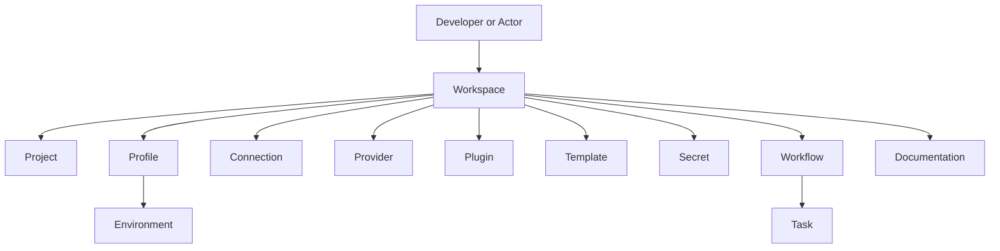
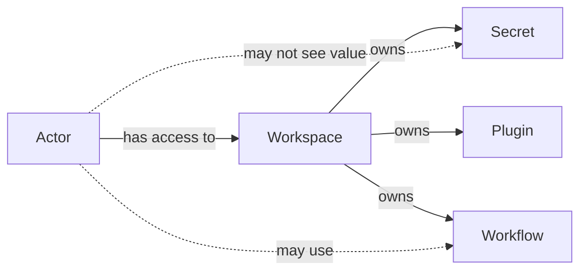
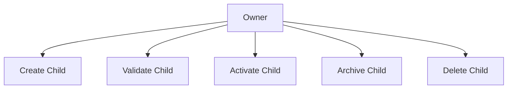
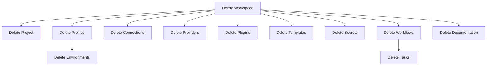

# 015 – Object Ownership

**Document ID:** DEVOS-SPEC-015

**Version:** 0.1

**Status:** Draft

**Category:** Domain Model

**Depends On:**

- DEVOS-SPEC-006 – Terminology
- DEVOS-SPEC-011 – Domain Model
- DEVOS-SPEC-012 – Domain Relationships
- DEVOS-SPEC-013 – Object Lifecycle
- DEVOS-SPEC-014 – State Model

**Referenced By:**

- DEVOS-SPEC-020 – Workspace Specification
- DEVOS-SPEC-029 – Workspace Manifest
- DEVOS-SPEC-036 – Security Engine
- DEVOS-SPEC-060 – Organizations
- DEVOS-SPEC-062 – RBAC
- DEVOS-SPEC-065 – Audit System

---

# Abstract

This document defines canonical ownership rules for DevOS domain objects.

Ownership determines lifecycle control, permission boundaries, synchronization boundaries, serialization boundaries, and deletion behavior.

This specification is implementation independent and does not define a concrete user model, role model, or access-control engine.

---

# Purpose

This specification answers the following question:

> **Who owns each DevOS domain object, and what does ownership mean?**

Ownership must be explicit so implementations can make consistent decisions about validation, deletion, export, import, access control, and audit behavior.

---

# Goals

This specification aims to:

- Define the canonical ownership hierarchy.
- Define owner responsibilities.
- Define ownership invariants.
- Define transfer and deletion constraints.
- Separate ownership from access.
- Establish a foundation for security and RBAC specifications.

---

# Non Goals

This specification does not define:

- User accounts
- Organizations
- Teams
- RBAC roles
- Authentication
- Authorization policies
- Billing ownership
- Cloud account ownership
- Database schemas

Those concerns are defined by later enterprise and security specifications.

---

# Ownership Definition

Ownership is lifecycle authority over an object.

An owner controls:

- creation
- validation
- activation
- archival
- deletion
- export
- import
- synchronization

Ownership is not the same as access.

An actor may have access to an object without owning it.

---

# Ownership Hierarchy

The Workspace is the root ownership boundary for all persistent DevOS domain objects.

The Developer or Actor is outside the Workspace aggregate.

The Workspace owns all persistent DevOS objects inside the aggregate boundary.

---

# Ownership Matrix

| Object        | Owner     | Ownership Type | Notes                         |
| ------------- | --------- | -------------- | ----------------------------- |
| Workspace     | Actor     | Root           | Root aggregate boundary.      |
| Project       | Workspace | Direct         | Exactly one Project per Workspace. |
| Profile       | Workspace | Direct         | One or more Profiles per Workspace. |
| Environment   | Profile   | Direct         | Exactly one Environment per Profile. |
| Connection    | Workspace | Direct         | External system configuration. |
| Provider      | Workspace | Direct         | Capability implementation.    |
| Plugin        | Workspace | Direct         | Workspace extension.          |
| Template      | Workspace | Direct         | Reusable definition.          |
| Secret        | Workspace | Direct         | Confidential configuration.   |
| Workflow      | Workspace | Direct         | Automation definition.        |
| Task          | Workflow  | Direct         | Atomic workflow operation.    |
| Documentation | Workspace | Direct         | Managed documentation.        |

---

# Ownership Types

## Root Ownership

Root ownership applies to the Workspace.

The Workspace is the root aggregate owned by an external Actor.

Root ownership defines the top-level boundary for:

- export
- import
- synchronization
- backup
- archival
- deletion

---

## Direct Ownership

Direct ownership applies when one domain object controls the lifecycle of another domain object.

Examples:

- Workspace owns Project.
- Workspace owns Profile.
- Profile owns Environment.
- Workflow owns Task.

A directly owned object cannot outlive its owner.

---

## Transitive Ownership

Transitive ownership applies through the ownership hierarchy.

Examples:

- Workspace transitively owns Environment through Profile.
- Workspace transitively owns Task through Workflow.

Transitive ownership is used for aggregate operations such as export, backup, archival, and deletion.

---

# Ownership Rules

The following rules MUST always hold.

- Every persistent domain object belongs to exactly one Workspace.
- Every object has exactly one direct owner.
- Ownership is explicit.
- Ownership is directional.
- Ownership is transitive.
- Circular ownership is prohibited.
- Shared ownership is prohibited in Version 0.1.
- Child objects cannot outlive their owner.
- Ownership cannot be inferred from naming, location, or display grouping alone.

---

# Ownership vs Access

Ownership controls lifecycle.

Access controls allowed actions.

An Actor may be allowed to execute a Workflow without owning the Workflow.

An Actor may be allowed to reference a Secret without being allowed to read the Secret value.

Access control is defined by security and enterprise specifications.

---

# Ownership and Lifecycle

Ownership defines lifecycle authority.

Only the owner or an authorized actor acting through the owner boundary may change a child object's lifecycle.

Lifecycle stages are defined in DEVOS-SPEC-013.

---

# Ownership and State

Ownership does not define runtime state.

Runtime state reports the condition of an object.

Ownership defines who controls that object.

Example:

- Workspace owns a Plugin.
- The Plugin state may be Enabled, Disabled, Updating, or Failed.
- The Plugin owner remains the Workspace in every state.

Runtime states are defined in DEVOS-SPEC-014.

---

# Transfer Rules

Version 0.1 does not support arbitrary ownership transfer between Workspaces.

To move an object between Workspaces, an implementation MUST treat the operation as:

1. export from the source Workspace.
2. import into the target Workspace.
3. validation inside the target Workspace.
4. optional deletion from the source Workspace.

This preserves aggregate boundaries and avoids shared ownership.

---

# Reference Rules

Objects may reference other objects without owning them.

References MUST NOT create lifecycle authority.

Examples:

- A Workflow may reference a Connection.
- A Plugin may reference a Provider.
- Documentation may reference a Project.

If a referenced object is deleted, the referencing object MUST be revalidated before it can remain Active.

---

# Secret Ownership

Secrets are owned by the Workspace.

Secret ownership does not grant permission to reveal secret values.

Implementations MUST treat Secret ownership and Secret value access as separate concerns.

A Secret may be:

- owned by a Workspace.
- referenced by a Workflow, Plugin, Provider, or Connection.
- resolved only by authorized systems.

Secret values MUST NOT be exposed through ownership metadata.

---

# Deletion Rules

Deletion follows ownership.

If an owner is deleted, all directly and transitively owned children are deleted.

Before deleting an independently deletable object, an implementation MUST reject or remove Active references to that object.

---

# Import and Export Boundaries

The Workspace is the import and export boundary.

A Workspace export SHOULD include:

- Project metadata
- Profiles
- Environments
- Connections
- Providers
- Plugins
- Templates
- Secret references or encrypted secret material
- Workflows
- Tasks
- Documentation

A Workspace export MUST NOT accidentally expose raw secret values.

Partial export may be supported later, but Version 0.1 treats Workspace export as the canonical unit.

---

# Audit Implications

Ownership changes and lifecycle changes SHOULD be auditable.

Audit events SHOULD record:

- object identifier
- object type
- owner identifier
- actor identifier when known
- operation
- timestamp
- result

Audit events MUST NOT include secret values.

Detailed audit behavior is defined in DEVOS-SPEC-065.

---

# Ownership Invariants

The following invariants MUST always hold.

- Workspace is the root domain ownership boundary.
- Every persistent domain object belongs to one Workspace.
- Every object has one direct owner.
- Ownership is never circular.
- Ownership is never shared in Version 0.1.
- Ownership does not imply permission to read secret values.
- Ownership survives runtime state changes.
- Deletion follows ownership.
- Import creates ownership in the target Workspace.

---

# Future Extensions

Future specifications may extend ownership for:

- Organizations
- Teams
- Shared Workspaces
- Workspace Federation
- Remote Agents
- Cloud Synchronization
- Marketplace Packages

Any future shared-ownership model MUST be introduced through an ADR because it changes the aggregate model.

---

# References

- DEVOS-SPEC-006 – Terminology
- DEVOS-SPEC-011 – Domain Model
- DEVOS-SPEC-012 – Domain Relationships
- DEVOS-SPEC-013 – Object Lifecycle
- DEVOS-SPEC-014 – State Model
- DEVOS-SPEC-036 – Security Engine
- DEVOS-SPEC-062 – RBAC

---

# Revision History

| Version | Date | Author             | Notes         |
| ------- | ---- | ------------------ | ------------- |
| 0.1     | TBD  | DevOS Contributors | Initial Draft |
