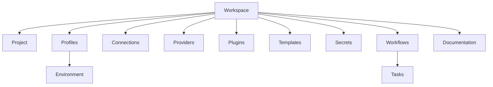
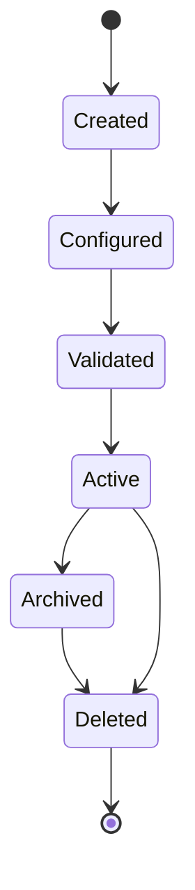
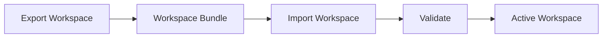

# 020 – Workspace Specification

**Document ID:** DEVOS-SPEC-020

**Version:** 0.1

**Status:** Draft

**Category:** Foundation

**Depends On:**

- DEVOS-SPEC-006 – Terminology
- DEVOS-SPEC-011 – Domain Model
- DEVOS-SPEC-012 – Domain Relationships
- DEVOS-SPEC-013 – Object Lifecycle
- DEVOS-SPEC-014 – State Model
- DEVOS-SPEC-015 – Object Ownership

**Referenced By:**

- DEVOS-SPEC-021 – Project Specification
- DEVOS-SPEC-022 – Profile Specification
- DEVOS-SPEC-029 – Workspace Manifest
- DEVOS-SPEC-031 – Workspace Engine
- DEVOS-SPEC-044 – Workspace Lifecycle

---

# Abstract

This document defines the Workspace, the root aggregate and primary operating boundary of DevOS.

A Workspace represents one managed software system and all DevOS-owned configuration, providers, plugins, templates, secrets, workflows, and documentation needed to operate that system.

---

# Purpose

This specification answers the following question:

> **What is a DevOS Workspace and what must every Workspace contain?**

The Workspace is the first concrete foundation object because every other persistent DevOS object belongs to it.

---

# Goals

This specification aims to:

- Define the Workspace contract.
- Define required Workspace contents.
- Define Workspace invariants.
- Define Workspace boundaries.
- Define Workspace validation requirements.
- Provide the foundation for the Workspace Manifest.

---

# Non Goals

This specification does not define:

- Manifest file syntax
- CLI commands
- Dashboard behavior
- Database schemas
- Synchronization protocol
- Remote execution
- Organization or team ownership

---

# Definition

A Workspace is the root DevOS domain object.

It owns exactly one Project and all supporting objects required to configure, inspect, automate, and document that Project.

A Workspace is both:

- a domain aggregate.
- an operational boundary.

---

# Required Properties

A Workspace MUST have:

| Property | Required | Description |
| -------- | -------- | ----------- |
| id       | Yes      | Stable Workspace identifier. |
| name     | Yes      | Human-readable Workspace name. |
| version  | Yes      | Workspace schema or manifest version. |
| project  | Yes      | The single Project owned by the Workspace. |
| profiles | Yes      | One or more Profiles. |
| manifest | Yes      | Declarative Workspace definition. |

A Workspace MAY have:

- Connections
- Providers
- Plugins
- Templates
- Secrets
- Workflows
- Documentation
- Metadata

---

# Workspace Composition

---

# Workspace Boundary

The Workspace boundary contains all persistent DevOS domain objects for one managed software system.

External systems are outside the Workspace boundary.

Examples of external systems:

- Git providers
- Cloud providers
- Databases
- Container runtimes
- AI providers
- Package registries

Workspace-owned objects may describe or connect to external systems, but those external systems are not owned by DevOS.

---

# Workspace Invariants

The following invariants MUST always hold.

- A Workspace has exactly one Project.
- A Workspace has one or more Profiles.
- A Workspace owns all persistent child objects.
- A Workspace is the only Aggregate Root.
- A Workspace cannot be partially owned by another Workspace.
- A Workspace cannot share child ownership with another Workspace.
- A Workspace export must preserve ownership relationships.
- A Workspace import must revalidate all owned objects.

---

# Lifecycle Requirements

A Workspace follows the lifecycle defined in DEVOS-SPEC-013.

A Workspace MUST NOT become Active unless:

- it has exactly one Project.
- it has at least one Profile.
- required owned objects are valid.
- ownership rules are satisfied.
- manifest validation succeeds.

---

# State Requirements

A Workspace reports the runtime state defined in DEVOS-SPEC-014.

| State    | Meaning |
| -------- | ------- |
| Unknown  | Workspace has not been evaluated. |
| Ready    | Required Workspace objects are usable. |
| Busy     | Workspace-level operation is running. |
| Degraded | Optional Workspace objects are failing. |
| Failed   | Required Workspace objects are failing. |

A Workspace MUST NOT report Ready if its Project or required Profile is Failed.

---

# Validation Requirements

Workspace validation MUST verify:

- Workspace identity exists.
- Workspace name exists.
- exactly one Project exists.
- one or more Profiles exist.
- every Environment belongs to exactly one Profile.
- every Task belongs to exactly one Workflow.
- no child object has multiple owners.
- no child object exists outside the Workspace aggregate.
- referenced objects exist or are explicitly optional.
- Secret values are not exposed in validation output.

---

# Manifest Relationship

A Workspace is represented declaratively by a Workspace Manifest.

The Workspace Manifest is the portable representation of the Workspace.

The Manifest MUST preserve:

- Workspace identity or import identity mapping.
- Project definition.
- Profile definitions.
- Environment definitions.
- owned object definitions.
- references between owned objects.

Manifest format is defined in DEVOS-SPEC-029.

---

# Import and Export

The Workspace is the canonical import and export unit.

Export SHOULD include all Workspace-owned objects except raw secret values.

Import MUST validate the Workspace before it can become Active.

---

# Deletion

Deleting a Workspace deletes the aggregate boundary.

All directly and transitively owned objects are deleted with the Workspace.

Implementations MUST prevent Active references to deleted Workspace objects.

Secret deletion MUST prevent future resolution of deleted secrets.

---

# Security Requirements

Workspace security requirements are minimal in this document.

A Workspace MUST:

- preserve ownership metadata.
- avoid exposing raw secret values.
- support audit of lifecycle changes.
- provide a boundary for future access-control policies.

Detailed security behavior is defined in DEVOS-SPEC-036 and DEVOS-SPEC-062.

---

# Future Extensions

Future Workspace specifications may add support for:

- Organizations
- Teams
- Shared Workspaces
- Remote Agents
- Cloud Synchronization
- Workspace Federation
- Marketplace Packages

These features MUST NOT break the single Workspace aggregate model without an ADR.

---

# References

- DEVOS-SPEC-006 – Terminology
- DEVOS-SPEC-011 – Domain Model
- DEVOS-SPEC-012 – Domain Relationships
- DEVOS-SPEC-013 – Object Lifecycle
- DEVOS-SPEC-014 – State Model
- DEVOS-SPEC-015 – Object Ownership
- DEVOS-SPEC-029 – Workspace Manifest

---

# Revision History

| Version | Date | Author             | Notes         |
| ------- | ---- | ------------------ | ------------- |
| 0.1     | TBD  | DevOS Contributors | Initial Draft |
