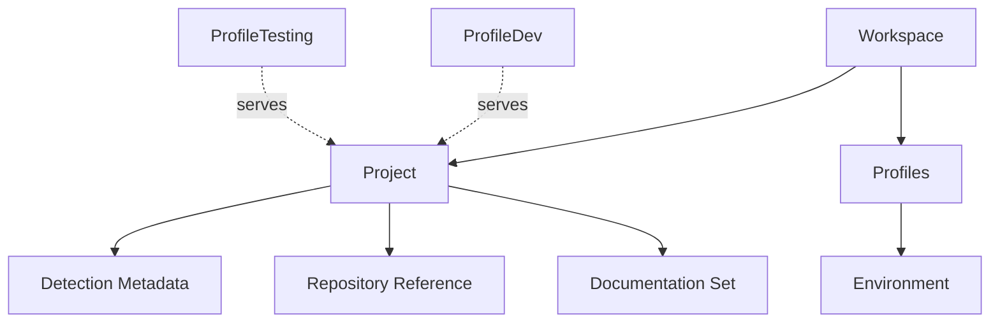
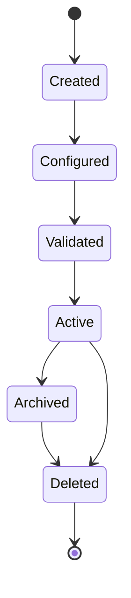

# 021 – Project Specification

**Document ID:** DEVOS-SPEC-021

**Version:** 0.1

**Status:** Draft

**Category:** Foundation

**Depends On:**

- DEVOS-SPEC-006 – Terminology
- DEVOS-SPEC-011 – Domain Model
- DEVOS-SPEC-012 – Domain Relationships
- DEVOS-SPEC-013 – Object Lifecycle
- DEVOS-SPEC-014 – State Model
- DEVOS-SPEC-015 – Object Ownership
- DEVOS-SPEC-020 – Workspace Specification

**Referenced By:**

- DEVOS-SPEC-022 – Profile Specification
- DEVOS-SPEC-029 – Workspace Manifest
- DEVOS-SPEC-031 – Workspace Engine
- DEVOS-SPEC-042 – Project Import
- DEVOS-SPEC-043 – Project Detection
- DEVOS-SPEC-044 – Workspace Lifecycle

---

# Abstract

This document defines the Project, the managed software system at the center of every DevOS Workspace.

A Project describes what is being built: its identity, its descriptive metadata, and the pointers that help tooling understand it.

This document defines required Project properties, optional declarations, invariants, lifecycle constraints, runtime states, and validation requirements.

It does not define how a Project is built, tested, or deployed.

---

# Purpose

This specification answers the following question:

> **What is a DevOS Project and what must every Project define?**

The Project is the second concrete foundation object because the Workspace exists to operate exactly one managed software system.

---

# Goals

This specification aims to:

- Define the Project contract.
- Define required and optional Project properties.
- Define the single Project invariant.
- Define Project lifecycle restrictions.
- Define Project runtime states.
- Define Project validation requirements.
- Provide the foundation for import and detection behavior.

---

# Non Goals

This specification does not define:

- Build, test, or deploy execution
- Manifest file syntax
- Import or detection algorithms
- Programming language support
- Repository hosting integrations
- CLI commands
- Database schemas
- Organization or team ownership

Build and deployment automation stays outside this version of the specification.

Workflows handle automation conceptually and are defined separately by the domain model.

---

# Definition

A Project is the single managed software system of one Workspace.

A Project describes WHAT is being built.

A Project is descriptive metadata about that system, not an executor of it.

Every Project belongs to exactly one Workspace.

A Project cannot exist outside a Workspace boundary.

---

# Single Project Invariant

DEVOS-SPEC-012 defines the cardinality rule and DEVOS-SPEC-015 defines the ownership matrix.

Together they require:

- A Workspace owns exactly one Project.
- A Project belongs to exactly one Workspace.

There is no Workspace without a Project and no Project outside a Workspace.

Implementations MUST reject any configuration that declares zero or multiple Projects for one Workspace.

---

# Required Properties

A Project MUST have:

| Property    | Required | Description |
| ----------- | -------- | ----------- |
| id          | Yes      | Stable Project identifier. |
| name        | Yes      | Human-readable Project name. |
| description | No       | Short explanation of the managed system. |
| version     | No       | Declared Project version. |
| metadata    | No       | Additional non-normative key/value information. |

---

# Optional Declarations

A Project MAY declare:

- a repository reference descriptor.
- language and tooling hints expressed as Detection Metadata.
- a documentation set pointer.

Detection Metadata is consumed conceptually by Project Detection defined in DEVOS-SPEC-043.

A repository reference descriptor points to an external system.

The external repository itself remains outside the Workspace boundary, consistent with DEVOS-SPEC-020.

---

# Project Composition

Profiles do not own the Project.

Each Profile provides one logical context under which the same Project is configured and operated.

---

# Project Invariants

The following invariants MUST always hold.

- A Project has exactly one owning Workspace.
- A Project cannot exist outside a Workspace aggregate.
- A Workspace has exactly one Project.
- A Project MUST NOT be owned by more than one Workspace.
- A Project MUST NOT be shared between Workspaces.
- Optional declarations MUST NOT change ownership relationships.
- A Project MUST NOT reference objects outside its own Workspace except as external descriptors.

---

# Lifecycle Requirements

A Project follows the lifecycle defined in DEVOS-SPEC-013.

The lifecycle of a Project is tied to the lifecycle of its Workspace.

The object lifecycle matrix in DEVOS-SPEC-013 states that a Project:

- cannot be archived.
- cannot be deleted independently.

A Project MUST NOT be archived or deleted independently of its Workspace.

The Active to Archived and Active to Deleted transitions above are reachable only through the owning Workspace.

When a Workspace is archived, its Project is archived with it.

When a Workspace is deleted, its Project is deleted with it.

Import and detection operations MAY replace Project metadata, but they MUST NOT create a new independent Project inside an existing Active Workspace.

---

# State Requirements

A Project reports the runtime state defined in DEVOS-SPEC-014.

| State   | Meaning |
| ------- | ------- |
| Unknown | Project status has not been inspected. |
| Ready   | Project metadata is readable and valid. |
| Busy    | Project detection, import, or analysis is running. |
| Failed  | Project metadata is unreadable or invalid. |

A Project enters Busy only while detection, import, or analysis is running.

A Project MUST report Ready before its Workspace can satisfy the Ready conditions defined in DEVOS-SPEC-020.

---

# Validation Requirements

Project validation MUST verify:

- Project identity exists.
- Project name exists.
- exactly one Project exists per Workspace.
- the Project belongs to exactly one owner.
- declared properties are well formed.
- optional declarations are either valid or absent.
- manifest consistency with the Project definition.
- no plaintext secret values appear in Project metadata.

Validation failures MUST keep the Project from becoming Validated in the lifecycle sense.

---

# Security Requirements

A Project holds descriptive metadata and therefore carries limited security surface.

A Project MUST:

- treat repository references as untrusted input during import.
- never store credentials inline.
- express sensitive values as Secret references when needed.
- exclude raw secret values from detection output.
- support audit of import and detection changes.

Detailed security behavior is defined in DEVOS-SPEC-036.

---

# Future Extensions

Future specifications may extend the Project with:

- richer language and tooling descriptors
- multi-repository descriptors
- build and deployment workflows
- Project templates
- Project sharing across Workspaces

Any change that relaxes the single Project invariant MUST require an ADR.

---

# References

- DEVOS-SPEC-006 – Terminology
- DEVOS-SPEC-011 – Domain Model
- DEVOS-SPEC-012 – Domain Relationships
- DEVOS-SPEC-013 – Object Lifecycle
- DEVOS-SPEC-014 – State Model
- DEVOS-SPEC-015 – Object Ownership
- DEVOS-SPEC-020 – Workspace Specification
- DEVOS-SPEC-029 – Workspace Manifest
- DEVOS-SPEC-042 – Project Import
- DEVOS-SPEC-043 – Project Detection

---

# Revision History

| Version | Date | Author             | Notes         |
| ------- | ---- | ------------------ | ------------- |
| 0.1     | TBD  | DevOS Contributors | Initial Draft |
