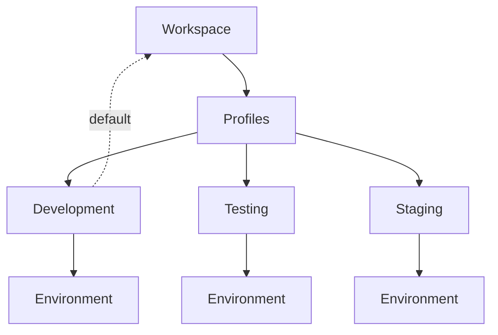
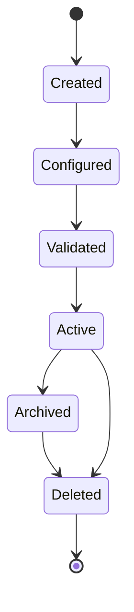

# 022 – Profile Specification

**Document ID:** DEVOS-SPEC-022

**Version:** 0.1

**Status:** Draft

**Category:** Foundation

**Depends On:**

- DEVOS-SPEC-006 – Terminology
- DEVOS-SPEC-011 – Domain Model
- DEVOS-SPEC-012 – Domain Relationships
- DEVOS-SPEC-013 – Object Lifecycle
- DEVOS-SPEC-014 – State Model
- DEVOS-SPEC-015 – Object Ownership
- DEVOS-SPEC-020 – Workspace Specification

**Referenced By:**

- DEVOS-SPEC-021 – Project Specification
- DEVOS-SPEC-023 – Environment Specification
- DEVOS-SPEC-029 – Workspace Manifest
- DEVOS-SPEC-045 – Configuration System
- DEVOS-SPEC-047 – Settings

---

# Abstract

This document defines the Profile, one named logical configuration context within a Workspace.

Profiles isolate configuration so the same Project can run under different contexts without duplication.

This document defines required Profile properties, optional declarations, the default Profile rule, invariants, lifecycle behavior, runtime states, and validation requirements.

---

# Purpose

This specification answers the following question:

> **What is a Profile and why does every Workspace need at least one?**

The Profile is the third concrete foundation object because a Workspace without a Profile has no context in which its Project is configured or operated.

---

# Goals

This specification aims to:

- Define the Profile contract.
- Define required and optional Profile properties.
- Define the default Profile rule.
- Define Profile invariants.
- Define Profile lifecycle freedom and its limits.
- Define Profile runtime states.
- Define Profile validation requirements.

---

# Non Goals

This specification does not define:

- Environment variable resolution
- Secret storage
- Manifest file syntax
- CLI commands
- Dashboard behavior
- Database schemas
- Access control policies
- Provider selection rules

Configuration layering is delegated to DEVOS-SPEC-045.

---

# Definition

A Profile is ONE named logical configuration context within the Workspace.

A Profile isolates configuration so the same Project runs under different contexts without duplicating the Workspace definition.

Illustrative Profile names include:

- Development
- Testing
- Staging
- Production
- Research

These names are examples only.

Implementations MUST NOT reserve or hardcode specific Profile names.

Every Profile owns exactly one Environment, as required by DEVOS-SPEC-015.

---

# Required Properties

A Profile MUST have:

| Property | Required | Description |
| -------- | -------- | ----------- |
| id       | Yes      | Stable Profile identifier. |
| name     | Yes      | Human-readable Profile name. |

A Profile MAY have:

| Property      | Required | Description |
| ------------- | -------- | ----------- |
| description   | No       | Short explanation of the context. |
| default flag  | No       | Marks this Profile as the fallback. |
| display order | No       | Ordering hint for user interfaces. |

At most one Profile per Workspace MAY declare the default flag.

---

# The Default Profile Rule

Tools select a Profile explicitly when operating on a Workspace.

Unspecified selection MUST fall back to the default Profile if one is declared.

If no default Profile is declared, unspecified selection MUST be rejected rather than guessed.

A Workspace SHOULD declare exactly one default Profile.

Exactly zero defaults are valid but reduce convenience.

More than one default is invalid and MUST fail validation.

---

# Minimum Profile Count

DEVOS-SPEC-020 requires that every Workspace owns one or more Profiles.

A Workspace MUST have at least one Profile.

A Workspace with zero Profiles MUST NOT become Active.

---

# Design Decisions

| Decision | Rationale |
| -------- | --------- |
| One Profile per context | Contexts stay isolated and independently configurable. |
| Exactly one Environment per Profile | Configuration for a context has exactly one source of truth. |
| Default Profile rule | Unspecified tool selection stays deterministic. |
| Names are not reserved | Contexts are user-defined, not hardcoded categories. |

---

# Profile Composition

Each Profile owns its own Environment.

Environments are never shared between Profiles.

---

# Profile Invariants

The following invariants MUST always hold.

- A Profile belongs to exactly one Workspace.
- A Profile owns exactly one Environment.
- A Workspace owns one or more Profiles.
- At most one Profile per Workspace is marked default.
- Environments cannot be shared between Profiles.
- Profile names MUST be unique within their Workspace.
- No circular ownership exists between Profiles and other objects.

---

# Lifecycle Requirements

A Profile follows the lifecycle defined in DEVOS-SPEC-013.

The object lifecycle matrix in DEVOS-SPEC-013 allows a Profile to be archived and deleted independently.

Independent deletion is bounded by one rule.

Profile deletion MUST preserve at least one remaining Profile in the Workspace.

Deleting the last remaining Profile MUST be rejected.

Archiving a Profile MUST NOT remove it from ownership.

An Archived Profile MUST NOT serve as the default Profile while archived.

When a Profile is deleted, its owned Environment is deleted with it.

---

# State Requirements

A Profile reports the runtime state defined in DEVOS-SPEC-014.

| State    | Meaning |
| -------- | ------- |
| Unknown  | Profile has not been evaluated. |
| Ready    | Profile and Environment are valid. |
| Degraded | Optional configuration is missing or invalid. |
| Failed   | Required Environment configuration is invalid. |
| Disabled | Profile is intentionally unavailable. |

Degraded means optional Environment configuration is invalid.

Disabled means the Profile is intentionally unavailable.

A Disabled Profile MUST NOT be selected as the default Profile target during execution.

---

# Validation Requirements

Profile validation MUST verify:

- Profile identity exists.
- Profile name exists.
- the Profile belongs to exactly one Workspace.
- the Profile owns exactly one Environment.
- at most one Profile per Workspace declares the default flag.
- an Archived Profile does not hold the default flag.
- display order, if present, is well formed.
- manifest consistency with the Profile definitions.

Validation failures MUST keep the Profile from becoming Validated in the lifecycle sense.

---

# Security Requirements

A Profile holds configuration context and therefore inherits the security posture of what it configures.

A Profile MUST:

- exclude raw secret values from its definition.
- reference Secrets instead of embedding them.
- support audit of default flag changes.
- remain inert while Disabled.

Detailed security behavior is defined in DEVOS-SPEC-036.

---

# Future Extensions

Future specifications may extend Profiles with:

- Profile inheritance
- Profile groups
- Per-profile access control
- Shared cross-Workspace contexts
- Scheduled profile activation

Any extension that breaks the one Environment per Profile rule MUST require an ADR.

---

# References

- DEVOS-SPEC-006 – Terminology
- DEVOS-SPEC-011 – Domain Model
- DEVOS-SPEC-012 – Domain Relationships
- DEVOS-SPEC-013 – Object Lifecycle
- DEVOS-SPEC-014 – State Model
- DEVOS-SPEC-015 – Object Ownership
- DEVOS-SPEC-020 – Workspace Specification
- DEVOS-SPEC-023 – Environment Specification
- DEVOS-SPEC-029 – Workspace Manifest
- DEVOS-SPEC-045 – Configuration System
- DEVOS-SPEC-047 – Settings

---

# Revision History

| Version | Date | Author             | Notes         |
| ------- | ---- | ------------------ | ------------- |
| 0.1     | TBD  | DevOS Contributors | Initial Draft |
