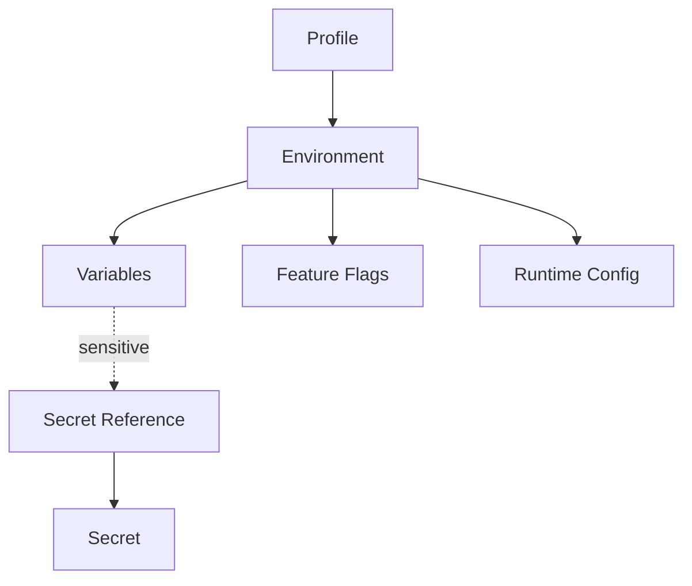
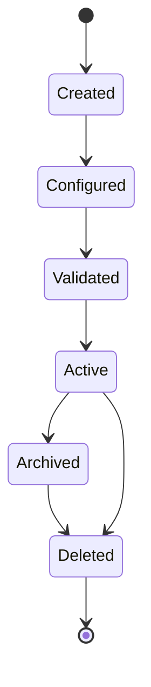

# 023 – Environment Specification

**Document ID:** DEVOS-SPEC-023

**Version:** 0.1

**Status:** Draft

**Category:** Foundation

**Depends On:**

- DEVOS-SPEC-006 – Terminology
- DEVOS-SPEC-011 – Domain Model
- DEVOS-SPEC-012 – Domain Relationships
- DEVOS-SPEC-013 – Object Lifecycle
- DEVOS-SPEC-014 – State Model
- DEVOS-SPEC-015 – Object Ownership
- DEVOS-SPEC-020 – Workspace Specification
- DEVOS-SPEC-028 – Secret Specification

**Referenced By:**

- DEVOS-SPEC-022 – Profile Specification
- DEVOS-SPEC-025 – Connection Specification
- DEVOS-SPEC-028 – Secret Specification
- DEVOS-SPEC-045 – Configuration System

---

# Abstract

This document defines the Environment, the runtime configuration owned by exactly one Profile.

An Environment contains environment variables, feature flags, and runtime configuration entries.

This document defines what an Environment owns, how values are expressed, how values are resolved conceptually, invariants, lifecycle restrictions, runtime states, validation requirements, and security requirements.

Final resolution authority is delegated to the Configuration System.

---

# Purpose

This specification answers the following question:

> **What runtime configuration does an Environment own and how are values resolved?**

The Environment is the fourth concrete foundation object because a Profile without runtime configuration has no operational meaning.

---

# Goals

This specification aims to:

- Define the Environment contract.
- Define the three kinds of configuration entries.
- Distinguish literal values from Secret references.
- Define conceptual resolution precedence.
- Define Environment invariants.
- Define Environment lifecycle restrictions.
- Define Environment runtime states.
- Define Environment validation requirements.

---

# Non Goals

This specification does not define:

- The full configuration layering model
- Secret storage or rotation mechanics
- dotenv file formats
- Shell integration
- Container runtimes
- Process execution
- Manifest file syntax
- CLI commands

Full layering is defined by DEVOS-SPEC-045.

Secret mechanics are defined by DEVOS-SPEC-028.

---

# Definition

An Environment is the runtime configuration owned by EXACTLY one Profile.

An Environment contains:

- environment variables.
- feature flags.
- runtime configuration entries.

Environment variables are name/value pairs.

A value MAY be a literal or a Secret reference.

Feature flags are named boolean or string toggles.

Runtime configuration entries are key/value settings consumed by tooling.

---

# Values

Literal values are allowed for non-sensitive data.

Sensitive values MUST be Secret references as defined in DEVOS-SPEC-028.

Sensitive values MUST NOT be stored as literals.

A Secret reference names a Secret owned by the same Workspace.

Implementations MUST NOT resolve Secret references at manifest parse time.

Resolution happens only through authorized systems at usage time.

---

# Ownership Constraint

DEVOS-SPEC-012 requires that every object belongs to exactly one owner and cannot be shared.

An Environment belongs to one Profile and cannot be shared between Profiles.

Two Profiles requiring identical configuration MUST declare their own Environments.

Copying between Environments is a user action, not implicit sharing.

---

# Resolution Precedence

Resolution precedence in this section is conceptual.

The full layering model is normatively defined by DEVOS-SPEC-045.

Conceptually, later sources override earlier ones:

1. defaults.
2. workspace-level settings defined in DEVOS-SPEC-047.
3. Environment variables.
4. secret-resolved references.

Secret-resolved references override literals of the same name.

When precedence cannot determine a single winner, implementations MUST fail closed rather than guess.

---

# Design Decisions

| Decision | Rationale |
| -------- | --------- |
| Exactly one Environment per Profile | One context has one source of truth. |
| Three entry kinds only | Variables, flags, and settings cover common needs without format sprawl. |
| Secrets by reference | Sensitive values never live inside Environment definitions. |
| Conceptual precedence here, authority elsewhere | This document stays structural; DEVOS-SPEC-045 owns layering. |
| Fail closed on ambiguity | Deterministic behavior beats silent guessing. |

---

# Environment Composition

The Secret referenced above is owned by the Workspace, not by the Environment.

---

# Environment Invariants

The following invariants MUST always hold.

- An Environment belongs to exactly one Profile.
- An Environment cannot be shared.
- Variable names are unique within the Environment.
- Feature flag names are unique within the Environment.
- Runtime configuration keys are unique within the Environment.
- Sensitive values are Secret references, never literals.
- Secret references point to Secrets owned by the same Workspace.
- No circular ownership exists involving an Environment.

---

# Lifecycle Requirements

An Environment follows the lifecycle defined in DEVOS-SPEC-013.

The object lifecycle matrix in DEVOS-SPEC-013 states that an Environment:

- cannot be archived.
- cannot be deleted independently.

The Environment lifecycle is tied to its Profile lifecycle.

The Active to Archived and Active to Deleted transitions above are reachable only through the owning Profile.

An Environment is archived when its Profile is archived.

An Environment is deleted when its Profile is deleted.

Implementations MUST NOT offer independent Environment archival or deletion.

---

# State Requirements

An Environment reports the runtime state defined in DEVOS-SPEC-014.

| State   | Meaning |
| ------- | ------- |
| Unknown | Environment has not been evaluated. |
| Ready   | Required configuration is present. |
| Failed  | Required configuration is missing or invalid. |

The Environment state set has exactly these three states.

There is no Busy or Degraded state for an Environment.

Evaluation of an Environment is instantaneous from the domain perspective; it does not occupy a Busy state.

Partial validity is reported by the owning Profile as Degraded, not by the Environment itself.

---

# Validation Requirements

Environment validation MUST verify:

- variable names exist and are non-empty.
- variable names are unique within the Environment.
- feature flag names exist and are unique.
- runtime configuration keys are unique.
- every Secret reference resolves to a Secret owned by the same Workspace.
- no literal value pattern-matches known plaintext secret shapes heuristically without being flagged.
- flagged values fail validation until reclassified as Secret references.
- the Environment belongs to exactly one Profile.

Validation output MUST NOT include resolved secret values.

---

# Security Requirements

Environments are the most common accidental leak path for secrets because dotenv habits encourage inline credentials.

DevOS prohibits this explicitly.

An Environment MUST NOT contain plaintext secrets.

Sensitive values MUST use Secret references, and DEVOS-SPEC-028 defines absolute rules that apply without exception.

An Environment MUST:

- store sensitive values only as Secret references.
- exclude raw secret values from exports.
- exclude raw secret values from validation output.
- exclude raw secret values from logs and diagnostics.
- fail closed when a referenced Secret cannot be resolved.

Detailed security behavior is defined in DEVOS-SPEC-036.

---

# Future Extensions

Future specifications may extend Environments with:

- computed values
- external configuration providers
- environment inheritance chains
- per-entry access control
- environment diffing tools

Any extension that relaxes the single-owner rule MUST require an ADR.

---

# References

- DEVOS-SPEC-006 – Terminology
- DEVOS-SPEC-011 – Domain Model
- DEVOS-SPEC-012 – Domain Relationships
- DEVOS-SPEC-013 – Object Lifecycle
- DEVOS-SPEC-014 – State Model
- DEVOS-SPEC-015 – Object Ownership
- DEVOS-SPEC-020 – Workspace Specification
- DEVOS-SPEC-022 – Profile Specification
- DEVOS-SPEC-028 – Secret Specification
- DEVOS-SPEC-045 – Configuration System
- DEVOS-SPEC-047 – Settings

---

# Revision History

| Version | Date | Author             | Notes         |
| ------- | ---- | ------------------ | ------------- |
| 0.1     | TBD  | DevOS Contributors | Initial Draft |
