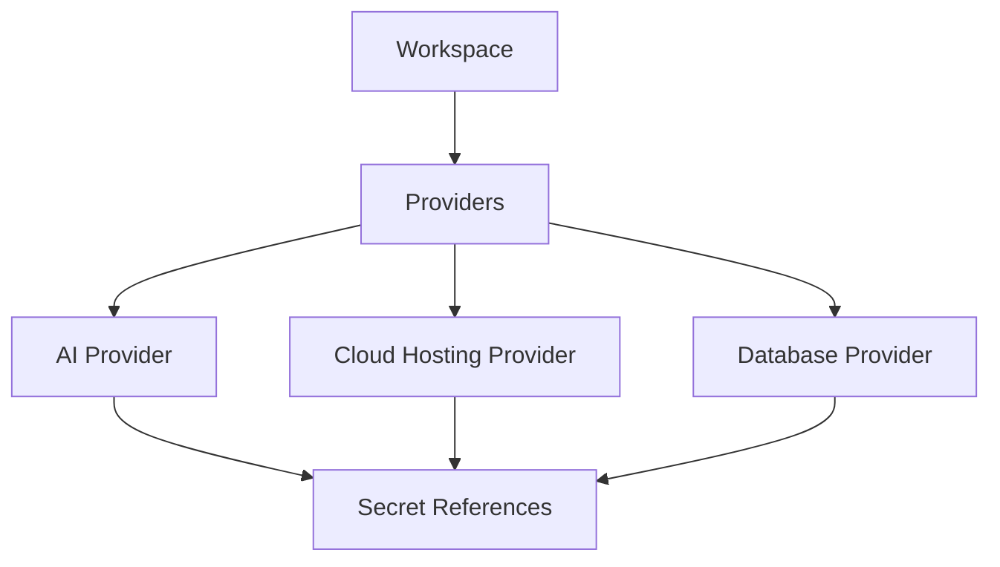
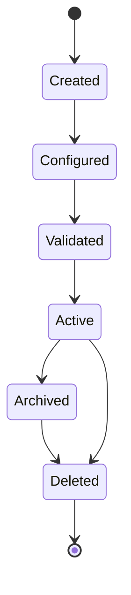
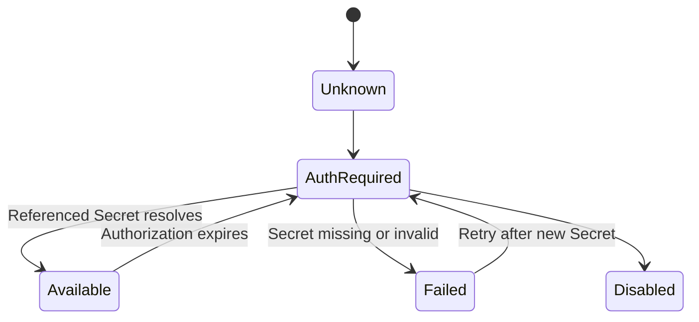

# 024 – Provider Specification

**Document ID:** DEVOS-SPEC-024

**Version:** 0.1

**Status:** Draft

**Category:** Foundation

**Depends On:**

- DEVOS-SPEC-006 – Terminology
- DEVOS-SPEC-011 – Domain Model
- DEVOS-SPEC-012 – Domain Relationships
- DEVOS-SPEC-013 – Object Lifecycle
- DEVOS-SPEC-014 – State Model
- DEVOS-SPEC-015 – Object Ownership
- DEVOS-SPEC-020 – Workspace Specification
- DEVOS-SPEC-028 – Secret Specification

**Referenced By:**

- DEVOS-SPEC-025 – Connection Specification
- DEVOS-SPEC-028 – Secret Specification
- DEVOS-SPEC-033 – Provider Engine
- DEVOS-SPEC-039 – AI Router
- DEVOS-SPEC-052 – Provider SDK

---

# Abstract

This document defines the Provider, the replaceable implementation unit for a DevOS capability category.

A Provider describes how a capability is fulfilled without changing what the Workspace requires.

This specification defines the Provider contract, its required properties, its credential handling, and its independence guarantees.

It does not define any specific vendor integration.

---

# Purpose

This specification answers the following question:

> **What is a Provider and what contract must every Provider satisfy?**

A Provider is a Workspace-owned object that implements one capability category behind a stable abstract contract.

Because every consumer depends only on that contract, providers stay interchangeable and no vendor becomes part of the domain model.

---

# Goals

This specification aims to:

- Define the Provider object and its contract.
- Define the open capability category model.
- Define required Provider properties.
- Guarantee provider replacement without structural change.
- Route all credentials through Secret references.
- Provide the foundation for the Provider Engine, AI Router, and Provider SDK.

---

# Non Goals

This specification does not define:

- Concrete vendor implementations
- Routing or selection algorithms
- Credential storage formats
- Network protocols
- API endpoints
- SDK binding details
- Provider pricing or quota models

---

# Definition

A Provider is a replaceable implementation of a capability category.

A capability category is an abstract kind of functionality the Workspace may consume.

A Provider declares which operations it supports within its category.

Consumers depend on the category and its abstract operations, never on a specific provider.

Every Provider is owned by exactly one Workspace.

---

# Capability Categories

Capability categories form an OPEN set.

This specification names initial categories as examples only:

- AI
- Cloud Hosting
- Database

Future categories MAY be added through the specification RFC process.

Vendor names appear in this document only as illustrative examples.

Example AI providers include OpenAI, Anthropic, and Ollama.

Example cloud hosting providers include AWS, Azure, and GCP.

Example database providers include PostgreSQL, MySQL, MongoDB, and Redis.

These examples are illustrative and MUST NOT be read as requirements, endorsements, or defaults.

---

# Required Properties

A Provider MUST have:

| Property          | Required | Description                                        |
| ----------------- | -------- | -------------------------------------------------- |
| id                | Yes      | Stable Provider identifier.                        |
| name              | Yes      | Human-readable Provider name.                      |
| capability        | Yes      | The capability category the Provider implements.   |
| configuration     | Yes      | Declarative Provider configuration block.          |

A Provider MAY have:

- a declaration of supported operations within its category.
- credential references expressed as Secret references.
- options and metadata.
- health evaluation hints.

---

# Provider Declaration

A Provider MUST declare its capabilities abstractly.

An abstract declaration states WHICH operations exist, not HOW they are performed.

Two providers of the same category SHOULD be substitutable when they declare overlapping operations.

Implementations MUST reject operations that a Provider has not declared.

---

# Provider Composition

---

# Credential Handling

Provider credentials are ALWAYS expressed as Secret references.

A Provider definition MUST NOT contain inline credential values.

Credential resolution is performed through DEVOS-SPEC-028 at use time.

Resolved credential values MUST NOT appear in Provider definitions, logs, diagnostics, or exports.

If a referenced Secret cannot be resolved, the Provider reports AuthRequired or Failed rather than failing silently.

---

# Provider Invariants

The following invariants MUST always hold.

- Every Provider belongs to exactly one Workspace.
- Replacing a Provider MUST NOT require changes to Workspace structure, Profiles, or Projects.
- Provider replacement MUST NOT change domain relationships defined in DEVOS-SPEC-011.
- This replaceability follows the Provider Agnostic principle (Rule 4).
- Consumers MUST depend on capability categories, not on specific providers.
- Provider definitions MUST NOT contain inline credential values.
- No capability category is hard-coded into the domain model.

---

# Lifecycle Requirements

A Provider follows the canonical lifecycle defined in DEVOS-SPEC-013.

A Provider MUST NOT become Active unless:

- its identity and capability category are valid.
- its configuration block passes validation.
- every credential reference points to an existing Workspace-owned Secret.
- its declared operations satisfy its category contract.

Deleting a Provider MUST remove or reject Active references to it before deletion completes, per DEVOS-SPEC-013.

---

# State Requirements

A Provider reports the runtime state defined in DEVOS-SPEC-014.

| State        | Meaning                                          |
| ------------ | ------------------------------------------------ |
| Unknown      | Provider has not been evaluated.                 |
| Available    | Provider can be used.                            |
| Unavailable  | Provider cannot currently be used.               |
| AuthRequired | Provider requires credentials or authorization.  |
| Degraded     | Provider is available with reduced capability.   |
| Failed       | Provider evaluation failed.                      |
| Disabled     | Provider is intentionally disabled.              |

A Provider MUST NOT report Available while a required Secret cannot be resolved.

---

# AuthRequired Resolution

AuthRequired indicates that the Provider lacks usable credentials or authorization.

Resolution is a controlled flow through Secret resolution, never an inline prompt embedded in configuration.

Implementations MUST NOT expose resolved credential values during this flow.

---

# Provider Selection

A Workspace MAY contain multiple Providers of the same capability category.

Choosing among them is a routing policy decision.

Routing policy is delegated conceptually to the Provider Engine in DEVOS-SPEC-033 and the AI Router in DEVOS-SPEC-039.

---

# Validation Requirements

Provider validation MUST verify:

- identity exists and is unique inside the Workspace.
- name exists.
- capability category is recognized or registered through the RFC process.
- configuration block satisfies the category contract.
- declared operations are valid for the category.
- every credential field is a Secret reference.
- no inline credential values are present.
- referenced Secrets exist and belong to the same Workspace.

Validation output MUST NOT contain credential values.

---

# Design Decisions

| Decision                 | Choice                                   | Rationale                                              |
| ------------------------ | ---------------------------------------- | ------------------------------------------------------ |
| Capability abstraction   | Consumers bind to categories, not vendors | Keeps Workspaces portable and provider agnostic.       |
| Credential indirection   | Secret references only                    | Centralizes secret handling in DEVOS-SPEC-028.         |
| No hard-coded vendors    | Open category set with RFC extension      | Prevents vendor lock-in inside the specification.      |
| Deferred selection       | Routing belongs to engines                | Separates contract from policy per DEVOS-SPEC-033.     |

---

# Security Requirements

A Provider MUST:

- store credentials only as Secret references.
- never log or expose resolved credential values.
- declare its permission surface before activation.
- support disabling without deletion.

Detailed security behavior is defined in DEVOS-SPEC-036.

---

# Future Extensions

Future Provider specifications may add support for:

- additional capability categories
- provider federation across Workspaces
- negotiated capability discovery
- usage metering
- marketplace-distributed providers

New categories MUST enter through the RFC process and MUST NOT break existing Provider contracts.

---

# References

- DEVOS-SPEC-006 – Terminology
- DEVOS-SPEC-011 – Domain Model
- DEVOS-SPEC-012 – Domain Relationships
- DEVOS-SPEC-013 – Object Lifecycle
- DEVOS-SPEC-014 – State Model
- DEVOS-SPEC-015 – Object Ownership
- DEVOS-SPEC-020 – Workspace Specification
- DEVOS-SPEC-028 – Secret Specification
- DEVOS-SPEC-033 – Provider Engine
- DEVOS-SPEC-039 – AI Router
- DEVOS-SPEC-052 – Provider SDK

---

# Revision History

| Version | Date | Author             | Notes         |
| ------- | ---- | ------------------ | ------------- |
| 0.1     | TBD  | DevOS Contributors | Initial Draft |
