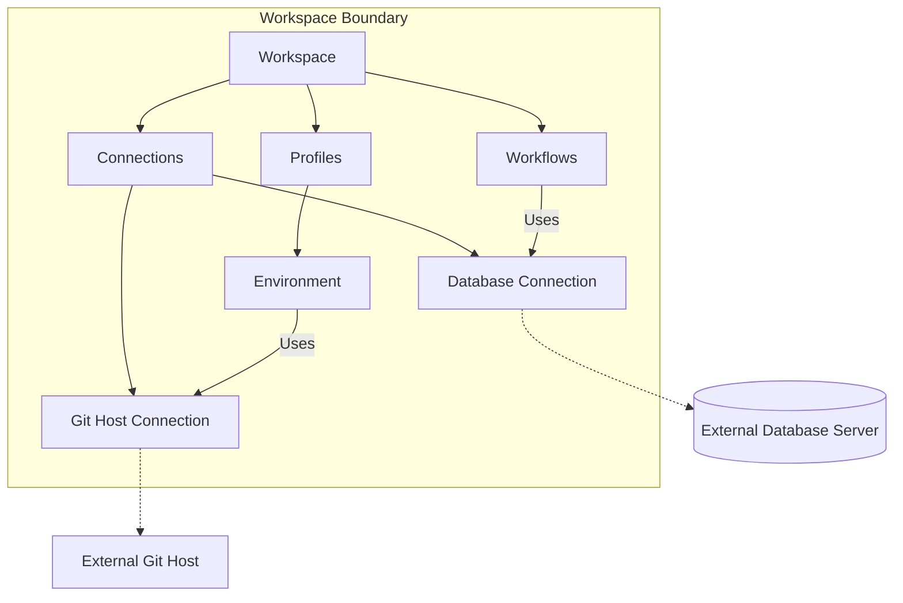
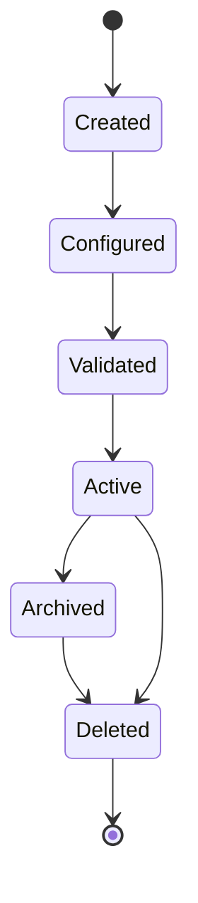
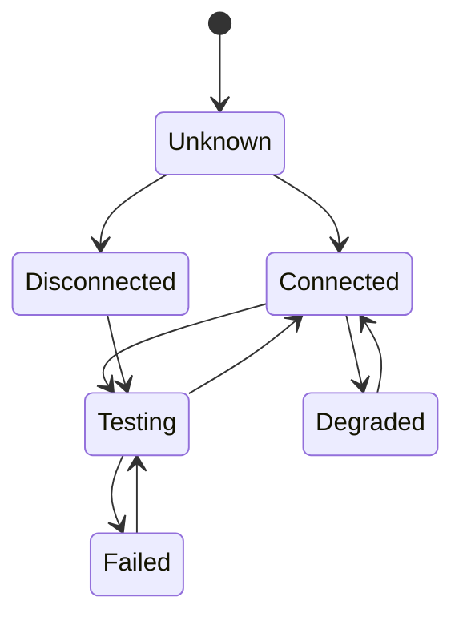

# 025 – Connection Specification

**Document ID:** DEVOS-SPEC-025

**Version:** 0.1

**Status:** Draft

**Category:** Foundation

**Depends On:**

- DEVOS-SPEC-006 – Terminology
- DEVOS-SPEC-011 – Domain Model
- DEVOS-SPEC-012 – Domain Relationships
- DEVOS-SPEC-013 – Object Lifecycle
- DEVOS-SPEC-014 – State Model
- DEVOS-SPEC-015 – Object Ownership
- DEVOS-SPEC-020 – Workspace Specification
- DEVOS-SPEC-028 – Secret Specification

**Referenced By:**

- DEVOS-SPEC-024 – Provider Specification
- DEVOS-SPEC-028 – Secret Specification
- DEVOS-SPEC-034 – Connection Engine
- DEVOS-SPEC-046 – Health System

---

# Abstract

This document defines the Connection, the declarative description of connectivity to one external system.

A Connection records WHERE and HOW to reach an external system without embedding credentials or owning that system.

This specification defines the Connection object, its relationship to Providers, its reuse across the Workspace, and its lifecycle and state requirements.

---

# Purpose

This specification answers the following question:

> **What is a Connection and how do Connections relate to Providers and external systems?**

A Connection is a Workspace-owned, declarative connectivity descriptor for exactly one external system instance.

Connections are reusable by many Workspace objects, while the external systems they describe always remain outside the DevOS aggregate boundary.

---

# Goals

This specification aims to:

- Define the Connection object and its required properties.
- Separate Connections from Providers and from external systems.
- Define Connection reuse across Workspace objects.
- Define Connection states.
- Define deletion rules for referenced Connections.
- Provide the foundation for the Connection Engine and Health System.

---

# Non Goals

This specification does not define:

- Connectivity check algorithms
- Network protocols
- Tunnel or proxy mechanics
- Credential storage formats
- External system administration
- Provider routing policy
- API endpoints

---

# Definition

A Connection is a declarative connectivity description for ONE external system instance.

Example external system instances include:

- a database server
- a git host
- a container host
- a Kubernetes cluster
- a message broker

These examples are illustrative and are not an exhaustive list.

A Connection is owned by a Workspace and MAY be used by many objects inside it.

The external system itself is never owned by DevOS.

---

# Distinction From Providers

A Connection and a Provider are different objects with different roles.

| Concept        | Role                                                     |
| -------------- | -------------------------------------------------------- |
| Connection     | Describes where and how to reach one external system.    |
| Provider       | Implements a capability category per DEVOS-SPEC-024.     |
| External system | The actual outside resource; never owned by DevOS.      |

A Connection MAY be associated with a Provider of a matching capability category.

That association is optional, and the two objects remain independently defined.

A Workspace MUST NOT treat a Provider as a substitute for a Connection or the reverse.

---

# Required Properties

A Connection MUST have:

| Property            | Required | Description                                              |
| ------------------- | -------- | -------------------------------------------------------- |
| id                  | Yes      | Stable Connection identifier.                            |
| name                | Yes      | Human-readable Connection name.                          |
| target type         | Yes      | The kind of external system being reached.               |
| endpoint descriptor | Yes      | Declarative address or locator for the external system.  |

A Connection MAY have:

- credential references expressed as Secret references only.
- connection options.
- health-check hints used by the Health System.

Credentials MUST NEVER be stored inline in a Connection.

---

# Connection Composition

Many Workspace objects MAY use one Connection.

The external systems pointed at by the dashed links stay OUTSIDE the Workspace aggregate boundary defined in DEVOS-SPEC-020.

---

# Connection Reuse

A Connection is OWNED by exactly one Workspace.

A Connection is USABLE by many Workspace objects, such as Workflows, Profiles, Environments, and Tasks.

This ownership and usage split follows the relationship rules of DEVOS-SPEC-012 and the ownership model of DEVOS-SPEC-015.

Usage MUST NOT transfer or share ownership.

Each using object references the Connection instead of duplicating its endpoint data.

---

# Connectivity Checks

This specification defines connectivity as declaration, not as verification.

Performing checks belongs conceptually to the Connection Engine in DEVOS-SPEC-034 and the Health System in DEVOS-SPEC-046.

Health-check hints on a Connection inform those systems but do not execute anything themselves.

Check results are reported as Connection state, never as lifecycle changes.

---

# Connection Invariants

The following invariants MUST always hold.

- Every Connection belongs to exactly one Workspace.
- A Connection describes at most one external system instance.
- External systems remain outside the Workspace aggregate boundary.
- A Connection MUST NOT contain inline credentials.
- Usage of a Connection never changes its ownership.
- Connection state never changes lifecycle stage.
- Deleting a Connection never deletes the external system.

---

# Lifecycle Requirements

A Connection follows the canonical lifecycle defined in DEVOS-SPEC-013.

A Connection MUST NOT become Active unless:

- its identity, name, target type, and endpoint descriptor pass validation.
- every credential field is a Secret reference into DEVOS-SPEC-028.
- no inline secret values are present.

Deletion is independent but guarded.

If Active references exist, they MUST be removed or rejected before independent deletion completes, per DEVOS-SPEC-013.

Deleting a Workspace deletes all owned Connections with it.

---

# State Requirements

A Connection reports the runtime state defined in DEVOS-SPEC-014.

| State        | Meaning                                                  |
| ------------ | -------------------------------------------------------- |
| Unknown      | Connection has not been checked.                         |
| Connected    | External system is reachable.                            |
| Testing      | Connectivity check is running.                           |
| Degraded     | External system is reachable with warnings.              |
| Disconnected | External system is intentionally offline or unreachable. |
| Failed       | Connectivity failed unexpectedly.                        |

State transitions are evaluated by the Connection Engine and reported through the Health System.

An Archived Connection SHOULD NOT be probed for connectivity.

---

# Validation Requirements

Connection validation MUST verify:

- identity exists and is unique inside the Workspace.
- name exists.
- target type is recognized.
- endpoint descriptor is syntactically valid for the target type.
- every credential field is a Secret reference.
- no inline credential values are present.
- referenced Secrets exist and belong to the same Workspace.
- health-check hints, when present, are structurally valid.

Validation output MUST NOT include resolved endpoints considered sensitive or any credential values.

---

# Security Requirements

Endpoint descriptors MAY be sensitive because host strings can reveal infrastructure topology.

Implementations MUST therefore:

- treat host strings as configuration data, not public output.
- suppress endpoint details in logs shared across trust boundaries.
- store credentials only as Secret references.
- exclude raw endpoints from exports when a portable alias suffices.

Detailed security behavior is defined in DEVOS-SPEC-036.

---

# Future Extensions

Future Connection specifications may add support for:

- connection pooling descriptors
- multiplexed connections
- federated connections across Workspaces
- measured quality-of-service reporting
- marketplace-distributed connection presets

New capabilities MUST NOT move external systems inside the Workspace aggregate boundary.

---

# References

- DEVOS-SPEC-006 – Terminology
- DEVOS-SPEC-011 – Domain Model
- DEVOS-SPEC-012 – Domain Relationships
- DEVOS-SPEC-013 – Object Lifecycle
- DEVOS-SPEC-014 – State Model
- DEVOS-SPEC-015 – Object Ownership
- DEVOS-SPEC-020 – Workspace Specification
- DEVOS-SPEC-024 – Provider Specification
- DEVOS-SPEC-028 – Secret Specification
- DEVOS-SPEC-034 – Connection Engine
- DEVOS-SPEC-046 – Health System

---

# Revision History

| Version | Date | Author             | Notes         |
| ------- | ---- | ------------------ | ------------- |
| 0.1     | TBD  | DevOS Contributors | Initial Draft |
