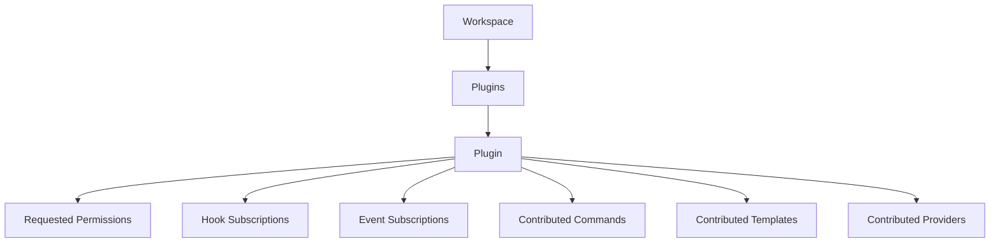
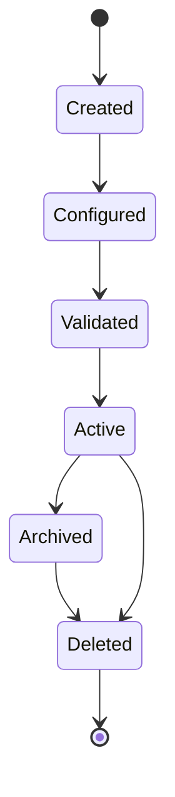
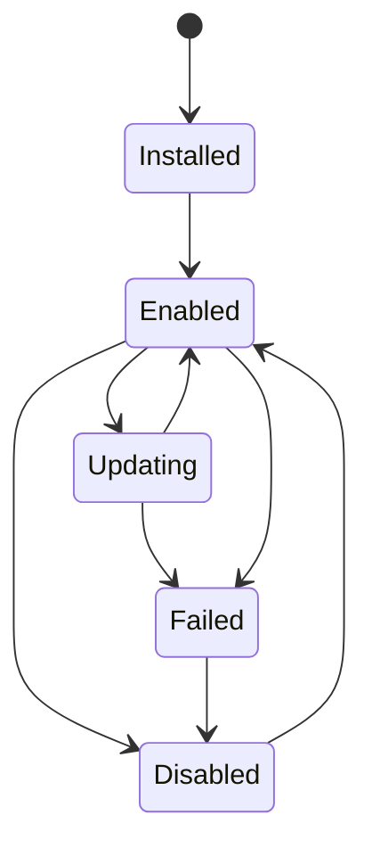
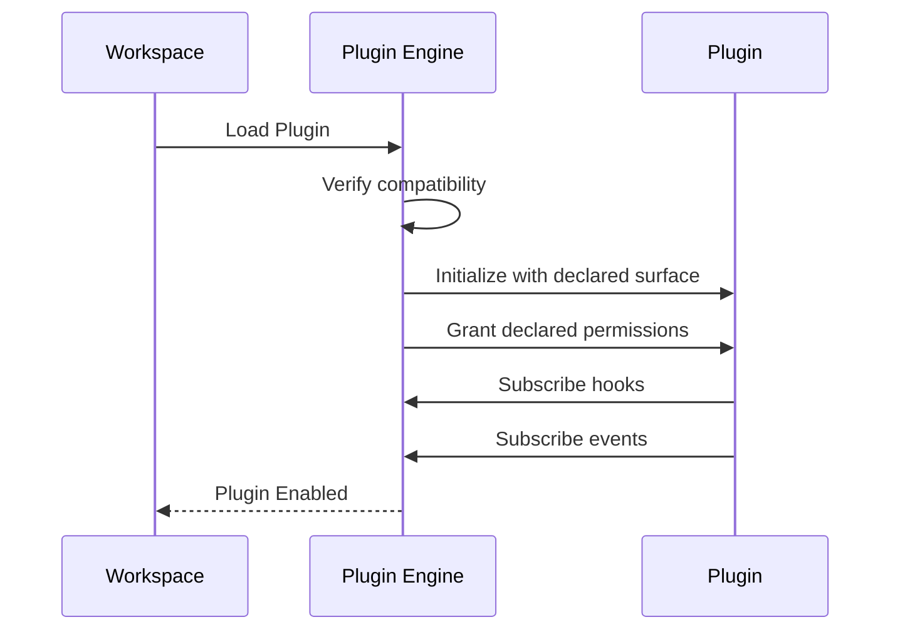

# 026 – Plugin Specification

**Document ID:** DEVOS-SPEC-026

**Version:** 0.1

**Status:** Draft

**Category:** Foundation

**Depends On:**

- DEVOS-SPEC-006 – Terminology
- DEVOS-SPEC-011 – Domain Model
- DEVOS-SPEC-012 – Domain Relationships
- DEVOS-SPEC-013 – Object Lifecycle
- DEVOS-SPEC-014 – State Model
- DEVOS-SPEC-015 – Object Ownership
- DEVOS-SPEC-020 – Workspace Specification

**Referenced By:**

- DEVOS-SPEC-032 – Plugin Engine
- DEVOS-SPEC-051 – Plugin SDK
- DEVOS-SPEC-056 – Hooks API
- DEVOS-SPEC-057 – Events API
- DEVOS-SPEC-059 – Versioning Policy
- DEVOS-SPEC-070 – Marketplace

---

# Abstract

This document defines the Plugin, the packaged extension unit of DevOS.

A Plugin adds capability to a Workspace exclusively through public interfaces.

This specification defines what a Plugin may do, what it must never do, its permission model, and its isolation guarantees.

It does not define plugin packaging formats or loading mechanics.

---

# Purpose

This specification answers the following question:

> **What may a DevOS Plugin do and what must it never do?**

A Plugin MAY extend DevOS through public interfaces such as hooks, events, and contributed objects.

A Plugin MUST NEVER modify the core platform or bypass those interfaces.

If functionality CAN be delivered as a Plugin, it SHOULD NOT enter the core platform.

---

# Goals

This specification aims to:

- Define the Plugin object and its required properties.
- Define the extension surface available to Plugins.
- Define a least-privilege permission model.
- Guarantee failure containment inside Workspaces.
- Define Plugin states.
- Provide the foundation for the Plugin Engine, Plugin SDK, Hooks API, and Events API.

---

# Non Goals

This specification does not define:

- Package file formats
- Loading or execution mechanics
- Hook payloads
- Event transport
- Marketplace policies

---

# Definition

A Plugin is a packaged extension that adds capability to DevOS through PUBLIC interfaces only.

Public interfaces include hooks, events, contributed commands, contributed templates, and contributed providers.

---

# Extension Primacy

DevOS follows the Plugin First principle (Rule 6).

If functionality CAN be a plugin, it SHOULD NOT enter core.

---

# Isolation Mandate

A Plugin MUST NEVER modify the core platform or bypass public interfaces.

This mandate follows Plugin Isolation as defined in DEVOS-SPEC-011.

A Plugin MUST NOT alter the ownership, lifecycle, or identity of objects it does not own.

---

# Required Properties

A Plugin MUST have:

| Property            | Required | Description                                              |
| ------------------- | -------- | -------------------------------------------------------- |
| id                  | Yes      | Stable Plugin identifier.                                |
| name                | Yes      | Human-readable Plugin name.                              |
| version             | Yes      | Plugin version within its compatibility range.           |
| compatibility range | Yes      | The range of platform versions this Plugin supports.     |

A Plugin MAY declare:

- requested permissions.
- hook subscriptions.
- event subscriptions.
- contributed commands.
- contributed templates.
- contributed providers.

Undeclared capabilities do not exist for the Plugin at runtime.

---

# Permission Model

Plugin permissions follow a least privilege default (Rule 8).

Permissions MUST be declared upfront in the Plugin definition.

A Plugin receives exactly the permissions it declared and nothing more.

Unrequested capabilities MUST be unavailable to the Plugin at runtime.

---

# Failure Containment

A failing Plugin MUST be contained so that:

- Workspace ownership remains intact.
- owned objects remain valid.
- other Plugins remain unaffected.
- the failing Plugin reports Failed without side effects leaking outward.

Containment mechanics are delegated to the Plugin Engine in DEVOS-SPEC-032.

---

# Plugin Invariants

The following invariants MUST always hold.

- Every Plugin belongs to exactly one Workspace.
- Plugins extend DevOS only through public interfaces.
- A Plugin MUST NEVER modify the core platform or bypass public interfaces.
- A Plugin receives only its declared permissions.
- Unrequested capabilities are unavailable at runtime.
- A Plugin failure MUST NOT corrupt Workspace state.
- Plugin removal is lifecycle Deletion, never a runtime state.
- Compatibility is governed by DEVOS-SPEC-059.

---

# Plugin Composition

---

# Lifecycle Requirements

A Plugin follows the canonical lifecycle defined in DEVOS-SPEC-013.

A Plugin MUST NOT become Active unless:

- its identity, name, and version pass validation.
- its compatibility range covers the current platform version.
- its requested permissions parse against the permission model.
- its hook and event subscriptions name existing public interfaces.

Plugin removal is lifecycle Deletion, not a runtime state, per the note in DEVOS-SPEC-014.

Compatibility evaluation is governed by the Versioning Policy in DEVOS-SPEC-059.

---

# State Requirements

A Plugin reports the runtime state defined in DEVOS-SPEC-014.

| State     | Meaning                                  |
| --------- | ---------------------------------------- |
| Installed | Plugin exists but is not yet enabled.    |
| Enabled   | Plugin can contribute behavior.          |
| Disabled  | Plugin is intentionally inactive.        |
| Updating  | Plugin update is in progress.            |
| Failed    | Plugin cannot be loaded or used.         |

---

# Loading Interaction

Loading and orchestration are delegated to the Plugin Engine in DEVOS-SPEC-032.

The Plugin Engine MUST grant only declared permissions and MUST reject subscriptions to unknown interfaces.

---

# Validation Requirements

Plugin validation MUST verify:

- identity exists and is unique inside the Workspace.
- name exists.
- version is present and well formed.
- compatibility range is present and parseable.
- requested permissions exist in the permission model.
- hook subscriptions reference public hooks.
- event subscriptions reference public events.
- contributed commands, templates, and providers satisfy their object specifications.

Validation output MUST NOT expose secret values.

---

# Design Decisions

| Decision               | Choice                                       | Rationale                                               |
| ---------------------- | -------------------------------------------- | ------------------------------------------------------- |
| Public interfaces only | No core modification, no bypass paths        | Preserves Platform stability per Rule 6.                |
| Upfront permissions    | Declared before load, least privilege default | Limits blast radius per Rule 8.                         |
| Failure containment    | Disable failing Plugin, keep Workspace valid | Protects the aggregate boundary.                        |
| Removal via lifecycle  | Deletion instead of runtime state            | Matches the state note in DEVOS-SPEC-014.               |

---

# Security Requirements

A Plugin MUST:

- run with only its declared permissions.
- never receive secrets it did not request and that policy allows.
- never log credential values obtained through permitted access.
- be disableable without deletion.

Detailed security behavior is defined in DEVOS-SPEC-036.

---

# Future Extensions

Future Plugin specifications may add support for:

- signed package verification
- sandboxed execution profiles
- inter-plugin contracts
- cross-Workspace plugin sharing
- marketplace distribution and updates

Distribution and registries are deferred to the Marketplace specification in DEVOS-SPEC-070.

New capabilities MUST NOT weaken the isolation mandate without an ADR.

---

# References

- DEVOS-SPEC-006 – Terminology
- DEVOS-SPEC-011 – Domain Model
- DEVOS-SPEC-012 – Domain Relationships
- DEVOS-SPEC-013 – Object Lifecycle
- DEVOS-SPEC-014 – State Model
- DEVOS-SPEC-015 – Object Ownership
- DEVOS-SPEC-020 – Workspace Specification
- DEVOS-SPEC-032 – Plugin Engine
- DEVOS-SPEC-051 – Plugin SDK
- DEVOS-SPEC-056 – Hooks API
- DEVOS-SPEC-057 – Events API
- DEVOS-SPEC-059 – Versioning Policy
- DEVOS-SPEC-070 – Marketplace

---

# Revision History

| Version | Date | Author             | Notes         |
| ------- | ---- | ------------------ | ------------- |
| 0.1     | TBD  | DevOS Contributors | Initial Draft |
