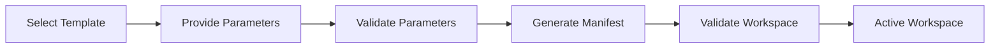

# 027 – Template Specification

**Document ID:** DEVOS-SPEC-027

**Version:** 0.1

**Status:** Draft

**Category:** Foundation

**Depends On:**

- DEVOS-SPEC-006 – Terminology
- DEVOS-SPEC-011 – Domain Model
- DEVOS-SPEC-012 – Domain Relationships
- DEVOS-SPEC-013 – Object Lifecycle
- DEVOS-SPEC-014 – State Model
- DEVOS-SPEC-015 – Object Ownership
- DEVOS-SPEC-020 – Workspace Specification

**Referenced By:**

- DEVOS-SPEC-035 – Template Engine
- DEVOS-SPEC-053 – Template SDK
- DEVOS-SPEC-070 – Marketplace

---

# Abstract

This document defines the Template, the reusable and parameterized DevOS object that accelerates creation of Workspaces, Projects, and Profiles.

A Template captures a known-good starting configuration once and turns it into a safe, repeatable starting point for future objects.

A Template is a declarative artifact. It describes its intended output; it never executes programs.

This specification is implementation independent. It defines what a Template is and what rules govern its use, not how template files are parsed or rendered.

---

# Purpose

This specification answers the following question:

> **What is a Template and what rules govern Template-driven creation?**

A Template accelerates object creation without sacrificing validation, portability, or safety.

Every instantiated result passes through the same validation gates as any hand-written configuration.

Templates make the common path fast; they never create a second, weaker path into the domain.

---

# Goals

This specification aims to:

- Define the Template contract.
- Define required and optional Template properties.
- Define typed Template parameters and their constraints.
- Define the instantiation flow from selection to Active Workspace.
- Define Template sources and ownership scope.
- Define Template security boundaries.

---

# Non Goals

This specification does not define:

- Template file syntax
- Template engine internals
- Registry protocols
- Marketplace distribution mechanics
- CLI commands
- User interface flows
- Database schemas

---

# Definition

A Template is a reusable, parameterized definition that describes the shape of a Workspace, Project, or Profile.

A Template exists so that developers do not start from an empty configuration.

A Template is:

- a declarative artifact.
- an input to creation, never a program.

A Template describes its output.

It does not execute code, fetch resources, or perform side effects.

Generation of the described output is performed by the Template Engine defined in DEVOS-SPEC-035.

---

# Required Properties

A Template MUST have:

| Property | Required | Description                |
| -------- | -------- | -------------------------- |
| id       | Yes      | Stable Template identifier. |
| name     | Yes      | Human-readable Template name. |
| version  | Yes      | Template version.           |

A Template MAY have:

- description
- parameters
- defaults
- examples
- compatibility range

The compatibility range declares which manifest or schema versions a Template targets.

---

# Declarative Nature

Templates are declarative by rule, not by preference.

A Template MUST describe the configuration it produces.

A Template MUST NOT contain executable logic.

Substitution of parameter values into static structure is the only transformation a Template performs.

This keeps every instantiation auditable, reproducible, and safe in offline environments.

---

# Template Parameters

Parameters are typed variables that make one Template usable for many needs.

## Parameter Types

Every parameter MUST declare exactly one type.

| Type    | Description                                     |
| ------- | ----------------------------------------------- |
| string  | Text value.                                     |
| number  | Numeric value.                                  |
| boolean | True or false value.                            |
| enum    | One value selected from a fixed allowed set.    |

## Required and Optional Parameters

Every parameter MUST be marked required or optional.

Required parameters MUST be supplied at instantiation.

Optional parameters MAY be omitted.

## Defaults

Any parameter MAY declare a default value.

The default MUST be applied when the caller omits an optional parameter.

A default MUST satisfy the constraints of its parameter.

A required parameter MUST NOT rely on a default to become satisfiable.

## Validation Constraints

Any parameter MAY declare validation constraints such as bounds, length limits, patterns, or allowed values.

Constraints MUST be checked before any output is generated.

Instantiation MUST fail when any constraint is violated.

Constraint failures MUST NOT produce partial output.

---

# Template Sources

In Version 0.1 a Template is owned by a Workspace, consistent with DEVOS-SPEC-015.

Workspace-owned templates travel with the Workspace aggregate and require no external service.

Shared registries and marketplace distribution are deferred to DEVOS-SPEC-070.

This specification defines neither registry protocols nor distribution formats.

---

# Instantiation Flow

Template-driven creation follows one canonical flow.

The stages have fixed meaning:

- Select Template chooses a Ready Template owned by the Workspace.
- Provide Parameters collects values for required parameters and overrides for optional ones.
- Validate Parameters checks types, constraints, and completeness.
- Generate Manifest produces a Workspace Manifest through the Template Engine defined in DEVOS-SPEC-035.
- Validate Workspace applies full manifest and domain validation as defined in DEVOS-SPEC-029 and DEVOS-SPEC-020.
- Active marks a Workspace that passed every gate.

No stage may be skipped.

Failed parameter validation MUST stop the flow before generation.

Generated output MUST NOT bypass Workspace activation requirements.

---

# Ownership and Scope

A Template belongs to exactly one Workspace.

A Template cannot own other domain objects.

A Template MAY reference Secrets, but only as references as defined in DEVOS-SPEC-028.

A Template MUST NOT create dependencies on objects outside its owning Workspace.

---

# Lifecycle Requirements

A Template follows the canonical lifecycle defined in DEVOS-SPEC-013.

An Archived Template is retained for history and rollback but MUST NOT create new Workspaces.

A Deleted Template MUST NOT be referenced by Active objects.

Lifecycle state does not change ownership.

---

# State Requirements

A Template reports the runtime state defined in DEVOS-SPEC-014.

| State    | Meaning                                |
| -------- | -------------------------------------- |
| Unknown  | Template has not been validated.       |
| Ready    | Template can be used.                  |
| Failed   | Template is invalid.                   |
| Disabled | Template is intentionally unavailable. |

Only a Template in Ready state participates in instantiation.

---

# Template Invariants

The following invariants MUST always hold.

- Every Template belongs to exactly one Workspace.
- A Template is declarative and MUST NOT execute code.
- Instantiation MUST NOT bypass validation.
- Archived Templates MUST NOT create new Workspaces.
- A Template MUST NOT read secret values.
- Instantiation MUST NOT depend on network access.

---

# Validation Requirements

Template validation MUST verify:

- Template identity exists.
- Template name exists.
- Template version exists.
- every parameter has a declared type.
- every parameter is marked required or optional.
- every declared default satisfies its own constraints.
- every enum parameter defines at least one allowed value.
- the described output maps to a valid Workspace structure.
- no executable step is declared.
- no secret value is embedded anywhere in the Template.

---

# Design Decisions

The following decisions shape this specification.

| Decision                   | Choice                                               | Rationale                                                 |
| -------------------------- | ---------------------------------------------------- | --------------------------------------------------------- |
| Declarative only           | Templates describe output and never execute programs | Keeps instantiation safe, auditable, and portable.         |
| Parameter typing           | Parameters carry explicit types                      | Invalid input is rejected before generation, not after.    |
| No implicit network access | Instantiation MUST NOT fetch external resources      | Preserves Offline First behavior and reproducible results. |

Changing any of these decisions requires an approved ADR.

---

# Security Requirements

Templates are untrusted input until validated.

A Template MUST NOT execute arbitrary code during instantiation.

Processing is limited to parameter checking and structural generation.

Any future executable step requires an explicit consent model approved through an ADR before it may exist in this specification.

A Template MUST NOT read secret values at any time.

A Template MAY create Secret references as defined in DEVOS-SPEC-028.

A Template MUST NOT embed credentials, tokens, certificates, or private keys.

Template validation output MUST NOT expose secret material.

Detailed runtime enforcement belongs to the Security Engine defined in DEVOS-SPEC-036.

---

# Future Extensions

Future specifications may add support for:

- Shared template registries
- Marketplace packages
- Template inheritance and composition
- Signed template packages
- Organization-level template policies

These extensions MUST preserve the declarative-only rule unless an ADR explicitly changes it.

They MUST NOT break the single Workspace aggregate model.

---

# References

- DEVOS-SPEC-006 – Terminology
- DEVOS-SPEC-011 – Domain Model
- DEVOS-SPEC-012 – Domain Relationships
- DEVOS-SPEC-013 – Object Lifecycle
- DEVOS-SPEC-014 – State Model
- DEVOS-SPEC-015 – Object Ownership
- DEVOS-SPEC-020 – Workspace Specification
- DEVOS-SPEC-028 – Secret Specification
- DEVOS-SPEC-029 – Workspace Manifest
- DEVOS-SPEC-035 – Template Engine
- DEVOS-SPEC-053 – Template SDK
- DEVOS-SPEC-070 – Marketplace

---

# Revision History

| Version | Date | Author             | Notes         |
| ------- | ---- | ------------------ | ------------- |
| 0.1     | TBD  | DevOS Contributors | Initial Draft |
