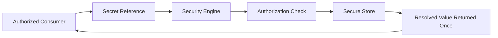

# 028 – Secret Specification

**Document ID:** DEVOS-SPEC-028

**Version:** 0.1

**Status:** Draft

**Category:** Foundation

**Depends On:**

- DEVOS-SPEC-006 – Terminology
- DEVOS-SPEC-011 – Domain Model
- DEVOS-SPEC-012 – Domain Relationships
- DEVOS-SPEC-013 – Object Lifecycle
- DEVOS-SPEC-014 – State Model
- DEVOS-SPEC-015 – Object Ownership
- DEVOS-SPEC-020 – Workspace Specification

**Referenced By:**

- DEVOS-SPEC-024 – Provider Specification
- DEVOS-SPEC-025 – Connection Specification
- DEVOS-SPEC-036 – Security Engine
- DEVOS-SPEC-049 – Logging
- DEVOS-SPEC-065 – Audit System

---

# Abstract

This document defines the Secret, the DevOS object that represents confidential configuration values.

It defines how secrets are represented, referenced, stored, rotated, exported, imported, and validated.

Above all, it defines the absolute prohibitions that keep secret values out of every observable DevOS surface.

This is the strictest Foundation specification.

Its prohibitions are absolute and override convenience everywhere else in the specification set.

---

# Purpose

This specification answers the following question:

> **How are confidential values represented, referenced, stored, and resolved in DevOS?**

A Secret has two parts that must never be confused.

The Secret object holds metadata and a reference handle.

The Secret value holds the confidential material and lives only in secure storage.

DevOS manages the object; the value never becomes part of the domain.

---

# Goals

This specification aims to:

- Define the Secret object contract.
- Separate Secret identity from Secret value.
- Define resolution semantics restricted to authorized components.
- Define rotation without identifier change.
- Define export, import, logging, and validation behavior that cannot leak values.
- Delegate normative storage requirements to the Security Engine.

---

# Non Goals

This specification does not define:

- Encryption algorithms or key management internals
- Vault product integrations
- Operating system keychain behavior
- API endpoints
- Database schemas
- Audit event formats

Normative storage requirements are delegated to DEVOS-SPEC-036.

---

# Definition

A Secret is a confidential configuration value such as an API key, token, password, certificate, or private key.

DevOS strictly separates the Secret object from the Secret value.

The Secret object holds identity, descriptive metadata, and a reference handle used by consumers.

The Secret value exists only inside secure storage controlled by the Security Engine defined in DEVOS-SPEC-036.

The Workspace owns the Secret object as required by DEVOS-SPEC-015.

The value is never copied into the Workspace domain.

---

# Required Properties

A Secret MUST have:

| Property | Required | Description                                                  |
| -------- | -------- | ------------------------------------------------------------ |
| id       | Yes      | Stable identifier used by consumers to reference the Secret. |
| name     | Yes      | Human-readable Secret name.                                  |

A Secret MAY have:

- description
- rotation policy hint
- expiry hint

Hints are advisory metadata describing intent; enforcement belongs to the Security Engine defined in DEVOS-SPEC-036.

---

# Absolute Rules

The following rules are absolute and admit no exceptions, configuration opt-outs, or debug modes.

- A Secret value MUST NEVER appear in a manifest.
- A Secret value MUST NEVER appear in an export bundle.
- A Secret value MUST NEVER appear in a log entry.
- A Secret value MUST NEVER appear in a state report.
- A Secret value MUST NEVER appear in diagnostics output.
- A Secret value MUST NEVER appear in an error message.
- A Secret value MUST NEVER appear in validation output.
- A Secret value MUST NEVER be committed to version control.
- A Secret value MUST NEVER be stored unencrypted.
- A Secret value MUST NEVER be delivered to unauthorized components.

These rules restate the export rule of DEVOS-SPEC-020, the state reporting rule of DEVOS-SPEC-014, and Rule 8 of SPECIFICATION_RULES.md, and hold during normal operation, failure, and debugging alike.

---

# Secret References

Consumers reference a Secret by identifier.

Providers, Connections, Plugins, Workflows, and Templates declare references such as a secretRef field.

A reference is a stable identifier, not a pointer to a storage location.

References MUST remain valid across rotation.

References MUST NOT encode, contain, or hint at the value.

A component holding only a reference holds no confidential information.

References MAY be exported, logged, validated, and displayed freely.

---

# Resolution

Resolution converts a reference into a usable value.

Resolution happens at use time, never at manifest load time and never at validation time.

Only authorized components MAY request resolution.

The Security Engine authorizes and performs every resolution as defined in DEVOS-SPEC-036.

The resolved value flows exactly once, from the secure store to the authorized consumer.

It MUST NOT flow back into manifests, logs, state reports, diagnostics, or exports.

Unauthorized resolution attempts MUST fail without disclosing whether the identifier exists, reporting only a state and reason code.

---

# Lifecycle Requirements

A Secret follows the canonical lifecycle defined in DEVOS-SPEC-013 and belongs to exactly one Workspace per DEVOS-SPEC-015.

Creation registers metadata and a handle; it does not move values through the domain.

Deleting a Secret MUST prevent future resolution of its identifier, consistent with DEVOS-SPEC-020.

Deleted is terminal for both the object and its resolvability.

An Archived Secret MUST NOT resolve for new consumers.

---

# State Requirements

A Secret reports the runtime state defined in DEVOS-SPEC-014.

| State       | Meaning                                         |
| ----------- | ----------------------------------------------- |
| Unknown     | Secret has not been checked.                    |
| Available   | Secret can be resolved by authorized systems.   |
| Unavailable | Secret cannot currently be resolved.            |
| Expired     | Secret is no longer valid.                      |
| Rotating    | Secret rotation is in progress.                 |
| Failed      | Secret resolution failed unexpectedly.          |

State transitions MUST NOT expose secret values in state messages.

---

# Rotation

Rotation replaces the Secret value without changing the identifier.

Consumers keep referencing the same identifier and re-resolve at next use.

No manifest change, no reference change, and no consumer redeployment are required by rotation.

During rotation the Secret state is Rotating as defined in DEVOS-SPEC-014.

Rotation MUST NOT write old or new values anywhere outside secure storage.

---

# Export and Import

Workspace export bundles carry Secret references and metadata.

Bundles NEVER carry values.

Import binds each reference to a secret that exists in the target system.

Unbound references after import report Unavailable until binding completes.

Import MUST revalidate the whole Workspace before activation, as required by DEVOS-SPEC-020.

---

# Storage Requirements

This document defines what storage must achieve; DEVOS-SPEC-036 defines how.

Secure storage MUST encrypt values at rest.

Secure storage MUST NOT persist plaintext values.

Secure storage MUST control access per authorized component.

Storage failures MUST degrade resolution to Unavailable or Failed states and MUST NOT fall back to plaintext caches, files, or environment dumps.

---

# Logging and Redaction

Redaction is mandatory in every log path.

Log systems MUST redact secret handles and any resolved fragments before persistence, as specified in DEVOS-SPEC-049.

Error messages MUST identify failures using identifiers and reason codes and MUST NOT quote, echo, truncate, or hash-display the value.

Debug modes MUST NOT disable redaction.

Audit records state that a Secret was accessed, by whom, and when, and nothing about the value, as specified in DEVOS-SPEC-065.

---

# Validation Without Exposure

Secret validation confirms presence and resolvability, not contents.

A validator MAY verify that a reference resolves and that authorization exists.

A validator MUST NOT read, compare, print, return, or checksum the value.

Validation output is limited to state and reason codes.

A passing validation proves the Secret can resolve, never what it contains.

---

# Violation Table

Every row marked Forbidden is a violation of this specification regardless of intent, mode, or log level.

| Action                                                | Forbidden |
| ----------------------------------------------------- | --------- |
| Placing a secret value in a manifest                  | Yes       |
| Including a secret value in an export bundle          | Yes       |
| Writing a secret value to a log                       | Yes       |
| Reporting a secret value in a state message           | Yes       |
| Embedding a secret value in diagnostics or errors     | Yes       |
| Returning a secret value from validation output       | Yes       |
| Storing a secret value unencrypted                    | Yes       |
| Delivering a secret value to an unauthorized consumer | Yes       |
| Referencing a Secret by identifier                    | No        |
| Recording Secret metadata outside secure storage      | No        |
| Creating a new Secret reference during instantiation  | No        |

---

# Secret Invariants

The following invariants MUST always hold.

- Every Secret belongs to exactly one Workspace.
- The Secret object never contains the Secret value.
- Values exist only in secure storage controlled by DEVOS-SPEC-036.
- Resolution occurs only at use time and only for authorized components.
- Rotation preserves identifiers.
- Deletion permanently prevents future resolution.
- Secret states, logs, exports, and validation outputs never expose values.

---

# Security Requirements

Security is the entire purpose of this object.

Implementations MUST treat every violation listed in this document as a defect of severity above all functional defects.

Implementations MUST fail closed: uncertain authorization means no resolution.

Implementations MUST support rotation without identifier change.

New surfaces added by future specifications inherit every prohibition in this document unless an ADR explicitly strengthens the model.

Weakening any prohibition requires changing this document first through the Change Process defined in DEVOS-SPEC-000.

---

# Future Extensions

Future specifications may add support for:

- Centralized enterprise vaults
- Automatic rotation policies
- Short-lived credentials
- Per-consumer authorization scopes
- Organization-level secret governance

These extensions MUST preserve the absolute rules of this document.

They MUST NOT break the single Workspace aggregate model without an ADR.

---

# References

- DEVOS-SPEC-000 – Specification Governance
- DEVOS-SPEC-006 – Terminology
- DEVOS-SPEC-011 – Domain Model
- DEVOS-SPEC-012 – Domain Relationships
- DEVOS-SPEC-013 – Object Lifecycle
- DEVOS-SPEC-014 – State Model
- DEVOS-SPEC-015 – Object Ownership
- DEVOS-SPEC-020 – Workspace Specification
- DEVOS-SPEC-024 – Provider Specification
- DEVOS-SPEC-025 – Connection Specification
- SPECIFICATION_RULES.md – Repository rule set (Rule 8)
- DEVOS-SPEC-036 – Security Engine
- DEVOS-SPEC-049 – Logging
- DEVOS-SPEC-065 – Audit System

---

# Revision History

| Version | Date | Author             | Notes         |
| ------- | ---- | ------------------ | ------------- |
| 0.1     | TBD  | DevOS Contributors | Initial Draft |
