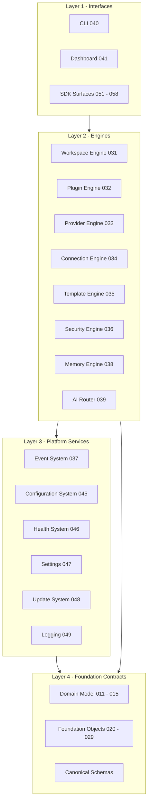
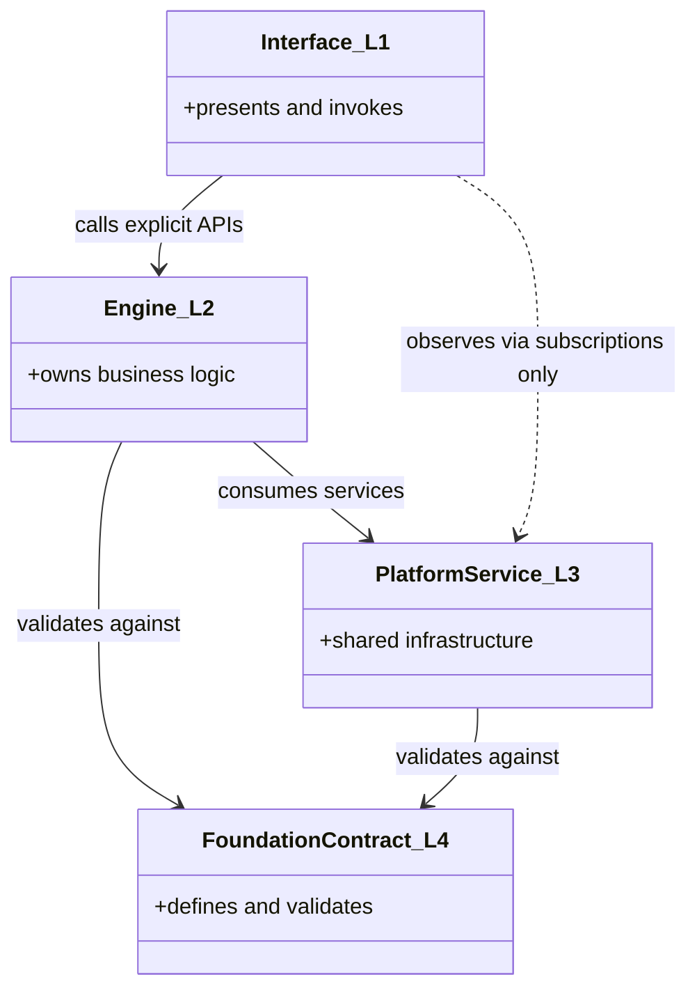
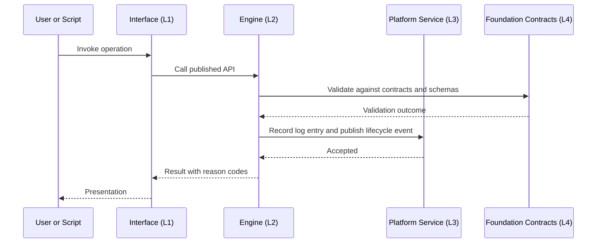
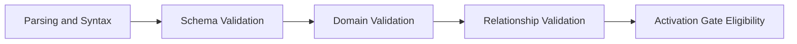

# 030 – System Architecture

**Document ID:** DEVOS-SPEC-030

**Version:** 0.1

**Status:** Draft

**Category:** Core Architecture

**Depends On:**

- DEVOS-SPEC-005 – Guiding Principles
- DEVOS-SPEC-006 – Terminology
- DEVOS-SPEC-011 – Domain Model
- DEVOS-SPEC-015 – Object Ownership
- DEVOS-SPEC-020 – Workspace Specification
- DEVOS-SPEC-029 – Workspace Manifest

**Referenced By:**

- DEVOS-SPEC-026 – Plugin Specification
- All Core Architecture specifications (DEVOS-SPEC-031 through DEVOS-SPEC-039)
- DEVOS-SPEC-040 – CLI
- DEVOS-SPEC-041 – Dashboard
- DEVOS-SPEC-042 – Project Import
- DEVOS-SPEC-043 – Project Detection
- DEVOS-SPEC-044 – Workspace Lifecycle
- DEVOS-SPEC-045 – Configuration System
- DEVOS-SPEC-046 – Health System
- DEVOS-SPEC-047 – Settings
- DEVOS-SPEC-048 – Update System
- DEVOS-SPEC-049 – Logging
- All SDK specifications (DEVOS-SPEC-051 through DEVOS-SPEC-059)

---

# Abstract

This document defines the System Architecture of DevOS: the layer model, the component catalog, and the rules that govern how every component relates to every other.

It fixes the four-layer structure into which all DevOS specifications fit, the direction of dependencies between layers, and the communication disciplines that keep components decoupled.

The architecture is implementation independent.

It names responsibilities and boundaries, never processes, threads, or technologies.

Every other specification positions itself inside the structure this document defines.

---

# Purpose

This specification answers the following question:

> **What are the layers of DevOS, which components live in each, and how may they depend on and talk to each other?**

The architecture exists so that independent specifications can evolve without hidden coupling.

Dependencies point in one direction only, components communicate through explicit contracts or events, and no surface accumulates business logic it does not own.

---

# Goals

This specification aims to:

- Define the four architectural layers and their members.
- Define the downward-only dependency rule.
- Define the two permitted communication disciplines.
- Catalog every core component with its one-line responsibility.
- Define cross-cutting disciplines shared by all components.
- Define trust boundaries and the placement of security enforcement.
- Provide the component taxonomy used by observability surfaces such as logging.

---

# Non Goals

This specification does not define:

- Engine internals or algorithms, owned by each engine specification
- Process models, threading, or deployment topologies
- Storage formats or persistence mechanisms
- Network protocols or wire formats
- User interface design
- Enterprise deployment patterns, deferred to DEVOS-SPEC-060 through DEVOS-SPEC-069

---

# Architectural Overview

DevOS is organized into four layers.

Interfaces invoke engines, engines rest on platform services, and everything validates against foundation contracts.

Layer membership is fixed by this document.

A component MAY be added to a layer only through the governance process of DEVOS-SPEC-000.

---

# The Four Layers

## Layer 1 – Interfaces

Interfaces are the surfaces through which humans and external code reach the platform.

| Component          | Specification   | Responsibility                                     |
| ------------------ | --------------- | -------------------------------------------------- |
| CLI                | DEVOS-SPEC-040  | Textual command surface for humans and automation. |
| Dashboard          | DEVOS-SPEC-041  | Visual workspace browser and editor.               |
| SDK surfaces       | DEVOS-SPEC-051 through DEVOS-SPEC-058 | Programmatic contracts over engine capabilities. |

Interfaces MUST be thin.

They own presentation, invocation, and ergonomics only.

Business logic MUST NOT originate inside an interface.

Every observable rule MUST trace to an engine or platform service below.

## Layer 2 – Engines

Engines own the business logic of the platform.

Each engine is the sole authority over the concern its specification defines.

| Engine            | Specification  | One-Line Responsibility                                    |
| ----------------- | -------------- | ---------------------------------------------------------- |
| Workspace Engine  | DEVOS-SPEC-031 | Executes Workspace operations and guards the aggregate.     |
| Plugin Engine     | DEVOS-SPEC-032 | Manages discovery, install, enablement, and isolation of plugins. |
| Provider Engine   | DEVOS-SPEC-033 | Registers providers and dispatches capability invocations.  |
| Connection Engine | DEVOS-SPEC-034 | Tests, establishes, and monitors Connections.               |
| Template Engine   | DEVOS-SPEC-035 | Turns Templates plus parameters into candidate manifests.   |
| Security Engine   | DEVOS-SPEC-036 | Enforces secret custody, permissions, and redaction.        |
| Memory Engine     | DEVOS-SPEC-038 | Provides scoped project memory to AI interactions.          |
| AI Router         | DEVOS-SPEC-039 | Normalizes AI requests and routes them to providers.        |

An engine MUST NOT implement a concern owned by another engine.

Cross-engine requests travel through explicit published APIs; nothing reads another engine's internals.

## Layer 3 – Platform Services

Platform services are shared infrastructure consumed by engines and interfaces.

| Service              | Specification  | One-Line Responsibility                                  |
| -------------------- | -------------- | -------------------------------------------------------- |
| Event System         | DEVOS-SPEC-037 | Publish-subscribe backbone carrying structured facts.     |
| Configuration System | DEVOS-SPEC-045 | Layered configuration resolution with provenance.         |
| Health System        | DEVOS-SPEC-046 | Aggregates state reports into one health answer.          |
| Settings             | DEVOS-SPEC-047 | Stores user preferences across scopes.                    |
| Update System        | DEVOS-SPEC-048 | Checks, verifies, and applies platform updates behind consent gates. |
| Logging              | DEVOS-SPEC-049 | Structured, redacted operational logs.                    |

Services observe and record; they do not command engines.

The Event System is the sanctioned way for lower layers to notify higher ones without creating upward dependencies.

## Layer 4 – Foundation Contracts

Foundation contracts define what exists and what is valid.

They contain no behavior.

| Contract Set       | Specifications                  | Content                                            |
| ------------------ | ------------------------------- | -------------------------------------------------- |
| Domain Model       | DEVOS-SPEC-011 through DEVOS-SPEC-015 | Objects, relationships, lifecycle, states, ownership. |
| Foundation Objects | DEVOS-SPEC-020 through DEVOS-SPEC-029 | Normative contracts for each core object.      |
| Canonical Schemas  | schemas/ directory              | JSON Schemas under `https://devos.dev/schemas/v0/`. |

Schemas are canonical per Rule 17 of SPECIFICATION_RULES.md.

When prose and schema appear to conflict, the schema wins.

---

# Dependency Rules

The layer model imposes one absolute rule.

Dependencies point downward only.

A component MAY depend on components in the same layer only through their published contracts, and MUST NOT depend on any component above its own layer.

Concrete prohibitions follow.

- An interface MUST NOT bypass engines to mutate domain objects directly.
- An engine MUST NOT call an interface.
- A platform service MUST NOT invoke an engine to command behavior.
- No component MAY depend circularly on another, directly or transitively.
- Foundation contracts depend on nothing above them.

Notification flows upward as data without violating these rules.

Lower layers publish events; higher layers subscribe.

Publication creates no compile-time or logical dependency from subscriber to emitter beyond the event contract itself.

Dashed arrows denote observation through the Event System, never control.

---

# Communication Disciplines

Exactly two communication forms exist between components.

| Discipline     | Form                              | Coupling | Use When                                        |
| -------------- | --------------------------------- | -------- | ----------------------------------------------- |
| Explicit API   | Direct call against a published contract. | Tight, synchronous | The caller needs a result to proceed. |
| Event          | Publication of an envelope on a topic per DEVOS-SPEC-037. | Loose, asynchronous | Others must learn that something happened. |

Rules:

- Engines communicate with each other through explicit APIs or events, never through shared mutable state.
- Events inform; they MUST NEVER veto or steer the emitting operation.
- Approval flows belong in explicit APIs and hooks as defined by DEVOS-SPEC-056.
- Every operation carries a correlation identifier shared across API calls, events, and log entries, per the shared discipline of DEVOS-SPEC-037 and DEVOS-SPEC-049.

Hidden channels are prohibited.

Any interaction not expressible as one of the two disciplines is an architectural defect.

---

# Request Flow Through Layers

One canonical traversal shows the discipline end to end.

The interface adds no decisions; the engine consults foundation contracts before acting; observability records what happened after the decision.

---

# Cross-Cutting Disciplines

The following disciplines bind every layer and are elaborated where they are owned.

## Correlation

Every logical operation carries one correlation identifier assigned at entry.

API results, events, and log entries belonging to the operation repeat it.

Consumers reconstruct whole operations from this identifier alone.

## Redaction Choke Point

All secret redaction centralizes in the Redaction Service of the Security Engine defined in DEVOS-SPEC-036.

No component implements substitute scrubbing.

Every output path passes the choke point, including debug modes.

## Validation Pipeline

Domain validation follows five ordered stages wherever objects are validated.

Each stage MUST pass completely before the next begins, and failure reports attributed reason codes.

Passage establishes eligibility only; activation decisions remain governed by DEVOS-SPEC-013 and DEVOS-SPEC-020.

Execution ownership of the pipeline belongs to the Workspace Engine defined in DEVOS-SPEC-031.

## Error Reporting

Failures carry stable machine-readable reason codes, the failing object, and a suggested next action.

Reason-code vocabularies are canonical registries owned by the specification of the component that raises them.

Errors identify; they never quote sensitive material.

## Offline First Placement

Core capability lives in Layers 2 through 4 and completes without network access, honoring Rule 7 of SPECIFICATION_RULES.md.

Network-dependent behavior concentrates in optional enhancements that report Degraded or Unavailable honestly when unreachable.

---

# Trust Boundaries

The architecture defines three trust zones.

| Zone       | Members                                   | Standing                                       |
| ---------- | ----------------------------------------- | ---------------------------------------------- |
| Trusted    | Engines and platform services.            | Authorized components subject to this specification set. |
| Semi-trusted | Interfaces.                             | Thin by mandate; incapable of privileged action. |
| Untrusted  | Plugins, manifests, Templates, parameter sets, packages. | Validated at every boundary; deny-by-default. |

Security enforcement concentrates in the Security Engine defined in DEVOS-SPEC-036, deliberately the smallest trusted component.

Plugins extend the platform only through public interfaces and never modify the core, restating Rule 6 of SPECIFICATION_RULES.md normatively.

Manifests and Template inputs are untrusted data until they pass the validation pipeline.

---

# Component Taxonomy for Observability

Observability surfaces identify sources using the canonical taxonomy below.

Logging entries name their emitting component per this table, as required by DEVOS-SPEC-049.

| Taxonomy Class     | Members                                          | Example Source Label     |
| ------------------ | ------------------------------------------------ | ------------------------ |
| interface          | CLI, Dashboard, SDK bindings.                     | `cli`, `dashboard`       |
| engine             | One entry per Layer 2 component.                  | `workspace-engine`       |
| platform-service   | One entry per Layer 3 component.                  | `event-system`           |
| plugin             | Contributing plugin identifier and version.       | `plugin:example-greeter` |
| import-tool        | Import and detection tooling.                     | `project-import`         |

Labels are stable identifiers suitable for filtering.

Implementations MAY append sub-labels but MUST NOT rename taxonomy classes.

---

# Placement Rules

New capability has exactly three homes.

| Capability Shape                                             | Required Home                        |
| ------------------------------------------------------------ | ------------------------------------ |
| Extends behavior for some users or projects                   | Plugin, per Rule 6 of SPECIFICATION_RULES.md. |
| Implements a replaceable external capability                  | Provider, per DEVOS-SPEC-024.        |
| Belongs in the core for every conformant implementation       | A numbered specification placed by governance per DEVOS-SPEC-000. |

Proposals MUST name the target layer and justify why no lower-cost home exists.

Top-level repository structure changes require an approved ADR, restating Rule 12 of SPECIFICATION_RULES.md.

---

# Architectural Invariants

The following invariants MUST always hold.

- The platform has exactly four layers, and every component occupies exactly one.
- Dependencies point downward only; upward calls are defects.
- Interfaces contain no business logic.
- Engines are the sole authorities over their concerns.
- Components communicate only through explicit APIs or events.
- Events never veto the operations they describe.
- Correlation identifiers link every observable trace of one operation.
- All redaction passes through the Security Engine choke point.
- Validation always traverses the five ordered stages.
- Core operation completes offline.
- The Workspace remains the single Aggregate Root per DEVOS-SPEC-011.

Violating any invariant is an architectural defect regardless of functional benefit.

---

# Design Decisions

| Decision                       | Choice                                              | Rationale                                       |
| ------------------------------ | --------------------------------------------------- | ----------------------------------------------- |
| Four fixed layers              | Interfaces, Engines, Platform Services, Foundation Contracts. | Makes dependency direction checkable. |
| Downward-only dependencies     | Prohibit upward and circular references.            | Keeps specifications independently evolvable.   |
| Two communication forms        | Explicit APIs and events only.                      | Eliminates hidden coupling channels.            |
| Central security kernel        | One small trusted engine enforces security.         | Minimizes and audits the trusted base.          |
| Thin interfaces                | Presentation without decisions.                     | Guarantees behavioral parity across surfaces.   |
| Canonical schemas              | Schemas outrank prose on conflict.                  | Gives implementations one testable truth.       |

Changing any decision requires an approved ADR.

---

# Security Requirements

The architecture enforces this posture:

- MUST concentrate permission evaluation, secret custody, and redaction in the Security Engine defined in DEVOS-SPEC-036.
- MUST treat untrusted-zone input as hostile until validated at the boundary where it enters.
- MUST keep deny-by-default evaluation at every capability request, resolving uncertainty to denial.
- MUST preserve the aggregate boundary in every layer; no layer MAY offer operations that escape Workspace ownership per DEVOS-SPEC-015.
- SHOULD keep trusted-component intercommunication local and free of network round trips, preserving Offline First behavior.

---

# Performance Requirements

- Layer traversal SHOULD add negligible cost relative to the operation performed.
- Event publication SHOULD be non-blocking for emitters regardless of subscriber count.
- Interfaces SHOULD remain responsive while engines execute long operations, observing progress through events.
- The architecture SHOULD permit engines to run concurrently because they share no mutable state.

---

# Future Extensions

Future specifications may add support for:

- Additional engines or platform services through the governance process
- Remote agent integration aligned with DEVOS-SPEC-068
- Federation topologies for multi-instance operation
- Alternative interface surfaces within Layer 1

These extensions MUST preserve layer membership rules, the downward-only dependency rule, and the two communication disciplines.

They MUST NOT break the single Workspace aggregate model without an approved ADR.

---

# References

- DEVOS-SPEC-000 – Specification Governance
- DEVOS-SPEC-005 – Guiding Principles
- DEVOS-SPEC-006 – Terminology
- DEVOS-SPEC-007 – Scope
- DEVOS-SPEC-011 – Domain Model
- DEVOS-SPEC-013 – Object Lifecycle
- DEVOS-SPEC-015 – Object Ownership
- DEVOS-SPEC-020 – Workspace Specification
- DEVOS-SPEC-024 – Provider Specification
- DEVOS-SPEC-026 – Plugin Specification
- DEVOS-SPEC-029 – Workspace Manifest
- SPECIFICATION_RULES.md – Repository rule set (Rules 6, 7, 12, 17)
- DEVOS-SPEC-031 through DEVOS-SPEC-039 – Core Architecture specifications
- DEVOS-SPEC-040 – CLI
- DEVOS-SPEC-041 – Dashboard
- DEVOS-SPEC-045 through DEVOS-SPEC-049 – Platform service specifications
- DEVOS-SPEC-050 – SDK Overview
- DEVOS-SPEC-068 – Remote Agents

---

# Revision History

| Version | Date | Author             | Notes         |
| ------- | ---- | ------------------ | ------------- |
| 0.1     | TBD  | DevOS Contributors | Initial Draft |
