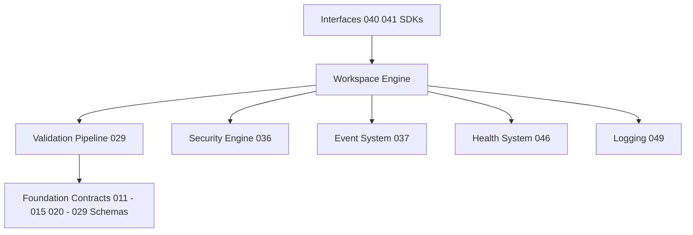
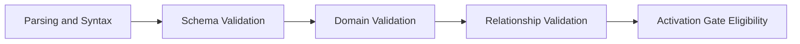
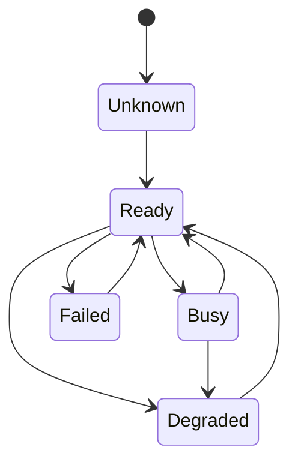
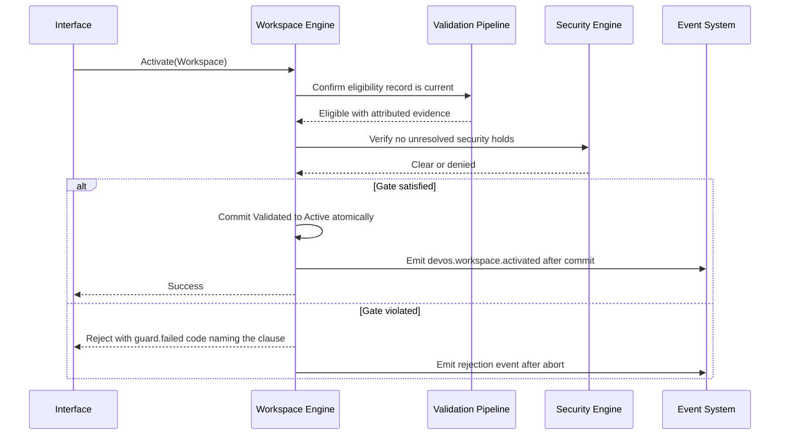

# 031 – Workspace Engine

**Document ID:** DEVOS-SPEC-031

**Version:** 0.1

**Status:** Draft

**Category:** Core Architecture

**Depends On:**

- DEVOS-SPEC-005 – Guiding Principles
- DEVOS-SPEC-006 – Terminology
- DEVOS-SPEC-011 – Domain Model
- DEVOS-SPEC-012 – Domain Relationships
- DEVOS-SPEC-013 – Object Lifecycle
- DEVOS-SPEC-014 – State Model
- DEVOS-SPEC-015 – Object Ownership
- DEVOS-SPEC-020 – Workspace Specification
- DEVOS-SPEC-028 – Secret Specification
- DEVOS-SPEC-029 – Workspace Manifest
- DEVOS-SPEC-030 – System Architecture
- DEVOS-SPEC-036 – Security Engine
- DEVOS-SPEC-037 – Event System

**Referenced By:**

- DEVOS-SPEC-020 – Workspace Specification
- DEVOS-SPEC-021 – Project Specification
- DEVOS-SPEC-029 – Workspace Manifest
- DEVOS-SPEC-035 – Template Engine
- DEVOS-SPEC-037 – Event System
- DEVOS-SPEC-040 – CLI
- DEVOS-SPEC-041 – Dashboard
- DEVOS-SPEC-042 – Project Import
- DEVOS-SPEC-043 – Project Detection
- DEVOS-SPEC-044 – Workspace Lifecycle
- DEVOS-SPEC-045 – Configuration System
- DEVOS-SPEC-046 – Health System
- DEVOS-SPEC-048 – Update System
- DEVOS-SPEC-050 – SDK Overview
- DEVOS-SPEC-054 – Workspace SDK

---

# Abstract

This document defines the Workspace Engine, the Core Architecture component that executes every Workspace-level operation and guards the integrity of the Workspace aggregate.

The engine is the sole executor of the operational contract defined in DEVOS-SPEC-044, the sole runner of the validation pipeline defined in DEVOS-SPEC-029, and the primary producer of Workspace lifecycle events defined in DEVOS-SPEC-037.

It owns the canonical error reason-code vocabulary used across the platform.

Every interface reaches the aggregate only through this engine.

---

# Purpose

This specification answers the following question:

> **How does the platform execute Workspace operations atomically, validate aggregates completely, and report failures uniformly?**

Operations commit fully or not at all, validation attributes every finding to an object and a clause, and every failure speaks one shared reason-code language.

Interfaces stay thin because this engine concentrates the mechanics.

---

# Goals

This specification aims to:

- Define the role of the Workspace Engine inside the architecture.
- Define execution duties for every operation of DEVOS-SPEC-044.
- Define ownership of the validation pipeline and its stage execution.
- Define the concurrency model internals behind the one-writer rule.
- Define transactional guarantees for every transition.
- Own the canonical reason-code vocabulary families.
- Define event production duties toward the Event System.

---

# Non Goals

This specification does not define:

- The operational contract of lifecycle operations, owned by DEVOS-SPEC-044
- Manifest syntax or schema contents, owned by DEVOS-SPEC-029
- Storage formats or persistence mechanisms
- Scheduling algorithms beyond the exclusivity requirement
- CLI commands or Dashboard flows
- Cloud synchronization behavior, deferred to DEVOS-SPEC-064

---

# Role

The Workspace Engine is a Core Architecture component positioned by DEVOS-SPEC-030.

The Workspace remains owned by its Actor per DEVOS-SPEC-015; the engine owns only the runtime dimension of the aggregate and is the sole mover of Workspace objects through their lifecycle stages.

DEVOS-SPEC-044 owns what operations exist and when each is permitted.

This document owns how permitted operations execute.

All arrows follow the downward dependency rule of DEVOS-SPEC-030.

---

# Responsibilities

The engine:

- executes Create, Configure, Validate, Activate, Archive, Delete, Export, and Import exactly as contracted by DEVOS-SPEC-044.
- runs the five-stage validation pipeline over candidate manifests and aggregate changes.
- enforces the activation gate of DEVOS-SPEC-020 atomically at Activate time.
- enforces the one-writer concurrency rule per Workspace.
- executes cascade deletion along the ownership graph of DEVOS-SPEC-015.
- coordinates the secret resolution cutoff of DEVOS-SPEC-028 with the Security Engine.
- emits lifecycle events through the Event System after durable commit.
- triggers health recalculation through the Health System on activation-affecting transitions.
- owns the canonical reason-code vocabulary families defined below.

The engine MUST NOT add local preconditions to any operation, skip any validation stage, activate an ineligible Workspace, or expose partial transition states to observers.

---

# Operation Execution Duties

Each operation of DEVOS-SPEC-044 carries fixed execution mechanics.

| Operation | Execution Duty                                                                 |
| --------- | ------------------------------------------------------------------------------ |
| Create    | Assign identity, materialize the aggregate boundary, enter Created.             |
| Configure | Capture declared configuration and mark it exposed for evaluation.              |
| Validate  | Run all pipeline stages and record attributed findings.                         |
| Activate  | Evaluate the activation gate atomically and recalculate health after success.   |
| Archive   | Freeze content immutably and exclude the Workspace from execution.              |
| Delete    | Cascade along ownership order and enforce the secret cutoff before completion.  |
| Export    | Assemble the complete bundle using references-not-secrets.                      |
| Import    | Materialize a Created draft and schedule full revalidation.                     |

Execution rules:

- Guards are evaluated inside the engine immediately before each transition.
- A failed guard aborts the operation without residue.
- Side effects become observable only after the transition commits durably.
- Export and Import run as side processes that never change the source lifecycle stage.

---

# Validation Pipeline Execution

The engine is the canonical runner of the pipeline defined in DEVOS-SPEC-029.

Execution rules:

- Stages run in order and each MUST pass completely before the next begins.
- Schema checks evaluate against `schemas/manifest.schema.json` under the reserved namespace `https://devos.dev/schemas/v0/`.
- Domain checks apply the object contracts of DEVOS-SPEC-020 through DEVOS-SPEC-028.
- Relationship checks apply the constraints of DEVOS-SPEC-012 and the ownership rules of DEVOS-SPEC-015.
- Every finding names the failing object, the failing clause, and the stage that produced it.
- Findings MUST NOT contain secret values.

Import revalidation runs the identical pipeline without shortcuts, because identifiers MAY have been remapped.

Update migrations requested by the Update System pass through the same gate before activation.

---

# Concurrency Internals

At most ONE mutating operation runs per Workspace at any moment.

Mechanics:

- The engine holds an exclusive execution claim on the Workspace for the duration of any mutation.
- The Workspace reports Busy per DEVOS-SPEC-014 while a mutation holds the claim.
- A second mutating request is rejected immediately with the state-conflict reason family; the engine never silently queues mutations.
- Read operations remain available throughout every mutation.
- The claim releases when the operation commits durably or aborts.

Interfaces surface Busy rather than retrying invisibly, consistent with the exit-code mapping fixed by DEVOS-SPEC-040.

---

# Transactional Guarantees

Every mutating operation is atomic.

Guarantees:

- An operation commits fully or leaves no trace; intermediate states are unobservable.
- Rejections never leave partial transitions behind.
- Committed state survives failure of the caller that requested the operation.
- Events, log entries, and health recalculations occur strictly after durable commit.

These guarantees hold for every operation in the catalog of DEVOS-SPEC-044.

---

# Reason-Code Vocabulary

The engine owns the canonical reason-code registry consumed platform-wide, including by the SDK layer per DEVOS-SPEC-050.

Codes use dotted lowercase identifiers grouped into families.

| Family             | Meaning                                              | Example Code                    |
| ------------------ | ---------------------------------------------------- | ------------------------------- |
| validation.<stage> | A named pipeline stage produced findings.            | `validation.relationship.unresolved-reference` |
| ownership.<rule>   | An ownership rule of DEVOS-SPEC-015 was violated.    | `ownership.multiple-owners`     |
| state.conflict     | Another mutating operation holds the Workspace.      | `state.conflict.busy`           |
| guard.failed       | A named precondition of the operation was not met.   | `guard.failed.activation-gate`  |
| dependency.active  | Deletion is blocked by an actively executing child.  | `dependency.active.workflow-running` |

Rules:

- Families and codes are stable identifiers; renaming is a breaking change under DEVOS-SPEC-059.
- The engine MUST map the error classes of DEVOS-SPEC-044 onto these families.
- Other components extend the registry only within families they own; they never redefine engine-owned families.
- Codes identify failures and never quote sensitive material.

---

# State Management

The engine moves the Workspace through its operational states as defined in DEVOS-SPEC-014.

Duties:

- The engine reports Busy while holding the execution claim, regardless of which operation runs.
- The engine recomputes Ready, Degraded, and Failed from child object states after each committed transition.
- The engine MUST NOT report Ready while the Project or a required Profile is Failed, restating DEVOS-SPEC-014 normatively.
- Lifecycle stages belong to DEVOS-SPEC-013; operational states belong here, and the engine conflates neither.

---

# Event Production

The engine is the primary producer of Workspace lifecycle events.

Production rules:

- Events follow the envelope and topic conventions of DEVOS-SPEC-037, including `devos.workspace.created`, `devos.workspace.validated`, `devos.workspace.activated`, `devos.workspace.archived`, and `devos.workspace.deleted`.
- Events publish only after durable commit of the transition they describe.
- Every event carries the correlation identifier of the producing operation.
- Events and payloads MUST NOT contain secret values, consistent with DEVOS-SPEC-028.

Consumers include interfaces, the Health System, audit tooling aligned with DEVOS-SPEC-065, and synchronization clients aligned with DEVOS-SPEC-064.

---

# Interaction Flow

One diagram shows Activate end to end with both outcomes.

Rejection paths leave no partial transitions, and events always describe committed reality.

---

# Workspace Engine Invariants

The following invariants MUST always hold.

- The engine is the only executor of Workspace lifecycle operations.
- Every operation maps verbatim onto DEVOS-SPEC-044 without added preconditions.
- Mutating operations are exclusive per Workspace and reject rather than queue.
- Reads never block on mutations.
- Transitions are atomic; intermediate states are never observable.
- All five validation stages run in order on full validation.
- Activation is decided atomically against the gate of DEVOS-SPEC-020.
- Cascade deletion follows the ownership graph and ends secret resolution permanently.
- Events publish only after durable commit and never carry secrets.
- The engine owns the canonical reason-code families and keeps them stable.

---

# Security Requirements

Implementations enforce this posture:

- MUST route every secret-related enforcement point through the Security Engine defined in DEVOS-SPEC-036, including the Delete cutoff and Export scrubbing.
- MUST treat imported bundles and manifests as untrusted input and revalidate completely.
- MUST keep reason codes, events, logs, and errors free of secret values per DEVOS-SPEC-028.
- MUST preserve ownership metadata across all transitions so attribution never degrades.
- SHOULD keep lock accounting observable so stuck mutations are diagnosable without exposing content.

---

# Performance Requirements

- Guard evaluation SHOULD be fast enough to sit inline on interactive paths such as Activate.
- Validation SHOULD stream large manifests rather than buffering whole aggregates where possible.
- Read availability SHOULD show no measurable degradation during mutations.
- Event publication SHOULD be asynchronous relative to the requesting caller once commit completes.

---

# Future Extensions

Future specifications may add support for:

- Scheduled archival driven by declarative policies
- Sync-aware transitions coordinated with DEVOS-SPEC-064
- Policy-driven guard extension through DEVOS-SPEC-063
- Multi-stage deletion with soft-delete windows
- True restore operations backed by an approved ADR

These extensions MUST preserve atomicity, exclusivity, the validation pipeline, and the canonical reason-code families without an ADR.

They MUST NOT break the single Workspace aggregate model.

---

# References

- DEVOS-SPEC-005 – Guiding Principles
- DEVOS-SPEC-006 – Terminology
- DEVOS-SPEC-011 – Domain Model
- DEVOS-SPEC-012 – Domain Relationships
- DEVOS-SPEC-013 – Object Lifecycle
- DEVOS-SPEC-014 – State Model
- DEVOS-SPEC-015 – Object Ownership
- DEVOS-SPEC-020 – Workspace Specification
- DEVOS-SPEC-021 – Project Specification
- DEVOS-SPEC-028 – Secret Specification
- DEVOS-SPEC-029 – Workspace Manifest
- DEVOS-SPEC-030 – System Architecture
- SPECIFICATION_RULES.md – Repository rule set (Rules 2, 5, 17)
- DEVOS-SPEC-035 – Template Engine
- DEVOS-SPEC-036 – Security Engine
- DEVOS-SPEC-037 – Event System
- DEVOS-SPEC-040 – CLI
- DEVOS-SPEC-041 – Dashboard
- DEVOS-SPEC-042 – Project Import
- DEVOS-SPEC-043 – Project Detection
- DEVOS-SPEC-044 – Workspace Lifecycle
- DEVOS-SPEC-045 – Configuration System
- DEVOS-SPEC-046 – Health System
- DEVOS-SPEC-048 – Update System
- DEVOS-SPEC-050 – SDK Overview
- DEVOS-SPEC-054 – Workspace SDK
- DEVOS-SPEC-059 – Versioning Policy
- DEVOS-SPEC-064 – Cloud Sync
- DEVOS-SPEC-065 – Audit System
- https://devos.dev/schemas/v0/ – Reserved schema namespace

---

# Revision History

| Version | Date | Author             | Notes         |
| ------- | ---- | ------------------ | ------------- |
| 0.1     | TBD  | DevOS Contributors | Initial Draft |
