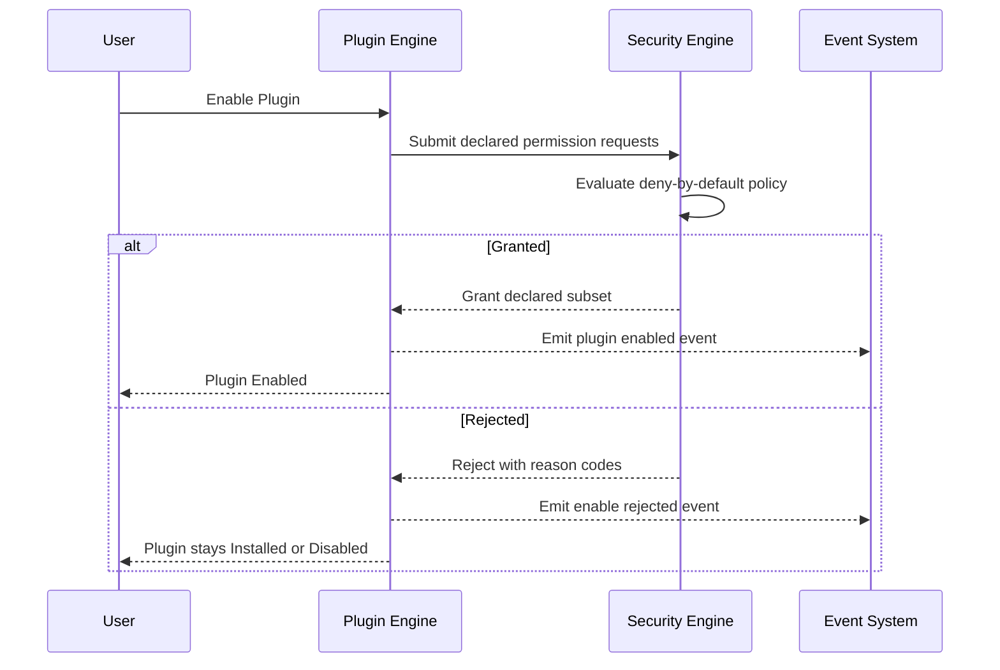

# 032 – Plugin Engine

**Document ID:** DEVOS-SPEC-032

**Version:** 0.1

**Status:** Draft

**Category:** Core Architecture

**Depends On:**

- DEVOS-SPEC-005 – Guiding Principles
- DEVOS-SPEC-006 – Terminology
- DEVOS-SPEC-013 – Object Lifecycle
- DEVOS-SPEC-014 – State Model
- DEVOS-SPEC-026 – Plugin Specification
- DEVOS-SPEC-030 – System Architecture
- DEVOS-SPEC-036 – Security Engine
- DEVOS-SPEC-037 – Event System

**Referenced By:**

- DEVOS-SPEC-026 – Plugin Specification
- DEVOS-SPEC-030 – System Architecture
- DEVOS-SPEC-041 – Dashboard
- DEVOS-SPEC-051 – Plugin SDK
- DEVOS-SPEC-056 – Hooks API
- DEVOS-SPEC-057 – Events API
- DEVOS-SPEC-070 – Marketplace

---

# Abstract

This document defines the Plugin Engine, the Core Architecture component that manages the complete operational life of Plugins within a Workspace.

The engine implements the Plugin contract defined in DEVOS-SPEC-026: it discovers, installs, enables, disables, updates, and contains plugins.

Every plugin is untrusted until its compatibility is verified and its requested permissions are granted by the Security Engine.

---

# Purpose

This specification answers the following question:

> **How are plugins discovered, trusted, loaded, and contained?**

Trust is earned through explicit verification steps, and a failing plugin degrades alone while the platform keeps running.

---

# Goals

This specification aims to:

- Define the role and responsibilities of the Plugin Engine.
- Define discover, install, enable, disable, update, and uninstall operations.
- Enforce isolation so plugin faults never corrupt Workspace state.
- Define the permission grant flow and plugin contribution points.
- Define registry abstraction, provenance recording, and compatibility checking.

---

# Non Goals

This specification does not define:

- Package file formats or archive layouts
- Hook payloads or event transport internals
- Sandbox implementation techniques
- Signature algorithms or key infrastructure
- Marketplace policies or remote distribution protocols
- CLI commands or dashboard flows

Remote registry distribution is deferred to DEVOS-SPEC-070.

---

# Role

The Plugin Engine is a Core Architecture component positioned by DEVOS-SPEC-030.

Plugin objects remain owned by their Workspaces per DEVOS-SPEC-015; the engine owns only their runtime dimension and is the sole mover between runtime states.

Authorization belongs to the Security Engine defined in DEVOS-SPEC-036, and lifecycle reporting flows through the Event System defined in DEVOS-SPEC-037.

---

# Responsibilities

The engine:

- discovers plugins from configured local-first sources.
- verifies declared compatibility before any install or update completes.
- moves plugins between Installed, Enabled, Disabled, Updating, and Failed states.
- registers declared hook subscriptions and event topics at enable time, applying only the granted permission subset.
- records provenance and contains failures without side effects leaking outward.
- emits lifecycle events for every state transition.

The engine MUST NOT modify core behavior, grant ungranted permissions, load incompatible plugins, or remove plugins outside the canonical lifecycle.

---

# Operations

## Discover

Discovery enumerates plugins available for installation from an ordered source list evaluated local-first, preserving Offline First behavior per Rule 7.

Remote registries are out of scope for Version 0.1 and deferred to DEVOS-SPEC-070.

Discovery MUST record the source and provenance of every reported candidate.

## Install

Installation brings a discovered candidate into the Workspace.

Install follows this fixed sequence:

1. Fetch the package from its source.
2. Verify declared compatibility against the platform version per DEVOS-SPEC-059.
3. Validate identity, version, permissions, and declared contributions.
4. Stage the package inside the owning Workspace and record provenance.
5. Enter Installed state.

A failed step MUST abort installation and MUST leave no staged residue.

## Enable

Enabling activates an Installed or Disabled plugin.

Requested permissions go to the Security Engine for deny-by-default evaluation; only the granted subset takes effect, keeping undeclared capabilities nonexistent at runtime per DEVOS-SPEC-026.

After granting, the engine registers declared hook subscriptions through the Hooks API concepts of DEVOS-SPEC-056 and declared topics through DEVOS-SPEC-057.

Success enters Enabled state and emits a lifecycle event.

## Disable

Disabling halts a plugin without deleting it.

The engine MUST deactivate subscriptions and withdraw contributions atomically.

Disabled plugins retain their installed artifacts and provenance records, and Disable MUST succeed even from Failed state, providing the recovery path required by DEVOS-SPEC-014.

## Update

Updating replaces an installed plugin with a new version inside its compatibility range.

The engine enters Updating state before touching the live surface, re-executing compatibility verification per DEVOS-SPEC-059 and permission evaluation per DEVOS-SPEC-036.

On success the new version activates and the plugin returns to Enabled; on failure the previous version MUST be restored and the plugin returns to its prior state or Disabled.

## Uninstall

Uninstall is lifecycle Deletion, never a runtime state, per the note in DEVOS-SPEC-014.

Active references to the plugin's contributions MUST be removed or rejected before deletion completes, per DEVOS-SPEC-013.

Deletion removes artifacts, subscriptions, contributions, and provenance belonging to the plugin, and Deleted is terminal.

---

# Isolation Enforcement

Isolation is the defining guarantee of this engine.

A plugin fault MUST NOT corrupt Workspace state; faults are captured at the plugin boundary and converted into failure reports while other plugins continue unaffected and a failing plugin enters Failed instead of crashing the platform.

| Plugin Failure                   | Platform Impact                                        |
| -------------------------------- | ------------------------------------------------------ |
| Hook handler throws              | Delivery reports failure; other subscribers still run. |
| Unhandled crash                  | Plugin is marked Failed; the platform continues.       |
| Unauthorized capability use      | Request is denied per DEVOS-SPEC-036 and audited.      |
| Update corruption                | Rollback restores the prior version; no data loss.     |

---

# Permission Grant Flow

Permission evaluation is delegated to the Security Engine and governed by deny-by-default policy.

The engine MUST apply exactly the granted subset and nothing more.

---

# Contribution Points

Enabled plugins MAY extend DevOS exclusively through declared contribution points.

| Contribution       | Target                                              | Governing Specification |
| ------------------ | --------------------------------------------------- | ----------------------- |
| Commands           | Command surface exposed to users.                   | DEVOS-SPEC-026          |
| Templates          | Contributed Templates join the shared pool.         | DEVOS-SPEC-035          |
| Providers          | Contributed Providers join the provider registry.   | DEVOS-SPEC-033          |
| Hooks              | Subscriptions to public hook interfaces.            | DEVOS-SPEC-056          |
| Events             | Subscriptions and publications on public topics.    | DEVOS-SPEC-057          |
| Dashboard surfaces | Conceptual extension surfaces shown to users.       | DEVOS-SPEC-041          |

Contributions take effect only while the plugin is Enabled and obey the same validation rules as authored objects.

Disabling or deleting a plugin MUST withdraw its contributions atomically, and provenance MUST identify the contributing plugin wherever a contribution appears.

---

# Registry Abstraction

The engine consults plugin sources through a registry abstraction that hides whether a source is local or remote.

- Sources are ordered; earlier sources win conflicts, and local sources precede remote ones.
- Every candidate carries provenance: origin, identifier, and version, recorded at discovery and preserved through install and update.
- Provenance is always known; the engine MUST refuse candidates lacking it.

---

# Compatibility Checking

Compatibility binds plugin versions to platform versions following the policy defined in DEVOS-SPEC-059.

| Declared Compatibility Range | Platform Version | Result                            |
| ---------------------------- | ---------------- | --------------------------------- |
| Contains the current version | Inside range     | Compatible; operation proceeds.   |
| Excludes the current version | Outside range    | Incompatible; operation rejected. |
| Absent or unparseable        | Any              | Invalid; operation rejected.      |

Compatibility MUST be rechecked at install and at every update.

---

# Error Classes

| Error Class           | Trigger                                          | Required Behavior                               |
| --------------------- | ------------------------------------------------ | ----------------------------------------------- |
| not-discovered        | Candidate is absent from all configured sources. | Report an empty result without escalation.      |
| incompatible-version  | Declared range excludes the platform version.    | Reject the operation and name both versions.    |
| invalid-package       | Package metadata fails validation.               | Abort install or update and leave no residue.   |
| permission-denied     | Security Engine rejects requested permissions.   | Keep the plugin non-enabled and report reasons. |
| unknown-interface     | Subscription names a nonexistent public surface. | Reject the subscription and stay Disabled.      |
| update-failed         | The new version cannot be activated.             | Roll back and restore the previous version.     |

---

# Plugin Engine Invariants

The following invariants MUST always hold.

- Plugins extend the platform only through public interfaces.
- A plugin MUST NEVER modify the core platform; this restates Rule 6 normatively.
- Plugins receive exactly their granted permission subset, under least privilege default.
- Undeclared capabilities do not exist at runtime.
- Provenance is always known for every installed plugin and contribution.
- A plugin failure MUST NOT corrupt Workspace state; failing plugins enter Failed state, never a platform-wide failure.
- Plugin removal is lifecycle Deletion, never a runtime state.
- Discovery operates local-first without requiring network access.

---

# Security Requirements

Implementations enforce this posture:

- MUST route every permission decision through the Security Engine and treat packages as untrusted input until verified.
- SHOULD support integrity verification of packages before staging; the signature trust model is deferred and MUST strengthen rather than weaken this document when introduced.
- MUST keep secret values out of every operation output per DEVOS-SPEC-028, keeping denied attempts auditable without exposing sensitive material.

---

# Performance Requirements

- Lazy loading SHOULD be supported: Installed plugins consume no runtime resources until Enabled.
- Fault containment SHOULD proceed without suspending unrelated plugin execution.
- State-transition events SHOULD be emitted asynchronously so plugin management does not block Workspace operations.

---

# Future Extensions

Future specifications may add support for:

- Sandboxed execution profiles with graded isolation levels
- Signed packages and marketplace attestation through DEVOS-SPEC-070
- Remote registries with dependency resolution
- Inter-plugin contracts and cross-Workspace sharing

These extensions MUST preserve the isolation mandate and deny-by-default granting without an ADR, and MUST NOT break the single Workspace aggregate model.

---

# References

- DEVOS-SPEC-005 – Guiding Principles
- DEVOS-SPEC-006 – Terminology
- DEVOS-SPEC-013 – Object Lifecycle
- DEVOS-SPEC-014 – State Model
- DEVOS-SPEC-026 – Plugin Specification
- DEVOS-SPEC-028 – Secret Specification
- DEVOS-SPEC-030 – System Architecture
- DEVOS-SPEC-033 – Provider Engine
- DEVOS-SPEC-035 – Template Engine
- DEVOS-SPEC-036 – Security Engine
- DEVOS-SPEC-037 – Event System
- DEVOS-SPEC-041 – Dashboard
- DEVOS-SPEC-056 – Hooks API
- DEVOS-SPEC-057 – Events API
- DEVOS-SPEC-059 – Versioning Policy
- DEVOS-SPEC-070 – Marketplace

---

# Revision History

| Version | Date | Author             | Notes         |
| ------- | ---- | ------------------ | ------------- |
| 0.1     | TBD  | DevOS Contributors | Initial Draft |
