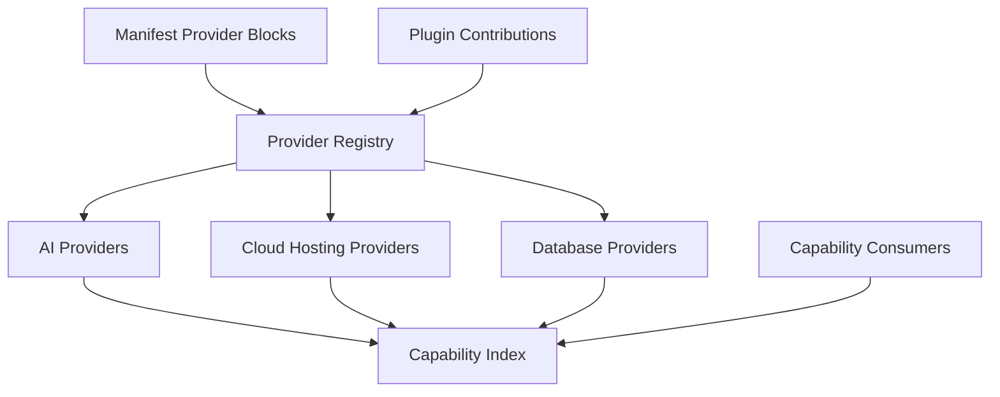
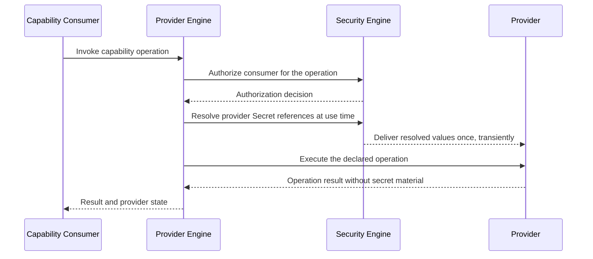

# 033 – Provider Engine

**Document ID:** DEVOS-SPEC-033

**Version:** 0.1

**Status:** Draft

**Category:** Core Architecture

**Depends On:**

- DEVOS-SPEC-005 – Guiding Principles
- DEVOS-SPEC-006 – Terminology
- DEVOS-SPEC-014 – State Model
- DEVOS-SPEC-024 – Provider Specification
- DEVOS-SPEC-028 – Secret Specification
- DEVOS-SPEC-030 – System Architecture
- DEVOS-SPEC-036 – Security Engine
- DEVOS-SPEC-037 – Event System

**Referenced By:**

- DEVOS-SPEC-024 – Provider Specification
- DEVOS-SPEC-030 – System Architecture
- DEVOS-SPEC-034 – Connection Engine
- DEVOS-SPEC-039 – AI Router
- DEVOS-SPEC-046 – Health System
- DEVOS-SPEC-052 – Provider SDK

---

# Abstract

This document defines the Provider Engine, the Core Architecture component that registers, evaluates, and exposes replaceable capability providers.

The engine maintains a Workspace-scoped provider registry and a capability index that maps every capability type to its available implementations.

It evaluates providers into the runtime states defined in DEVOS-SPEC-014 and coordinates credential resolution without ever holding credentials itself.

---

# Purpose

This specification answers the following question:

> **How does DevOS register, evaluate, and expose replaceable capability providers?**

Registration collects providers declaratively, evaluation turns declarations into honest runtime states, and exposure offers a stable resolution API keyed by capability type.

Because consumers address capabilities rather than vendors, any conforming provider can serve any consumer, preserving the Provider Agnostic principle.

---

# Goals

This specification aims to:

- Define the role and responsibilities of the Provider Engine.
- Define the Workspace-scoped provider registry, registration paths, and capability index.
- Define the evaluation cycle, provider runtime states, and AuthRequired handling.
- Define the resolution API consumed by capability consumers, health reporting, and failover support.
- Define credential coordination that never persists credential values.

---

# Non Goals

This specification does not define:

- Concrete vendor implementations
- Routing or selection algorithms
- Credential storage formats or vault integrations
- Network protocols or API endpoints
- Pricing, quota, or billing models
- SDK binding details

Vendor names appear nowhere in this document because none are needed.

---

# Role

The Provider Engine is a Core Architecture component positioned by DEVOS-SPEC-030.

Provider objects remain owned by their Workspaces per DEVOS-SPEC-015; the engine owns only their runtime representation and is the single authority for provider availability facts inside a Workspace.

Authorization and secret resolution belong to the Security Engine defined in DEVOS-SPEC-036, and availability reporting reaches the Health System defined in DEVOS-SPEC-046 through the Event System defined in DEVOS-SPEC-037.

---

# Responsibilities

The engine:

- registers providers declared in manifest blocks or contributed by plugins.
- validates provider configuration against the provider schema.
- maintains the capability index for the owning Workspace.
- evaluates providers into states from the DEVOS-SPEC-014 provider set.
- detects missing authorization and signals AuthRequired to users.
- exposes a resolution API for capability consumers.
- publishes health observations and failover candidate information.

The engine MUST NOT store or log credential values, prefer any vendor, report Available while a referenced Secret cannot resolve, or bypass the Security Engine for any authorization decision.

---

# Provider Registry

The registry is scoped to exactly one Workspace.

Providers enter through manifest-declared provider blocks or plugin contributions registered at enable time.

- Both paths record provenance: manifest location for declared providers, contributing plugin id and version for contributed ones.
- Duplicate identities inside a Workspace MUST be rejected.
- Withdrawing a contributing plugin MUST remove its contributions atomically.
- Registry contents MUST be reconstructible from declarative inputs alone.

---

# Capability Index

The capability index maps each capability type to its available providers.

Capability categories form the open set defined in DEVOS-SPEC-024.

Entries are sorted by declared priority, which orders candidates but never overrides availability facts.

Consumers address the index by capability type, never by vendor identity.

An empty entry is a valid answer meaning no provider currently serves the capability.

---

# Evaluation Cycle

Evaluation converts registry entries into honest runtime states, running at registration, at configuration change, at credential change, on demand, and on schedule where configured.

States reuse the provider set defined in DEVOS-SPEC-014.

| State        | Meaning                                         |
| ------------ | ----------------------------------------------- |
| Unknown      | Provider has not been evaluated.                |
| Available    | Provider can be used.                           |
| Unavailable  | Provider cannot currently be used.              |
| AuthRequired | Provider requires credentials or authorization. |
| Degraded     | Provider is available with reduced capability.  |
| Failed       | Provider evaluation failed.                     |
| Disabled     | Provider is intentionally disabled.             |

- Evaluation SHOULD complete offline where the provider allows local evaluation.
- A provider MUST NOT report Available while a required Secret cannot resolve, per DEVOS-SPEC-024.
- Every state change MUST be published through the Event System.

---

# AuthRequired Handling

AuthRequired means the provider lacks usable credentials or authorization.

Handling follows a fixed flow:

1. Detection: evaluation finds a missing, expired, or unresolvable credential reference.
2. Signaling: the engine emits an AuthRequired event reflected on user-facing interfaces.
3. Binding: the user supplies or corrects the Secret through normal secret management.
4. Recovery: re-evaluation resolves the reference at use time and moves the provider to Available.

The engine itself NEVER holds credentials.

Binding happens exclusively through Secret references resolved at use time by the Security Engine as mandated by DEVOS-SPEC-028, and signaling uses identifiers and reason codes only, never quoting or hinting at values.

---

# Resolution API

The resolution API is the stable contract through which consumers use providers.

Primary consumers include the AI Router defined in DEVOS-SPEC-039 and other capability consumers built on the Provider SDK defined in DEVOS-SPEC-052.

The API answers two questions: which providers can currently serve this capability type, and how a selected provider is invoked for a declared operation.

- Answers contain capability-level descriptions only.
- Implementations MUST reject operations a provider has not declared, per DEVOS-SPEC-024.
- Resolved credentials never appear in API responses.

---

# Failover Support

Failover lets consumers survive individual provider degradation; the engine contributes facts while consumers contribute policy.

- Ordered candidate lists per capability type drawn from the capability index.
- Availability signals emitted on every state change.
- Degraded-capability notices describing which operations remain usable.

Consumer policies, such as router policies in DEVOS-SPEC-039, decide when to switch; the engine MUST NOT switch providers under its own authority.

---

# Credential Coordination

Credential handling is coordinated by this engine but owned by the Security Engine.

Resolved values are transient and exist only across the invocation boundary; no engine persists, caches, logs, or echoes them, consistent with DEVOS-SPEC-028.

Unauthorized resolution attempts fail closed with reason codes only.

---

# Configuration Validation

Provider configuration blocks MUST validate against the provider schema under the reserved namespace https://devos.dev/schemas/v0/, following the schema discipline of Rule 17 in SPECIFICATION_RULES.md.

Validation MUST verify identity, name, category recognition, category-contract conformance, declared operations, Secret-reference-only credentials, and absence of inline values.

Invalid configurations MUST keep the provider in Failed or Unknown state, never Available, and validation output MUST NOT contain credential values.

---

# Error Classes

| Error Class            | Trigger                                            | Required Behavior                                  |
| ---------------------- | -------------------------------------------------- | -------------------------------------------------- |
| unknown-capability     | Addressed capability type has no registered entry. | Answer with empty candidates and a reason code.    |
| duplicate-provider     | Identity collides inside the Workspace.            | Reject registration and name the collision.        |
| invalid-configuration  | Configuration fails schema or contract checks.     | Keep the provider non-Available and report causes. |
| auth-required          | Referenced Secret cannot resolve.                  | Report AuthRequired through the standard flow.     |
| undeclared-operation   | Consumer requests an operation not declared.       | Reject the operation per DEVOS-SPEC-024.           |
| contribution-withdrawn | Contributing plugin was disabled or deleted.       | Remove contributions atomically and republish.     |

---

# Provider Engine Invariants

The following invariants MUST always hold.

- No vendor is hard-coded anywhere; this restates Rule 4 normatively.
- Consumers address capability types, never specific providers.
- The registry is Workspace-scoped, and every provider belongs to exactly one Workspace.
- The engine NEVER holds credentials; resolution is use-time only through DEVOS-SPEC-036, no ambient credentials exist, and every credential is a declared Secret reference.
- Evaluation is offline-safe wherever the provider permits local evaluation.
- A provider MUST NOT report Available while required authorization cannot resolve.
- Provenance is recorded for every registration path.
- Replacing a provider never requires changes to Workspace structure, Profiles, or Projects.

---

# Security Requirements

The engine enforces the credential posture of DEVOS-SPEC-024 and DEVOS-SPEC-028.

Implementations:

- MUST delegate every resolution and authorization decision to the Security Engine.
- MUST confine resolved values to the invocation boundary and redact credential material from diagnostics, state messages, and exports.
- SHOULD evaluate locally before any network probe, preserving Offline First behavior where possible.
- MUST treat uncertain authorization as no resolution.

---

# Performance Requirements

- Capability index lookups SHOULD require no network access.
- Evaluation SHOULD be incremental, re-evaluating only affected providers on change.
- State-change publication SHOULD be asynchronous relative to consumer requests.
- Registry reconstruction SHOULD scale with provider count, not with Workspace history.

---

# Future Extensions

Future specifications may add support for:

- Usage metering per provider and capability
- Cost telemetry feeds for budget-aware routing
- Negotiated capability discovery between providers and consumers
- Cross-Workspace provider federation and marketplace distribution through DEVOS-SPEC-070

These extensions MUST preserve capability addressing and MUST NOT introduce vendor lock-in or break the single Workspace aggregate model without an ADR.

---

# References

- DEVOS-SPEC-005 – Guiding Principles
- DEVOS-SPEC-006 – Terminology
- DEVOS-SPEC-014 – State Model
- DEVOS-SPEC-015 – Object Ownership
- DEVOS-SPEC-024 – Provider Specification
- DEVOS-SPEC-028 – Secret Specification
- DEVOS-SPEC-029 – Workspace Manifest
- DEVOS-SPEC-030 – System Architecture
- DEVOS-SPEC-032 – Plugin Engine
- DEVOS-SPEC-034 – Connection Engine
- DEVOS-SPEC-036 – Security Engine
- DEVOS-SPEC-037 – Event System
- DEVOS-SPEC-039 – AI Router
- DEVOS-SPEC-046 – Health System
- DEVOS-SPEC-052 – Provider SDK

---

# Revision History

| Version | Date | Author             | Notes         |
| ------- | ---- | ------------------ | ------------- |
| 0.1     | TBD  | DevOS Contributors | Initial Draft |
