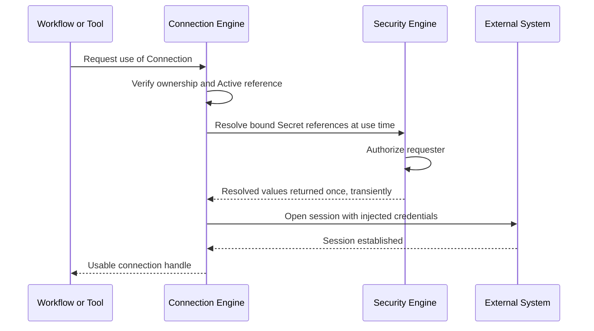

# 034 – Connection Engine

**Document ID:** DEVOS-SPEC-034

**Version:** 0.1

**Status:** Draft

**Category:** Core Architecture

**Depends On:**

- DEVOS-SPEC-005 – Guiding Principles
- DEVOS-SPEC-006 – Terminology
- DEVOS-SPEC-013 – Object Lifecycle
- DEVOS-SPEC-014 – State Model
- DEVOS-SPEC-025 – Connection Specification
- DEVOS-SPEC-028 – Secret Specification
- DEVOS-SPEC-030 – System Architecture
- DEVOS-SPEC-036 – Security Engine
- DEVOS-SPEC-037 – Event System

**Referenced By:**

- DEVOS-SPEC-025 – Connection Specification
- DEVOS-SPEC-030 – System Architecture
- DEVOS-SPEC-046 – Health System
- DEVOS-SPEC-068 – Remote Agents

---

# Abstract

This document defines the Connection Engine, the Core Architecture component that tests, maintains, and secures connectivity to external systems.

The engine implements the Connection contract defined in DEVOS-SPEC-025: it registers connections, runs connectivity checks, monitors health, binds credentials, and releases or deletes connections.

A Connection declares connectivity; this engine turns that declaration into verified runtime states without ever storing plaintext credentials.

---

# Purpose

This specification answers the following question:

> **How does DevOS test, maintain, and secure connectivity to external systems?**

Testing produces honest states through tiered checks, maintenance keeps those states current on demand or on consented schedule, and security guarantees that credential values exist only transiently at the moment of use.

The external system is always reached from outside; it is never pulled inside the Workspace aggregate.

---

# Goals

This specification aims to:

- Define the role and responsibilities of the Connection Engine.
- Define register, test, monitor, bind-credentials, and release operations.
- Define abstract connectivity check semantics and result mapping.
- Define connection state transitions with their triggers.
- Define credential injection that never persists values.
- Preserve the external boundary defined for Workspaces.
- Define error classes raised during connectivity work.

---

# Non Goals

This specification does not define:

- Check algorithms or protocol implementations
- Tunnel or proxy mechanics
- Credential storage formats
- External system administration
- Provider routing policy

---

# Role

The Connection Engine is a Core Architecture component positioned by DEVOS-SPEC-030.

Connection objects remain owned by their Workspaces per DEVOS-SPEC-015; the engine owns only their runtime dimension and is the sole authority for executing checks and reporting connection states.

Authorization and secret resolution belong to the Security Engine defined in DEVOS-SPEC-036, and state observations flow to the Health System defined in DEVOS-SPEC-046 through the Event System defined in DEVOS-SPEC-037.

---

# Responsibilities

The engine:

- registers connections declared in manifest connection blocks.
- executes connectivity checks and maps results to states, reporting changes as events consumed by the Health System.
- associates Secret references with connections at binding time and injects resolved credentials only at use time.
- guards deletion so reference integrity survives per DEVOS-SPEC-013.

The engine MUST NOT store plaintext credentials, scan in the background without consent, include secret material in test results, or treat a Provider as a substitute for a Connection.

---

# Operations

## Register

Registration ingests a Connection from the connections block of a Workspace Manifest.

The registered object MUST satisfy validation per DEVOS-SPEC-025 before progressing through the canonical lifecycle of DEVOS-SPEC-013.

Registration records provenance linking the Connection to its manifest origin.

Every credential field MUST be a Secret reference into DEVOS-SPEC-028.

## Test

Testing performs a connectivity check against one Connection.

The engine enters Testing state, executes the check tiers, and transitions to Connected, Degraded, Failed, or Disconnected according to the results.

Test results are reported as Connection state, never as lifecycle changes, per DEVOS-SPEC-025.

## Monitor

Monitoring keeps connection states current through on-demand or scheduled checks.

Scheduled monitoring requires explicit user consent and feeds observations to the Health System defined in DEVOS-SPEC-046; absent consent, the engine performs no background scanning.

## Bind Credentials

Binding associates Secret references with a Connection.

Binding stores references only; values remain in secure storage controlled by the Security Engine, and injection happens exclusively at use time.

Rotating a bound Secret requires no re-binding because references survive rotation, per DEVOS-SPEC-028.

## Release and Delete

Release detaches using objects from a Connection without deleting it.

Delete follows the canonical lifecycle of DEVOS-SPEC-013.

Active references MUST be removed or rejected before independent deletion completes, after which the cascade rules of the owning Workspace apply.

Deleting a Connection never deletes the external system.

Deleting the owning Workspace deletes all owned Connections with it.

---

# Connectivity Check Semantics

Checks are described abstractly as three tiers evaluated in order.

| Tier               | Verifies                                        | Typical Failure Meaning                          |
| ------------------ | ----------------------------------------------- | ------------------------------------------------ |
| Reachability probe | The endpoint can be reached at all.             | Unreachable endpoint or name resolution failure. |
| Auth probe         | Bound credentials are accepted.                 | Credentials missing, expired, or rejected.       |
| Capability probe   | The advertised capability responds as expected. | Endpoint reachable but service incomplete.       |

Result mapping rules:

- All tiers pass: the Connection reports Connected.
- Tiers pass with warnings: the Connection reports Degraded with warnings.
- Auth fails while reachability succeeds: the Connection reports Failed with an auth-rejected reason code.
- Reachability fails: the outcome distinguishes intentional offline (Disconnected) from unexpected failure (Failed).
- A check that cannot run reports Unknown until invoked again.

Degraded-with-warnings and Failed are distinct outcomes and MUST NOT be collapsed into one another.

Check results contain identifiers, timings, and reason codes only.

---

# State Transitions

States reuse the connection set defined in DEVOS-SPEC-014.

| From         | Trigger                               | To           |
| ------------ | ------------------------------------- | ------------ |
| Unknown      | First check begins.                   | Testing      |
| Testing      | All check tiers pass.                 | Connected    |
| Testing      | Tiers pass with warnings.             | Degraded     |
| Testing      | Check fails unexpectedly.             | Failed       |
| Testing      | Connectivity intentionally disabled.  | Disconnected |
| Connected    | On-demand or scheduled check begins.  | Testing      |
| Degraded     | On-demand or scheduled check begins.  | Testing      |
| Disconnected | User re-enables and invokes a test.   | Testing      |
| Failed       | Retry is invoked.                     | Testing      |

State transitions are reported through the Event System defined in DEVOS-SPEC-037.

An Archived Connection SHOULD NOT be probed for connectivity.

State never changes lifecycle stage, per DEVOS-SPEC-025.

---

# Credential Injection

Credentials are injected only at the moment a connection is used.

Resolved values are NEVER persisted by this engine, and are never cached, logged, echoed, exported, or written into state reports, consistent with DEVOS-SPEC-028.

If resolution fails, the engine reports Failed with a reason code and reaches no external system; unauthorized resolution attempts fail closed.

---

# External Boundary

External systems remain outside the Workspace aggregate boundary defined in DEVOS-SPEC-020.

Connections describe them; they are never owned by DevOS.

Reaching an external system is a deliberate act triggered by an invoked check or an actual use, and no operation of this engine moves any part of an external system into the domain model.

---

# Offline Stance

Disconnected is a valid steady state, preserving Offline First behavior per Rule 7.

Registration, binding, release, and deletion require no network access.

Checks require network access only when invoked, scheduled monitoring exists only where the user has consented, and absence of network is reported as state information, never raised as a platform failure.

---

# Error Classes

| Error Class     | Trigger                                            | Required Behavior                                  |
| --------------- | -------------------------------------------------- | -------------------------------------------------- |
| Timeout         | The endpoint did not answer within bounds.         | Report Failed with timeout reason code.            |
| DnsFailure      | The endpoint could not be resolved.                | Report Failed with resolution reason code.         |
| AuthRejected    | Bound credentials were refused by the system.      | Report Failed with auth-rejected reason code.      |
| InvalidEndpoint | The endpoint descriptor is malformed for the type. | Reject before testing and report the defect.       |
| Refusal         | An active reference blocks deletion.               | Reject deletion and name the blocking references.  |
| ConsentMissing  | Scheduled monitoring lacks user consent.           | Perform no scans and report the unmet precondition.|

Error messages MUST use identifiers and reason codes and MUST NOT quote secret material, consistent with DEVOS-SPEC-028.

---

# Connection Engine Invariants

The following invariants MUST always hold.

- Every Connection belongs to exactly one Workspace; ownership is singular.
- No plaintext endpoint credentials exist at rest anywhere in this engine.
- No background scanning occurs without explicit user consent.
- Test results contain no secret material under any circumstance.
- Credential injection happens only at use time and only through DEVOS-SPEC-036.
- External systems stay outside the aggregate boundary defined in DEVOS-SPEC-020.
- Connection state never changes lifecycle stage.
- Deleting a Connection never deletes the external system, while deletion respects reference integrity per DEVOS-SPEC-013.
- Disconnected remains a valid steady state, never an implicit failure.

---

# Security Requirements

Implementations enforce the endpoint and credential posture of DEVOS-SPEC-025 and DEVOS-SPEC-028:

- MUST store credentials only as Secret references.
- MUST resolve values transiently at use time through the Security Engine.
- MUST suppress endpoint details in outputs shared across trust boundaries and redact credential material from logs, diagnostics, and exports.
- MUST keep consent for scheduled monitoring explicit, revocable, and auditable.
- MUST treat uncertain authorization as no injection and no connection attempt.

---

# Performance Requirements

- On-demand tests SHOULD return promptly and MUST respect bounded timeouts.
- Scheduled monitoring SHOULD stagger checks to avoid bursts against external systems.
- State reporting SHOULD be asynchronous relative to the workflows requesting connectivity.
- Credential injection SHOULD add negligible overhead to session establishment.

---

# Future Extensions

Future specifications may add support for:

- Connection pooling hints for high-throughput consumers
- Tunneling integrations for restricted networks
- Measured quality-of-service reporting
- Federated connections across Workspaces
- Remote agent connectivity through DEVOS-SPEC-068

These extensions MUST preserve the external boundary, MUST NOT introduce inline credentials, and MUST NOT break the single Workspace aggregate model without an ADR.

---

# References

- DEVOS-SPEC-005 – Guiding Principles
- DEVOS-SPEC-006 – Terminology
- DEVOS-SPEC-013 – Object Lifecycle
- DEVOS-SPEC-014 – State Model
- DEVOS-SPEC-015 – Object Ownership
- DEVOS-SPEC-020 – Workspace Specification
- DEVOS-SPEC-024 – Provider Specification
- DEVOS-SPEC-025 – Connection Specification
- DEVOS-SPEC-028 – Secret Specification
- DEVOS-SPEC-030 – System Architecture
- DEVOS-SPEC-033 – Provider Engine
- DEVOS-SPEC-036 – Security Engine
- DEVOS-SPEC-037 – Event System
- DEVOS-SPEC-046 – Health System
- DEVOS-SPEC-068 – Remote Agents

---

# Revision History

| Version | Date | Author             | Notes         |
| ------- | ---- | ------------------ | ------------- |
| 0.1     | TBD  | DevOS Contributors | Initial Draft |
