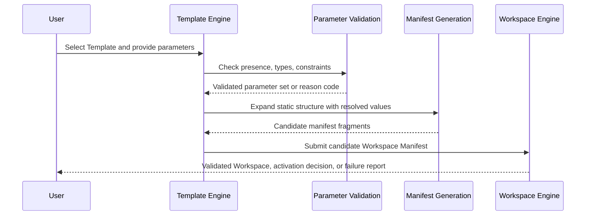

# 035 – Template Engine

**Document ID:** DEVOS-SPEC-035

**Version:** 0.1

**Status:** Draft

**Category:** Core Architecture

**Depends On:**

- DEVOS-SPEC-005 – Guiding Principles
- DEVOS-SPEC-006 – Terminology
- DEVOS-SPEC-011 – Domain Model
- DEVOS-SPEC-013 – Object Lifecycle
- DEVOS-SPEC-014 – State Model
- DEVOS-SPEC-020 – Workspace Specification
- DEVOS-SPEC-027 – Template Specification
- DEVOS-SPEC-029 – Workspace Manifest
- DEVOS-SPEC-030 – System Architecture

**Referenced By:**

- DEVOS-SPEC-027 – Template Specification
- DEVOS-SPEC-030 – System Architecture
- DEVOS-SPEC-041 – Dashboard
- DEVOS-SPEC-053 – Template SDK

---

# Abstract

This document defines the Template Engine, the Core Architecture component that executes Template-driven creation.

The engine implements the canonical instantiation flow defined in DEVOS-SPEC-027, from parameter validation through manifest generation.

It is deterministic by rule: identical Templates combined with identical parameters MUST produce equivalent output manifests.

The engine never executes code, never reads secret values, requires no network access, and hands every result to the validation pipeline defined in DEVOS-SPEC-029.

---

# Purpose

This specification answers the following question:

> **How does DevOS turn Templates into validated Workspaces deterministically and safely?**

The engine converts a declarative Template plus a validated parameter set into a candidate Workspace Manifest.

Determinism keeps results reproducible; delegation to the standard pipeline keeps them trustworthy.

---

# Goals

This specification aims to:

- Define the role and responsibilities of the Template Engine.
- Execute the instantiation flow defined in DEVOS-SPEC-027 without omission.
- Define parameter handling for typed parameters, defaults, and constraints.
- Define substitution scope and forbidden input sources.
- Require deterministic, offline-capable generation.
- Define provenance tracking for plugin-contributed Templates.
- Define error classes raised during instantiation.

---

# Non Goals

This specification does not define:

- Template file syntax or rendering internals
- Registry protocols or marketplace mechanics
- Manifest schema contents
- Workspace activation logic beyond hand-off
- CLI commands or user interface flows
- Database schemas

---

# Role

The Template Engine is a Core Architecture component positioned by DEVOS-SPEC-030.

It sits between user intent and the domain: callers supply a Template selection and parameters, and the engine returns a candidate manifest and nothing else.

It owns no persistent domain objects.

A Template remains owned by its Workspace per DEVOS-SPEC-015, and any resulting Workspace belongs to its own owner once activated.

---

# Responsibilities

The engine:

- accepts instantiation requests naming a Template and a parameter set.
- validates parameters against Template declarations before any generation.
- emits DEVOS-SPEC-029 conformant manifest fragments on success.
- records provenance for contributed Templates.
- reports lifecycle outcomes through the Event System defined in DEVOS-SPEC-037.
- rejects invalid requests with stable reason codes.

The engine MUST NOT:

- execute code contained in or referenced by a Template.
- read environment variables during generation.
- read secret values during generation.
- activate Workspaces itself.
- bypass any validation stage.

---

# Instantiation Flow

The engine executes exactly the flow defined in DEVOS-SPEC-027.

| Stage               | Actor            | Behavior                                                       |
| ------------------- | ---------------- | -------------------------------------------------------------- |
| Select              | Caller           | Chooses a Ready Template visible in the target scope.           |
| Provide Parameters  | Caller           | Supplies required values and optional overrides.                |
| Validate Parameters | Template Engine  | Checks presence, types, and constraints.                        |
| Generate Manifest   | Template Engine  | Emits DEVOS-SPEC-029 conformant manifest fragments.             |
| Validate Workspace  | Workspace Engine | Applies the full DEVOS-SPEC-029 pipeline and domain validation. |
| Activate            | Workspace Engine | Activates per DEVOS-SPEC-013 and DEVOS-SPEC-020.                |

Flow rules:

- No stage MAY be skipped or reordered.
- Only a Template in Ready state participates; Archived, Deleted, Failed, and Disabled Templates MUST be rejected at Select time.
- Failed parameter validation MUST stop the flow before generation.
- Generated output MUST NOT bypass Workspace activation requirements.

---

# Parameter Handling

Parameters are the only variable input to generation.

## Types

Every parameter declares exactly one type as defined in DEVOS-SPEC-027.

| Type    | Rule                                                          |
| ------- | ------------------------------------------------------------- |
| string  | Value MUST be text and satisfy length or pattern constraints. |
| number  | Value MUST be numeric and satisfy bound constraints.          |
| boolean | Value MUST be true or false.                                  |
| enum    | Value MUST equal exactly one allowed value.                   |

## Defaults and Constraints

- The engine MUST apply a declared default when an optional parameter is omitted.
- A default MUST satisfy its own constraints before the Template is valid.
- A required parameter MUST NOT rely on a default to become satisfiable.
- Constraints MUST be checked after type checking and before generation.
- Any constraint violation MUST stop instantiation with an unsatisfied-constraint reason code.

## Missing Required Rejection

- Instantiation MUST fail when a required parameter has no caller-supplied value.
- The failure MUST occur before any generation work.
- The rejection MUST name the missing parameter and MUST NOT produce partial output.

---

# Substitution Scope

Substitution replaces placeholders in the Template's static structure with resolved parameter values.

Resolution follows fixed precedence:

- caller-supplied values take precedence.
- declared defaults fill omitted optional parameters.
- nothing else resolves.

Additional rules:

- A variable resolving from neither source MUST cause rejection.
- A Template MUST NOT read environment variables during generation, as mandated by DEVOS-SPEC-027.
- A Template MUST NOT read secret values during generation, as mandated by DEVOS-SPEC-027.
- A Template MAY emit Secret references as defined in DEVOS-SPEC-028; references carry identifiers, never values.
- Generation input consists of exactly the Template definition and the validated parameter set.

---

# Determinism Requirement

Identical Templates combined with identical parameters MUST produce equivalent output manifests.

Equivalence is semantic equivalence, modulo generated identifiers assigned by import or activation machinery.

Rules:

- Randomness, wall-clock reads, environment probes, and network lookups MUST NOT influence output.
- Timestamp-like values in output MUST derive from explicit parameters rather than from the clock.

Determinism keeps instantiations reproducible, reviewable, and testable across implementations.

---

# Generation

Generation expands the Template's static structure into manifest fragments conforming to DEVOS-SPEC-029.

Fragments assemble into one complete candidate Workspace Manifest describing the Project, Profiles, Environments, and owned objects the Template declares.

- The candidate MUST be expressible under the canonical schema referenced by DEVOS-SPEC-029.
- Validation MUST be delegated down the DEVOS-SPEC-029 pipeline before activation eligibility is claimed.
- Passing generation establishes candidacy only.
- Activation decisions remain governed by DEVOS-SPEC-013 and DEVOS-SPEC-020 and executed by the Workspace Engine defined in DEVOS-SPEC-031.

---

# Contributed Templates

Plugins MAY contribute Templates, consistent with Plugin First and DEVOS-SPEC-026.

Contributed Templates enter the same pool as authored Templates under identical rules.

- Provenance MUST record which plugin contributed each contributed Template.
- Provenance MUST be visible to users before instantiation and included in diagnostics.
- Contribution MUST NOT elevate a Template above validation or grant extra capabilities.
- Disabling or removing a contributing plugin MUST remove its contributions from the selectable pool.
- Workspaces already created from contributed Templates remain unaffected.

---

# Error Classes

| Error Class            | Trigger                                             | Required Behavior                                         |
| ---------------------- | --------------------------------------------------- | ---------------------------------------------------------- |
| invalid-parameter      | A supplied value fails its declared type check.      | Reject before generation and name the offending parameter. |
| unsatisfied-constraint | A value violates a declared constraint.              | Reject before generation and describe the constraint.      |
| missing-required       | A required parameter has no value and no default.    | Reject before generation and name the parameter.           |
| generation-conflict    | Generated structure conflicts with target state.     | Stop the flow and report without partial output.           |
| template-unavailable   | Selected Template is not Ready or not visible.       | Reject at Select time and report the Template state.       |

Error messages MUST use identifiers and reason codes and MUST NOT expose secret material, consistent with DEVOS-SPEC-028.

---

# Template Engine Invariants

The following invariants MUST always hold.

- Identical Templates with identical parameters MUST generate equivalent manifests, modulo generated identifiers.
- Parameter validation MUST precede generation.
- Failed validation MUST NOT produce partial output.
- Generation MUST NOT read environment variables.
- Generation MUST NOT read secret values.
- Generation MUST NOT depend on network access.
- Every generated manifest MUST pass the DEVOS-SPEC-029 pipeline before activation.
- Only Ready Templates MAY instantiate.
- Contributed Templates obey the same rules as authored Templates.
- The engine MUST NOT execute code under any circumstance.

---

# Security Requirements

This section restates and enforces the security stance of DEVOS-SPEC-027.

- The engine processes declarative input only; code execution is prohibited in Version 0.1.
- Templates and parameter sets are untrusted input until validated.
- Substitution scope MUST be enforced and unknown variable sources rejected.
- Any future executable step requires an explicit consent model approved through an ADR before it may exist in this specification.
- Runtime enforcement of these boundaries belongs to the Security Engine defined in DEVOS-SPEC-036.

---

# Performance Requirements

- Generation SHOULD be pure and fast, with no side effects beyond the returned fragments.
- Instantiation MUST NOT require network access, preserving Offline First behavior.
- Parameter validation SHOULD fail fast before generation resources are spent.
- Memory use SHOULD scale with Template size, not with Workspace history.

---

# Future Extensions

Future specifications may add support for:

- Template inheritance and composition
- Signed template packages
- Shared registries and marketplace distribution through DEVOS-SPEC-070
- Dry-run previews of generated manifests
- Organization-level template policies

These extensions MUST preserve the declarative-only rule unless an ADR explicitly changes it.

They MUST preserve determinism and MUST NOT break the single Workspace aggregate model.

---

# References

- DEVOS-SPEC-005 – Guiding Principles
- DEVOS-SPEC-006 – Terminology
- DEVOS-SPEC-013 – Object Lifecycle
- DEVOS-SPEC-015 – Object Ownership
- DEVOS-SPEC-020 – Workspace Specification
- DEVOS-SPEC-026 – Plugin Specification
- DEVOS-SPEC-027 – Template Specification
- DEVOS-SPEC-028 – Secret Specification
- DEVOS-SPEC-029 – Workspace Manifest
- DEVOS-SPEC-030 – System Architecture
- DEVOS-SPEC-031 – Workspace Engine
- DEVOS-SPEC-036 – Security Engine
- DEVOS-SPEC-037 – Event System

---

# Revision History

| Version | Date | Author             | Notes         |
| ------- | ---- | ------------------ | ------------- |
| 0.1     | TBD  | DevOS Contributors | Initial Draft |
