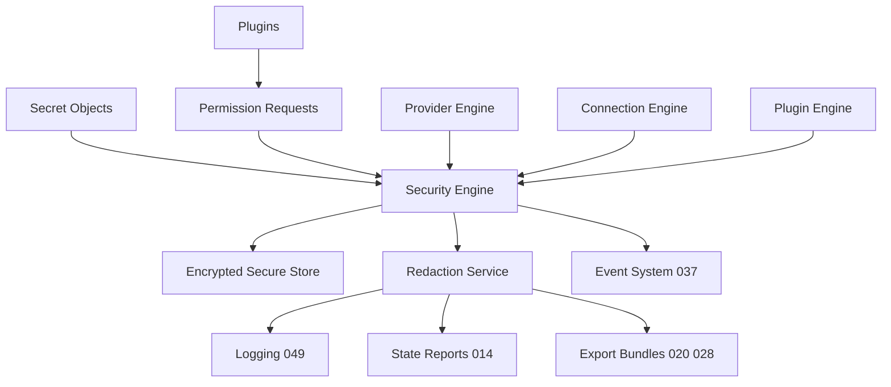

# 036 – Security Engine

**Document ID:** DEVOS-SPEC-036

**Version:** 0.1

**Status:** Draft

**Category:** Core Architecture

**Depends On:**

- DEVOS-SPEC-005 – Guiding Principles
- DEVOS-SPEC-006 – Terminology
- DEVOS-SPEC-011 – Domain Model
- DEVOS-SPEC-013 – Object Lifecycle
- DEVOS-SPEC-014 – State Model
- DEVOS-SPEC-020 – Workspace Specification
- DEVOS-SPEC-026 – Plugin Specification
- DEVOS-SPEC-028 – Secret Specification
- DEVOS-SPEC-030 – System Architecture

**Referenced By:**

- DEVOS-SPEC-026 – Plugin Specification
- DEVOS-SPEC-028 – Secret Specification
- DEVOS-SPEC-030 – System Architecture
- DEVOS-SPEC-033 – Provider Engine
- DEVOS-SPEC-034 – Connection Engine
- DEVOS-SPEC-049 – Logging
- DEVOS-SPEC-062 – RBAC
- DEVOS-SPEC-065 – Audit System

---

# Abstract

This document defines the Security Engine, the platform's security kernel.

It is the single component through which secret custody, permission evaluation, redaction, security audit events, and key management are enforced.

The engine implements the absolute rules of DEVOS-SPEC-028 and the least-privilege stance of DEVOS-SPEC-026.

It guarantees deny-by-default behavior, encrypted-at-rest custody of secret values, and one choke point through which every observable output passes.

This specification is deliberately abstract about cryptography.

It mandates outcomes and vetted primitives, never algorithms.

---

# Purpose

This specification answers the following question:

> **What guarantees does DevOS make about secrets, permissions, and safe defaults?**

DevOS guarantees that secret values exist only in secure storage and only transiently at use time.

It guarantees that ungranted capability equals unavailable capability.

It guarantees that every observable surface, from logs to exports, is scrubbed of secret material by a single service.

These guarantees hold during normal operation, failure, and debugging alike.

---

# Goals

This specification aims to:

- Define the Security Engine as the platform security kernel.
- Define secret custody implementing the absolute rules of DEVOS-SPEC-028.
- Define least-privilege permission evaluation for plugins.
- Define the Redaction Service as a single observability choke point.
- Define security-relevant audit event emission through DEVOS-SPEC-037.
- Define abstract key management requirements.
- Define the threat model and security invariants of Version 0.1.

---

# Non Goals

This specification does not define:

- Specific cryptographic suites or algorithm choices
- Network policy enforcement in Version 0.1
- RBAC role semantics, deferred to DEVOS-SPEC-062
- Audit retention schedules, deferred to DEVOS-SPEC-065
- Plugin sandbox mechanics, defined by DEVOS-SPEC-026
- Operating system keystore internals
- Database schemas or API endpoints

---

# Role

The Security Engine is a Core Architecture component positioned by DEVOS-SPEC-030.

It is the smallest trusted component of the platform.

All other engines delegate security decisions to it rather than reimplementing them.

The Provider Engine defined in DEVOS-SPEC-033 and the Connection Engine defined in DEVOS-SPEC-034 resolve credentials only through it.

Centralization keeps the trusted base small, auditable, and testable.

---

# Responsibilities

The engine:

- stores and protects secret values on behalf of Secret objects defined in DEVOS-SPEC-028.
- authorizes and performs every secret resolution.
- evaluates plugin permission requests against declared capabilities.
- operates the Redaction Service across all observable outputs.
- emits security-relevant events through the Event System defined in DEVOS-SPEC-037.
- manages cryptographic keys at an abstract level.

The engine MUST fail closed whenever authorization is uncertain.

---

# Security Pillars

The engine stands on five pillars.

Each pillar is normative for every conformant implementation.

## Secret Custody

Secret values are stored encrypted at rest inside secure storage controlled by this engine.

Custody rules:

- Plaintext values MUST NOT be persisted anywhere, implementing the absolute rules of DEVOS-SPEC-028.
- The resolution API MUST be restricted to authorized components.
- A value exists ONLY transiently at use time.
- Resolution flows exactly once from secure storage to the authorized consumer and never back into manifests, logs, state reports, diagnostics, exports, or errors.
- Unauthorized resolution attempts MUST fail without disclosing whether the identifier exists.
- Deletion of a Secret MUST permanently prevent future resolution.
- Storage failures MUST degrade resolution to Unavailable or Failed states without plaintext fallbacks.

## Permission Evaluation

Plugin permission requests are evaluated against the least-privilege principle expressed as Rule 8 of SPECIFICATION_RULES.md.

Evaluation rules:

- An ungranted capability is an unavailable capability.
- Evaluation is deny-by-default: absent, ambiguous, or expired grants all resolve to denial.
- Grants MUST be recorded with their scope and MUST be revocable.
- Revocation takes effect for subsequent evaluations without plugin reinstallation.
- Evaluation results are authoritative; no other component MAY grant capabilities.

## Redaction Service

The Redaction Service is the single choke point through which observable outputs pass before release.

It scrubs secret material from:

- log entries as specified in DEVOS-SPEC-049.
- state reports as specified in DEVOS-SPEC-014.
- export bundles as specified in DEVOS-SPEC-020 and DEVOS-SPEC-028.
- diagnostics and error messages.

Debug modes MUST NOT disable redaction.

Any output path that bypasses the service violates this specification.

## Audit Events

The engine emits security-relevant events through DEVOS-SPEC-037, including `devos.secret.rotated`, `devos.access.denied`, and `devos.plugin.permission.granted`.

Events record who acted, what object was affected, and when.

Events MUST NOT record secret values.

Enterprise audit retention and queryability are deferred to DEVOS-SPEC-065.

## Key Management

Key management is defined abstractly in Version 0.1.

- Implementations MUST use vetted cryptographic primitives.
- Algorithms MUST NOT be mandated, preserving implementation independence and cryptographic agility.
- Integration with operating system keystores is permitted and SHOULD be preferred where available.
- Encryption keys MUST be rotatable without exposing plaintext beyond transient use.
- Key material MUST obey the same custody rules as secret values.

---

# Threat Model

The following threats are in scope for Version 0.1.

| Threat                    | Vector                                               | Mitigation                                                                  |
| ------------------------- | ------------------------------------------------------ | ------------------------------------------------------------------------------ |
| Log leakage               | Secret material echoed into log entries                | Redaction choke point and mandatory DEVOS-SPEC-049 redaction.                   |
| Export leakage            | Values copied into Workspace export bundles            | Export paths carry references only per DEVOS-SPEC-020 and DEVOS-SPEC-028.       |
| Manifest embedding        | Credentials pasted into manifest fields                | Schema and domain validation reject embedded values per DEVOS-SPEC-029.         |
| Memory scraping           | Plaintext held in process memory                       | Transient-only resolution minimizes the exposure window.                        |
| Dependency supply chain   | Malicious plugins requesting broad capabilities        | Least-privilege evaluation, deny-by-default, and provenance tracking.           |
| Misconfigured connections | Connections granted more credential access than needed | Resolution restricted to authorized consumers with scoped grants.               |

New surfaces introduced by future specifications inherit these mitigations unless an ADR strengthens them.

---

# Security Invariants

The following invariants MUST always hold.

- Every capability request is denied by default until explicitly granted.
- No secret value is ever persisted as plaintext.
- No secret value appears in any observability stream: logs, state reports, exports, diagnostics, errors, or events.
- Every security-relevant action is auditable through emitted events.
- Uncertain authorization always resolves to denial.
- Plugins never modify core components, consistent with Rule 6 of SPECIFICATION_RULES.md.
- Revocation of a grant takes precedence over any prior approval.

---

# Design Decisions

The following decisions shape this specification.

| Decision               | Choice                                             | Rationale                                        |
| ---------------------- | ---------------------------------------------------- | --------------------------------------------------- |
| Single kernel          | All security enforcement centralizes in one engine    | Keeps the trusted base small and auditable.         |
| Algorithm independence | Primitives are mandated, algorithms are not           | Preserves portability and cryptographic agility.    |
| Choke-point redaction  | One service scrubs every observable output            | No leak path can bypass review.                     |
| Transient resolution   | Values exist only at use time                         | Shrinks the attack surface available to scrapers.   |

Changing any of these decisions requires an approved ADR.

---

# Operation Overview

Permission evaluation follows one canonical sequence.

A caller presents identity, requested capability, and scope.

The engine consults recorded grants and applies deny-by-default semantics.

The outcome is either a grant binding or a denial reason code.

Denials MUST be indistinguishable with respect to whether the underlying resource exists.

Secret resolution follows DEVOS-SPEC-028 exactly.

The authorization check precedes every access to secure storage.

Resolved values traverse memory once and are released by the consumer after use.

---

# Performance Requirements

- Permission evaluations SHOULD be fast enough to sit inline on hot paths such as connection establishment.
- Redaction SHOULD operate incrementally on streams so large logs and exports are not buffered whole.
- Custody operations MUST NOT trade correctness for latency under load.
- Security checks MUST remain local and MUST NOT require network round trips, preserving Offline First behavior.

---

# Future Extensions

Future specifications may add support for:

- Centralized enterprise vaults
- RBAC integration through DEVOS-SPEC-062
- Policy-driven evaluation through DEVOS-SPEC-063
- Network policy enforcement
- Hardware-backed key storage
- Automatic rotation policies

These extensions MUST preserve the pillars and invariants of this document.

They MUST NOT break the single Workspace aggregate model without an approved ADR.

---

# References

- DEVOS-SPEC-005 – Guiding Principles
- DEVOS-SPEC-006 – Terminology
- DEVOS-SPEC-013 – Object Lifecycle
- DEVOS-SPEC-020 – Workspace Specification
- DEVOS-SPEC-026 – Plugin Specification
- DEVOS-SPEC-028 – Secret Specification
- DEVOS-SPEC-029 – Workspace Manifest
- DEVOS-SPEC-030 – System Architecture
- DEVOS-SPEC-032 – Plugin Engine
- DEVOS-SPEC-033 – Provider Engine
- DEVOS-SPEC-034 – Connection Engine
- DEVOS-SPEC-037 – Event System
- DEVOS-SPEC-049 – Logging
- SPECIFICATION_RULES.md – Repository rule set (Rules 6, 8)
- DEVOS-SPEC-062 – RBAC
- DEVOS-SPEC-063 – Policy Engine
- DEVOS-SPEC-065 – Audit System

---

# Revision History

| Version | Date | Author             | Notes         |
| ------- | ---- | ------------------ | ------------- |
| 0.1     | TBD  | DevOS Contributors | Initial Draft |
