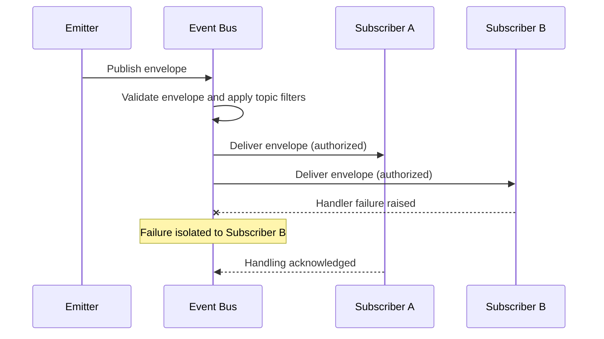

# 037 – Event System

**Document ID:** DEVOS-SPEC-037

**Version:** 0.1

**Status:** Draft

**Category:** Core Architecture

**Depends On:**

- DEVOS-SPEC-005 – Guiding Principles
- DEVOS-SPEC-006 – Terminology
- DEVOS-SPEC-011 – Domain Model
- DEVOS-SPEC-013 – Object Lifecycle
- DEVOS-SPEC-014 – State Model
- DEVOS-SPEC-020 – Workspace Specification
- DEVOS-SPEC-026 – Plugin Specification
- DEVOS-SPEC-030 – System Architecture
- DEVOS-SPEC-031 – Workspace Engine

**Referenced By:**

- DEVOS-SPEC-026 – Plugin Specification
- DEVOS-SPEC-030 – System Architecture
- DEVOS-SPEC-031 – Workspace Engine
- DEVOS-SPEC-032 – Plugin Engine
- DEVOS-SPEC-033 – Provider Engine
- DEVOS-SPEC-034 – Connection Engine
- DEVOS-SPEC-036 – Security Engine
- DEVOS-SPEC-041 – Dashboard
- DEVOS-SPEC-056 – Hooks API
- DEVOS-SPEC-057 – Events API

---

# Abstract

This document defines the Event System, the canonical publish-subscribe backbone of DevOS.

The system decouples engines and surfaces so that components observe what happens without depending on each other, per the dependency rules of DEVOS-SPEC-030.

It defines the event envelope, topic naming, a starter event catalog, delivery tiers, subscriptions, and the distinction between events and hooks.

Events are asynchronous notifications.

They inform; they never veto.

---

# Purpose

This specification answers the following question:

> **How do decoupled components observe and react to what happens in DevOS?**

Emitters publish structured facts to named topics.

Subscribers receive only the topics they are authorized and subscribed to see.

No emitter knows its subscribers, and no subscriber can affect its emitter.

---

# Goals

This specification aims to:

- Define the publish-subscribe backbone role.
- Define the required event envelope fields.
- Define the topic naming convention with canonical examples.
- Provide a starter event catalog across domains.
- Classify delivery guarantees into tiers.
- Distinguish events from hooks defined in DEVOS-SPEC-056.
- Define workspace-scoped, permission-aware subscriptions.
- Define handler failure isolation.

---

# Non Goals

This specification does not define:

- Transport protocols or wire formats
- Retention schedules, which implementations choose
- Hook lifecycle semantics, defined by DEVOS-SPEC-056
- The public events surface, defined by DEVOS-SPEC-057
- Enterprise audit storage, deferred to DEVOS-SPEC-065
- Database schemas or network topology

---

# Role and Responsibilities

The Event System is backbone infrastructure positioned by DEVOS-SPEC-030.

Every engine MAY be an emitter; every engine, surface, plugin, and tool MAY be a subscriber.

The Workspace Engine defined in DEVOS-SPEC-031 is the primary producer of lifecycle events, and the Security Engine defined in DEVOS-SPEC-036 is the primary producer of security events.

Responsibilities:

- accept well-formed envelopes from emitters.
- route envelopes to subscribers by topic.
- enforce subscription authorization before every delivery.
- isolate subscriber failures from emitters and from other subscribers.
- classify topics into delivery tiers and record outcomes per tier.

---

# Event Envelope

Every event MUST carry a complete envelope.

| Field            | Required | Description                                                      |
| ---------------- | -------- | ------------------------------------------------------------------ |
| id               | Yes      | Unique event identifier.                                           |
| type             | Yes      | Topic string under which the event was published.                  |
| timestamp        | Yes      | Time of publication as reported by the emitting component.         |
| source           | Yes      | Emitting object expressed as object type plus object identifier.   |
| correlationId    | Yes      | Identifier linking all events belonging to one logical operation.  |
| payloadReference | Yes      | Reference to the event payload data.                               |

Envelope rules:

- Correlation identifiers let consumers reconstruct multi-step operations such as instantiation or activation.
- Envelopes and payloads MUST NOT contain secret values, consistent with DEVOS-SPEC-028 and the state reporting rules of DEVOS-SPEC-014.

---

# Topic Naming Convention

Topics follow one convention:

`devos.<domain>.<object>.<action>`

Segments are lowercase and dotted; domains mirror the domain objects defined in DEVOS-SPEC-011.

Canonical examples include `devos.workspace.created`, `devos.profile.updated`, `devos.secret.rotated`, `devos.plugin.enabled`, and `devos.connection.state.changed`.

Renaming a published topic is a breaking change under the versioning policy referenced by DEVOS-SPEC-030.

---

# Starter Event Catalog

The following catalog seeds Version 0.1 with cross-domain coverage.

| Topic                            | Producer          | Example Consumers |
| -------------------------------- | ------------------- | -------------------- |
| devos.workspace.created          | Workspace Engine    | Dashboard, CLI       |
| devos.workspace.archived         | Workspace Engine    | Logging              |
| devos.workspace.state.changed    | Workspace Engine    | Dashboard            |
| devos.profile.updated            | Workspace Engine    | Workspace SDK        |
| devos.connection.state.changed   | Connection Engine   | Dashboard, Logging   |
| devos.provider.auth.required     | Provider Engine     | Dashboard            |
| devos.plugin.installed           | Plugin Engine       | Dashboard            |
| devos.plugin.enabled             | Plugin Engine       | Dashboard            |
| devos.plugin.permission.granted  | Security Engine     | Audit tooling        |
| devos.access.denied              | Security Engine     | Logging              |
| devos.secret.rotated             | Security Engine     | Audit tooling        |
| devos.template.instantiated      | Template Engine     | Workspace SDK        |

Producers and consumers are roles, not exclusive assignments; any authorized component MAY subscribe to any catalog topic it is granted.

---

# Delivery Guarantees

Delivery guarantees are classified into three tiers.

| Tier | Classification      | Example Events                          | Guarantee                                        |
| ---- | --------------------- | ------------------------------------------ | ---------------------------------------------------- |
| A    | Durable audit-grade   | Security events such as secret rotation    | At-least-once delivery with durable recording.       |
| B    | Operational           | State changes and lifecycle transitions    | At-least-once preferred with bounded retention.      |
| C    | Ephemeral UI          | Progress hints and refresh requests        | Best-effort delivery with no retention duty.         |

Delivery rules:

- At-least-once is the preferred overall stance, so consumers SHOULD treat handling as idempotent.
- Per-source ordering SHOULD hold: ordering across different sources or topics is not guaranteed.
- Tier C MAY be shed under pressure.
- Tier A and Tier B MUST NOT be silently dropped; failures MUST be recorded per tier policy.

## Retention

Retention is abstract in Version 0.1.

Implementations choose how long events persist, guided by tier classification.

Tier A events SHOULD outlive the process lifetime; Tier C events SHOULD be disposable at any moment.

---

# Hooks versus Events

Hooks are defined by DEVOS-SPEC-056; the public events surface is defined by DEVOS-SPEC-057.

| Aspect          | Hooks (DEVOS-SPEC-056)                 | Events (DEVOS-SPEC-057)                   |
| --------------- | ------------------------------------------ | ------------------------------------------------ |
| Execution model | Synchronous lifecycle callback             | Asynchronous notification                        |
| Veto power      | May veto and abort the operation           | Cannot veto anything                             |
| Timing          | Runs inline during the intercepted step    | Runs after the fact, at delivery time            |
| Coupling        | Tight coupling between caller and hook     | No coupling between emitter and subscriber       |
| Failure effect  | Can fail or block the operation            | Isolated; never affects the emitter              |

A component that must approve or reject an operation uses hooks; a component that merely needs to know an operation happened uses events.

---

# Subscription Model

Subscriptions are scoped to exactly one Workspace.

Subscription rules:

- A subscription names one or more topics and one consumer.
- Plugins subscribe only to topics granted through the permission model of DEVOS-SPEC-026.
- Topic access is deny-by-default, evaluated consistently with the Security Engine defined in DEVOS-SPEC-036.
- An event published in one Workspace MUST NEVER be delivered to a consumer subscribed in another Workspace.
- Revocation of a topic grant ends matching deliveries for subsequent evaluations.

---

# Handler Failure Isolation

Subscriber handlers run in isolation.

One failing handler MUST NOT affect the emitter, the bus, or other subscribers.

Failure handling:

- The bus records failures against the subscribing consumer according to tier policy.
- Repeated failures MAY cause suspension of that subscriber's deliveries pending remediation.
- Suspension is local to one subscriber and never suppresses publication for others.
- Malformed envelopes MUST be rejected at publish time before any delivery attempt.

## Error Classes

| Error Class         | Trigger                                   | Required Behavior                                     |
| ------------------- | --------------------------------------------- | ----------------------------------------------------------- |
| malformed-envelope  | Envelope fails structural validation.         | Reject at publish time and report a reason code.            |
| undeliverable-event | No route exists or tier capacity is spent.    | Record per tier policy; never block the emitter.            |
| handler-failure     | A subscriber handler raises an error.         | Isolate the failure and continue other deliveries.          |
| unauthorized-topic  | Consumer subscribes to an ungranted topic.    | Deny the subscription per the authorization rules above.    |

## Delivery Flow

---

# Event System Invariants

The following invariants MUST always hold.

- Events and payloads MUST NEVER carry secret values, consistent with DEVOS-SPEC-028 and DEVOS-SPEC-014.
- Events have no veto power over any operation.
- Events MUST NEVER leak across Workspace boundaries.
- Every published event carries a complete envelope.
- Topics follow the lowercase dotted convention.
- Handler failures never propagate to emitters or sibling subscribers.
- Subscription follows deny-by-default authorization.

---

# Security Requirements

Subscription is a capability and MUST be granted, never assumed.

The bus MUST enforce topic authorization before every delivery.

Event content passes through the Redaction Service of DEVOS-SPEC-036 wherever it becomes observable.

Tier A events feed audit consumers such as the Audit System defined in DEVOS-SPEC-065.

---

# Performance Requirements

- Publication SHOULD be non-blocking for emitters regardless of subscriber count.
- Routing SHOULD scale linearly with active subscriptions.
- Slow subscribers SHOULD be buffered or shed according to tier instead of stalling emitters.
- Under pressure the system sheds Tier C first, then Tier B buffering, and NEVER Tier A durability.

---

# Future Extensions

Future specifications may add support for:

- Event replay from recorded history
- A federation bridge for cross-instance distribution
- Structured query over historical events
- Dead-letter inspection tooling

These extensions MUST preserve the envelope contract and the no-veto rule.

They MUST NOT break the single Workspace aggregate model without an approved ADR.

---

# References

- DEVOS-SPEC-006 – Terminology
- DEVOS-SPEC-011 – Domain Model
- DEVOS-SPEC-014 – State Model
- DEVOS-SPEC-020 – Workspace Specification
- DEVOS-SPEC-026 – Plugin Specification
- DEVOS-SPEC-028 – Secret Specification
- DEVOS-SPEC-030 – System Architecture
- DEVOS-SPEC-031 – Workspace Engine
- DEVOS-SPEC-036 – Security Engine
- DEVOS-SPEC-056 – Hooks API
- DEVOS-SPEC-057 – Events API
- DEVOS-SPEC-065 – Audit System

---

# Revision History

| Version | Date | Author             | Notes         |
| ------- | ---- | ------------------ | ------------- |
| 0.1     | TBD  | DevOS Contributors | Initial Draft |
