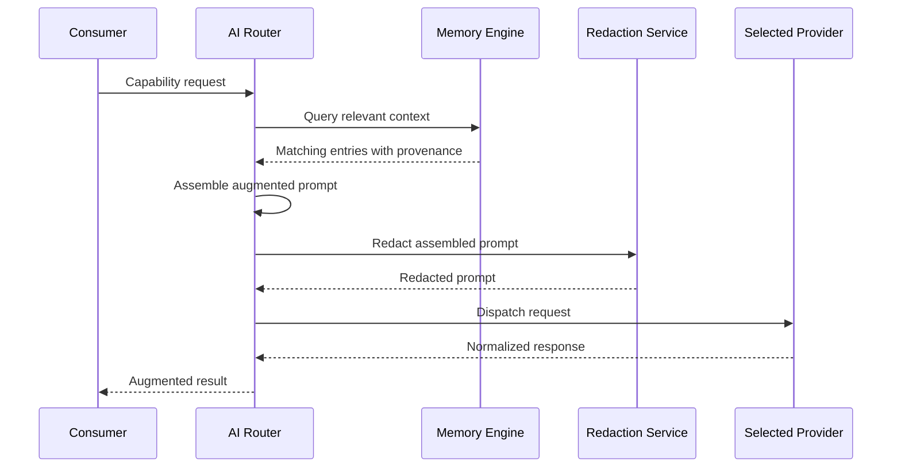

# 038 – Memory Engine

**Document ID:** DEVOS-SPEC-038

**Version:** 0.1

**Status:** Draft

**Category:** Core Architecture

**Depends On:**

- DEVOS-SPEC-005 – Guiding Principles
- DEVOS-SPEC-006 – Terminology
- DEVOS-SPEC-011 – Domain Model
- DEVOS-SPEC-013 – Object Lifecycle
- DEVOS-SPEC-014 – State Model
- DEVOS-SPEC-020 – Workspace Specification
- DEVOS-SPEC-028 – Secret Specification
- DEVOS-SPEC-030 – System Architecture
- DEVOS-SPEC-036 – Security Engine
- DEVOS-SPEC-037 – Event System

**Referenced By:**

- DEVOS-SPEC-030 – System Architecture
- DEVOS-SPEC-039 – AI Router
- DEVOS-SPEC-071 – AI Agents
- DEVOS-SPEC-072 – Research Platform

---

# Abstract

This document defines the Memory Engine, the component that gives AI-assisted features persistent, workspace-scoped operational knowledge.

Memory records project facts, decisions, preferences, environment quirks, and past workflow outcomes.

Today such context lives inside chat transcripts owned by vendors, so DevOS moves it into the Workspace the developer owns.

---

# Purpose

This specification answers the following question:

> **How does DevOS give AI-assisted features reliable, workspace-scoped memory without sacrificing privacy or portability?**

The answer is an engine-layer store of derived, human-readable knowledge inside the Workspace aggregate.

Every entry carries provenance, respects privacy choices, travels with export and import by default, and works fully offline.

---

# Goals

This specification aims to:

- Define Memory as persistent, workspace-scoped operational knowledge.
- Classify memory into kinds and scopes.
- Bind memory to Workspace ownership, export, and import.
- Make collection explainable through provenance metadata.
- Keep storage local-first with replaceable backends and declarative retention.
- Define the Write, Query, Forget, Expire, Export, and Import operations.
- Give the AI Router safe context augmentation and exclude model training.

---

# Non Goals

This specification does not define:

- Semantic search algorithms or index structures
- Knowledge graph construction
- Model training, fine-tuning, or evaluation
- Chat transcript capture or replay
- Team sharing semantics
- Concrete storage products or database schemas
- Prompt assembly logic, which belongs to DEVOS-SPEC-039

---

# Role and Responsibilities

DEVOS-SPEC-030 organizes DevOS into Interfaces, Engines, and Platform Services.

The Memory Engine belongs to the engine layer and serves the CLI, Dashboard, plugins, and the AI Router.

It relies on Logging in DEVOS-SPEC-049, emits observations through the Event System in DEVOS-SPEC-037, and cooperates with the Security Engine in DEVOS-SPEC-036.

The Memory Engine MUST:

- store and retrieve workspace-scoped memory entries.
- enforce privacy and provenance rules on every operation.
- apply declarative retention and expiry policies.
- honor visibility flags in every read, export, and sync path.
- serve context augmentation requests from the AI Router.
- report honest runtime states defined in DEVOS-SPEC-014.

---

# Memory Entries

Memory is a persistent, workspace-scoped record of operational knowledge derived from Workspace activity.

An entry carries an identifier, kind, scope, human-readable content, visibility flag, provenance, and a retention policy reference.

Memory describes knowledge about work, not the work itself, which remains owned by Workflows and Tasks in DEVOS-SPEC-011.

Every memory entry belongs to exactly one Workspace.

Memory kinds classify entries by what they describe.

| Kind                     | Example                                                 | Scope              |
| ------------------------ | ------------------------------------------------------- | ------------------ |
| Project Facts            | The release checklist requires a signed manifest first. | Project wide.      |
| Preferences              | Reviews favor concise summaries over long reports.      | Workspace wide.    |
| Environment Observations | The profile container lacks a warm package cache.       | Profile scoped.    |
| Workflow Outcomes        | The nightly workflow failed twice before a retry held.  | Workflow scoped.   |
| Documentation Excerpts   | Runbook passage describing incident escalation steps.   | Source referenced. |

New kinds MAY enter through the specification RFC process.

---

# Ownership, Privacy, and Storage

Memories belong to the Workspace aggregate like the child objects defined in DEVOS-SPEC-015.

By default memory rides Workspace export and import.

Entries marked Private are excluded from export bundles and any synchronization, and visibility is always a user choice expressed through declarative flags.

Deleting a Workspace deletes all of its memory.

The following privacy rules are normative:

- An entry MUST NOT contain secret values as defined in DEVOS-SPEC-028.
- Writes embedding resolvable Secret material MUST be rejected.
- Private entries MUST NOT leave the machine through any channel.
- Visibility flags MUST be honored by every reader, including the AI Router.
- Prompt-bound memory MUST pass the same redaction service used for logs in DEVOS-SPEC-036.
- Forgetting MUST remove entries completely, not hide them.

Collection MUST be explainable, so every entry carries provenance written at creation time.

Provenance records which component wrote the entry, when, and why.

Provenance MUST NOT be rewritten after creation, and corrections are appended as new entries.

Storage is local-first by default, and all memory operations MUST work without network access per the Offline First principle (Rule 7).

Backends sit behind a replaceable seam, so swapping a backend MUST NOT change consumer APIs, entry semantics, or privacy guarantees, per the Provider Agnostic principle (Rule 4).

Retention and expiry policies are declarative per kind or scope, following Configuration as Code (Rule 5), and expired removal MUST be emitted as an event in DEVOS-SPEC-037.

Readers and writers MUST declare their intent, undeclared components MUST be denied by DEVOS-SPEC-036, and writers MUST be identifiable so provenance stays truthful.

---

# Operations

The Memory Engine exposes six operations.

## Write

Write creates an entry with kind, scope, content, visibility, and reason.

Write MUST validate content against the privacy rules and attach provenance atomically.

## Query

Query returns entries matching kind, scope, and content criteria.

Results MUST respect visibility flags and include provenance without mutating anything.

## Forget

Forget explicitly deletes entries by identifier, scope, or kind.

Forget MUST be irreversible and MUST emit an event through DEVOS-SPEC-037.

## Expire

Expire applies retention policies and deletes eligible entries.

Expire behaves like Forget and MUST run without network access.

## Export

Export serializes memory for inclusion in a Workspace bundle.

Export MUST exclude Private entries while preserving kinds, scopes, provenance, and retention references.

## Import

Import validates incoming entries against current privacy rules.

Import MUST reject forbidden content rather than silently accepting it, and it records the import in provenance.

---

# Context Augmentation Flow

The primary memory consumer is the AI Router in DEVOS-SPEC-039, which consumes memory as context augmentation for prompts.

Prompts assembled with memory MUST pass the same redaction service as logs before dispatch.

Memory enrichment is always advisory, so a failed or disabled Memory Engine MUST degrade assistance quality, never request correctness.

---

# States and Invariants

The Memory Engine reports the global runtime states defined in DEVOS-SPEC-014.

| State    | Meaning                              |
| -------- | ------------------------------------ |
| Unknown  | Memory has not been evaluated.       |
| Ready    | Memory accepts reads and writes.     |
| Busy     | A memory operation is running.       |
| Degraded | Memory runs with reduced capability. |
| Failed   | Memory operations cannot complete.   |
| Disabled | Memory is intentionally turned off.  |

Degraded MUST identify which capability shrank, and disabling Memory MUST NOT disable the Workspace.

The following invariants MUST always hold:

- Every entry belongs to exactly one Workspace and never crosses boundaries.
- Every entry carries immutable provenance recording writer, time, and reason.
- Entries MUST NOT contain secret values per DEVOS-SPEC-028.
- Private entries are excluded from export and synchronization.
- Basic operations work fully offline.
- Backend replacement preserves consumer contracts.
- Forget and Expire remove entries irreversibly.
- Memory operations are observable through DEVOS-SPEC-037.
- Consumers cannot bypass the declared access model.

DevOS v0.1 performs NO model training on Workspace data, and this exclusion is normative.

Memory is a retrieval store, never a training corpus, and implementations MUST NOT feed memory, prompts, or responses into training processes.

Relaxing this exclusion requires an ADR plus explicit per-Workspace consent.

---

# Security and Performance

The Memory Engine MUST:

- enforce the declared reader and writer model through DEVOS-SPEC-036.
- reject content containing secret values per DEVOS-SPEC-028.
- prevent provenance forgery by unregistered writers.
- honor visibility flags in every read path.
- exclude Private entries from every outbound artifact.
- emit audit-relevant events for writes, forgets, expiries, imports, and exports.

Detailed redaction behavior is defined in DEVOS-SPEC-036.

Memory sits on the interactive path of AI assistance.

All operations MUST complete without network access, per the Offline First principle (Rule 7).

Local queries SHOULD return quickly enough to remain invisible during prompt assembly.

Writes SHOULD be cheap enough to occur inline with ordinary activity, while expiry passes SHOULD run in the background.

Large Workspaces MUST keep query costs bounded through scoping rather than full scans.

Hosted backends, when configured, are optional accelerators and never requirements.

---

# Future Extensions

Future Memory specifications may add support for:

- knowledge graph linking between entries and owned objects
- team-shared memory scoped through Teams in DEVOS-SPEC-061
- shared memory exchange through Workspace Sharing in DEVOS-SPEC-066
- semantic search backends behind the storage seam
- cross-Workspace federation

These features MUST NOT break the single Workspace aggregate model without an ADR.

---

# References

- DEVOS-SPEC-005 – Guiding Principles
- DEVOS-SPEC-006 – Terminology
- DEVOS-SPEC-011 – Domain Model
- DEVOS-SPEC-013 – Object Lifecycle
- DEVOS-SPEC-014 – State Model
- DEVOS-SPEC-020 – Workspace Specification
- DEVOS-SPEC-028 – Secret Specification
- DEVOS-SPEC-030 – System Architecture
- DEVOS-SPEC-036 – Security Engine
- DEVOS-SPEC-037 – Event System
- DEVOS-SPEC-039 – AI Router
- DEVOS-SPEC-049 – Logging
- DEVOS-SPEC-061 – Teams
- DEVOS-SPEC-066 – Workspace Sharing

---

# Revision History

| Version | Date | Author             | Notes         |
| ------- | ---- | ------------------ | ------------- |
| 0.1     | TBD  | DevOS Contributors | Initial Draft |
