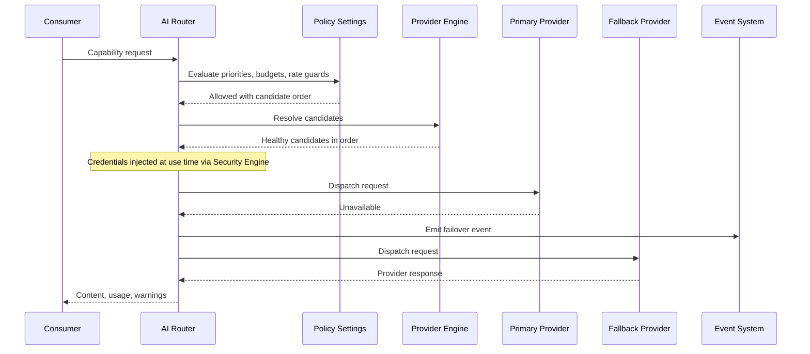

# 039 – AI Router

**Document ID:** DEVOS-SPEC-039

**Version:** 0.1

**Status:** Draft

**Category:** Core Architecture

**Depends On:**

- DEVOS-SPEC-005 – Guiding Principles
- DEVOS-SPEC-006 – Terminology
- DEVOS-SPEC-011 – Domain Model
- DEVOS-SPEC-013 – Object Lifecycle
- DEVOS-SPEC-014 – State Model
- DEVOS-SPEC-020 – Workspace Specification
- DEVOS-SPEC-024 – Provider Specification
- DEVOS-SPEC-028 – Secret Specification
- DEVOS-SPEC-030 – System Architecture
- DEVOS-SPEC-033 – Provider Engine
- DEVOS-SPEC-036 – Security Engine
- DEVOS-SPEC-037 – Event System

**Referenced By:**

- DEVOS-SPEC-024 – Provider Specification
- DEVOS-SPEC-030 – System Architecture
- DEVOS-SPEC-033 – Provider Engine
- DEVOS-SPEC-038 – Memory Engine
- DEVOS-SPEC-047 – Settings
- DEVOS-SPEC-052 – Provider SDK
- DEVOS-SPEC-071 – AI Agents

---

# Abstract

This document defines the AI Router, the single entry point through which DevOS consumers reach AI capability.

Consumers address abstract capabilities, never vendors, while policy, fallback, budgets, and redaction stay declarative and workspace-owned.

Vendor knowledge is confined to replaceable adapters built on the Provider model defined in DEVOS-SPEC-024.

---

# Purpose

This specification answers the following question:

> **How does DevOS send AI requests to the right provider without coupling the Workspace to any vendor?**

The Router speaks only in capabilities and contracts.

Consumers written once keep working as providers come and go.

---

# Goals

This specification aims to:

- Define the AI Router as the single entry point for AI capability requests.
- Define capability addressing for consumers.
- Define the routing pipeline from request to normalized response.
- Define abstract request and response models normalized behind adapters.
- Define fallback chains with transparent failover.
- Define declarative cost and budget guards with explicit signals.
- Guarantee offline operation and redaction before observation.

---

# Non Goals

This specification does not define:

- Concrete vendor integrations, endpoints, or wire protocols
- Billing, metering, or invoicing implementations
- Agent reasoning and tool-use loops, which belong to DEVOS-SPEC-071

---

# Role and Responsibilities

DEVOS-SPEC-030 organizes DevOS into Interfaces, Engines, and Platform Services.

The AI Router belongs to the engine layer and is consumed by interface surfaces such as the CLI and Dashboard, by plugins, and by future agents.

It delegates candidate discovery to the Provider Engine in DEVOS-SPEC-033, reads policy from Settings in DEVOS-SPEC-047, observes through Logging in DEVOS-SPEC-049 and the Event System in DEVOS-SPEC-037, and cooperates with the Security Engine in DEVOS-SPEC-036.

No consumer MAY contact providers directly for AI capability.

The AI Router MUST:

- accept capability requests from every consumer surface.
- evaluate declarative policy before any dispatch.
- select candidates through the Provider Engine only.
- normalize responses behind stable contracts.
- enforce budgets and rate guards with explicit signals.
- inject credentials at use time only.
- emit routing events for every observable outcome.

---

# Definition and Capability Addressing

The AI Router is the single entry point for AI capability requests inside a Workspace.

It owns policy application, candidate ordering, failover, normalization, and guard enforcement, while providers, credentials, and memory remain owned elsewhere.

Consumers address capabilities, not vendors.

A capability is an abstract operation the Router can fulfill through one or more Providers, and illustrative verbs include summarize, generate, and embed.

These verbs are examples only and form an open set extended through the specification RFC process.

Consumer APIs MUST NOT encode vendor names, model names, or endpoint shapes, and two providers declaring the same capability MUST be interchangeable.

Every request traverses one ordered pipeline: Request → Policy Evaluation → Candidate Selection → Dispatch → Response Normalization → Consumer.

Pipeline stages are observable, and a rejected request exits early with an explicit reason and never reaches a provider.

---

# Policy and Candidate Selection

Policy comes from declarative Settings defined in DEVOS-SPEC-047.

Workspaces declare priority lists of preferred providers per capability, spend ceilings and budgets, rate guards limiting request bursts, and constraints such as locality preference for offline operation.

Policy evaluation MUST precede any dispatch, and denied requests MUST surface an explicit machine-readable reason recorded as an event per DEVOS-SPEC-037.

Guards accumulate usage metrics from responses, and an exceeded budget forces denial or downgrade to a cheaper capability path with an explicit signal; silent degradation MUST NOT happen.

Candidate selection is delegated to the Provider Engine defined in DEVOS-SPEC-033, which resolves Providers declaring the requested capability and reports their health states from DEVOS-SPEC-014.

The Router orders candidates using workspace policy.

Providers reporting Unavailable, AuthRequired, Failed, or Disabled are skipped for immediate dispatch but inform fallback planning.

---

# Normalized Models

The Router accepts and returns abstract shapes regardless of provider.

A request MUST have:

| Field       | Required | Description                                           |
| ----------- | -------- | ----------------------------------------------------- |
| capability  | Yes      | The abstract capability being requested.              |
| context     | Yes      | References to prompt and context inputs.              |
| options     | No       | Declarative options such as output shape or language. |
| constraints | No       | Budget, timeout, streaming, and privacy constraints.  |

Context references MAY point to Memory Engine entries defined in DEVOS-SPEC-038, and requests MUST NOT embed raw credentials.

A response returns:

| Field    | Required | Description                                     |
| -------- | -------- | ----------------------------------------------- |
| content  | Yes      | Normalized response content.                    |
| usage    | Yes      | Usage metrics reported by the Provider.         |
| provider | Yes      | Identifier of the fulfilling Provider.          |
| warnings | No       | Degradation notices and partial-result markers. |

Vendor-specific payloads are normalized behind adapters implemented through the Provider SDK defined in DEVOS-SPEC-052.

Adapter faults MUST surface as provider failures, never as corrupted normalized responses, and adding a vendor MUST NOT change consumer APIs or Workspace structure per DEVOS-SPEC-024.

Streaming is supported conceptually: progressive responses deliver clearly marked partial results followed by a final response.

Partial results MUST be distinguishable from complete ones, cancellation MUST propagate downstream, and streaming failures follow normal failover rules.

---

# Fallback Chains

Each capability MAY declare an ordered list of preferred providers, and the Router attempts candidates in order, failing over automatically when a provider reports Unavailable or Failed.

Every failover attempt MUST be emitted as an event through DEVOS-SPEC-037 and MUST NOT be hidden from consumers.

Final responses identify the fulfilling provider, and failure responses summarize exhausted candidates.

---

# Secrets, Redaction, and Memory

Provider credentials live only as Secret references per DEVOS-SPEC-024 and DEVOS-SPEC-028.

Credentials are injected at use time through the Security Engine defined in DEVOS-SPEC-036.

Resolved credential values MUST NEVER appear in logs, events, diagnostics, or persistence.

Prompts and responses MUST pass redaction before any observation or logging, reusing the service applied to logs in DEVOS-SPEC-049.

The Router MUST NOT persist prompt content except as derived, user-visible knowledge explicitly stored by the Memory Engine under the provenance rules of DEVOS-SPEC-038.

The Router MAY query memory for context augmentation, and memory unavailability MUST degrade assistance quality only, never request validity.

---

# Offline Behavior

Locally installed providers are first-class citizens.

Example local runtimes include Ollama-class local model servers, named as illustration only and implying no endorsement, following the Provider Agnostic principle (Rule 4).

The Router itself MUST operate with no network connection.

Local dispatch, policy evaluation, failover among local providers, and budget guards MUST all function offline, while remote providers extend reach without becoming prerequisites.

---

# Request States

Request tracking is request-scoped bookkeeping and is distinct from the object lifecycle states defined in DEVOS-SPEC-014.

| State      | Meaning                                      |
| ---------- | -------------------------------------------- |
| Pending    | Accepted, awaiting policy evaluation.        |
| Dispatched | Sent to a selected Provider.                 |
| Succeeded  | Normalized response delivered.               |
| Failed     | Rejected by policy or candidates exhausted.  |

Request states MUST NOT leak into Workspace object state.

---

# Request Flow

One diagram shows the happy path plus the failover path together.

---

# Design Decisions

| Decision              | Choice                                       | Rationale                                          |
| --------------------- | -------------------------------------------- | -------------------------------------------------- |
| Capability addressing | Consumers bind to capabilities, not vendors  | Keeps consumer APIs free of vendor coupling.       |
| Adapter normalization | Dialects translated behind SDK adapters      | Confines vendor differences to replaceable units.  |
| Policy separation     | Routing rules live in declarative Settings   | Workspaces tune behavior without code changes.     |
| Transparent failover  | Attempts surfaced as events                  | Keeps routing observable and auditable.            |
| Use-time secrets      | Credentials injected through Security Engine | Prevents credential leakage into configs and logs. |

---

# Invariants

The following invariants MUST always hold:

- Consumer APIs MUST NOT couple to any vendor.
- All consumer AI traffic MUST flow through the Router and address capabilities only.
- Policy evaluation MUST precede dispatch.
- Failover MUST be automatic yet visible as events.
- Budget exhaustion MUST produce an explicit signal, never silence.
- Prompts and responses MUST be redacted before observation.
- Resolved credential values MUST NEVER be logged or persisted.
- Prompt content MUST NOT persist outside Memory Engine derived entries.
- Router operation MUST NOT require network connectivity.

---

# Security and Performance

The AI Router MUST:

- resolve credentials exclusively through Secret references per DEVOS-SPEC-028 via DEVOS-SPEC-036.
- redact prompts and responses before logging per DEVOS-SPEC-028 and DEVOS-SPEC-049.
- keep resolved secrets out of events, diagnostics, and persistence.
- enforce budgets and rate guards before dispatch.
- record denials, downgrades, and failovers as auditable events.
- refuse direct provider access that bypasses declared policy.

Detailed security behavior is defined in DEVOS-SPEC-036.

The Router sits on the interactive path of AI-assisted features, so overhead between policy approval and dispatch SHOULD stay minimal.

The Router itself MUST run without any network access per the Offline First principle (Rule 7), and local provider dispatch MUST complete fully offline.

Unreachable remote candidates SHOULD fail over promptly rather than stall the chain, streaming SHOULD deliver the first partial result immediately, and guard evaluation MUST NOT become the pipeline bottleneck.

---

# Future Extensions

Future AI Router specifications may add support for:

- multi-model orchestration across several providers per request
- agent tool-use loops built on DEVOS-SPEC-071
- semantic caching of equivalent requests
- negotiated capability discovery per DEVOS-SPEC-024
- cross-Workspace routing federation

These features MUST NOT break capability addressing or vendor neutrality without an ADR.

---

# References

- DEVOS-SPEC-005 – Guiding Principles
- DEVOS-SPEC-006 – Terminology
- DEVOS-SPEC-011 – Domain Model
- DEVOS-SPEC-013 – Object Lifecycle
- DEVOS-SPEC-014 – State Model
- DEVOS-SPEC-020 – Workspace Specification
- DEVOS-SPEC-024 – Provider Specification
- DEVOS-SPEC-028 – Secret Specification
- DEVOS-SPEC-030 – System Architecture
- DEVOS-SPEC-033 – Provider Engine
- DEVOS-SPEC-036 – Security Engine
- DEVOS-SPEC-037 – Event System
- DEVOS-SPEC-038 – Memory Engine
- DEVOS-SPEC-047 – Settings
- DEVOS-SPEC-049 – Logging
- DEVOS-SPEC-052 – Provider SDK
- DEVOS-SPEC-071 – AI Agents

---

# Revision History

| Version | Date | Author             | Notes         |
| ------- | ---- | ------------------ | ------------- |
| 0.1     | TBD  | DevOS Contributors | Initial Draft |
