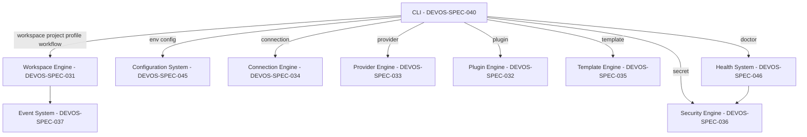

# 040 – CLI

**Document ID:** DEVOS-SPEC-040

**Version:** 0.1

**Status:** Draft

**Category:** Platform

**Depends On:**

- DEVOS-SPEC-005 – Guiding Principles
- DEVOS-SPEC-006 – Terminology
- DEVOS-SPEC-007 – Scope
- DEVOS-SPEC-014 – State Model
- DEVOS-SPEC-020 – Workspace Specification
- DEVOS-SPEC-029 – Workspace Manifest
- DEVOS-SPEC-030 – System Architecture
- DEVOS-SPEC-031 – Workspace Engine

**Referenced By:**

- DEVOS-SPEC-041 – Dashboard
- DEVOS-SPEC-042 – Project Import
- DEVOS-SPEC-044 – Workspace Lifecycle
- DEVOS-SPEC-046 – Health System
- DEVOS-SPEC-058 – CLI API

---

# Abstract

This document defines the DevOS Command-Line Interface, the primary textual interface and automation surface of the platform.

It specifies what the CLI must make possible, the behavioral principles every command must honor, and the guarantees the CLI owes to scripts and to humans.

The CLI is a thin interface-layer component in the architecture of DEVOS-SPEC-030; it owns presentation and invocation only and delegates every business operation to the engines.

The exact command syntax, flags, and output envelope are owned by DEVOS-SPEC-058; this document owns the behavioral contract that DEVOS-SPEC-058 elaborates.

---

# Purpose

This specification answers the following question:

> **What must the command-line interface make possible, and what does it guarantee to scripts and humans?**

The CLI is the first interface most developers meet and the surface automation trusts most, so its value comes from predictability under identical conditions.

---

# Goals

This specification aims to:

- Define the role of the CLI as a thin layer over the engines.
- Define the design principles that govern every command.
- Define the conceptual command groups without fixing concrete syntax.
- Define output modes and the exit code contract shared with automation.
- Define interaction, secret-safety, help, configuration, and update behavior.

---

# Non Goals

This specification does not define:

- Concrete command names, flag spellings, or grammar, owned by DEVOS-SPEC-058
- Output envelope schemas or serialization details, owned by DEVOS-SPEC-058
- Dashboard screens or visual interaction, owned by DEVOS-SPEC-041
- Engine internals of any kind
- Shell completion contracts, deferred to Future Extensions

---

# Role in the Architecture

DEVOS-SPEC-030 organizes DevOS into Interfaces, Engines, and Platform Services.

The CLI belongs to the Interface layer alongside the Dashboard defined in DEVOS-SPEC-041.

The CLI MUST NOT contain normative business logic; every workspace operation, health evaluation, resolution decision, and secret action is performed by an engine.

Where DEVOS-SPEC-044 defines lifecycle operations, the CLI exposes them verbatim and adds no local preconditions of its own.

Any rule a user can observe through the CLI MUST be traceable to an engine or platform-service specification rather than to the CLI itself.

---

# Design Principles

Every command MUST satisfy all five principles below.

| Principle   | Normative Requirement                                                                 |
| ----------- | ------------------------------------------------------------------------------------- |
| Scriptable  | A non-interactive run MUST complete without a TTY and never block on human input.      |
| Composable  | Commands MUST read stdin and write stdout in ways that support ordinary piping.        |
| Predictable | Output ordering MUST be deterministic for identical input state.                       |
| Honest      | Failures MUST surface stable reason codes and explanations instead of being swallowed. |
| Offline     | Core commands MUST work without network connectivity, honoring Offline First (Rule 7). |

Predictable ordering means list-style output follows one declared order per command, chosen by DEVOS-SPEC-058.

Honest errors mean the CLI never converts a failure into silent success, an empty result, or a generic message without a reason code.

---

# Command Groups

The CLI organizes its capabilities into conceptual groups whose concrete verbs, aliases, and syntax belong to DEVOS-SPEC-058.

| Group      | Purpose                                              | Representative Operations (illustrative verbs)            |
| ---------- | ---------------------------------------------------- | --------------------------------------------------------- |
| workspace  | Manage Workspaces per DEVOS-SPEC-044.                | init, import, export, validate, activate, archive, delete |
| project    | Manage the single Project owned by each Workspace.   | show, set                                                 |
| profile    | Manage Profiles and their selection.                 | add, switch, default                                      |
| env        | Inspect and manage Environment configuration values. | get, set, list                                            |
| connection | Manage Connections to external systems.              | add, test, list                                           |
| provider   | Manage Providers, including AI providers.            | add, list, status                                         |
| plugin     | Manage Plugins across their lifecycle.               | install, enable, disable, update, list                    |
| template   | Discover Templates and create from them.             | list, new                                                 |
| secret     | Manage Secret references and rotation.               | set, rotate, list                                         |
| workflow   | Run and observe Workflows.                           | run, status, list                                         |
| doctor     | Produce the health answer of DEVOS-SPEC-046.         | run health evaluation                                     |
| config     | Show effective configuration with provenance.        | get                                                       |

Group boundaries follow domain ownership rather than convenience.

The env and config groups answer exclusively through the layered stack defined in DEVOS-SPEC-045, including which layer decided each effective value.

The doctor group is a pure consumer of the Health System defined in DEVOS-SPEC-046 and MUST NOT recompute aggregation locally.

The secret group operates on references and operations as fixed by DEVOS-SPEC-028 and executes through the Security Engine defined in DEVOS-SPEC-036.

---

# Output Modes

Human mode presents tables, colors, and progress indications tuned for interactive terminals.

Machine mode, selected by an option such as `--format json`, emits stable structured output designed for scripts and tools.

Machine mode MUST use the response envelope owned by DEVOS-SPEC-058, whose canonical shape distinguishes success results from error results, conceptually `{result | error}`.

Colors and decorative formatting MUST be disabled automatically when stdout is not attached to a terminal.

Progress indications MAY appear in human mode but MUST NOT interleave with machine-mode payload output.

---

# Exit Code Contract

The CLI communicates outcome class to automation primarily through exit codes.

| Exit Code | Meaning            | Typical Trigger                                              |
| --------- | ------------------ | ------------------------------------------------------------ |
| 0         | Success            | The requested operation completed as asked.                   |
| 1         | Runtime error      | An operation failed during execution, such as a probe error.  |
| 2         | Usage error        | The invocation was malformed or referenced unknown syntax.    |
| 3         | Validation failed  | Validation produced blocking findings, per DEVOS-SPEC-029.    |
| 4         | State conflict     | A mutating request met Busy, per DEVOS-SPEC-044.              |
| 5         | Permission denied  | Permission evaluation refused the action.                     |
| 6         | Dependency missing | A required engine, plugin, or external tool is unavailable.   |

This table is the summary contract; the canonical enumeration, including sub-codes and envelope fields, is owned by DEVOS-SPEC-058.

Implementations MUST keep these classes stable because continuous-integration gates depend on them, including the doctor gate described in DEVOS-SPEC-046.

---

# Interactive Fallback

Prompts are permitted ONLY in interactive sessions where a TTY is available.

In non-interactive mode, a command that would prompt MUST auto-decline the pending choice and fail with a clear reason code explaining which decision was missing.

Auto-decline MUST also name the flag, file edit, or other non-interactive path that would have supplied the decision.

Interactive sessions MAY offer wizards, but every wizard step MUST have a documented non-interactive equivalent.

---

# Secret Safety UX

Secret handling follows the absolute rules of DEVOS-SPEC-028 without exception.

Secret commands mask values by default in every mode, human and machine.

Revealing a secret value REQUIRES an explicit opt-in flag on the specific command plus an explicit confirmation step.

Copy-to-clipboard and reveal flows conceptually emit audit events so exposure moments remain attributable, feeding the audit direction of DEVOS-SPEC-065.

Secret values MUST NEVER appear in command output, error messages, help text, log sinks governed by DEVOS-SPEC-049, or completion candidates.

Redaction of anything the CLI prints remains the responsibility of the Security Engine defined in DEVOS-SPEC-036; the CLI MUST NOT implement substitute redaction.

---

# Help System

Every command and group MUST respond to a help request, conventionally `--help`, without requiring a Workspace to exist.

Command help MUST include at least one example block showing a realistic invocation.

Error messages MUST include a suggested next action, aligning with the report philosophy of DEVOS-SPEC-046 in which every finding names a concrete next step.

Help text MUST describe output modes and exit codes relevant to the command so script authors can self-serve.

---

# Configuration Respect

The CLI reads all layered configuration through the system defined in DEVOS-SPEC-045 and honors the user preferences defined in DEVOS-SPEC-047.

Telemetry remains disabled by default at every scope, and the CLI participates in no telemetry transmission while that default holds, restating the normative stance of DEVOS-SPEC-047.

Settings changes made through other surfaces MUST be honored by subsequent invocations without restarts, except where a schema entry explicitly declares restart required.

Unknown settings keys are treated exactly as DEVOS-SPEC-047 directs: warn and continue.

Version and update commands surface the channel model defined in DEVOS-SPEC-048, displaying channels and versions but NEVER downloading or applying updates without explicit consent gates.

Absent connectivity degrades gracefully to a clear informational state rather than failing commands, honoring Offline First.

---

# Delegation Map

No business logic originates inside the CLI itself; every group delegates downward through the layering rule of DEVOS-SPEC-030.

Lifecycle events shown above are emitted by engines, never synthesized by the CLI.

---

# CLI Invariants

The following invariants MUST always hold.

- The CLI implements no normative business logic of its own.
- Non-interactive invocations always complete without a TTY.
- Prompts never occur outside interactive sessions.
- Identical input state yields deterministic output ordering.
- Exit codes match this summary contract, canonically fixed by DEVOS-SPEC-058.
- Machine-mode output always uses the stable envelope owned by DEVOS-SPEC-058.
- Secret values are masked by default everywhere, per DEVOS-SPEC-028.
- Revealing secrets requires an explicit flag plus confirmation and is auditable.
- All configuration and settings questions resolve through DEVOS-SPEC-045 and DEVOS-SPEC-047.
- Core commands work fully offline.

---

# Error Handling Requirements

Failures MUST report four things: what failed, the stable reason code, the object involved when applicable, and a suggested next action.

Reason codes MUST be stable identifiers suitable for scripting, with their registry owned by DEVOS-SPEC-058.

The CLI MUST map the error classes of DEVOS-SPEC-044 onto its exit-code contract, including state-conflict to code 4.

Validation findings are presented with their attributed objects and clauses, as produced by the DEVOS-SPEC-029 pipeline.

Errors MUST NEVER include secret values, tokens, or credential material, per DEVOS-SPEC-028 and the redaction discipline of DEVOS-SPEC-036.

---

# Future Extensions

Future specifications may add support for:

- Shell completion contracts with deterministic candidate ordering
- A full terminal user interface mode
- Interactive watch modes for events and workflows

These extensions MUST preserve scriptability, the thin-layer rule, and the exit-code stability that automation depends on.

Shell completions remain explicitly out of contract for Version 0.1.

---

# References

- DEVOS-SPEC-005 – Guiding Principles
- DEVOS-SPEC-006 – Terminology
- DEVOS-SPEC-007 – Scope
- DEVOS-SPEC-014 – State Model
- DEVOS-SPEC-020 – Workspace Specification
- DEVOS-SPEC-028 – Secret Specification
- DEVOS-SPEC-029 – Workspace Manifest
- DEVOS-SPEC-030 – System Architecture
- DEVOS-SPEC-031 – Workspace Engine
- DEVOS-SPEC-036 – Security Engine
- DEVOS-SPEC-037 – Event System
- DEVOS-SPEC-041 – Dashboard
- DEVOS-SPEC-042 – Project Import
- DEVOS-SPEC-044 – Workspace Lifecycle
- DEVOS-SPEC-045 – Configuration System
- DEVOS-SPEC-046 – Health System
- DEVOS-SPEC-047 – Settings
- DEVOS-SPEC-048 – Update System
- DEVOS-SPEC-049 – Logging
- DEVOS-SPEC-058 – CLI API
- SPECIFICATION_RULES.md – Repository rule set (Rules 7 and 8)

---

# Revision History

| Version | Date | Author             | Notes         |
| ------- | ---- | ------------------ | ------------- |
| 0.1     | TBD  | DevOS Contributors | Initial Draft |
