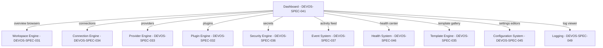

# 041 – Dashboard

**Document ID:** DEVOS-SPEC-041

**Version:** 0.1

**Status:** Draft

**Category:** Platform

**Depends On:**

- DEVOS-SPEC-005 – Guiding Principles
- DEVOS-SPEC-006 – Terminology
- DEVOS-SPEC-007 – Scope
- DEVOS-SPEC-014 – State Model
- DEVOS-SPEC-020 – Workspace Specification
- DEVOS-SPEC-028 – Secret Specification
- DEVOS-SPEC-030 – System Architecture
- DEVOS-SPEC-037 – Event System
- DEVOS-SPEC-044 – Workspace Lifecycle
- DEVOS-SPEC-046 – Health System
- DEVOS-SPEC-047 – Settings

**Referenced By:**

- DEVOS-SPEC-026 – Plugin Specification
- DEVOS-SPEC-030 – System Architecture
- DEVOS-SPEC-032 – Plugin Engine
- DEVOS-SPEC-073 – Desktop Platform
- DEVOS-SPEC-074 – Web Platform

---

# Abstract

This document defines the DevOS Dashboard, the local visual management surface of the platform.

It specifies which surfaces the Dashboard provides, the parity it owes to the CLI defined in DEVOS-SPEC-040, and the lines it can never cross.

The Dashboard is a thin interface-layer component in the architecture of DEVOS-SPEC-030; it owns presentation only, delegates every business operation to the engines, and writes declarative files on disk with no hidden store of truth.

---

# Purpose

This specification answers the following question:

> **What does the local visual interface manage, and what lines can it never cross?**

The Dashboard gives developers a visual answer to the same questions the CLI answers textually: what exists, what state it is in, what changed, and what needs attention.

Its power is bounded by the platform rules: it edits files, never shadow state, and it exposes operations rather than inventing them.

---

# Goals

This specification aims to:

- Define the role of the Dashboard as a visual interface over shared engine APIs.
- Define the parity principle between the Dashboard and the CLI.
- Define the catalog of Version 0.1 surfaces.
- Define configuration-as-code discipline for every edit.
- Define secret handling, dangerous-operation confirmation, and plugin extension behavior.
- Define event-driven refresh and accessibility expectations.

---

# Non Goals

This specification does not define:

- Concrete screen layouts, visual design systems, or widget libraries
- A code editor capability, excluded by DEVOS-SPEC-008
- Prompt-first or chat-first AI interaction surfaces; AI features route through the AI Router defined in DEVOS-SPEC-039 with UX specifics deferred
- Engine internals or aggregation logic of any kind
- Hosted or multi-user dashboard products, deferred to DEVOS-SPEC-073 and DEVOS-SPEC-074
- Marketplace transaction flows, deferred to DEVOS-SPEC-070

---

# Role and Parity Principle

DEVOS-SPEC-030 organizes DevOS into Interfaces, Engines, and Platform Services.

The Dashboard belongs to the Interface layer alongside the CLI defined in DEVOS-SPEC-040.

Both interfaces consume the same engine APIs, honor the lifecycle operations fixed by DEVOS-SPEC-044, and render the same reports produced by DEVOS-SPEC-046.

PARITY PRINCIPLE: any operation available through one interface SHOULD be available through the other.

Where an operation is deliberately absent from one interface, that absence MUST be documented as part of that interface's specification rather than left as silent asymmetry.

Neither interface MAY add local preconditions, side effects, or validation that engines do not define.

---

# Local First

The Dashboard binds locally by default and requires no cloud account, honoring Offline First (Rule 7); all Version 0.1 functionality operates against local Workspaces, files, and services.

Remote, hosted, and collaborative variants are distinct future platforms pointed at DEVOS-SPEC-073, DEVOS-SPEC-074, and DEVOS-SPEC-076.

Nothing in this document grants the Version 0.1 Dashboard network authority over remote Workspaces.

Absence of connectivity MUST degrade gracefully to fully functional local management rather than blocking the interface.

---

# Surfaces Catalog

Version 0.1 defines the following conceptual surfaces.

| Surface             | Purpose                                                        | Backing Specs                     |
| ------------------- | -------------------------------------------------------------- | --------------------------------- |
| Workspace Overview  | Inspect state and drive lifecycle operations.                  | DEVOS-SPEC-020, DEVOS-SPEC-044    |
| Object Browsers     | Browse profiles, environments, connections, providers, plugins, templates, and masked secrets. | DEVOS-SPEC-020 family, DEVOS-SPEC-028 |
| Activity Feed       | Observe live platform events as they occur.                    | DEVOS-SPEC-037                    |
| Health Center       | View aggregated health and trigger doctor evaluations.         | DEVOS-SPEC-046                    |
| Template Gallery    | Discover Templates and start the instantiate flow.             | DEVOS-SPEC-027, DEVOS-SPEC-035    |
| Settings Editors    | Edit preferences as declarative files.                         | DEVOS-SPEC-047                    |
| Log Viewer          | Stream and filter redacted log records.                        | DEVOS-SPEC-049                    |

Lifecycle actions offered by the Workspace Overview are exactly the operations cataloged by DEVOS-SPEC-044, including their guards and Busy signaling.

The Health Center displays the canonical report shape of DEVOS-SPEC-046 and MAY trigger on-demand evaluations but never scheduled ones without consent recorded through DEVOS-SPEC-047 settings.

The Log Viewer consumes only records already passed through the redaction pipeline of DEVOS-SPEC-049 and offers no bypass.

---

# Configuration-as-Code Discipline

Dashboard edits WRITE manifest and settings files on disk through the storage semantics of DEVOS-SPEC-045 and DEVOS-SPEC-047.

The Dashboard MUST NOT maintain a hidden application database of truth, restating Configuration as Code (Rule 5).

Everything a user changes through the interface MUST be reconstructible from the files alone after closing the application.

External edits to those files MUST be detected and reflected through file-watch refresh, adopting either the previous complete view or the next complete view, never a mixture.

Conflict between an external edit and a pending local edit MUST be surfaced honestly instead of being silently overwritten.

---

# Secret Handling

Secret values are ALWAYS masked in every surface, listing, search result, export preview, and copy affordance.

Reveal requires an explicit per-item action plus confirmation, and each reveal emits an auditable event consistent with the absolute rules of DEVOS-SPEC-028.

Redaction enforcement belongs to the Security Engine defined in DEVOS-SPEC-036; the Dashboard MUST NOT implement substitute redaction.

Search and filter features operate on references and metadata, and screenshots or diagnostics contain masked values only.

---

# Dangerous Operations

Destructive operations include archive, delete, reset, and comparable irreversible actions from the catalog of DEVOS-SPEC-044.

Each destructive operation REQUIRES explicit confirmation that names the object being affected, such as its type and identifier.

Generic confirmations that do not name the object MUST NOT satisfy this requirement.

Bulk destructive operations across multiple objects are PROHIBITED in Version 0.1.

Busy states are surfaced visibly during destructive operations, and blocked operations display the guard failure and suggested next action exactly as engines attribute them.

---

# Plugin Extensions

Plugins MAY contribute Dashboard surfaces exclusively through the contribution points declared in DEVOS-SPEC-026 and managed by DEVOS-SPEC-032.

Contributed surfaces render inside the permission scopes granted to the contributing plugin, MUST NOT exceed them, and carry provenance identifying the contributing plugin per DEVOS-SPEC-032.

Disabling or deleting a plugin withdraws its contributed surfaces atomically.

Contributed surfaces obey the same secret-handling and dangerous-operation rules as built-in surfaces; plugin contribution grants no exemption.

---

# Event-Driven UI

The Dashboard subscribes to platform events through the Event System defined in DEVOS-SPEC-037.

State changes, lifecycle transitions, settings changes, and health updates arrive as events and drive incremental view refresh.

Delivery follows the tier model of DEVOS-SPEC-037: ephemeral-tier events MAY be shed under load without breaking correctness, while durable-tier recording is preserved by the bus.

When an ephemeral update is missed, the Dashboard reconciles by re-reading current state from the owning engine rather than guessing.

Correlation identifiers from event envelopes join related activity-feed entries into one visible narrative, matching the correlation discipline of DEVOS-SPEC-049.

---

# Accessibility and Internationalization

Accessibility is a requirement-level concern, not a future enhancement.

Every interactive element MUST be reachable and operable by keyboard navigation alone.

Every meaningful control carries screen-reader labels derived from the same stable names used in help and reports.

Themes are supported through the appearance settings of DEVOS-SPEC-047, and color is NEVER the sole carrier of state meaning.

These requirements apply equally to plugin-contributed surfaces rendered inside declared scopes.

---

# Surface Delegation Map

No business logic originates inside the Dashboard itself; surfaces delegate downward through the layering rule of DEVOS-SPEC-030.

All delegations follow one direction: interfaces ask, engines answer, interfaces present.

---

# Dashboard Invariants

The following invariants MUST always hold.

- The Dashboard implements no normative business logic of its own.
- Every operation honors the parity principle toward the CLI.
- Edits always land as declarative files on disk, and no hidden database of truth ever exists.
- Secret values are masked everywhere unless explicitly revealed per item with audit.
- Destructive operations always name their object in confirmation.
- Bulk destructive operations do not exist in Version 0.1.
- Plugin surfaces render only within granted permission scopes with visible provenance.
- Missed ephemeral events reconcile through engine re-reads, never guesses.
- Every interactive element is keyboard operable and screen-reader labeled.
- Core functionality works offline with no cloud account.

---

# Security Requirements

The Dashboard obeys Security by Default (Rule 8) in every surface.

If an implementation exposes a local API for its own use, that API MUST require a local authentication token scoped to the local user session.

Any embedded local server remains CSRF-safe; concrete transport mechanics stay abstract here and belong to implementation guidance and DEVOS-SPEC-055.

Permission evaluation, secret custody, and redaction belong exclusively to the Security Engine defined in DEVOS-SPEC-036, and plugin surfaces execute under the isolation enforced by DEVOS-SPEC-032.

Audit-relevant interactions flow as engine-emitted events feeding the audit direction of DEVOS-SPEC-065, while who may perform which operation is governed beginning at DEVOS-SPEC-062.

---

# Performance Requirements

Cold start SHOULD feel immediate, with budgets stated at statement level here and concretized by implementation guidance.

Long lists, such as activity feeds and logs, SHOULD be virtualized so scroll performance stays independent of history length.

Updates SHOULD be incremental, reserving full re-renders for reconciliation after missed ephemeral events, and rapid successive external file edits SHOULD coalesce into single view updates.

---

# Future Extensions

Future specifications may extend the Dashboard through:

- The desktop shell platform defined in DEVOS-SPEC-073
- The web platform defined in DEVOS-SPEC-074, with hosted identity concerns
- Cloud-connected workspaces coordinated by DEVOS-SPEC-076
- Browsing and installing from marketplaces defined in DEVOS-SPEC-070
- Richer AI-assisted views routed through the AI Router of DEVOS-SPEC-039

These extensions MUST preserve parity with the CLI, configuration-as-code discipline, and the local-first default unless an ADR changes them.

---

# References

- DEVOS-SPEC-008 – Non Goals
- DEVOS-SPEC-014 – State Model
- DEVOS-SPEC-020 – Workspace Specification
- DEVOS-SPEC-026 – Plugin Specification
- DEVOS-SPEC-027 – Template Specification
- DEVOS-SPEC-028 – Secret Specification
- DEVOS-SPEC-030 – System Architecture
- DEVOS-SPEC-031 – Workspace Engine
- DEVOS-SPEC-032 – Plugin Engine
- DEVOS-SPEC-035 – Template Engine
- DEVOS-SPEC-036 – Security Engine
- DEVOS-SPEC-037 – Event System
- DEVOS-SPEC-039 – AI Router
- DEVOS-SPEC-040 – CLI
- DEVOS-SPEC-044 – Workspace Lifecycle
- DEVOS-SPEC-045 – Configuration System
- DEVOS-SPEC-046 – Health System
- DEVOS-SPEC-047 – Settings
- DEVOS-SPEC-049 – Logging
- DEVOS-SPEC-055 – API Specification
- DEVOS-SPEC-062 – RBAC
- DEVOS-SPEC-065 – Audit System
- DEVOS-SPEC-070 – Marketplace
- DEVOS-SPEC-073 – Desktop Platform
- DEVOS-SPEC-074 – Web Platform
- DEVOS-SPEC-076 – Cloud Platform
- SPECIFICATION_RULES.md – Repository rule set (Rules 2, 5, 7, and 8)

---

# Revision History

| Version | Date | Author             | Notes         |
| ------- | ---- | ------------------ | ------------- |
| 0.1     | TBD  | DevOS Contributors | Initial Draft |
