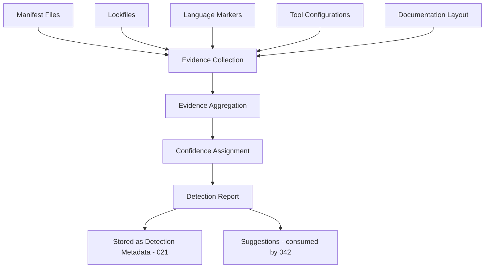
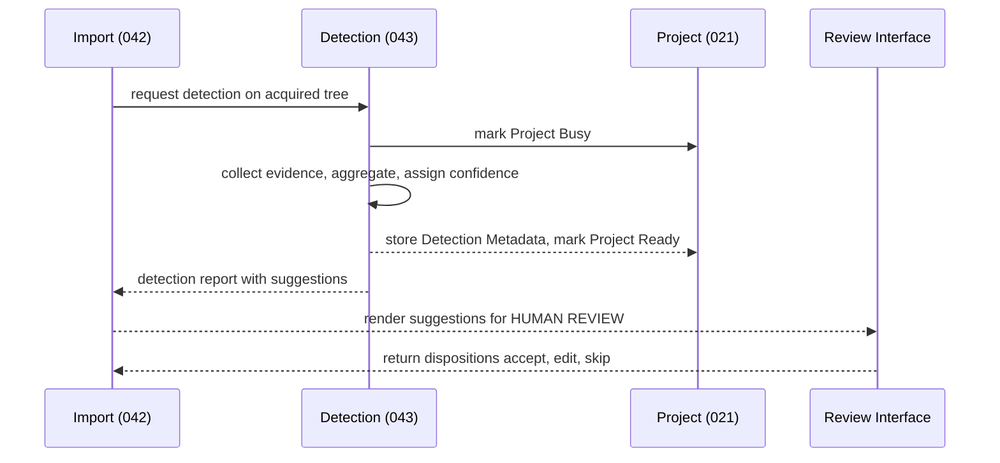

# 043 – Project Detection

**Document ID:** DEVOS-SPEC-043

**Version:** 0.1

**Status:** Draft

**Category:** Platform

**Depends On:**

- DEVOS-SPEC-005 – Guiding Principles
- DEVOS-SPEC-006 – Terminology
- DEVOS-SPEC-014 – State Model
- DEVOS-SPEC-020 – Workspace Specification
- DEVOS-SPEC-021 – Project Specification
- DEVOS-SPEC-026 – Plugin Specification
- DEVOS-SPEC-030 – System Architecture
- DEVOS-SPEC-037 – Event System

**Referenced By:**

- DEVOS-SPEC-021 – Project Specification
- DEVOS-SPEC-026 – Plugin Specification
- DEVOS-SPEC-035 – Template Engine
- DEVOS-SPEC-042 – Project Import

---

# Abstract

This document defines Project Detection, the read-only analysis that answers one question about a project tree: what is this?

Detection reads files locally, aggregates evidence across signal categories, assigns confidence, and emits a report of Detection Metadata plus Suggestions.

It never executes anything and never reaches the network; its report is consumed by Project Import per DEVOS-SPEC-042 and stored on the Project as metadata per DEVOS-SPEC-021.

---

# Purpose

This specification answers the following question:

> **How does DevOS figure out what kind of project it is looking at — safely, offline, and without ever acting on its own?**

Detection reads only, decides probabilistically, and proposes without commanding; its output is advisory by definition and always requires human disposition downstream.

---

# Goals

This specification aims to:

- Define detection as read-only analysis with advisory output.
- Define abstract signal categories without product mandates.
- Define the confidence model, suggestions shape, and determinism requirements.
- Define privacy, safety, pluggable detector, and override persistence rules.
- Define state integration and performance bounds.

---

# Non Goals

This specification does not define:

- Import orchestration, owned by DEVOS-SPEC-042.
- Manifest generation or validation, owned by DEVOS-SPEC-029 and DEVOS-SPEC-031.
- Plugin permission mechanics beyond detector contributions, owned by DEVOS-SPEC-026.
- Dependency vulnerability scanning or remote registry lookups in Version 0.1.
- Language support matrices or ecosystem coverage guarantees.

---

# Definition

Detection is READ-ONLY analysis of one acquired project tree producing DETECTION METADATA plus SUGGESTIONS.

Detection Metadata describes what was observed: signals found, evidence collected, confidence assigned.

Suggestions describe what could be done: proposed names, Profiles, Connections, and Templates for human review.

Suggestions are advisory data and MUST NOT trigger any domain mutation by themselves.

Consumers are Project Import per DEVOS-SPEC-042 during onboarding and the Project itself per DEVOS-SPEC-021 as stored optional metadata.

---

# Signal Categories

Detectors gather evidence from abstract signal categories; no specific file format is mandated.

| Signal Category      | Examples (illustrative)                                        | Weight Class |
| -------------------- | -------------------------------------------------------------- | ------------ |
| Manifest Files       | Project descriptors declaring name, version, dependencies.     | Primary      |
| Lockfiles            | Resolved dependency trees pinning exact versions.              | Primary      |
| Language Markers     | Source file extensions, language configuration markers.        | Secondary    |
| Tool Configurations  | Linters, formatters, container descriptions.                   | Secondary    |
| Documentation Layout | Documentation directories and top-level descriptive documents. | Tertiary     |

Primary evidence can establish high confidence alone when internally consistent.

Tertiary evidence alone MUST NOT produce more than Low confidence.

---

# Evidence Aggregation

Signals flow through aggregation into a single report.

Each piece of evidence cites its signal category and source path.

Aggregation combines evidence per candidate interpretation of the tree, and the report records conflicting interpretations alongside winning ones so reviewers see why a suggestion exists.

---

# Confidence Model

Every suggestion carries an aggregate confidence level.

| Level  | Meaning                                                                | Presentation Contract                         |
| ------ | ---------------------------------------------------------------------- | --------------------------------------------- |
| High   | Convergent Primary-class evidence with no significant contradiction.    | Pre-checked suggestion in review interfaces.   |
| Medium | Supporting evidence present but incomplete or partially inconsistent.   | Visible but unchecked suggestion.              |
| Low    | Weak, sparse, or Tertiary-only evidence.                                | Informational display only; never pre-checked. |

Conflicting evidence MUST resolve to the lowest applicable confidence level and MUST attach an explicit conflict note naming the disagreeing signals.

A report containing only Low confidence remains valid output and still enables manual import through DEVOS-SPEC-042.

---

# Suggestions Output

The report exposes suggestions with at least the following fields.

| Field                | Type   | Meaning                                                                      |
| -------------------- | ------ | ---------------------------------------------------------------------------- |
| projectName          | string | Proposed Project name per DEVOS-SPEC-021, derived from observed identity.     |
| languages            | list   | Detected language families relevant to Profile planning.                      |
| suggestedProfiles    | list   | Proposed Profiles per DEVOS-SPEC-022, each with confidence and provenance.    |
| suggestedConnections | list   | Proposed Connections per DEVOS-SPEC-025, each with confidence and provenance. |
| suggestedTemplates   | list   | Proposed Templates per DEVOS-SPEC-027, each with confidence and provenance.   |
| confidence           | enum   | Aggregate High, Medium, or Low level for each suggestion.                     |
| evidence             | list   | Citations pairing each signal with the file path that produced it.            |

Every list entry MUST carry its own confidence and provenance rather than inheriting one report-level value, with wording following DEVOS-SPEC-042: which detector produced the suggestion and at what confidence.

No field above MAY carry a secret value or credential material.

---

# Determinism Requirement

Detection MUST be deterministic.

The same tree snapshot MUST produce an identical report, with ordering normalized so filesystem iteration order never changes output and irrelevant timestamp differences ignored.

This requirement exists because detection feeds tests, diff-based re-import proposals, and reproducible reviews.

Implementations MUST be able to repeat any historical report from a retained snapshot.

---

# Privacy and Safety

The following rules are NORMATIVE.

Detection reads project files LOCALLY and sends NOTHING over the network.

Detection does NOT execute any project code; reading is not running.

Detection MUST respect declared ignore-file conventions conceptually by refusing to descend into ignored directories.

Large binaries MUST be skipped according to a declarative size policy rather than opened wholesale.

Incidentally encountered secret values MUST never appear in Detection Metadata, suggestions, logs, or events, consistent with DEVOS-SPEC-021 and DEVOS-SPEC-028, with redaction enforcement owned by DEVOS-SPEC-036.

---

# Pluggable Detectors

Plugins MAY contribute detectors through the contribution model defined in DEVOS-SPEC-026.

Contributed detectors run under their plugin's permission scope, inheriting the isolation boundaries owned by the Plugin Engine defined in DEVOS-SPEC-032.

Core detectors MUST NOT be shadowed silently; when a contributed detector overlaps a core category, the report MUST show both results with their origins.

Provenance ALWAYS identifies which detector produced which suggestion.

Uninstalling a plugin removes its detectors from future runs without altering persisted history, and detector lifecycle events SHOULD be observable through the Event System defined in DEVOS-SPEC-037.

---

# Override Persistence

Human corrections are first-class configuration: when a user edits or rejects a suggestion, that disposition persists in the manifest as explicit user configuration.

Re-running detection MUST NEVER override explicit user configuration.

Previously decided areas appear as settled context rather than fresh proposals, and only genuinely new signals generate new suggestions.

This implements One Source of Truth from DEVOS-SPEC-005: once a human decides, the manifest is the decision record.

---

# State Integration

While detection runs, the Project reports Busy per DEVOS-SPEC-014.

After success the Project returns to Ready, and on failure it reports Failed with an attributed reason.

Busy is exclusive with mutating operations per the concurrency philosophy of DEVOS-SPEC-044, while read access to stored metadata remains available throughout.

---

# Interaction Sequence

Dispositions flow back into provenance records; the review interaction itself belongs to DEVOS-SPEC-042.

---

# Detection Invariants

The following invariants MUST always hold.

- Detection is strictly read-only against the analyzed tree.
- Detection never executes acquired code and never performs network I/O.
- The same tree snapshot always yields the same report.
- Every suggestion carries provenance and per-suggestion confidence.
- Conflicting evidence lowers confidence and produces a conflict note.
- Detection never overrides explicit user configuration.
- Contributed detectors run inside plugin isolation and cannot silently shadow core detectors.
- Secret values never appear in Detection Metadata, suggestions, logs, or events.

---

# Performance Requirements

Detection MUST operate within a bounded time budget declared by the implementation, degrading gracefully toward lower confidence when the budget is hit rather than hanging or failing silently.

Incremental re-detection on watched trees SHOULD be supported so repeated analyses touch only changed subtrees.

Memory consumption SHOULD stay proportional to indexed evidence rather than total tree size, complementing the streaming acquisition stance of DEVOS-SPEC-042, and budget exhaustion or skips MUST appear in the report as evidence limitations.

---

# Future Extensions

Future specifications may extend Project Detection with:

- ecosystem detector packs distributed through DEVOS-SPEC-077.
- AI-assisted inference routed through DEVOS-SPEC-039, clearly marked experimental until standardized.
- dependency vulnerability scanning as a separate analysis pass.
- remote registry enrichment behind the consent regime of DEVOS-SPEC-042.

Any network-capable extension MUST adopt explicit consent semantics matching DEVOS-SPEC-042.

Any inference extension MUST preserve determinism guarantees by versioning models and recording which engine produced which suggestion.

Extensions require an RFC and ADR, MUST NOT weaken the read-only and offline guarantees of this document, and MUST NOT break the single-Workspace aggregate model of DEVOS-SPEC-011.

---

# References

- DEVOS-SPEC-005 – Guiding Principles
- DEVOS-SPEC-011 – Domain Model
- DEVOS-SPEC-014 – State Model
- DEVOS-SPEC-021 – Project Specification
- DEVOS-SPEC-022 – Profile Specification
- DEVOS-SPEC-025 – Connection Specification
- DEVOS-SPEC-026 – Plugin Specification
- DEVOS-SPEC-027 – Template Specification
- DEVOS-SPEC-028 – Secret Specification
- DEVOS-SPEC-031 – Workspace Engine
- DEVOS-SPEC-032 – Plugin Engine
- DEVOS-SPEC-036 – Security Engine
- DEVOS-SPEC-037 – Event System
- DEVOS-SPEC-039 – AI Router
- DEVOS-SPEC-042 – Project Import
- DEVOS-SPEC-044 – Workspace Lifecycle
- DEVOS-SPEC-077 – Ecosystem

---

# Revision History

| Version | Date | Author             | Notes         |
| ------- | ---- | ------------------ | ------------- |
| 0.1     | TBD  | DevOS Contributors | Initial Draft |
