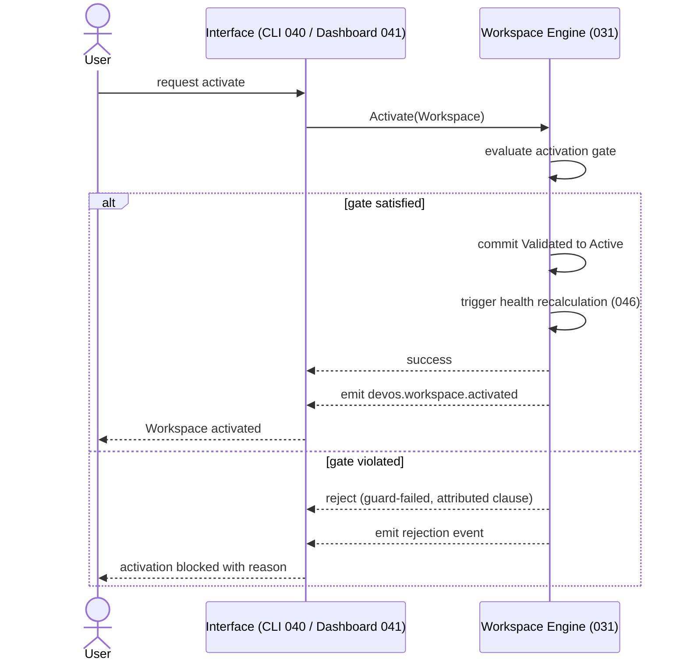

# 044 – Workspace Lifecycle

**Document ID:** DEVOS-SPEC-044

**Version:** 0.1

**Status:** Draft

**Category:** Platform

**Depends On:**

- DEVOS-SPEC-005 – Guiding Principles
- DEVOS-SPEC-006 – Terminology
- DEVOS-SPEC-011 – Domain Model
- DEVOS-SPEC-012 – Domain Relationships
- DEVOS-SPEC-013 – Object Lifecycle
- DEVOS-SPEC-014 – State Model
- DEVOS-SPEC-020 – Workspace Specification
- DEVOS-SPEC-029 – Workspace Manifest
- DEVOS-SPEC-030 – System Architecture
- DEVOS-SPEC-031 – Workspace Engine

**Referenced By:**

- DEVOS-SPEC-020 – Workspace Specification
- DEVOS-SPEC-031 – Workspace Engine
- DEVOS-SPEC-040 – CLI
- DEVOS-SPEC-041 – Dashboard
- DEVOS-SPEC-042 – Project Import
- DEVOS-SPEC-064 – Cloud Sync

---

# Abstract

This document defines the user-facing lifecycle operations that act on a DevOS Workspace.

For each operation it specifies when the operation is permitted, which guards must pass, what the operation guarantees on success, and how failure is reported.

The internal mechanics that execute these operations belong to the Workspace Engine defined in DEVOS-SPEC-031.

This document owns the operational contract; DEVOS-SPEC-031 owns the engine internals.

---

# Purpose

This specification answers the following question:

> **Which workspace operations exist, when is each permitted, and what does each guarantee?**

Every interface that mutates a Workspace MUST expose exactly the operations defined here, with exactly these permission rules and guarantees.

This keeps the CLI, the Dashboard, project import tooling, and future synchronization clients behaviorally identical toward the same Workspace.

---

# Goals

This specification aims to:

- Define the complete catalog of Workspace lifecycle operations.
- Define when each operation is permitted.
- Define the guards and side effects of every transition.
- Define the Workspace concurrency model.
- Define error classes and their meaning for interfaces.

---

# Non Goals

This specification does not define:

- Workspace Engine internals or scheduling strategy
- Manifest syntax or validation algorithms
- Storage formats or persistence mechanisms
- CLI command names or Dashboard screen layouts
- Organization or team ownership
- Restore-from-archive behavior (excluded in v0.1)

---

# Operation Catalog

A Workspace supports exactly the following operations.

| Operation | From → To                              | Key Guarantees                                                                    |
| --------- | -------------------------------------- | --------------------------------------------------------------------------------- |
| Create    | [*] → Created                          | Identity is assigned; the object exists inside exactly one Workspace aggregate.   |
| Configure | Created → Configured                   | Declared configuration is captured and exposed for evaluation; validity is NOT asserted. |
| Validate  | Configured → Validated                 | Domain validation passed; ownership and relationship constraints hold.            |
| Activate  | Validated → Active                     | Activation gate satisfied; the Workspace becomes usable; health is recalculated.  |
| Archive   | Active → Archived                      | Content is retained immutably; the Workspace is excluded from execution.          |
| Delete    | Active → Deleted, Archived → Deleted   | Full cascade over owned objects; secret resolution is permanently cut off.        |
| Export    | Active/Archived → Bundle               | Complete aggregate snapshot; references-not-secrets; source stage unchanged.      |
| Import    | Bundle → Created draft                 | A new Workspace starts at Created; it MUST be validated before it becomes Active. |

Export and Import are aggregate-level operations against a portable Bundle rather than lifecycle stages of a single Workspace.

Import MUST NOT reuse the trust status of the originating Workspace; the imported draft begins unvalidated.

---

# Activation Gate

The activation gate restates the normative rule of DEVOS-SPEC-020.

A Workspace MUST NOT become Active unless:

- it has exactly one Project.
- it has at least one Profile.
- required owned objects are valid.
- ownership rules are satisfied.
- manifest validation succeeds.

Interfaces MUST treat a failed activation gate as a terminal outcome of the Activate operation, not as a retryable warning.

Implementations MUST attribute a rejected activation to the specific unsatisfied clause.

---

# Guards and Side Effects

Every transition carries guards that MUST pass and side effects that MUST occur on success.

Events are emitted through the Event System defined in DEVOS-SPEC-037.

Health recalculation is performed by the Health System defined in DEVOS-SPEC-046.

| Transition            | Guard Requirements                                                     | Success Side Effects                                        |
| --------------------- | ---------------------------------------------------------------------- | ----------------------------------------------------------- |
| Create                | Identity rules of DEVOS-SPEC-013 satisfied.                            | `devos.workspace.created`; health state Unknown.             |
| Configure             | Declared configuration present and attributable to the Workspace.       | `devos.workspace.configured`.                                |
| Validate              | Manifest passes the DEVOS-SPEC-029 pipeline; ownership rules of DEVOS-SPEC-012 hold. | `devos.workspace.validated`.                    |
| Activate              | Full activation gate satisfied.                                         | `devos.workspace.activated`; health recalculated via 046.    |
| Archive               | No other mutating operation is running.                                 | `devos.workspace.archived`; owned objects archived with it.  |
| Delete                | No active dependency blocks deletion.                                   | `devos.workspace.deleted`; cascade executed; secret cutoff.  |
| Export (side process) | Workspace is Active or Archived.                                        | `devos.workspace.exported`; no lifecycle change.             |
| Import (side process) | Bundle is complete and parseable.                                       | `devos.workspace.imported`; new Workspace at Created.        |

During any mutating operation the Workspace reports Busy as defined in DEVOS-SPEC-014.

Side effects MUST be observable only after the transition is durably committed.

---

# Concurrency Model

At most ONE mutating lifecycle operation may run at a time per Workspace.

A second mutating request arriving during an ongoing operation MUST be rejected with the State-conflict error class.

Read operations MUST remain available while a mutating operation runs.

The Busy state defined in DEVOS-SPEC-014 is the authoritative signal that a mutation is in progress.

Interfaces MUST surface Busy to users instead of silently queuing mutations.

This model maps to exit code 4 (state conflict) in the CLI contract of DEVOS-SPEC-040.

---

# Export Contract

Export produces a portable Workspace Bundle.

The Bundle MUST be complete over the aggregate: all owned objects and the references between them are represented.

The Bundle MUST follow references-not-secrets: raw secret values are never written into a Bundle.

Detailed Bundle contents and round-trip guarantees are defined in DEVOS-SPEC-020 and DEVOS-SPEC-029; this document defers to them and does not duplicate them.

---

# Delete and Cascade Ordering

Deleting a Workspace deletes the aggregate boundary.

Cascade proceeds along the ownership graph defined in DEVOS-SPEC-013.

Environments follow their owning Profiles, and Tasks follow their owning Workflows.

Implementations MUST prevent Active references to deleted objects, as required by DEVOS-SPEC-020.

Secret deletion MUST cut off future resolution of deleted secrets, as required by DEVOS-SPEC-028.

The cutoff guarantee is absolute: no later operation may resolve a secret whose owning Workspace has been deleted.

---

# Archive Semantics

Archiving retires a Workspace from normal operation while retaining it completely.

An Archived Workspace MUST remain owned by its Actor.

An Archived Workspace MUST be excluded from execution.

An Archived Workspace MUST be immutable except for lifecycle bookkeeping such as the Delete operation.

Archived Workspaces are retained for audit, rollback reference, and export.

---

# Recovery Position

DevOS v0.1 does NOT define an Archived → Active restore operation.

This exclusion is deliberate and listed as a non goal.

Restore would reintroduce mutable history and undermine the immutability guarantee of the Archived stage.

Restoration remains achievable because restore is equivalent to create-from-export, and create-from-import IS supported.

A user who needs a former Workspace imports its Bundle and obtains a new, independently validated Workspace.

Any true restore operation requires a future ADR and MUST NOT break the single-Workspace aggregate model.

---

# Activation Sequence

The following interaction shows the Activate happy path and the guard rejection path.

---

# Workspace Lifecycle Invariants

The following invariants MUST always hold.

- Every lifecycle transition occurs inside one Workspace aggregate.
- Every mutating operation is exclusive per Workspace.
- Rejections never leave partial transitions behind.
- Read availability is never suspended by a mutating operation.
- The activation gate is evaluated atomically at Activate time.
- Export never changes the source lifecycle stage.
- Import always yields an unvalidated Created draft.
- Archived Workspaces are immutable and non-executing.
- Secret values never appear in lifecycle events, errors, or reports.

---

# Error Classes

Lifecycle failures MUST be reported using the following classes.

| Error Class        | Meaning                                                            | Example Trigger                                    |
| ------------------ | ------------------------------------------------------------------ | -------------------------------------------------- |
| guard-failed       | A named precondition of the operation was not met.                  | Activation gate clause unsatisfied.                |
| state-conflict     | Another mutating operation currently holds the Workspace.           | Activate issued while Workspace is Busy.           |
| validation-blocked | Composite validation failed with attributed, actionable findings.   | Manifest fails the DEVOS-SPEC-029 pipeline.        |
| dependency-active  | Deletion blocked until an actively executing dependency is stopped. | Delete requested while a Workflow is Running.      |

Interfaces MUST map these classes to their own presentation and exit-code schemes.

The CLI mapping is fixed by DEVOS-SPEC-040, including exit code 4 for state-conflict.

Error messages MUST identify the failing object, the failing clause where applicable, and a suggested next action.

---

# Security Requirements

Lifecycle operations MUST preserve ownership metadata across all transitions.

Lifecycle events, errors, and reports MUST NOT contain raw secret values.

Delete MUST enforce the secret resolution cutoff of DEVOS-SPEC-028.

Export MUST enforce the references-not-secrets rule of DEVOS-SPEC-020.

Import MUST revalidate everything and MUST NOT inherit prior security approvals.

---

# Future Extensions

Future specifications may extend this document with:

- Scheduled archival based on declarative policies
- Lifecycle policies governed by the Policy Engine (DEVOS-SPEC-063)
- Sync-aware transitions coordinated by Cloud Sync (DEVOS-SPEC-064)
- True restore operations backed by an ADR
- Multi-stage deletion with soft-delete windows

These extensions MUST NOT break the single-Workspace aggregate model or the canonical lifecycle of DEVOS-SPEC-013.

---

# References

- DEVOS-SPEC-005 – Guiding Principles
- DEVOS-SPEC-006 – Terminology
- DEVOS-SPEC-011 – Domain Model
- DEVOS-SPEC-012 – Domain Relationships
- DEVOS-SPEC-013 – Object Lifecycle
- DEVOS-SPEC-014 – State Model
- DEVOS-SPEC-020 – Workspace Specification
- DEVOS-SPEC-028 – Secret Specification
- DEVOS-SPEC-029 – Workspace Manifest
- DEVOS-SPEC-030 – System Architecture
- DEVOS-SPEC-031 – Workspace Engine
- DEVOS-SPEC-037 – Event System
- DEVOS-SPEC-040 – CLI
- DEVOS-SPEC-041 – Dashboard
- DEVOS-SPEC-042 – Project Import
- DEVOS-SPEC-046 – Health System
- DEVOS-SPEC-064 – Cloud Sync

---

# Revision History

| Version | Date | Author             | Notes         |
| ------- | ---- | ------------------ | ------------- |
| 0.1     | TBD  | DevOS Contributors | Initial Draft |
