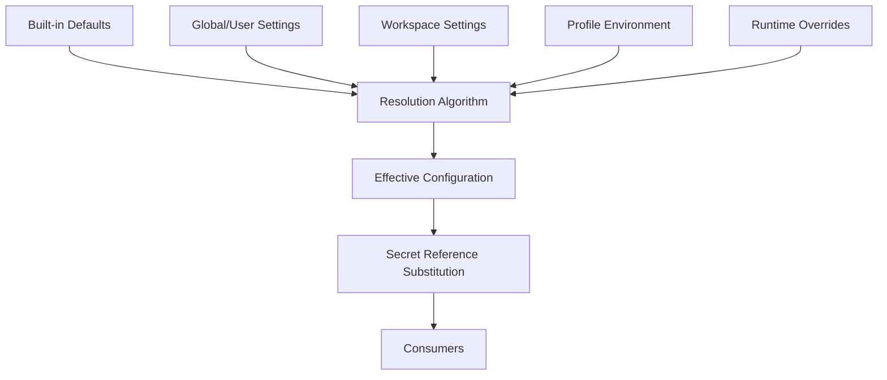

# 045 – Configuration System

**Document ID:** DEVOS-SPEC-045

**Version:** 0.1

**Status:** Draft

**Category:** Platform

**Depends On:**

- DEVOS-SPEC-005 – Guiding Principles
- DEVOS-SPEC-006 – Terminology
- DEVOS-SPEC-014 – State Model
- DEVOS-SPEC-020 – Workspace Specification
- DEVOS-SPEC-023 – Environment Specification
- DEVOS-SPEC-028 – Secret Specification
- DEVOS-SPEC-030 – System Architecture
- DEVOS-SPEC-036 – Security Engine
- DEVOS-SPEC-037 – Event System

**Referenced By:**

- DEVOS-SPEC-022 – Profile Specification
- DEVOS-SPEC-023 – Environment Specification
- DEVOS-SPEC-029 – Workspace Manifest
- DEVOS-SPEC-031 – Workspace Engine
- DEVOS-SPEC-040 – CLI
- DEVOS-SPEC-041 – Dashboard
- DEVOS-SPEC-047 – Settings

---

# Abstract

This document defines how DevOS resolves configuration values from multiple declarative layers.

It specifies the ordered layers, the resolution algorithm, the merge policy, secret reference substitution, validation, and change propagation.

Configuration in DevOS is declarative code; this document gives that code one deterministic meaning.

It does not define storage formats, file locations, or user interface behavior.

---

# Purpose

This specification answers the following question:

> **When several configuration layers define the same key, which value wins and how do changes propagate?**

Every consumer of configuration, from engines to interfaces, MUST observe the same resolved result for the same inputs.

Predictability is chosen over cleverness throughout this document.

---

# Goals

This specification aims to:

- Define the canonical configuration layers and their precedence.
- Define a deterministic resolution algorithm.
- Define a simple, predictable merge policy per key shape.
- Define when and how secret references are substituted.
- Define per-layer and composite validation.
- Define change propagation with safe hot reload.
- Make layer provenance answerable for every resolved key.

---

# Non Goals

This specification does not define:

- File formats or directory layouts
- Settings screen or CLI command design
- Remote or dynamic configuration services
- Per-tool configuration managed inside Environments beyond DEVOS-SPEC-023
- Secret storage mechanics
- Encryption at rest

---

# Configuration Layers

Configuration is organized into five numbered layers.

Precedence rises with the layer number: layer 5 overrides layer 4, which overrides layer 3, and so on.

| # | Layer                     | Scope            | Source                                              | Persistence        |
| - | ------------------------- | ---------------- | --------------------------------------------------- | ------------------ |
| 1 | Built-in Defaults         | Platform-wide    | Shipped specification defaults.                      | Immutable.         |
| 2 | Global/User Settings      | One user         | Global scope of DEVOS-SPEC-047.                      | Declarative files. |
| 3 | Workspace Settings        | One Workspace    | Workspace-owned declarative settings.                | Versioned with the Workspace. |
| 4 | Profile Environment       | One Profile      | Variables, flags, and runtime config of DEVOS-SPEC-023. | Declarative files. |
| 5 | Explicit Runtime Overrides| One invocation   | Interface flags or process environment injection.     | Transient; never persisted. |

Layer 1 always applies.

Layers 2 through 4 apply when present for the active scope.

Layer 5 applies only to the single invocation that declared it and MUST NOT be recorded into any persistent layer.

---

# Resolution Algorithm

Resolution MUST proceed in the following steps.

1. Determine the active Profile and its owned Environment.
2. Collect all applicable layers: layers 1 through 4 for the active scope, plus layer 5 when explicitly provided.
3. Order the collected layers from lowest to highest precedence.
4. Resolve each requested key across all collected layers using the merge policy below.
5. Record the winning layer as the provenance of every resolved key.
6. Run composite validation over the fully resolved view.
7. Leave `${secrets.NAME}` style references unresolved in the stored effective view.

Secret references are substituted only at use time, as defined below.

The same inputs MUST always produce the same resolution output.

---

# Merge Policy

The merge policy is normative and intentionally minimal.

For scalar keys, the highest applicable layer wins outright.

For map-valued keys, maps are merged shallowly: keys from higher layers override matching keys from lower layers, and unmatched lower-layer keys survive.

For list-valued keys, the highest layer that declares the list replaces it whole; lists are NEVER concatenated.

A layer that does not declare a key has no effect on that key.

There are no partial overrides, no deep merges, and no type coercions between layers.

Rationale: every developer must be able to predict the outcome in their head without running anything.

---

# Layer Stack Resolution

---

# Secret References

Some configuration values are indirections rather than literal values.

A secret reference is expressed conceptually as textual `${secrets.NAME}` syntax pointing at a Workspace-owned Secret.

References are detected after normal merge resolution completes, because merging operates on references exactly as it operates on scalars.

Substitution happens last, immediately before use, through the Security Engine defined in DEVOS-SPEC-036.

Resolved secret values MUST NEVER be persisted into any layer, cache, export, log, or event, as required by DEVOS-SPEC-028.

If a referenced secret cannot be resolved, the consuming operation fails with an attributed reason; the reference text itself is never replaced by partial material.

---

# Validation

Validation happens at two points.

Per-layer validation runs when a layer is written or loaded and checks that layer in isolation against its schema.

Composite validation runs after resolution and checks the final effective view.

Unknown keys encountered during composite validation MUST produce warnings attributed to their declaring layer.

Type mismatches between layers MUST fail resolution with errors attributed to the offending layer.

Validation output MUST never include resolved secret material.

Composite failure blocks consumers; per-layer warnings do not.

---

# Change Propagation

Any edit to any layer emits a `devos.config.changed` event family through the Event System defined in DEVOS-SPEC-037.

Event names are qualified by layer, for example `devos.config.workspace.changed` or `devos.config.profile.changed`.

Consumers re-resolve lazily upon receiving change events; there is no requirement to push new values proactively.

Hot reload SHOULD be supported wherever file watching exists.

Hot reload MUST be safe: re-resolution is atomic, so consumers observe either the previous complete view or the next complete view, never a mixture.

Transient runtime overrides never participate in change propagation because they are not persisted.

---

# Observability

The system MUST expose an effective-config introspection concept.

This concept shows the fully resolved view one key at a time together with its winning layer attribution.

For every key a user can ask: which value is in effect, and which layer decided it.

Privacy rule: where a resolved value is a secret reference, introspection renders the reference text, never the substituted material.

Introspection output is derived entirely from declarative files plus the active invocation context.

---

# Worked Example

One key, `runtime.logLevel`, traced across all five layers.

| # | Layer                | Declared Value | Outcome                    |
| - | -------------------- | -------------- | -------------------------- |
| 1 | Built-in Defaults    | info           | Superseded by layer 3.     |
| 2 | Global/User Settings | (unset)        | Skipped; declares nothing. |
| 3 | Workspace Settings   | debug          | Superseded by layer 4.     |
| 4 | Profile Environment  | warn           | Winner.                    |
| 5 | Runtime Override     | (not provided) | Skipped; nothing declared. |

The effective value is `warn` with provenance "Profile Environment".

Had layer 5 been invoked with `error`, the effective value would be `error` for that single invocation only.

---

# Configuration Invariants

The following invariants MUST always hold.

- Declarative files are the only truth; no hidden state participates in resolution (Configuration as Code).
- Resolution is deterministic for identical inputs.
- Every resolved key has an answerable winning layer.
- List values are replaced, never concatenated.
- Secret references resolve last and only at use time.
- Resolved secret values are never persisted anywhere.
- No secret material leaks across layers through merges, events, or logs.
- Hot reload never exposes a partially resolved view.
- Transient overrides disappear when the invocation ends.

---

# Security Requirements

The system MUST route all secret substitution through DEVOS-SPEC-036.

The system MUST obey the absolute secret rules of DEVOS-SPEC-028.

Change events MUST carry layer identity and affected keys but MUST NOT carry resolved secret values.

Introspection MUST render secrets as references.

Validation failures MUST NOT echo secret-bearing values.

Access control over who may edit which layer is governed by the security specifications, not here.

---

# Future Extensions

Future specifications may add support for:

- Environment-scoped includes within a layer
- Config templates shared across Workspaces
- Layered policy overlays via the Policy Engine (DEVOS-SPEC-063)
- Sync-aware configuration propagation via Cloud Sync (DEVOS-SPEC-064)

These extensions MUST preserve deterministic, file-first resolution unless an ADR changes the model.

---

# References

- DEVOS-SPEC-005 – Guiding Principles
- DEVOS-SPEC-006 – Terminology
- DEVOS-SPEC-014 – State Model
- DEVOS-SPEC-020 – Workspace Specification
- DEVOS-SPEC-022 – Profile Specification
- DEVOS-SPEC-023 – Environment Specification
- DEVOS-SPEC-028 – Secret Specification
- DEVOS-SPEC-029 – Workspace Manifest
- DEVOS-SPEC-030 – System Architecture
- DEVOS-SPEC-031 – Workspace Engine
- DEVOS-SPEC-036 – Security Engine
- DEVOS-SPEC-037 – Event System
- DEVOS-SPEC-040 – CLI
- DEVOS-SPEC-041 – Dashboard
- DEVOS-SPEC-047 – Settings

---

# Revision History

| Version | Date | Author             | Notes         |
| ------- | ---- | ------------------ | ------------- |
| 0.1     | TBD  | DevOS Contributors | Initial Draft |
