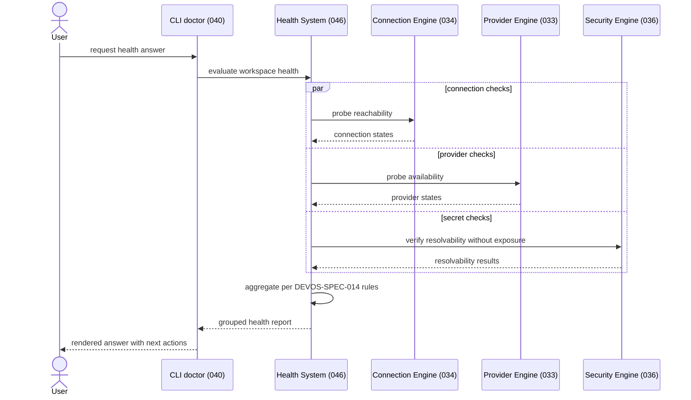

# 046 – Health System

**Document ID:** DEVOS-SPEC-046

**Version:** 0.1

**Status:** Draft

**Category:** Platform

**Depends On:**

- DEVOS-SPEC-005 – Guiding Principles
- DEVOS-SPEC-006 – Terminology
- DEVOS-SPEC-014 – State Model
- DEVOS-SPEC-020 – Workspace Specification
- DEVOS-SPEC-023 – Environment Specification
- DEVOS-SPEC-030 – System Architecture
- DEVOS-SPEC-032 – Plugin Engine
- DEVOS-SPEC-033 – Provider Engine
- DEVOS-SPEC-034 – Connection Engine
- DEVOS-SPEC-037 – Event System

**Referenced By:**

- DEVOS-SPEC-024 – Provider Specification
- DEVOS-SPEC-025 – Connection Specification
- DEVOS-SPEC-030 – System Architecture
- DEVOS-SPEC-031 – Workspace Engine
- DEVOS-SPEC-040 – CLI
- DEVOS-SPEC-041 – Dashboard
- DEVOS-SPEC-049 – Logging

---

# Abstract

This document defines the DevOS Health System.

It turns scattered per-object states into one aggregated, trustworthy answer about a Workspace: is my workspace healthy?

The document defines the canonical health checks, the aggregation rules, the execution model, the report format, severity mapping, and how interfaces consume results.

Health is an observation discipline; it never mutates what it observes.

---

# Purpose

This specification answers the following question:

> **How does DevOS turn scattered object states into one trustworthy answer: is my workspace healthy?**

Individual engines already know the state of their own objects.

The Health System composes those facts using the aggregation rules of DEVOS-SPEC-014 and reports them in one stable shape.

---

# Goals

This specification aims to:

- Define the canonical set of health checks and their producers.
- Define normative workspace health aggregation.
- Define on-demand and optional scheduled execution.
- Define a single report format shared by all interfaces.
- Map states to severities for humans and automation.
- Keep every check free of side effects and secret exposure.

---

# Non Goals

This specification does not define:

- Automatic repair or remediation
- Provider-specific diagnostic logic
- Metrics storage or time-series databases
- Alerting delivery mechanisms
- Dashboard layout or CLI rendering details
- Workflow run monitoring
- Historical analytics beyond optional local rolling history

---

# Health Checks

A health check is a bounded observation of one owned object or aggregate property.

The canonical check set is fixed by this table; implementations MUST NOT invent untracked kinds.

| Check                  | Producer                                   | Evaluates                                                        |
| ---------------------- | ------------------------------------------ | ---------------------------------------------------------------- |
| Environment validity   | DEVOS-SPEC-023 via DEVOS-SPEC-045          | Required configuration is present, well-formed, and resolvable.  |
| Connection reachability| DEVOS-SPEC-034                             | The external system behind each Connection is reachable.         |
| Provider availability  | DEVOS-SPEC-033                             | Each Provider is usable, including AuthRequired detection.       |
| Plugin integrity       | DEVOS-SPEC-032                             | Each enabled Plugin loads, is intact, and holds valid grants.    |
| Manifest validity      | DEVOS-SPEC-029 validation pipeline         | The manifest parses, is schema-valid, and round-trips.           |
| Secret resolvability   | DEVOS-SPEC-036 with DEVOS-SPEC-028         | Every referenced secret resolves WITHOUT any exposure.           |

Producers remain the authority for their own object states.

The Health System never overrides producer states; it only aggregates them.

---

# Aggregation Rules

Workspace health follows the state rules of DEVOS-SPEC-014 exactly.

The following truth table restates them precisely.

| Required Children     | Optional Children     | Workspace Health Answer |
| --------------------- | --------------------- | ----------------------- |
| All Ready             | All Ready             | Ready                   |
| All Ready             | Any failing           | Degraded                |
| Any required failing  | Any                   | Failed                  |
| Operation running     | Any                   | Busy                    |
| Not yet evaluated     | Any                   | Unknown                 |

Normative statements:

- A Workspace is Ready if and only if all required children are Ready.
- A Workspace is Degraded when only optional children are failing.
- A Workspace is Failed when any required child is failing.
- A Workspace is Busy while a Workspace-level operation runs.
- A Workspace is Unknown until its first evaluation completes.

AuthRequired on a Provider is not Failed; it is an actionable condition handled through severity mapping below.

Aggregated answers MUST be deterministic for identical input states.

---

# Execution Model

Checks run in two modes.

On-demand checks execute when a user or tool requests a health evaluation, such as the doctor flow of DEVOS-SPEC-040.

Scheduled monitoring is OPTIONAL and disabled by default.

Enabling scheduled monitoring is explicit consent from the user.

Monitoring intervals and toggles are declarative settings owned by DEVOS-SPEC-047.

Every check MUST be a side-effect-free observation.

Checks MUST NOT mutate objects, repair configuration, restart anything, rotate secrets, or emit lifecycle transitions.

Findings recommend actions; they never perform them.

State changes observed as a side effect of normal engine operation continue to flow as ordinary events of DEVOS-SPEC-037.

---

# Doctor Invocation Sequence

---

# Report Format

All interfaces consume the same report shape.

| Field                 | Requirement                                                          |
| --------------------- | -------------------------------------------------------------------- |
| Object reference      | Stable identifier and object type inside exactly one Workspace.      |
| Check kind            | One of the canonical kinds defined above.                            |
| State                 | A value drawn from the DEVOS-SPEC-014 set for that object type.      |
| Reason code           | Stable machine-readable code when applicable.                        |
| Human summary         | One display-safe sentence describing the finding.                    |
| Suggested next action | One concrete step the user can take next.                            |

Report contents align with the reporting rules of DEVOS-SPEC-014.

Reports MUST NOT include secret values, access tokens, private keys, credentials, or unnecessary external payloads.

Secret resolvability findings describe outcomes only; they never quote material.

---

# Severity Mapping

Raw states are mapped to severities so humans and automation can prioritize.

| State        | Severity      | Meaning                              |
| ------------ | ------------- | ------------------------------------ |
| Failed       | Blocker       | Required function cannot proceed.    |
| Degraded     | Warning       | Usable with reduced capability.      |
| AuthRequired | Action-needed | Usable after user authorization.     |
| Disabled     | Info          | Intentionally inactive; no concern.  |

Interfaces MUST preserve these mappings rather than inventing local ones.

Blockers gate readiness; warnings do not.

---

# Consumption

Three consumption paths share one report format.

The CLI renders the grouped report in the doctor flow of DEVOS-SPEC-040, grouped by object type with blockers first.

The Dashboard health center subscribes to health and state events through DEVOS-SPEC-037 and refreshes views incrementally.

Continuous integration uses doctor as a non-interactive gate: the command exits nonzero when blockers exist, with exit codes fixed by DEVOS-SPEC-040.

No consumer may recompute aggregation independently.

---

# History

The system MAY retain a local rolling history of past evaluations.

Retention length is declarative and configured through DEVOS-SPEC-047.

History MUST NEVER be exported implicitly as part of a Workspace Bundle.

Explicit export of history requires a future specification and user intent.

---

# Performance Requirements

Each individual check SHOULD complete within a bounded budget with a mandatory timeout.

Independent checks SHOULD be executable in parallel across producers.

The overall evaluation SHOULD return promptly even when external systems are unreachable, using timeouts instead of unbounded waits.

Scheduled monitoring SHOULD stagger checks to avoid synchronized load spikes.

Budgets are statement-level here; concrete numbers belong to implementation guidance, not this specification.

---

# Security Requirements

Every check MUST obey the absolute secret rules of DEVOS-SPEC-028.

Resolvability checks MUST verify resolution without exposing resolved values.

Reports, histories, and events MUST NOT contain secret material.

Scheduled monitoring MUST be off until explicitly enabled by the user.

Check results MUST be scoped to one Workspace and never leak across Workspaces.

---

# Invariants

The following invariants MUST always hold.

- Producers own their states; the Health System only aggregates.
- Aggregation follows DEVOS-SPEC-014 exactly and deterministically.
- Every check is a side-effect-free observation.
- No check ever repairs, mutates, or remediates.
- Reports never contain secret material.
- Unknown is reported honestly until first evaluation completes.
- Scheduled monitoring never runs without consent.
- History stays local unless explicitly exported.
- All consumers render the same report shape.

---

# Future Extensions

Future specifications may add support for:

- SLI-style metrics export for external observability stacks
- Alerting webhooks and notification policies
- Auto-remediation flows with explicit user consent
- Trend analysis over retained local history
- Enterprise monitoring integration

These extensions MUST preserve the report-only default stance of v0.1 unless an ADR changes it.

---

# References

- DEVOS-SPEC-005 – Guiding Principles
- DEVOS-SPEC-006 – Terminology
- DEVOS-SPEC-014 – State Model
- DEVOS-SPEC-020 – Workspace Specification
- DEVOS-SPEC-023 – Environment Specification
- DEVOS-SPEC-024 – Provider Specification
- DEVOS-SPEC-025 – Connection Specification
- DEVOS-SPEC-028 – Secret Specification
- DEVOS-SPEC-029 – Workspace Manifest
- DEVOS-SPEC-030 – System Architecture
- DEVOS-SPEC-031 – Workspace Engine
- DEVOS-SPEC-032 – Plugin Engine
- DEVOS-SPEC-033 – Provider Engine
- DEVOS-SPEC-034 – Connection Engine
- DEVOS-SPEC-036 – Security Engine
- DEVOS-SPEC-037 – Event System
- DEVOS-SPEC-040 – CLI
- DEVOS-SPEC-041 – Dashboard
- DEVOS-SPEC-047 – Settings
- DEVOS-SPEC-049 – Logging

---

# Revision History

| Version | Date | Author             | Notes         |
| ------- | ---- | ------------------ | ------------- |
| 0.1     | TBD  | DevOS Contributors | Initial Draft |
