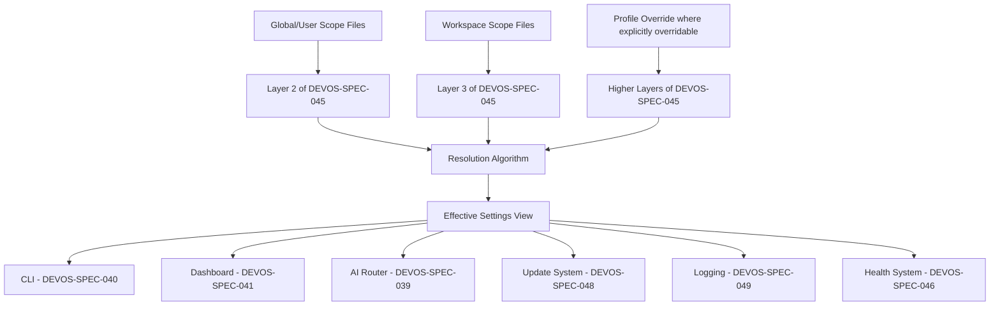

# 047 – Settings

**Document ID:** DEVOS-SPEC-047

**Version:** 0.1

**Status:** Draft

**Category:** Platform

**Depends On:**

- DEVOS-SPEC-005 – Guiding Principles
- DEVOS-SPEC-006 – Terminology
- DEVOS-SPEC-014 – State Model
- DEVOS-SPEC-020 – Workspace Specification
- DEVOS-SPEC-028 – Secret Specification
- DEVOS-SPEC-030 – System Architecture
- DEVOS-SPEC-036 – Security Engine
- DEVOS-SPEC-037 – Event System
- DEVOS-SPEC-039 – AI Router
- DEVOS-SPEC-045 – Configuration System

**Referenced By:**

- DEVOS-SPEC-033 – Provider Engine
- DEVOS-SPEC-039 – AI Router
- DEVOS-SPEC-040 – CLI
- DEVOS-SPEC-041 – Dashboard
- DEVOS-SPEC-045 – Configuration System
- DEVOS-SPEC-046 – Health System
- DEVOS-SPEC-048 – Update System
- DEVOS-SPEC-062 – RBAC

---

# Abstract

This document defines Settings, the user preference surface of DevOS.

Settings personalize how tools and components behave; they never redefine what a Workspace means or whether it is valid.

The document defines the distinction between settings and configuration, the Global/User and Workspace scopes, the canonical Version 0.1 categories, declarative storage, validation, migration, and change semantics.

Precedence is not redefined here; settings participate as layers two and three of the resolution stack defined in DEVOS-SPEC-045.

---

# Purpose

This specification answers the following question:

> **What can users personalize about DevOS behavior, and where do those preferences live?**

Users express preferences once, in declarative files, and every DevOS surface honors them identically.

Preferences are validated data, never hidden state, and they never contain secret values.

---

# Goals

This specification aims to:

- Separate settings from configuration.
- Define the Global/User and Workspace scopes.
- Define the canonical settings categories of Version 0.1.
- Integrate settings precedence into the stack of DEVOS-SPEC-045 by citation.
- Define declarative storage and schema-based validation.
- Define change events and safe consumption semantics.

---

# Non Goals

This specification does not define:

- File locations or directory layouts
- Settings screen or CLI command design
- The resolution algorithm, which belongs to DEVOS-SPEC-045
- Workspace semantic content, which belongs to DEVOS-SPEC-020
- Secret storage mechanics
- Enterprise managed policy, deferred to DEVOS-SPEC-060 through DEVOS-SPEC-063

---

# Settings versus Configuration

Settings and configuration are deliberately distinct concepts in DevOS.

| Aspect           | Settings                                    | Configuration                                 |
| ---------------- | ------------------------------------------- | --------------------------------------------- |
| Answers          | How should tools behave for this user?      | What does this Workspace and Project mean?    |
| Nature           | User preference for tool behavior.          | Data describing the Workspace or Project.     |
| Owns meaning     | No; it tunes behavior only.                 | Yes; it defines domain content.               |
| Affects validity | Never.                                      | Yes; invalid configuration blocks activation. |
| Examples         | Theme, log defaults, update channel.        | Providers, Profiles, Workflows, Templates.    |
| Canonical spec   | DEVOS-SPEC-047.                             | DEVOS-SPEC-045.                               |

A setting change MUST NEVER alter Workspace semantic validity as defined in DEVOS-SPEC-020.

Deleting every settings file MUST leave the Workspace itself intact and valid.

Configuration remains governed exclusively by DEVOS-SPEC-045.

---

# Scopes

Version 0.1 defines two settings scopes.

| Scope       | Applies To               | Audience                                | Persistence                      |
| ----------- | ------------------------ | --------------------------------------- | -------------------------------- |
| Global/User | One user, all Workspaces | Personal preferences across projects.   | Declarative files owned by the user. |
| Workspace   | One Workspace            | Preferences shared within the Workspace.| Versioned with the Workspace.    |

A Profile override MAY apply only where a setting explicitly declares itself overridable in its schema entry.

Non-overridable settings MUST ignore Profile overrides without error.

The scope test is simple: does this preference describe a person or a project?

---

# Precedence Integration

This document defines no precedence algorithm of its own.

Global/User settings form layer 2 and Workspace settings form layer 3 of the five-layer stack defined in DEVOS-SPEC-045.

Resolution order, merge policy, provenance attribution, and hot reload safety all follow DEVOS-SPEC-045 exactly.

Where a setting declares itself Profile-overridable, that override rides the higher layers of the same stack instead of introducing new rules.

Every effective setting value MUST remain answerable to the question "which layer decided this?" through the introspection concept of DEVOS-SPEC-045.

---

# Canonical Categories

The following categories define the canonical settings namespace of Version 0.1.

Example keys are illustrative; schemas define the normative key sets.

| Category            | Example Keys (illustrative)          | Notes                                                        |
| ------------------- | ------------------------------------ | ------------------------------------------------------------ |
| Appearance          | ui.theme                             | Interface presentation only; no engine behavior changes.     |
| Editor Integrations | editors.default, editors.openCommand | Bridges to external editors; editor names stay illustrative. |
| AI Routing Defaults | ai.priority, ai.budget               | Feeds declarative priority policies and budget guards of DEVOS-SPEC-039. |
| Updates             | updates.channel                      | Selects the channel consumed by DEVOS-SPEC-048.              |
| Telemetry           | telemetry.enabled                    | DEFAULT false; this default is normative.                    |
| Logging Defaults    | log.level                            | Per-component level defaults feeding DEVOS-SPEC-049.         |
| Health Monitoring   | health.scheduled                     | Opt-in scheduled intervals feeding DEVOS-SPEC-046.           |

Telemetry MUST default to false at every scope, and this default is a normative privacy stance.

Absent health.scheduled means no scheduled health checks run.

New categories MUST enter through this table and its schemas before any consumer reads their keys.

---

# Storage

Settings live in declarative, human-readable files.

Setting files MUST validate against the settings schemas under the reserved namespace https://devos.dev/schemas/v0/, conceptually schemas/settings.schema.json.

Schemas are canonical per Rule 17; documentation explains schemas and implementations validate against them.

Hidden state stores, registries, or caches of settings truth MUST NOT exist, restating Configuration as Code (Rule 5).

Everything a user decided about preferences MUST be reconstructible from the files alone.

Workspace-scoped settings MAY sit beside Workspace manifests, subject to the layout freedom of DEVOS-SPEC-045.

---

# Change Semantics

Any accepted edit to any scope emits a devos.settings.changed event family through the Event System defined in DEVOS-SPEC-037.

Change events carry affected keys and scope identity but MUST NOT carry resolved secret material, per DEVOS-SPEC-028.

Consumers apply changes lazily upon receiving events.

Consumers MAY hot-reload where safe, observing either the previous complete view or the next complete view and never a mixture, mirroring the hot reload rule of DEVOS-SPEC-045.

No consumer MAY demand a restart to honor a change unless its schema entry explicitly declares restart required.

---

# Schema Migration

Setting schemas are versioned like every other schema.

Migration between settings schema versions follows the Versioning Policy defined in DEVOS-SPEC-059.

Deprecated keys MUST show deprecation notices before their removal windows open, per Rule 18.

Migrations MUST be expressible as declarative transformations over the files themselves.

---

# Validation Requirements

Validation runs per file at load time and edit time.

- Unknown keys MUST produce warnings and MUST NOT fail, keeping files forward-compatible.
- Type mismatches against the schema MUST fail with errors attributed to the offending key.
- Enum-constrained values MUST reject out-of-set values and name the allowed set.
- Conflicting overridability declarations MUST resolve toward the more restrictive one.
- Validation output MUST never include secret values, per DEVOS-SPEC-028.

Warnings never block other keys; a failed key simply does not resolve.

---

# Resolution Flow

---

# Security Requirements

Settings MUST NEVER contain secret values.

Settings MAY contain secret references, which are freely displayable per DEVOS-SPEC-028.

No setting MAY weaken a security default of the platform without an explicit consent model declared in its schema entry.

Consent for such settings MUST be recorded visibly in the declarative file itself, never in hidden state.

Disabled telemetry MUST transmit nothing, and telemetry is disabled by default.

Redaction of observable outputs derived from settings follows DEVOS-SPEC-036.

Who may edit which scope is an access-control question governed by DEVOS-SPEC-062.

---

# Settings Invariants

The following invariants MUST always hold.

- Telemetry is off by default at every scope.
- Settings never contain secret values; references are allowed.
- No setting weakens security defaults without explicit, visible consent.
- Settings never alter Workspace semantic validity.
- Declarative files are the only truth; no hidden state stores exist.
- Unknown keys warn and survive; forward compatibility holds.
- Every effective value has answerable provenance through DEVOS-SPEC-045.
- Accepted edits always emit devos.settings.changed events through DEVOS-SPEC-037.
- Schema migration always follows DEVOS-SPEC-059.

---

# Future Extensions

Future specifications may add support for:

- Team-managed managed settings distributed by Organizations
- Range-restricting policy overlays via the Policy Engine
- Roaming preference profiles via Cloud Sync

These belong to the Enterprise track beginning at DEVOS-SPEC-060 and MUST NOT break single-Workspace ownership without an ADR.

---

# References

- DEVOS-SPEC-005 – Guiding Principles
- DEVOS-SPEC-006 – Terminology
- DEVOS-SPEC-014 – State Model
- DEVOS-SPEC-020 – Workspace Specification
- DEVOS-SPEC-028 – Secret Specification
- DEVOS-SPEC-030 – System Architecture
- DEVOS-SPEC-033 – Provider Engine
- DEVOS-SPEC-036 – Security Engine
- DEVOS-SPEC-037 – Event System
- DEVOS-SPEC-039 – AI Router
- DEVOS-SPEC-040 – CLI
- DEVOS-SPEC-041 – Dashboard
- DEVOS-SPEC-045 – Configuration System
- DEVOS-SPEC-046 – Health System
- DEVOS-SPEC-048 – Update System
- DEVOS-SPEC-059 – Versioning Policy
- DEVOS-SPEC-062 – RBAC
- SPECIFICATION_RULES.md – Repository rule set (Rules 5 and 17)

---

# Revision History

| Version | Date | Author             | Notes         |
| ------- | ---- | ------------------ | ------------- |
| 0.1     | TBD  | DevOS Contributors | Initial Draft |
