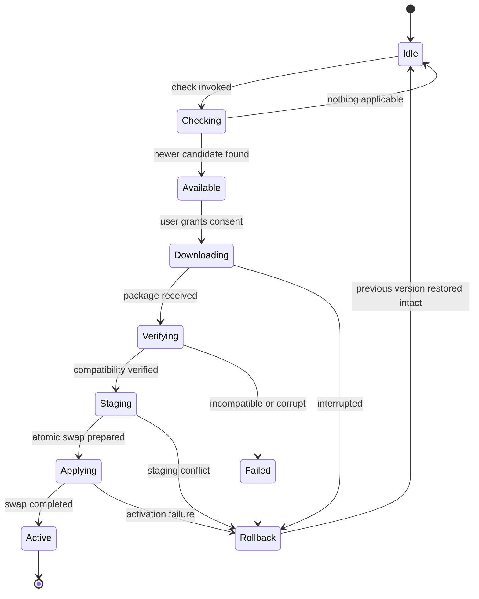

# 048 – Update System

**Document ID:** DEVOS-SPEC-048

**Version:** 0.1

**Status:** Draft

**Category:** Platform

**Depends On:**

- DEVOS-SPEC-005 – Guiding Principles
- DEVOS-SPEC-006 – Terminology
- DEVOS-SPEC-014 – State Model
- DEVOS-SPEC-020 – Workspace Specification
- DEVOS-SPEC-026 – Plugin Specification
- DEVOS-SPEC-028 – Secret Specification
- DEVOS-SPEC-030 – System Architecture
- DEVOS-SPEC-036 – Security Engine
- DEVOS-SPEC-037 – Event System
- DEVOS-SPEC-059 – Versioning Policy

**Referenced By:**

- DEVOS-SPEC-026 – Plugin Specification
- DEVOS-SPEC-040 – CLI
- DEVOS-SPEC-041 – Dashboard
- DEVOS-SPEC-047 – Settings
- DEVOS-SPEC-059 – Versioning Policy
- DEVOS-SPEC-078 – V2 Roadmap

---

# Abstract

This document defines the Update System, the component that evolves installed DevOS units safely.

It defines updateable units, release channels, the consent-gated safety pipeline, atomic swap staging, rollback, breaking-change surfacing, and workspace protection during migration.

The central promise is continuity: no update may ever leave a workspace half-updated.

The system is deliberately abstract about packaging and distribution mechanics.

---

# Purpose

This specification answers the following question:

> **How does DevOS evolve installed components without ever leaving a workspace half-updated?**

Every change to an installed unit passes through consent, verification, staging, and an atomic activation step.

Any failure restores the previous version intact.

---

# Goals

This specification aims to:

- Define the updateable units of Version 0.1.
- Define release channels and their default.
- Define the safety pipeline from check to activation.
- Define the atomicity invariant for every observer.
- Define breaking-change surfacing per Rule 18.
- Define workspace protection before migrations run.
- Define offline behavior and prohibit forced updates.

---

# Non Goals

This specification does not define:

- Package formats or archive layouts
- Registry protocols or mirror topology
- Signature algorithms or key infrastructure internals
- Marketplace commerce behavior, deferred to DEVOS-SPEC-070
- Fleet orchestration, deferred to the Enterprise track
- Application auto-start or scheduler design

---

# Updateable Units

The system updates versioned units, never ad-hoc files.

| Unit                                  | Versioned By                          | Source                                              |
| ------------------------------------- | ------------------------------------- | --------------------------------------------------- |
| Application (CLI/Dashboard binary)    | SemVer with channels                  | Official release channels.                          |
| Plugins                               | Compatibility ranges per DEVOS-SPEC-059 | Declared plugin sources per DEVOS-SPEC-026.       |
| Templates                             | Template pack versions                | Declared template sources.                          |
| Provider Adapters                     | Adapter registry versions             | Registry defined via DEVOS-SPEC-052 and DEVOS-SPEC-033. |
| Schema packs (manifest.schema.json and peers) | Schema pack versions          | Release channels alongside the application.         |

A unit is the smallest independently replaceable artifact of its kind.

Partial replacement inside a unit is impossible by definition.

---

# Channels

Channels are conceptual release lines: stable, beta, and edge.

| Channel | Intent                              | Stability Promise                       |
| ------- | ----------------------------------- | --------------------------------------- |
| stable  | Default line for daily work.        | Tested releases; supported window honored. |
| beta    | Early access to upcoming releases.  | Feature complete but subject to change. |
| edge    | Cutting builds for evaluation.      | No stability guarantee at all.          |

Channel selection is a setting read through updates.channel as defined in DEVOS-SPEC-047.

The default channel is stable; this default is normative.

Changing channels changes which candidates are offered, never what is installed without consent.

---

# Safety Pipeline

Every unit passes through the same pipeline.

Checking contacts sources only when invoked.

Downloading MUST require explicit user consent; silent downloads are prohibited, restating transparency under Security by Default (Rule 8).

Verifying checks candidate compatibility against the current workspace and plugin matrix per DEVOS-SPEC-059.

Staging prepares the new version in a staging area without touching the active installation.

Applying performs the atomic swap.

Rollback restores the previous version intact whenever any step fails.

---

# Atomicity Invariant

The atomicity invariant is absolute.

From every observer's perspective, a unit is entirely old-version or entirely new-version.

No observer ever sees mixed state across the boundary of one unit.

Staging area semantics remain abstract; this document mandates the observable outcome, not the mechanism.

Observers include engines, interfaces, plugins, concurrent operations, and crash recovery paths alike.

---

# Consent and Provenance

Consent is required once per install, update, or uninstall action.

Consent MUST name the unit, the target version, and the source it comes from.

Every install, update, and uninstall emits auditable events through the Event System defined in DEVOS-SPEC-037.

Events MUST include source provenance: which channel, which source, which version transition.

Unattributed changes to installed units MUST be treated as defects of the highest severity.

---

# Breaking Changes

Breaking changes follow the Rule 18 flow: RFC, ADR, migration strategy, version bump, and deprecation notice.

Deprecation notices MUST be visible to users before removal windows open.

Migration steps are attached conceptually to release notes metadata so interfaces can surface them beside the offer.

An update whose target is incompatible with the current matrix MUST be withheld at Verifying rather than applied with warnings.

The system MUST NEVER apply a known-breaking change silently.

---

# Workspace Protection

Before any migration runs, the system takes an automatic backup of affected manifests.

Backups are configuration-as-code snapshots: declarative, human-readable, and storable in version control.

Migrations run through workspace validation as defined in DEVOS-SPEC-031 before activation.

A migration that fails validation activates nothing and leaves backups in place.

Workspace semantic validity is never traded for newer units.

---

# Offline Stance

Checking for updates requires network only when the user invokes a check.

Core operation within the supported window NEVER requires an update, honoring Offline First (Rule 7).

Forced updates are prohibited in Version 0.1.

Expired support windows MAY produce prominent notices, but never blocked work.

All local units, channels, and settings continue functioning offline.

---

# Error Classes

Failures are classified, reported, and resolved deterministically.

| Error Class         | Meaning                                        | Outcome                                     |
| ------------------- | ---------------------------------------------- | ------------------------------------------- |
| Incompatible target | Candidate fails the DEVOS-SPEC-059 matrix.     | Update withheld at Verifying.               |
| Checksum mismatch   | Package fails integrity verification.          | Download rejected; retry requires re-consent. |
| Staging conflict    | Staging area cannot prepare the swap.          | Rollback to previous version intact.        |
| Activation failure  | Swap fails mid-application.                    | Rollback; workspace validation reconfirmed. |
| Rollback exhausted  | Even rollback cannot restore the prior version.| Unit quarantined Disabled per DEVOS-SPEC-014 states. |

Quarantine is visible, named, and accompanied by restoration guidance.

Quarantine MUST prefer honest failure over corrupted ambiguity.

---

# Update Invariants

The following invariants MUST always hold.

- No download happens without explicit consent.
- Every unit is entirely old-version or entirely new-version to every observer.
- Any pipeline failure restores the previous version intact.
- The default channel is stable.
- Forced updates are prohibited in Version 0.1.
- Every mutation emits an auditable event with source provenance through DEVOS-SPEC-037.
- Manifests are backed up before migrations, and DEVOS-SPEC-031 validation gates activation.
- Checking consumes network only when invoked.
- Rollback exhaustion quarantines the unit Disabled instead of leaving mixed state.

---

# Security Requirements

Verification MUST cover integrity at minimum; signature enforcement is a Future Extension until specified.

Provenance recorded in audit events MUST be sufficient to answer "where did this unit come from?" later.

Diagnostics produced by the pipeline pass redaction as defined in DEVOS-SPEC-036 before display or logging per DEVOS-SPEC-049.

Credentials used to reach sources stay in secure storage per DEVOS-SPEC-028 and never enter events or logs.

Staging areas MUST NOT become readable substitutes for secure storage.

---

# Performance Requirements

Checks SHOULD complete quickly enough to feel interactive.

Staging SHOULD make the applying step short, since observers wait on the atomic swap only.

Pipeline overhead MUST NOT slow normal operation when no update activity is running.

---

# Future Extensions

Future specifications may add support for:

- Staged fleet rollout across Organizations
- Signed manifests enforcement
- Delta downloads for large units
- Scheduled maintenance windows

These extensions MUST preserve consent, atomicity, and rollback guarantees, and MUST NOT break the single Workspace aggregate model without an ADR.

---

# References

- DEVOS-SPEC-005 – Guiding Principles
- DEVOS-SPEC-006 – Terminology
- DEVOS-SPEC-014 – State Model
- DEVOS-SPEC-020 – Workspace Specification
- DEVOS-SPEC-026 – Plugin Specification
- DEVOS-SPEC-028 – Secret Specification
- DEVOS-SPEC-030 – System Architecture
- DEVOS-SPEC-031 – Workspace Engine
- DEVOS-SPEC-033 – Provider Engine
- DEVOS-SPEC-036 – Security Engine
- DEVOS-SPEC-037 – Event System
- DEVOS-SPEC-040 – CLI
- DEVOS-SPEC-041 – Dashboard
- DEVOS-SPEC-047 – Settings
- DEVOS-SPEC-052 – Provider SDK
- DEVOS-SPEC-059 – Versioning Policy
- DEVOS-SPEC-078 – V2 Roadmap
- SPECIFICATION_RULES.md – Repository rule set (Rules 7, 8, and 18)

---

# Revision History

| Version | Date | Author             | Notes         |
| ------- | ---- | ------------------ | ------------- |
| 0.1     | TBD  | DevOS Contributors | Initial Draft |
