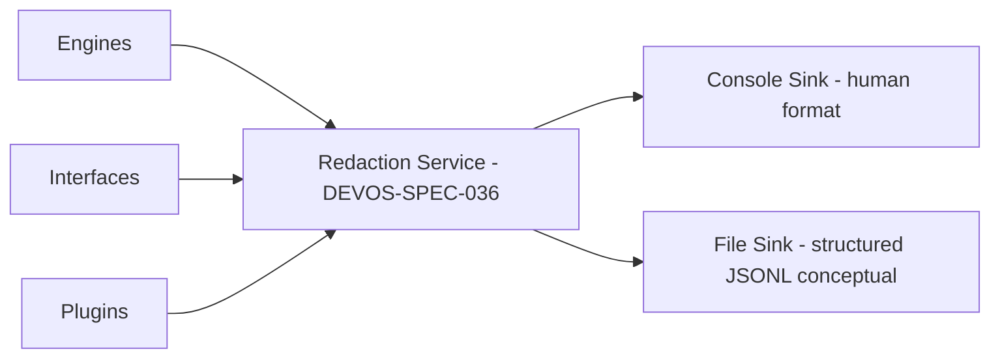

# 049 – Logging

**Document ID:** DEVOS-SPEC-049

**Version:** 0.1

**Status:** Draft

**Category:** Platform

**Depends On:**

- DEVOS-SPEC-005 – Guiding Principles
- DEVOS-SPEC-006 – Terminology
- DEVOS-SPEC-014 – State Model
- DEVOS-SPEC-020 – Workspace Specification
- DEVOS-SPEC-028 – Secret Specification
- DEVOS-SPEC-030 – System Architecture
- DEVOS-SPEC-036 – Security Engine
- DEVOS-SPEC-037 – Event System

**Referenced By:**

- DEVOS-SPEC-014 – State Model
- DEVOS-SPEC-026 – Plugin Specification
- DEVOS-SPEC-030 – System Architecture
- DEVOS-SPEC-036 – Security Engine
- DEVOS-SPEC-039 – AI Router
- DEVOS-SPEC-040 – CLI
- DEVOS-SPEC-041 – Dashboard
- DEVOS-SPEC-065 – Audit System

---

# Abstract

This document defines Logging, the record of what DevOS did and when.

It defines the log levels, the required record shape, the mandatory redaction pipeline, local sinks, rotation and retention, correlation across components, and performance behavior under failure.

Redaction is the centerpiece: no sink ever receives an unredacted record.

Logs are local diagnostic records; enterprise audit retention is a separate concern deferred to DEVOS-SPEC-065.

---

# Purpose

This specification answers the following question:

> **What does DevOS record about its own behavior, and what must never appear in those records?**

DevOS records enough to diagnose failures, understand operations, and feed future audit trails.

It records nothing that would leak secret material or private content, at any level, in any mode.

---

# Goals

This specification aims to:

- Frame the purpose of platform logging.
- Define log levels with usage guidance.
- Define the required record shape with correlation identifiers.
- Define the mandatory redaction pipeline through DEVOS-SPEC-036.
- Define local-first sinks and rotation policies.
- Define correlation across components.
- Guarantee that logging failure never harms correctness.

---

# Non Goals

This specification does not define:

- Audit event formats or retention policy, owned by DEVOS-SPEC-065
- Metrics, tracing infrastructure, or observability backends
- Remote log shipping, out of scope for Version 0.1
- Log search user interfaces
- Plugin-internal logging implementations beyond their obligations here
- Concrete storage products or file locking mechanics

---

# Role of Logs

Logs serve three purposes in Version 0.1.

They help diagnose failures after they happen.

They help users and developers understand what operations occurred.

They provide raw input from which a future audit trail can be derived, with retention and governance deferred to DEVOS-SPEC-065.

Logs are evidence, never authority; correctness never depends on them.

---

# Log Levels

Five levels are canonical.

| Level | Meaning                                       | Example (illustrative)                    |
| ----- | --------------------------------------------- | ----------------------------------------- |
| trace | Finest-grained internal steps.                | Resolution entered the merge step.        |
| debug | Developer-facing diagnostic detail.           | Provider candidate ordered second.        |
| info  | Normal, notable operations.                   | Workspace activation completed.           |
| warn  | Recoverable anomaly worth attention.          | Unknown settings key ignored.             |
| error | An operation failed.                          | Connection handshake failed.              |

Levels are guidance for filtering, never for redaction behavior.

Redaction applies identically at every level, including trace and debug.

Default levels per component are user preferences defined in DEVOS-SPEC-047.

---

# Record Shape

Every record carries the following fields.

| Field             | Required | Description                                                       |
| ----------------- | -------- | ----------------------------------------------------------------- |
| timestamp         | Yes      | When the record was created.                                      |
| level             | Yes      | One of the five canonical levels.                                 |
| component         | Yes      | Emitting engine or interface name per the taxonomy of DEVOS-SPEC-030. |
| correlationId     | Yes      | Identifier matching the envelope correlation ids of DEVOS-SPEC-037. |
| message           | Yes      | Human-readable summary, safe by construction.                     |
| structured fields | May      | Key-value pairs adding searchable context.                        |

Structured field keys SHOULD be stable and documented per component.

Records MUST NOT carry free-form dumps of objects that bypass the shape.

The correlationId is mandatory on operational records so multi-component work stays traceable.

---

# Redaction Pipeline

All records pass Security Engine redaction as defined in DEVOS-SPEC-036 before reaching any sink.

This is normative and admits no exceptions, modes, or opt-outs.

The forbidden-content list restates DEVOS-SPEC-014 and DEVOS-SPEC-028:

- Secret values of any kind
- Tokens and session credentials
- Private keys and certificates
- Passwords and API keys wherever they appear
- Prompt bodies by default, honoring the stance of DEVOS-SPEC-039 that prompts are redacted before observation and never persisted outside Memory Engine derived entries

Redaction replaces matched material with typed placeholders such as [REDACTED:secret-ref], shown here as illustration only.

Placeholders identify the kind of material removed without disclosing any of it.

Debug modes MUST NOT disable redaction, restating DEVOS-SPEC-028.

A record that cannot be redacted MUST be dropped rather than emitted unredacted.

---

# Pipeline Flow

Sinks receive records only after redaction.

No side channel exists from a component directly to a sink.

---

# Sinks

Version 0.1 defines two sinks.

| Sink    | Format            | Audience                          |
| ------- | ----------------- | --------------------------------- |
| Console | Human-readable    | Interactive sessions via CLI and Dashboard. |
| File    | Structured JSONL-style, conceptual | Local inspection and tooling. |

Logging is local-first, honoring Offline First (Rule 7).

Remote shipping is out of scope for Version 0.1.

Sink enablement per level follows the logging defaults of DEVOS-SPEC-047.

---

# Rotation and Retention

File sinks rotate by size or time using declarative policies.

Rotation and retention policies are settings declared through DEVOS-SPEC-047.

Retention defaults are modest: recent diagnostics, not indefinite archives.

Deleted rotations are gone; the system keeps no shadow copies.

Retention governance for audit purposes remains with DEVOS-SPEC-065.

---

# Correlation

One logical operation shares one correlationId across every component it touches.

The identifier MUST match the correlation id of the corresponding events in DEVOS-SPEC-037, so log traces join event streams.

Worked example: one workspace activation traced across three components.

| Step | Component         | Level | correlationId | Message (illustrative)      |
| ---- | ----------------- | ----- | ------------- | --------------------------- |
| 1    | Workspace Engine  | info  | op-4171       | Activation started.         |
| 2    | Provider Engine   | info  | op-4171       | Provider health verified.   |
| 3    | Security Engine   | info  | op-4171       | Secret references validated.|
| 4    | CLI               | info  | op-4171       | Activation complete.        |

A reader filters on op-4171 and reconstructs the whole operation across components.

Correlation turns scattered lines into one narrative.

---

# Performance Requirements

Log writes SHOULD be asynchronous and buffered.

Buffering MUST NOT reorder records of one operation into misleading narratives.

Logging failure MUST degrade silently: the platform continues, the missing logs are noted, and no operation crashes.

Logging is never load-bearing for correctness.

Backpressure from slow sinks MUST throttle logging, never engines or interfaces.

---

# Privacy Stance

Logs are local records about local activity.

They stay on the machine unless the user moves them.

Diagnostic bundles for bug reports REQUIRE explicit user action to create.

Before export, a bundle passes a redaction verification step that shows the user a preview of exactly which files and records leave the machine.

Export without explicit consent is prohibited, and preview output renders only redacted material per DEVOS-SPEC-036.

---

# Logging Invariants

The following invariants MUST always hold.

- No secret material EVER appears in any record or sink.
- No prompt content appears by default.
- Correlation ids are mandatory on operational records and match DEVOS-SPEC-037 envelopes.
- Sinks never receive unredacted records.
- Redaction applies identically at all levels and in debug modes.
- Logging failure degrades silently and never crashes the platform.
- Logs remain local; remote shipping does not exist in Version 0.1.
- Diagnostic export requires explicit action plus verified preview.

---

# Security Requirements

The Security Engine defined in DEVOS-SPEC-036 is the single enforcement point for redaction.

Components MUST NOT attempt their own redaction in place of the service.

Violation of the forbidden-content list is a defect ranked above all functional defects, mirroring DEVOS-SPEC-028.

Audit-relevant facts belong in audit streams per DEVOS-SPEC-065, not stretched into log semantics.

Access control over who may read file sinks follows the security specifications, not this document.

---

# Future Extensions

Future specifications may add support for:

- A structured audit stream split feeding DEVOS-SPEC-065
- Pluggable sinks registered like other extensions
- Opt-in remote shipping with explicit transport controls

These extensions MUST preserve redaction-before-sink and MUST NOT break the single Workspace aggregate model without an ADR.

---

# References

- DEVOS-SPEC-005 – Guiding Principles
- DEVOS-SPEC-006 – Terminology
- DEVOS-SPEC-014 – State Model
- DEVOS-SPEC-020 – Workspace Specification
- DEVOS-SPEC-026 – Plugin Specification
- DEVOS-SPEC-028 – Secret Specification
- DEVOS-SPEC-030 – System Architecture
- DEVOS-SPEC-036 – Security Engine
- DEVOS-SPEC-037 – Event System
- DEVOS-SPEC-039 – AI Router
- DEVOS-SPEC-040 – CLI
- DEVOS-SPEC-041 – Dashboard
- DEVOS-SPEC-047 – Settings
- DEVOS-SPEC-065 – Audit System
- SPECIFICATION_RULES.md – Repository rule set (Rule 7)

---

# Revision History

| Version | Date | Author             | Notes         |
| ------- | ---- | ------------------ | ------------- |
| 0.1     | TBD  | DevOS Contributors | Initial Draft |
