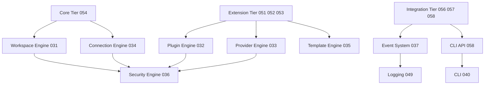

# 050 – SDK Overview

**Document ID:** DEVOS-SPEC-050

**Version:** 0.1

**Status:** Draft

**Category:** SDK

**Depends On:**

- DEVOS-SPEC-005 – Guiding Principles
- DEVOS-SPEC-006 – Terminology
- DEVOS-SPEC-007 – Scope
- DEVOS-SPEC-011 – Domain Model
- DEVOS-SPEC-014 – State Model
- DEVOS-SPEC-020 – Workspace Specification
- DEVOS-SPEC-030 – System Architecture

**Referenced By:**

- All SDK specifications (DEVOS-SPEC-051 through DEVOS-SPEC-059)

---

# Abstract

This document defines the DevOS SDK layer: the programmatic surface through which external code observes, manipulates, extends, and automates the platform.

It fixes what every DevOS SDK promises, to whom, and under which stability rules.

The SDK layer is a set of contracts, not a library; language bindings are implementations of these contracts and are judged by behavior alone.

Every capability an SDK exposes is a capability the CLI defined in DEVOS-SPEC-040 and the Dashboard defined in DEVOS-SPEC-041 already use.

---

# Purpose

This specification answers the following question:

> **What does the DevOS SDK layer promise, to whom, under what stability rules?**

It promises parity with first-party interfaces, organizes surfaces for three distinct audiences, and evolves them under an explicit stability ladder.

Programmatic access is ordinary access, never privileged access.

---

# Goals

This specification aims to:

- Establish the Parity Principle as the foundation of every SDK contract.
- Organize SDK surfaces into three tiers with clear audiences.
- Define the stability ladder governing change across all SDK specifications.
- Define binding independence so any language may conform behaviorally.
- Define cross-cutting contracts for errors, asynchronous work, security, and offline behavior.
- Provide the conformance checklist for bindings claiming compatibility.

---

# Non Goals

This specification does not define:

- Programming languages, libraries, or package formats
- Wire protocols or transport encodings
- Concrete API endpoint shapes, deferred to DEVOS-SPEC-055
- Hook payload schemas or event transport internals
- Version numbering mechanics, deferred to DEVOS-SPEC-059
- CLI commands or Dashboard interaction flows

---

# Definition

The SDK layer is the collection of specifications DEVOS-SPEC-051 through DEVOS-SPEC-059.

An SDK surface is any programmatic contract through which code outside the platform core invokes engine or platform-service behavior.

A binding is a concrete implementation of one or more SDK surfaces in a specific language environment.

Bindings are implementations; this layer owns semantics only.

---

# The Parity Principle

The Parity Principle is normative for every SDK specification.

SDKs expose the SAME capabilities that the CLI defined in DEVOS-SPEC-040 and the Dashboard defined in DEVOS-SPEC-041 use.

There is no hidden privileged API behind programmatic access.

Every SDK operation traverses the same authorization and validation gates as the equivalent first-party action.

Anything reachable through one conforming surface MUST be reachable through the others, or the difference MUST be documented as surface-specific presentation only.

Parity applies to capability, not ergonomics; a Dashboard wizard and an SDK call MAY differ in convenience while performing identical engine operations.

---

# SDK Tiers

SDK surfaces are organized into three tiers.

Each tier serves one primary audience and addresses specific engines.

| Tier        | Audience                                                   | Surface Docs                                   |
| ----------- | ---------------------------------------------------------- | ---------------------------------------------- |
| Core        | Developers manipulating Workspaces and owned objects.      | DEVOS-SPEC-054                                 |
| Extension   | Plugin, provider, and template authors extending DevOS.    | DEVOS-SPEC-051, DEVOS-SPEC-052, DEVOS-SPEC-053 |
| Integration | Automators wiring events, hooks, and command-line tooling. | DEVOS-SPEC-056, DEVOS-SPEC-057, DEVOS-SPEC-058 |

Two umbrella specifications apply across all tiers.

DEVOS-SPEC-055 defines the shared API rules for errors, asynchronous results, and security posture.

DEVOS-SPEC-059 defines versioning and compatibility for every tier.

Tiers address engines; they never bypass them.

---

# Binding Independence

DevOS SDK specifications define SEMANTICS, not syntax.

Language bindings are implementations judged behaviorally, never by API-shape equality.

Conformance means satisfying the behavioral checklist for the claimed tier.

A binding MAY adopt idiomatic naming, packaging, and error representation for its language.

A binding MUST NOT rename concepts in ways that obscure the semantic contracts of this layer.

Behavioral equivalence is the only accepted proof of compatibility.

---

# The Stability Ladder

Every SDK capability sits on exactly one rung of the stability ladder.

| Rung         | Guarantee                                   | Change Rules                                                       |
| ------------ | ------------------------------------------- | ------------------------------------------------------------------ |
| Experimental | MAY break in any release without notice.    | MUST be explicitly marked; MUST NOT gate core functionality.       |
| Stable       | SemVer guarantees apply per DEVOS-SPEC-059. | Breaking change requires a major version bump and migration notes. |
| Deprecated   | Remains functional until removal.           | Removal only after the notice window required by Rule 18.          |

Movement is upward only: Experimental promotes to Stable, and Stable deprecates before removal.

A capability MUST NOT silently fall from Stable back to Experimental.

A deprecation notice SHOULD name the replacement capability and MUST remain visible until removal completes.

---

# Cross-Cutting Contracts

The contracts below bind every tier and are elaborated in DEVOS-SPEC-055.

## Error Model

SDK operations return typed errors carrying a machine-readable reasonCode.

Reason codes draw from the canonical vocabularies established in DEVOS-SPEC-031, such as the validation.*, ownership.*, and state.conflict families.

Every error carries a correlationId compatible with the correlation discipline shared by DEVOS-SPEC-037 and DEVOS-SPEC-049.

Errors identify failures using identifiers and reason codes and never quote sensitive material.

## Async Model

Long-running operations report observable states from DEVOS-SPEC-014 rather than blocking blindly.

Consumers MAY observe progress and request cancellation for long operations.

Cancellation is conceptual in this layer: a cancelled operation stops producing effects and reports its terminal state honestly.

Request-scoped bookkeeping MUST NOT leak into Workspace object state, consistent with DEVOS-SPEC-039.

## Security Rules for Consumers

RAW SECRET VALUES ARE NEVER EXPOSED through ANY SDK surface.

Secret resolution stays inside the Security Engine defined in DEVOS-SPEC-036, implementing the absolute rules of DEVOS-SPEC-028.

SDK consumers hold least-privilege handles: references, identifiers, and granted scopes, never confidential material.

Deny-by-default applies to every SDK-initiated capability request, and uncertain authorization resolves to denial.

Debug modes, verbose logging, and export helpers inherit every prohibition of DEVOS-SPEC-028 without exception.

## Offline First Obligations

No mandatory network exists in any core tier.

Every Core-tier and Extension-tier operation MUST complete offline wherever the addressed engine operates offline, preserving Rule 7.

Network-dependent capabilities are enhancements that report Unavailable or Degraded honestly when unreachable.

Bindings MUST NOT require connectivity for discovery, validation, or local state inspection.

---

# Conformance Checklist

A binding claiming "DevOS SDK compatible v0" for a tier MUST satisfy every item below for that tier's scope.

- [ ] Exposes every Stable capability of its claimed scope with documented parity to first-party interfaces.
- [ ] Returns typed errors carrying canonical reasonCode values and a correlationId on every failure.
- [ ] Reports long operations using states defined in DEVOS-SPEC-014 without inventing new global states.
- [ ] Never returns a raw secret value from any call, callback, stream, dump, or debug mode.
- [ ] Applies deny-by-default permission checks and fails closed on uncertain authorization.
- [ ] Completes all core-scope operations offline; network remains an optional enhancement.
- [ ] Evaluates compatibility and honors deprecation notice windows per DEVOS-SPEC-059 and Rule 18.
- [ ] Passes the behavioral checklist defined by each claimed surface specification.

Partial conformance MUST be stated precisely, naming the exact surfaces covered.

---

# Reading Order

New SDK readers SHOULD proceed in this order.

| Document       | Title             | One-Line Promise                                              |
| -------------- | ----------------- | ------------------------------------------------------------- |
| DEVOS-SPEC-051 | Plugin SDK        | What plugin authors write, declare, and receive at runtime.    |
| DEVOS-SPEC-052 | Provider SDK      | How adapters implement replaceable capability providers.       |
| DEVOS-SPEC-053 | Template SDK      | How template authors parameterize safe creation flows.         |
| DEVOS-SPEC-054 | Workspace SDK     | The object manipulation surface over the Workspace aggregate.  |
| DEVOS-SPEC-055 | API Specification | Umbrella rules unifying errors, async, and security posture.   |
| DEVOS-SPEC-056 | Hooks API         | Synchronous extension points with bounded veto semantics.      |
| DEVOS-SPEC-057 | Events API        | Asynchronous subscription and publication on public topics.    |
| DEVOS-SPEC-058 | CLI API           | Automation parity with the command line interface.             |
| DEVOS-SPEC-059 | Versioning Policy | Compatibility ranges, SemVer guarantees, deprecation windows.  |

---

# SDK Layer Invariants

The following invariants MUST always hold.

- SDKs expose the same capabilities as first-party interfaces; no hidden privileged API exists.
- Every SDK operation maps to an engine or platform service; SDKs add no authority of their own.
- Raw secret values never cross any SDK boundary in any direction.
- Undeclared capabilities do not exist at runtime for any SDK consumer.
- Bindings conform by behavior, never by symbol-level shape.
- Stability rungs never regress silently; promotion and deprecation follow DEVOS-SPEC-059.
- No core-tier SDK operation requires network connectivity.

---

# Future Extensions

Future SDK specifications may add support for:

- Remote agent integration surfaces aligned with DEVOS-SPEC-068
- Policy-aware and RBAC-aware handles through DEVOS-SPEC-062 and DEVOS-SPEC-063
- Marketplace distribution APIs through DEVOS-SPEC-070
- Additional tier refinements driven by binding implementation feedback

These extensions MUST preserve parity, tiering, and the stability ladder unless an approved ADR changes them.

---

# References

- DEVOS-SPEC-005 – Guiding Principles
- DEVOS-SPEC-006 – Terminology
- DEVOS-SPEC-007 – Scope
- DEVOS-SPEC-011 – Domain Model
- DEVOS-SPEC-014 – State Model
- DEVOS-SPEC-020 – Workspace Specification
- DEVOS-SPEC-026 – Plugin Specification
- DEVOS-SPEC-030 – System Architecture
- DEVOS-SPEC-031 – Workspace Engine
- DEVOS-SPEC-037 – Event System
- DEVOS-SPEC-040 – CLI
- DEVOS-SPEC-041 – Dashboard
- DEVOS-SPEC-049 – Logging
- SPECIFICATION_RULES.md – Repository rule set (Rules 7, 18)
- DEVOS-SPEC-051 through DEVOS-SPEC-059 – SDK specifications

---

# Revision History

| Version | Date | Author             | Notes         |
| ------- | ---- | ------------------ | ------------- |
| 0.1     | TBD  | DevOS Contributors | Initial Draft |
