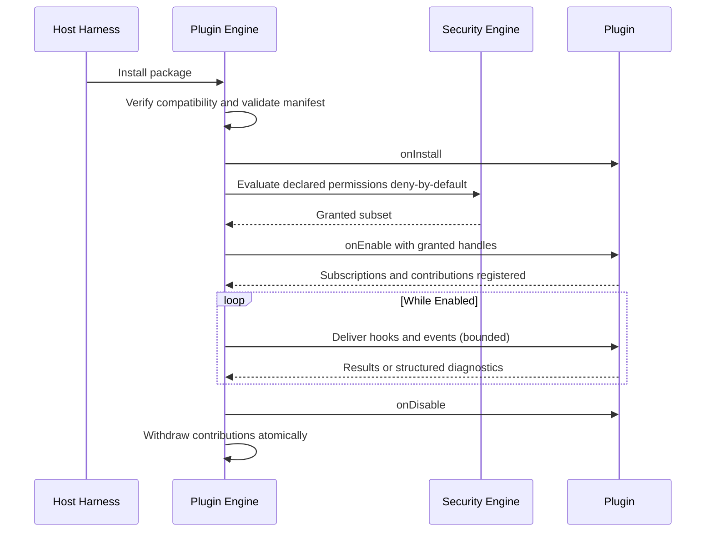

# 051 – Plugin SDK

**Document ID:** DEVOS-SPEC-051

**Version:** 0.1

**Status:** Draft

**Category:** SDK

**Depends On:**

- DEVOS-SPEC-005 – Guiding Principles
- DEVOS-SPEC-006 – Terminology
- DEVOS-SPEC-007 – Scope
- DEVOS-SPEC-011 – Domain Model
- DEVOS-SPEC-014 – State Model
- DEVOS-SPEC-020 – Workspace Specification
- DEVOS-SPEC-026 – Plugin Specification
- DEVOS-SPEC-030 – System Architecture
- DEVOS-SPEC-032 – Plugin Engine
- DEVOS-SPEC-036 – Security Engine
- DEVOS-SPEC-037 – Event System
- DEVOS-SPEC-059 – Versioning Policy

**Referenced By:**

- DEVOS-SPEC-026 – Plugin Specification
- DEVOS-SPEC-032 – Plugin Engine
- DEVOS-SPEC-055 – API Specification
- DEVOS-SPEC-056 – Hooks API
- DEVOS-SPEC-057 – Events API
- DEVOS-SPEC-070 – Marketplace

---

# Abstract

This document defines the Plugin SDK, the Extension-tier contract through which authors build DevOS plugins.

It specifies exactly what a plugin author writes, declares, and receives: the manifest surface, lifecycle callbacks, permission strings, contributions, storage rules, and event programming rules.

The SDK binds the Plugin contract of DEVOS-SPEC-026 to the runtime guarantees of the Plugin Engine defined in DEVOS-SPEC-032 and the deny-by-default evaluation of the Security Engine defined in DEVOS-SPEC-036.

---

# Purpose

This specification answers the following question:

> **What exactly does a plugin author write, declare, and receive?**

Authors write one declarative manifest plus small bounded callbacks; they declare permissions and contributions upfront; they receive exactly the granted subset as host-provided handles, and nothing more.

Everything static lives in the manifest, everything dynamic happens inside callbacks, and anything undeclared does not exist at runtime.

---

# Goals

This specification aims to:

- Define the conceptual manifest surface a plugin author produces.
- Define lifecycle callbacks and the guarantees attached to each.
- Define the permission declaration grammar and its deny-by-default receipt.
- Recap the contribution types available to enabled plugins.
- Define plugin-local storage, event programming, and error reporting rules.
- Define packaging, testing expectations, and security obligations for authors.

---

# Non Goals

This specification does not define:

- Package archive formats or loading mechanics
- Hook payload schemas, deferred to DEVOS-SPEC-056
- Event transport internals, deferred to DEVOS-SPEC-057
- Marketplace distribution policy, deferred to DEVOS-SPEC-070
- Specific language bindings or their idioms

---

# Author Model

A plugin author produces one manifest and a set of lifecycle callbacks.

The host harness loads the manifest, verifies compatibility per DEVOS-SPEC-059, evaluates declared permissions per DEVOS-SPEC-036, and invokes callbacks with granted handles only.

Authors never touch engines directly; every engine interaction arrives as an injected handle scoped to the grant.

This keeps authors inside the public-interface boundary mandated by DEVOS-SPEC-026.

---

# Manifest Surface

The manifest is the declarative half of every plugin.

| Field               | Required | Description                                                    |
| ------------------- | -------- | -------------------------------------------------------------- |
| id                  | Yes      | Stable plugin identifier unique inside the owning Workspace.   |
| name                | Yes      | Human-readable plugin name.                                    |
| version             | Yes      | Plugin version inside its compatibility range.                 |
| compatibility range | Yes      | Supported platform version span, evaluated per DEVOS-SPEC-059. |
| permissions[]       | No       | Scoped capability strings requested upfront.                   |
| contributions{}     | No       | Declared contribution entries validated at load time.          |
| entry descriptor    | Yes      | Binding-defined pointer to the enablement logic.               |

The fields above are semantic; bindings MAY encode them differently while preserving meaning.

Validation of every field follows DEVOS-SPEC-026 before any callback runs.

---

# Lifecycle Callbacks

Callbacks are the dynamic half of every plugin.

The names below are conceptual; bindings MAY rename them while preserving semantics.

| Callback    | Invoked When                                            | Author Guarantee                                                        |
| ----------- | ------------------------------------------------------- | ----------------------------------------------------------------------- |
| onInstall   | After staging succeeds and before Installed state.      | Idempotent and bounded; failure aborts install with no residue.         |
| onEnable    | After permission grants are applied by the engine.      | Idempotent and bounded; registers subscriptions and contributions only. |
| onDisable   | Before subscriptions and contributions are withdrawn.   | Idempotent and bounded; releases resources without deleting state.      |
| onUpdate    | During Updating state, before the new version activates. | Tolerates prior-version data; failure triggers rollback per DEVOS-SPEC-032. |
| onUninstall | During lifecycle Deletion, before artifacts are removed.| Final cleanup; MUST NOT assume any later callback runs.                 |

Every callback is invoked by the host, never scheduled by the plugin itself.

Failure inside any callback is contained per DEVOS-SPEC-032 and maps the plugin to Failed state rather than crashing anything.

Disable MUST succeed even from Failed state, providing the recovery path required by DEVOS-SPEC-014.

---

# Permission Declaration

Permissions are requested as scoped strings following the grammar "<domain>:<capability>", optionally extended with ":<scope-pattern>" where the domain supports scoping.

The strings below are illustrative examples of the grammar.

| Example String                     | Meaning                                                      |
| ---------------------------------- | ------------------------------------------------------------ |
| workspace:read                     | Read Workspace objects through the Core tier.                |
| events:subscribe:devos.connection.* | Subscribe to matching public topics per DEVOS-SPEC-057.     |
| templates:contribute               | Add Templates to the shared pool per DEVOS-SPEC-035.         |
| ai:invoke                          | Request AI capability through the AI Router.                 |

Receipt follows deny-by-default: undeclared capability is unavailable capability, evaluated exclusively by the Security Engine defined in DEVOS-SPEC-036.

A plugin receives exactly its granted subset and nothing more.

Grants carry scope, are revocable, and revocation takes effect on subsequent evaluations without reinstallation.

---

# Contribution Types

Enabled plugins extend DevOS exclusively through declared contributions, recapitulated from DEVOS-SPEC-032.

| Contribution       | Destination                                      | Governing Specification |
| ------------------ | ------------------------------------------------ | ----------------------- |
| commands           | User-facing command surface.                     | DEVOS-SPEC-026          |
| templates          | Shared template pool.                            | DEVOS-SPEC-035          |
| providers          | Workspace-scoped provider registry.              | DEVOS-SPEC-033          |
| hooks              | Public hook interfaces with veto semantics.      | DEVOS-SPEC-056          |
| topics             | Subscriptions and publications on public topics. | DEVOS-SPEC-057          |
| dashboard surfaces | Conceptual Dashboard extension surfaces.         | DEVOS-SPEC-041          |

Contributions take effect only while the plugin is Enabled.

Disabling or deleting the plugin withdraws its contributions atomically.

Provenance identifies the contributing plugin wherever a contribution appears.

---

# Storage Rules

Plugin-local state lives under the Workspace boundary inside a namespace derived from the plugin identifier.

Plugins MUST NOT write outside their namespace.

Namespaced state dies completely at uninstall, alongside artifacts, subscriptions, contributions, and provenance records.

Growth guidance is abstract: keep stored state proportional to function, because hosts MAY impose size limits.

Storage obeys every Workspace export and validation rule; it MUST NOT become a side channel around the aggregate boundary.

---

# Event and Hook Programming Rules

A plugin subscribes only to topics its grants cover, and subscriptions naming unknown public interfaces are rejected per DEVOS-SPEC-032.

Handlers MUST be bounded in time; long work belongs in asynchronous follow-up, never inside a delivery path.

Veto power exists ONLY through declared hooks as defined in DEVOS-SPEC-056; plain event subscribers observe but never block.

Publications target only public topics the plugin is granted, and payloads MUST NOT contain secret values per DEVOS-SPEC-028.

Delivery order and transport are owned by the Event System defined in DEVOS-SPEC-037; plugins MUST NOT assume ordering beyond what that specification guarantees.

---

# Error Reporting Contract

Plugin failures surface as structured diagnostics, never as crashes or silent swallowing.

Diagnostics carry a reasonCode drawn from canonical vocabularies and a correlationId consistent with DEVOS-SPEC-037 and DEVOS-SPEC-049, matching the cross-cutting error model of DEVOS-SPEC-050.

Unhandled faults map the plugin to Failed state per DEVOS-SPEC-014 while other plugins continue unaffected.

Recovery follows the Disable path, never implicit retry storms.

---

# Packaging

Packages are immutable versioned artifacts carrying provenance metadata: origin, identifier, and version.

Provenance is recorded at discovery and preserved through install and update, and the engine MUST refuse candidates lacking it per DEVOS-SPEC-032.

Signing is encouraged; signature enforcement follows the roadmap deferred to DEVOS-SPEC-048 and DEVOS-SPEC-070 and MUST strengthen rather than weaken this document when introduced.

Update always produces a new immutable version; in-place mutation of installed artifacts never happens.

---

# Testing Expectations

A conforming host harness MUST be able to simulate plugin behaviors deterministically.

| Simulatable Behavior  | Harness Obligation                                                 |
| --------------------- | ------------------------------------------------------------------ |
| Lifecycle transitions | Drive install, enable, disable, update, and uninstall in sequence. |
| Permission denial     | Present denied grants and verify containment and Failed mapping.   |
| Event delivery        | Inject synthetic topics without network or live engines.           |
| Hook veto path        | Exercise declared hooks with controlled outcomes per DEVOS-SPEC-056.|
| Failure containment   | Force handler faults and assert isolation per DEVOS-SPEC-032.      |

Plugins tested against a conforming harness behave identically under real engines, because callbacks see handles, not environments.

---

# Security Requirements

The following obligations are numbered and normative.

1. A plugin MUST NEVER receive ambient secret access; secret values arrive only through authorized resolution permitted by DEVOS-SPEC-028 and performed by DEVOS-SPEC-036.
2. A plugin MUST NOT perform network access outside its declared and granted capabilities, preserving Offline First behavior.
3. A plugin MUST NEVER modify the core platform or bypass public interfaces; this restates Rule 6 normatively.
4. A plugin MUST NOT write outside its storage namespace or alter objects it does not own.
5. A plugin MUST NOT place secret values into logs, diagnostics, events, or contributed payloads.

Violating any item above is a defect above all functional defects, consistent with DEVOS-SPEC-028.

---

# Illustrative Sketch

The following sketch is illustrative neutral pseudocode and non-normative.

```text
plugin manifest:
  id: example-greeter
  name: Example Greeter
  version: 1.0.0
  compatibility: ">=0.1 <1.0"
  permissions:
    - events:subscribe:devos.connection.*
    - commands:contribute
  contributions:
    commands:
      - id: greet

onEnable(context):
  # context exposes exactly the granted handles.
  context.events.subscribe("devos.connection.connected", handleConnected)
  context.commands.register("greet", runGreet)
  return Ok

onDisable(context):
  context.releaseAll()   # host withdraws remaining registrations atomically
  return Ok
```

---

# Interaction Flow

One diagram shows install through disable together.



---

# Plugin SDK Invariants

The following invariants MUST always hold.

- Authors write declarations and bounded callbacks only; all authority remains with the host.
- A plugin receives exactly its granted permission subset and nothing more.
- Undeclared capabilities do not exist at runtime.
- Every callback is idempotent and time-bounded; failures are contained per DEVOS-SPEC-032.
- Plugin-local state dies completely at uninstall.
- Veto power exists only through declared hooks.
- A failing plugin reports Failed and never crashes the platform.
- Secret values never appear in any plugin-visible surface except authorized transient resolution.

---

# Future Extensions

Future Plugin SDK specifications may add support for:

- Sandboxed execution profiles with graded isolation levels
- Marketplace attestation and signed-package enforcement through DEVOS-SPEC-070
- Inter-plugin contracts within a Workspace
- Cross-Workspace plugin sharing

These extensions MUST preserve the isolation mandate and deny-by-default granting without an approved ADR.

---

# References

- DEVOS-SPEC-005 – Guiding Principles
- DEVOS-SPEC-006 – Terminology
- DEVOS-SPEC-007 – Scope
- DEVOS-SPEC-011 – Domain Model
- DEVOS-SPEC-014 – State Model
- DEVOS-SPEC-020 – Workspace Specification
- DEVOS-SPEC-026 – Plugin Specification
- DEVOS-SPEC-028 – Secret Specification
- DEVOS-SPEC-030 – System Architecture
- DEVOS-SPEC-032 – Plugin Engine
- DEVOS-SPEC-033 – Provider Engine
- DEVOS-SPEC-035 – Template Engine
- DEVOS-SPEC-036 – Security Engine
- DEVOS-SPEC-037 – Event System
- DEVOS-SPEC-041 – Dashboard
- DEVOS-SPEC-048 – Update System
- DEVOS-SPEC-050 – SDK Overview
- SPECIFICATION_RULES.md – Repository rule set (Rules 6, 7)
- DEVOS-SPEC-055 – API Specification
- DEVOS-SPEC-056 – Hooks API
- DEVOS-SPEC-057 – Events API
- DEVOS-SPEC-059 – Versioning Policy
- DEVOS-SPEC-070 – Marketplace

---

# Revision History

| Version | Date | Author             | Notes         |
| ------- | ---- | ------------------ | ------------- |
| 0.1     | TBD  | DevOS Contributors | Initial Draft |
