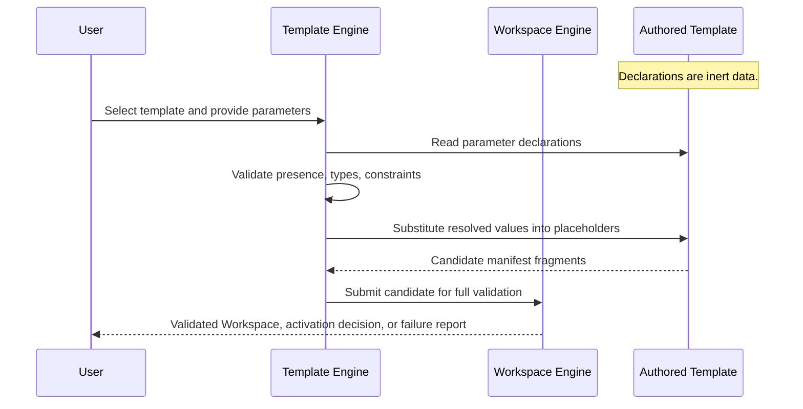

# 053 – Template SDK

**Document ID:** DEVOS-SPEC-053

**Version:** 0.1

**Status:** Draft

**Category:** SDK

**Depends On:**

- DEVOS-SPEC-005 – Guiding Principles
- DEVOS-SPEC-006 – Terminology
- DEVOS-SPEC-007 – Scope
- DEVOS-SPEC-011 – Domain Model
- DEVOS-SPEC-014 – State Model
- DEVOS-SPEC-020 – Workspace Specification
- DEVOS-SPEC-026 – Plugin Specification
- DEVOS-SPEC-027 – Template Specification
- DEVOS-SPEC-028 – Secret Specification
- DEVOS-SPEC-029 – Workspace Manifest
- DEVOS-SPEC-030 – System Architecture
- DEVOS-SPEC-035 – Template Engine
- DEVOS-SPEC-036 – Security Engine
- DEVOS-SPEC-059 – Versioning Policy

**Referenced By:**

- DEVOS-SPEC-027 – Template Specification
- DEVOS-SPEC-032 – Plugin Engine
- DEVOS-SPEC-035 – Template Engine
- DEVOS-SPEC-050 – SDK Overview
- DEVOS-SPEC-055 – API Specification
- DEVOS-SPEC-070 – Marketplace

---

# Abstract

This document defines the Template SDK, the Extension-tier contract through which authors create DevOS Templates.

It specifies what a template author writes and declares: the manifest surface, the parameter declaration grammar, the static structure, substitution placeholders, provenance fields, and packaging duties.

The SDK binds the Template contract of DEVOS-SPEC-027 to the deterministic execution guarantees of the Template Engine defined in DEVOS-SPEC-035.

Templates are pure data; authoring one requires no code and grants no capabilities beyond declaration.

---

# Purpose

This specification answers the following question:

> **What exactly does a template author write, declare, and promise?**

Authors write one declarative manifest plus a static structure containing placeholders.

They declare typed parameters with defaults and constraints upfront.

They promise determinism: identical inputs yield equivalent output, and nothing dynamic ever enters generation.

Everything executable is out of scope by design.

---

# Goals

This specification aims to:

- Define the conceptual manifest surface a template author produces.
- Define the parameter declaration grammar with types, defaults, and constraints.
- Define placeholder syntax obligations and substitution scope from the author side.
- Define permitted outputs, including Secret references.
- Define determinism promises every template makes implicitly.
- Define the plugin contribution path for templates.
- Define packaging, testing expectations, and security obligations for authors.

---

# Non Goals

This specification does not define:

- Rendering internals or file layout conventions inside packages
- Registry distribution or marketplace mechanics, deferred to DEVOS-SPEC-070
- Manifest schema contents, owned by DEVOS-SPEC-029
- Instantiation execution mechanics, owned by DEVOS-SPEC-035
- Language bindings or their idioms

---

# Author Model

A template author produces one manifest and one static structure.

The host harness loads both, validates declarations per DEVOS-SPEC-027, and hands them to the Template Engine at instantiation time.

Authors never invoke engines, never execute during generation, and never observe instantiation directly.

Their entire contract is fulfilled before any instantiation begins.

This keeps authors fully inside the declarative-only rule mandated by DEVOS-SPEC-027.

---

# Manifest Surface

The manifest is the declarative entry point of every template.

| Field               | Required | Description                                                        |
| ------------------- | -------- | ------------------------------------------------------------------ |
| id                  | Yes      | Stable template identifier unique inside its scope.                |
| name                | Yes      | Human-readable template name.                                      |
| version             | Yes      | Template version evaluated per DEVOS-SPEC-059.                     |
| compatibility range | Yes      | Supported platform version span.                                   |
| parameters[]        | No       | Declared parameter entries validated before generation.            |
| structure           | Yes      | Static declarative content containing placeholders.               |
| provenance          | Yes      | Origin metadata recorded at registration and preserved thereafter. |

Fields above are semantic; bindings MAY encode them differently while preserving meaning.

A manifest whose defaults violate their own constraints is invalid per DEVOS-SPEC-027 and MUST NOT become Ready.

---

# Parameter Declaration Grammar

Every declared parameter carries exactly one type and optional controls.

| Attribute   | Required | Rule                                                                  |
| ----------- | -------- | --------------------------------------------------------------------- |
| name        | Yes      | Stable identifier referenced by placeholders in the structure.         |
| type        | Yes      | Exactly one of string, number, boolean, enum per DEVOS-SPEC-027.       |
| required    | Yes      | Required parameters have no default satisfiability path.               |
| default     | No       | Optional only; MUST satisfy its own constraints before use.            |
| description | Yes      | Human-readable explanation shown to callers before they supply values. |
| constraints | No       | Length, pattern, bound, or enumeration restrictions per type.          |

Declaration rules:

- Every constraint MUST be declarative and checkable without executing anything.
- Enumerations MUST enumerate their allowed values exhaustively.
- Two parameters in one template MUST NOT share a name.
- Placeholders referencing undeclared parameters are invalid and keep the template out of Ready state.

---

# Placeholder Obligations

Placeholders mark where resolved parameter values enter the static structure.

Author rules:

- Every placeholder MUST reference a declared parameter by exact name.
- Resolution follows fixed precedence: caller values first, then defaults, then nothing.
- A placeholder that can resolve from neither source makes the template invalid.
- Placeholders MUST NOT appear inside comments intended as documentation-only text, because substitution is purely textual within the declared structure.

Authors declare structure; the engine performs all substitution per the scope rules of DEVOS-SPEC-035.

---

# Permitted Outputs

Generation input consists of exactly the template definition and a validated parameter set, so authors control output entirely through declaration.

| Output                          | Permitted | Condition                                                     |
| ------------------------------- | --------- | ------------------------------------------------------------- |
| Project and Profile definitions  | Yes      | Must conform to the canonical manifest schema of DEVOS-SPEC-029. |
| Environment variables            | Yes      | Literal values or resolved parameter references only.          |
| Connection and Provider blocks   | Yes      | Credentials expressed as Secret references exclusively.        |
| Secret references                | Yes      | Identifiers and metadata only, never values, per DEVOS-SPEC-028. |
| Workflow and Task definitions    | Yes      | Declarative definitions conforming to their contracts.          |
| Executable code emitted or run   | No        | Prohibited outright by DEVOS-SPEC-027 and DEVOS-SPEC-035.      |

Templates MAY emit Secret references so created Workspaces prompt users to bind values through normal secret flows afterward.

---

# Determinism Promises

By declaring a template, an author promises that identical templates combined with identical parameters produce equivalent manifests.

Authors therefore MUST NOT rely on:

- randomness of any kind
- wall-clock time
- environment probes
- network lookups
- caller identity

Timestamp-like output values MUST derive from explicit parameters rather than from the clock.

Violating determinism breaks reproducibility guarantees downstream and is a conformance defect even when results look correct once.

---

# Contribution Path

Plugins MAY contribute templates, consistent with Plugin First and DEVOS-SPEC-032.

Contribution rules recapitulated for authors:

- Contributed templates enter the shared pool under identical rules as authored ones.
- Provenance records the contributing plugin identifier and version, visible to users before instantiation.
- Contribution grants no validation bypass and no extra capability.
- Disabling or removing the contributing plugin removes its contributions from the selectable pool atomically.
- Workspaces already created from contributed templates remain unaffected.

Template authors who need dynamic behavior should contribute a plugin with commands instead; templates themselves stay inert forever.

---

# Packaging

Packages are immutable versioned artifacts carrying complete provenance metadata: origin, identifier, and version.

Rules:

- Update always produces a new immutable version; in-place mutation never happens.
- The engine refuses candidates lacking provenance, consistent with DEVOS-SPEC-035.
- Local-first availability preserves Offline First behavior per Rule 7 of SPECIFICATION_RULES.md.
- Remote registry distribution is deferred to DEVOS-SPEC-070 and MUST strengthen rather than weaken this document when introduced.

---

# Testing Expectations

Because templates are pure data, conformance testing reduces to deterministic checks.

| Check                       | Harness Obligation                                                   |
| --------------------------- | -------------------------------------------------------------------- |
| Declaration validity        | Validate manifest fields and parameter grammar without engines.      |
| Constraint sanity           | Confirm every default satisfies its own constraints.                 |
| Deterministic instantiation | Instantiate twice with fixed inputs and assert semantic equivalence. |
| Missing-required rejection  | Omit a required parameter and assert rejection before generation.    |
| Reference integrity         | Assert no unresolved placeholder survives validation.                |

Templates passing these checks behave identically across conformant implementations because generation sees nothing but declarations and parameters.

---

# Illustrative Sketch

The following sketch is illustrative neutral pseudocode and non-normative.

```text
template manifest:
  id: service-template
  name: Example Service Template
  version: 1.0.0
  compatibility: ">=0.1 <1.0"
  parameters:
    - name: serviceName
      type: string
      required: true
      description: Name of the managed project.
      constraints:
        pattern: "^[a-z][a-z0-9-]*$"
    - name: logLevel
      type: enum
      required: false
      default: info
      description: Initial log level for the development profile.
      constraints:
        values: [debug, info, warn]
    - name: apiKeyRef
      type: string
      required: false
      description: Identifier of an existing Secret to reference.

structure:
  project:
    name: "${serviceName}"
  profiles:
    - name: development
      environment:
        variables:
          LOG_LEVEL: "${logLevel}"
  providers:
    - name: ai-assistant
      credentialSecretRef: "${apiKeyRef}"
```

---

# Instantiation Flow From the Author Side

One diagram shows how authored declarations travel into creation.



The template participates passively throughout; every arrow into it is a read.

---

# Conformance Checklist

A template claiming "DevOS SDK compatible v0" conformance MUST satisfy every item below.

- [ ] Validates against the manifest surface and parameter grammar defined here.
- [ ] Declares every placeholder target and resolves each from caller values or defaults.
- [ ] Carries complete provenance and an immutable versioned package.
- [ ] Contains no executable steps, no environment reads, no clock reads, and no secret values.
- [ ] Emits credentials exclusively as Secret references.
- [ ] Produces semantically equivalent output for identical inputs on repeated runs.
- [ ] Remains Ready-eligible only while its declarations validate cleanly.

---

# Template SDK Invariants

The following invariants MUST always hold.

- Templates are pure data; no authored artifact executes, ever.
- Authors declare; only engines resolve, substitute, and generate.
- Undeclared placeholders make templates invalid rather than resolving to empty.
- Defaults satisfy their own constraints before any template becomes Ready.
- Secret values never appear in any template field, placeholder, or generated output.
- Determinism holds identically across all conformant implementations.
- Contributed templates obey every rule that authored templates obey.

---

# Security Requirements

The following obligations are numbered and normative.

1. A template MUST NEVER contain a secret value in any field or encoding, restating DEVOS-SPEC-028 normatively.
2. A template MUST NOT read environment variables, files outside its own package, or any ambient source during generation.
3. A template MUST NOT request permissions, network access, or code execution anywhere in its declarations.
4. A contributed template MUST NOT gain authority from its contributing plugin beyond ordinary participation in the pool.
5. Any future executable step requires an explicit consent model approved through an ADR before it may exist in this specification.

Violating any item above is a defect above all functional defects.

---

# Future Extensions

Future Template SDK specifications may add support for:

- Template inheritance and composition declarations
- Signed template packages with attestation through DEVOS-SPEC-070
- Dry-run preview surfaces exposing candidate manifests before creation
- Organization-level parameter policies through DEVOS-SPEC-063

These extensions MUST preserve the declarative-only rule, determinism, and the single Workspace aggregate model unless an approved ADR changes them.

---

# References

- DEVOS-SPEC-005 – Guiding Principles
- DEVOS-SPEC-006 – Terminology
- DEVOS-SPEC-007 – Scope
- DEVOS-SPEC-011 – Domain Model
- DEVOS-SPEC-014 – State Model
- DEVOS-SPEC-020 – Workspace Specification
- DEVOS-SPEC-026 – Plugin Specification
- DEVOS-SPEC-027 – Template Specification
- DEVOS-SPEC-028 – Secret Specification
- DEVOS-SPEC-029 – Workspace Manifest
- DEVOS-SPEC-030 – System Architecture
- SPECIFICATION_RULES.md – Repository rule set (Rules 6, 7)
- DEVOS-SPEC-032 – Plugin Engine
- DEVOS-SPEC-035 – Template Engine
- DEVOS-SPEC-036 – Security Engine
- DEVOS-SPEC-050 – SDK Overview
- DEVOS-SPEC-055 – API Specification
- DEVOS-SPEC-059 – Versioning Policy
- DEVOS-SPEC-063 – Policy Engine
- DEVOS-SPEC-070 – Marketplace

---

# Revision History

| Version | Date | Author             | Notes         |
| ------- | ---- | ------------------ | ------------- |
| 0.1     | TBD  | DevOS Contributors | Initial Draft |
