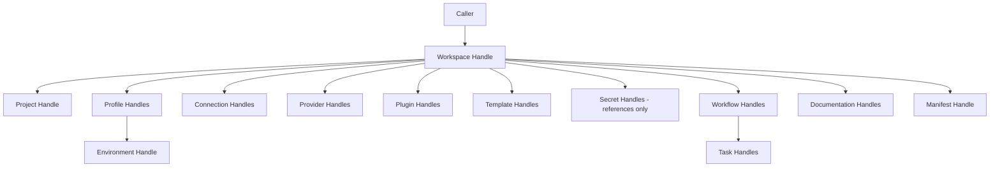

# 054 – Workspace SDK

**Document ID:** DEVOS-SPEC-054

**Version:** 0.1

**Status:** Draft

**Category:** SDK

**Depends On:**

- DEVOS-SPEC-005 – Guiding Principles
- DEVOS-SPEC-006 – Terminology
- DEVOS-SPEC-007 – Scope
- DEVOS-SPEC-011 – Domain Model
- DEVOS-SPEC-013 – Object Lifecycle
- DEVOS-SPEC-014 – State Model
- DEVOS-SPEC-015 – Object Ownership
- DEVOS-SPEC-020 – Workspace Specification
- DEVOS-SPEC-029 – Workspace Manifest
- DEVOS-SPEC-030 – System Architecture
- DEVOS-SPEC-031 – Workspace Engine
- DEVOS-SPEC-036 – Security Engine
- DEVOS-SPEC-044 – Workspace Lifecycle
- DEVOS-SPEC-059 – Versioning Policy

**Referenced By:**

- DEVOS-SPEC-020 – Workspace Specification
- DEVOS-SPEC-029 – Workspace Manifest
- DEVOS-SPEC-037 – Event System
- DEVOS-SPEC-050 – SDK Overview
- DEVOS-SPEC-055 – API Specification

---

# Abstract

This document defines the Workspace SDK, the Core-tier contract through which developers observe and manipulate Workspaces and every object inside them.

It organizes the surface into scoped handles, one per aggregate member, and fixes the operations each handle exposes, the guarantees each operation carries, and the boundaries none may cross.

Every operation traverses the Workspace Engine defined in DEVOS-SPEC-031 under the operational contract of DEVOS-SPEC-044.

The SDK adds no authority of its own; it packages engine capabilities for programmatic callers.

---

# Purpose

This specification answers the following question:

> **How does external code manipulate a Workspace and its objects safely, completely, and identically to first-party tools?**

Callers receive workspace-scoped handles that expose exactly the lifecycle operations of DEVOS-SPEC-044 and the ownership-respecting manipulation rights of DEVOS-SPEC-015.

There is no back door around engines and no privileged path beside the CLI and Dashboard.

---

# Goals

This specification aims to:

- Define handle scoping over the Workspace aggregate.
- Define the workspace-level operation set mirroring DEVOS-SPEC-044.
- Define object-level manipulation rights per aggregate member.
- Define reference discipline for secrets and cross-object links.
- Define long-operation observation and cancellation duties.
- Define export and import programmatic contracts.
- Provide the conformance checklist for bindings claiming this tier.

---

# Non Goals

This specification does not define:

- Error, async, and security mechanics beyond recapitulation, unified in DEVOS-SPEC-055
- Event subscription surfaces, owned by DEVOS-SPEC-057
- Hook interception points, owned by DEVOS-SPEC-056
- CLI grammar, owned by DEVOS-SPEC-058
- Language binding idioms or packaging formats
- Multi-Workspace aggregation, excluded from Version 0.1

---

# Handle Model

All access flows through handles.

A handle binds one caller to exactly one object inside exactly one Workspace.

| Rule                | Normative Requirement                                                   |
| ------------------- | ----------------------------------------------------------------------- |
| Single scope        | A handle operates on one Workspace; it MUST NOT reach other Workspaces. |
| Derived authority   | A handle exposes only operations the addressed object contract permits. |
| No ambient access   | Code holding no handle sees nothing; there is no global context object. |
| Explicit lifecycle  | Handles are acquired through explicit open operations and released explicitly or by scope exit. |
| Least privilege     | Handles carry scopes granted deny-by-default per DEVOS-SPEC-036.         |

Handles are inert references.

Authority lives in engines; handles merely address them.



The graph mirrors the ownership tree of DEVOS-SPEC-015 exactly; handles never flatten or bypass it.

---

# Workspace-Level Operations

A workspace handle exposes exactly the operations defined in DEVOS-SPEC-044.

| Operation | Handle Method Semantics                                        | Returns                                            |
| --------- | --------------------------------------------------------------- | -------------------------------------------------- |
| Create    | Materialize a new Workspace draft with assigned identity.       | New handle bound to the Created draft.             |
| Configure | Capture declared configuration on the draft.                    | Success or attributed findings.                    |
| Validate  | Run the full pipeline of DEVOS-SPEC-029 through the engine.     | Findings list or eligibility confirmation.         |
| Activate  | Evaluate the activation gate atomically.                        | Active confirmation or guard-failed attribution.   |
| Archive   | Retire the Workspace immutably.                                 | Archived confirmation.                             |
| Delete    | Cascade across the aggregate and cut off secret resolution.     | Deleted confirmation; handle invalid afterward.    |
| Export    | Assemble the portable bundle, references-not-secrets.           | Bundle reference.                                  |
| Import    | Materialize an unvalidated Created draft from a bundle.         | New handle bound to the imported draft.            |

Recapitulation rules:

- Preconditions, guards, and side effects are exactly those of DEVOS-SPEC-044; this tier adds none.
- State-conflict outcomes surface as typed errors carrying `state.conflict` codes per DEVOS-SPEC-031.
- Read operations remain available during mutations, so inspection methods never block on the exclusivity rule.

---

# Object-Level Manipulation Rights

Child-object handles expose manipulation rights bounded by their owning contracts.

| Handle      | May Do                                                                  | Must Never Do                                     |
| ----------- | ----------------------------------------------------------------------- | ------------------------------------------------- |
| Project     | Read and update the single Project per DEVOS-SPEC-021.                  | Create a second Project or exist without its Workspace. |
| Profile     | Add, update, remove Profiles; select defaults per DEVOS-SPEC-022.       | Leave a Profile without its embedded Environment.  |
| Environment | Read and update variables and runtime configuration per DEVOS-SPEC-023. | Detach from its Profile or shadow another Environment. |
| Connection  | Register, update, test, remove Connections per DEVOS-SPEC-025.          | Store credentials inline.                          |
| Provider    | Register, update, replace Providers per DEVOS-SPEC-024.                 | Address vendors instead of capabilities.           |
| Plugin      | Install, enable, disable, update Plugins through DEVOS-SPEC-032.        | Grant permissions to itself.                       |
| Template    | List Ready Templates and instantiate per DEVOS-SPEC-027.                | Execute anything contributed by a Template.        |
| Secret      | Manage references and trigger rotation per DEVOS-SPEC-028.              | Read, return, log, or export any value.            |
| Workflow    | Define Workflows and Tasks; request runs per their contracts.           | Outlive deletion of its Workspace.                 |
| Documentation | Register and update documentation entries.                            | Bypass Workspace ownership.                        |
| Manifest    | Read the manifest and propose changes through Configure flows.          | Mutate objects outside declarative flows.           |

Every mutation revalidates affected aggregates through the engine before commit.

Invalid mutations fail with attributed findings and leave stored state untouched.

---

# Reference Discipline

Objects link to each other through stable references, never embedding copies.

Rules:

- Cross-object links use identifiers resolvable inside the owning Workspace.
- Secret links are references exclusively; raw values are unwritable and unreadable through this tier, restating DEVOS-SPEC-028.
- Deleting an object referenced elsewhere follows the active-reference rules of DEVOS-SPEC-013; the engine rejects or remaps, never dangling.
- Import-time identifier remapping updates references transparently per DEVOS-SPEC-029, and handles obtained before remap report staleness honestly.

Reference integrity is validated by the Relationship stage of the pipeline on every mutation.

---

# Long-Running Operations

Some operations, notably Validate on large aggregates, Export, Import, and Delete cascades, take meaningful time.

Observation duties:

- Long operations expose observable progress mapped to states defined in DEVOS-SPEC-014 without inventing new ones.
- Callers MAY subscribe to completion through the events surface of DEVOS-SPEC-057 using the correlation identifier returned at submission.
- Callers MAY request cancellation; cancellation stops producing effects and reports the terminal state honestly, per the async model of DEVOS-SPEC-050.
- Busy reporting remains authoritative during any mutation, and conflicting submissions receive `state.conflict` immediately.

Bindings MAY present polling or callback styles; both satisfy this section when grounded in the same observable states.

---

# Export and Import Contracts

Programmatic portability mirrors the operational contract exactly.

Export rules:

- The bundle contains the complete aggregate and references between owned objects.
- Raw secret values never enter a bundle, enforced with the Security Engine per DEVOS-SPEC-028.
- Export never changes the source lifecycle stage.

Import rules:

- Import yields an unvalidated Created draft regardless of exporter claims.
- Identifiers MAY remap on conflict, recorded as identity mappings per DEVOS-SPEC-029.
- Full revalidation precedes any activation attempt; trust never imports.

Round-trip equivalence of DEVOS-SPEC-029 applies verbatim to bundles produced through this tier.

---

# Illustrative Sketch

The following sketch is illustrative neutral pseudocode and non-normative.

```text
handle = devos.open(workspaceId, scope: [read, mutate])
ws = handle.workspace()

ws.validate():
  findings = engine.runPipeline(ws.manifest())
  return findings.attributed()      # object, clause, stage per finding

ws.activate():
  outcome = engine.activate(ws)
  if outcome.blocked:
    return Error(reasonCode: "guard.failed.activation-gate",
                 details: outcome.unsatisfiedClauses,
                 correlationId: outcome.correlationId)
  return Ok(outcome.activeHandle)

profiles = ws.profiles.add(name: "staging")
profiles.default.environment.variables.set(LOG_LEVEL: "warn")

secretRef = ws.secrets.reference(id: "ai-provider-key")   # metadata only
ws.providers.add(name: "ai-assistant", credentialSecretRef: secretRef)

bundle = ws.export()
newHandle = devos.import(bundle)     # arrives Created and unvalidated
```

---

# Conformance Checklist

A binding claiming "DevOS SDK compatible v0" Core-tier conformance MUST satisfy every item below.

- [ ] Exposes all eight Workspace-level operations with DEVOS-SPEC-044 semantics and no added preconditions.
- [ ] Scopes every handle to one Workspace and grants nothing ambient.
- [ ] Mirrors the ownership tree in handle structure without flattening.
- [ ] Rejects inline credentials and returns no secret values from any call, dump, or debug mode.
- [ ] Surfaces validation findings attributed to object, clause, and stage.
- [ ] Maps state conflicts to `state.conflict` typed errors without queuing.
- [ ] Preserves round-trip equivalence for exported and imported bundles.
- [ ] Reports long operations through canonical states with honest cancellation.

---

# Workspace SDK Invariants

The following invariants MUST always hold.

- Every operation maps onto an engine capability; the tier adds no authority.
- One handle addresses one object in one Workspace, always.
- Ownership rules of DEVOS-SPEC-015 are structurally inexpressible to violate.
- Raw secret values never cross this boundary in either direction.
- Programmatic access equals first-party access; no hidden privileged API exists.
- Imported drafts always begin unvalidated at Created.
- Deletion of a Workspace invalidates every handle derived from it.

---

# Security Requirements

The following obligations are numbered and normative.

1. A binding MUST evaluate every capability request deny-by-default through the Security Engine defined in DEVOS-SPEC-036 and fail closed on uncertainty.
2. A binding MUST NEVER return, cache, log, or export a raw secret value from any surface, consistent with DEVOS-SPEC-028.
3. A binding MUST NOT offer operations outside the catalogs of DEVOS-SPEC-044 and the object contracts of DEVOS-SPEC-020 through DEVOS-SPEC-028.
4. A binding MUST preserve ownership attribution across every mutation.
5. Debug modes, verbose traces, and export helpers inherit every prohibition above without exception.

---

# Future Extensions

Future Workspace SDK specifications may add support for:

- Batch operations spanning multiple owned objects atomically
- Subscription-first reactive variants built on DEVOS-SPEC-057
- Policy-aware handles aligned with DEVOS-SPEC-063 and RBAC-aligned scopes aligned with DEVOS-SPEC-062
- Remote agent manipulation surfaces aligned with DEVOS-SPEC-068

These extensions MUST preserve handle scoping, engine-only authority, and the single Workspace aggregate model unless an approved ADR changes them.

---

# References

- DEVOS-SPEC-005 – Guiding Principles
- DEVOS-SPEC-006 – Terminology
- DEVOS-SPEC-007 – Scope
- DEVOS-SPEC-011 – Domain Model
- DEVOS-SPEC-013 – Object Lifecycle
- DEVOS-SPEC-014 – State Model
- DEVOS-SPEC-015 – Object Ownership
- DEVOS-SPEC-020 – Workspace Specification
- DEVOS-SPEC-021 through DEVOS-SPEC-028 – Foundation object specifications
- DEVOS-SPEC-029 – Workspace Manifest
- DEVOS-SPEC-030 – System Architecture
- SPECIFICATION_RULES.md – Repository rule set (Rule 2)
- DEVOS-SPEC-031 – Workspace Engine
- DEVOS-SPEC-032 – Plugin Engine
- DEVOS-SPEC-036 – Security Engine
- DEVOS-SPEC-037 – Event System
- DEVOS-SPEC-044 – Workspace Lifecycle
- DEVOS-SPEC-050 – SDK Overview
- DEVOS-SPEC-055 – API Specification
- DEVOS-SPEC-056 – Hooks API
- DEVOS-SPEC-057 – Events API
- DEVOS-SPEC-058 – CLI API
- DEVOS-SPEC-059 – Versioning Policy
- DEVOS-SPEC-062 – RBAC
- DEVOS-SPEC-063 – Policy Engine
- DEVOS-SPEC-064 – Cloud Sync
- DEVOS-SPEC-068 – Remote Agents

---

# Revision History

| Version | Date | Author             | Notes         |
| ------- | ---- | ------------------ | ------------- |
| 0.1     | TBD  | DevOS Contributors | Initial Draft |
