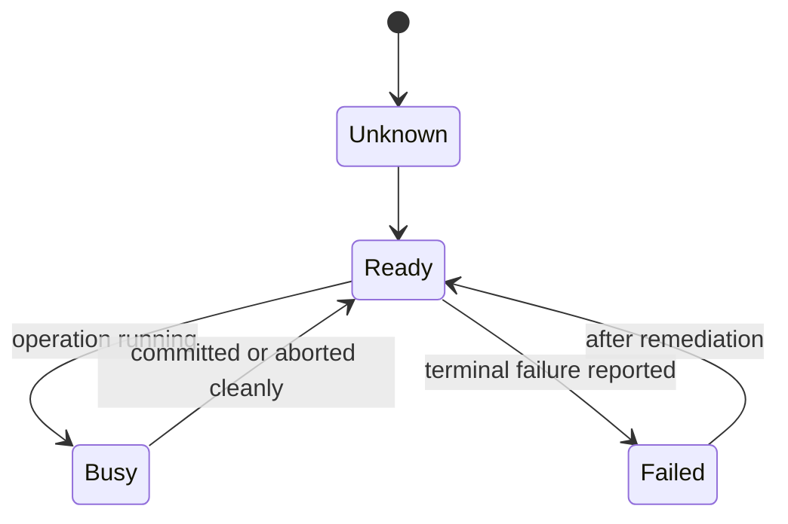
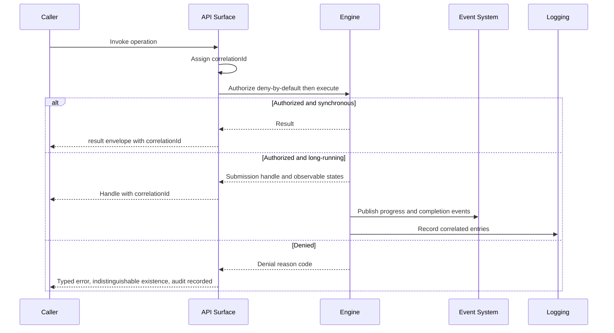

# 055 – API Specification

**Document ID:** DEVOS-SPEC-055

**Version:** 0.1

**Status:** Draft

**Category:** SDK

**Depends On:**

- DEVOS-SPEC-005 – Guiding Principles
- DEVOS-SPEC-006 – Terminology
- DEVOS-SPEC-007 – Scope
- DEVOS-SPEC-014 – State Model
- DEVOS-SPEC-020 – Workspace Specification
- DEVOS-SPEC-028 – Secret Specification
- DEVOS-SPEC-030 – System Architecture
- DEVOS-SPEC-031 – Workspace Engine
- DEVOS-SPEC-036 – Security Engine
- DEVOS-SPEC-037 – Event System
- DEVOS-SPEC-039 – AI Router
- DEVOS-SPEC-049 – Logging
- DEVOS-SPEC-050 – SDK Overview

**Referenced By:**

- DEVOS-SPEC-039 – AI Router
- DEVOS-SPEC-041 – Dashboard
- All SDK specifications (DEVOS-SPEC-051 through DEVOS-SPEC-054, DEVOS-SPEC-056 through DEVOS-SPEC-058)

---

# Abstract

This document defines the shared API rules that unify every DevOS programmatic surface.

It fixes the error model with typed failures and canonical reason codes, the asynchronous model for long-running operations, the idempotency expectations of callers, the security posture binding every call, and the correlation discipline that stitches calls, events, and logs into one traceable story.

Every SDK specification, and every surface consuming them such as the Dashboard, inherits this document by reference.

One vocabulary here means identical failure meaning everywhere.

---

# Purpose

This specification answers the following question:

> **What do all DevOS APIs share, so callers learn failure, waiting, authorization, and tracing exactly once?**

Errors carry stable typed codes from engine-owned vocabularies.

Long work reports honest observable states instead of blocking blindly.

Authorization is deny-by-default on every path.

Secrets never appear anywhere.

Correlation identifiers link everything belonging to one operation.

---

# Goals

This specification aims to:

- Define the unified error model and its required fields.
- Define reason-code sourcing rules tying codes to their owning specifications.
- Define the async model for long operations including cancellation semantics.
- Define idempotency and retry expectations for callers.
- Define the security posture inherited by every surface.
- Define the correlation discipline across APIs, events, and logs.
- Define conformance duties for any surface claiming this document.

---

# Non Goals

This specification does not define:

- Wire protocols, transports, or serialization encodings
- Language-specific exception mechanisms or binding idioms
- Hook veto semantics, owned by DEVOS-SPEC-056
- Event delivery mechanics, owned by DEVOS-SPEC-057
- CLI exit-code mapping, owned by DEVOS-SPEC-058
- Version numbering mechanics, owned by DEVOS-SPEC-059

---

# Scope of Application

This document binds every surface that exposes engine capabilities programmatically.

| Surface                       | Relationship                                        |
| ----------------------------- | ----------------------------------------------------- |
| Core tier (DEVOS-SPEC-054)    | Applies in full.                                      |
| Extension tier (DEVOS-SPEC-051 through DEVOS-SPEC-053) | Applies in full.             |
| Integration tier (DEVOS-SPEC-056 through DEVOS-SPEC-058) | Applies in full.            |
| Dashboard (DEVOS-SPEC-041)    | Applies wherever it consumes engines programmatically. |

Surfaces MAY add presentation concerns but MUST NOT weaken any rule below.

Where a surface specification repeats a rule of this document, both remain normative and identical in meaning.

---

# Error Model

Every failed operation returns a typed error carrying at least the fields below.

| Field          | Required | Description                                                          |
| -------------- | -------- | -------------------------------------------------------------------- |
| reasonCode     | Yes      | Stable dotted identifier drawn from an owned canonical family.       |
| message        | Yes      | Human-readable explanation naming what failed.                        |
| objectRef      | No       | Identifier of the failing object when one exists.                     |
| details[]      | No       | Structured attributed entries such as validation findings.            |
| suggestedAction | Yes     | Concrete next step the caller can take.                               |
| correlationId  | Yes      | Identifier linking this failure to all traces of its operation.        |

Error rules:

- Errors identify failures using identifiers and reason codes; they MUST NEVER quote secret values, tokens, or credential material, consistent with DEVOS-SPEC-028.
- Messages are explanatory; `reasonCode` is the contract automation relies on.
- Denials MUST be indistinguishable with respect to whether the underlying resource exists, consistent with DEVOS-SPEC-036.
- Success responses carry no error fields; envelopes distinguish outcomes structurally rather than by convention.

## Reason-Code Sourcing

Reason codes are owned, never invented ad hoc.

| Source                            | Owns                                                        |
| --------------------------------- | ----------------------------------------------------------- |
| DEVOS-SPEC-031                    | Canonical families: `validation.*`, `ownership.*`, `state.conflict`, `guard.failed`, `dependency.active`. |
| Engine specifications             | Families scoped to their own error classes.                 |
| Platform service specifications   | Families scoped to their own error classes.                 |
| Surface specifications            | Surface-local families prefixed to avoid collision, such as CLI usage errors. |

A caller encountering an unknown code still handles it through the envelope structure; unknown codes extend vocabularies without breaking consumers.

Renaming or reusing an existing code with new meaning is a breaking change under DEVOS-SPEC-059.

---

# Asynchronous Model

Operations that cannot complete synchronously report progress honestly instead of blocking blindly.

Model rules:

- Long operations return a submission handle carrying the operation correlation identifier immediately.
- Observable progress maps onto states defined in DEVOS-SPEC-014; surfaces MUST NOT invent new global states.
- Callers MAY observe progress through polling or through event subscriptions per DEVOS-SPEC-057, both grounded in the same states.
- Terminal outcomes are exactly success, failure with typed error, or cancelled.
- Cancellation stops producing effects and reports its terminal state truthfully; it never fabricates success.
- Request-scoped bookkeeping such as submission handles MUST NOT leak into Workspace object state, consistent with DEVOS-SPEC-039.

Busy is authoritative while any mutation holds the Workspace claim per DEVOS-SPEC-031.

---

# Idempotency and Retrying

Callers need predictable behavior under retries.

Rules:

- Read operations are inherently safe to repeat.
- Mutating lifecycle operations reject concurrent duplicates with `state.conflict` rather than executing twice, because exclusivity is per Workspace.
- Operations keyed by explicit request identifiers MAY deduplicate; deduplication scope is the owning Workspace and identifiers expire with their operation records.
- Retry guidance attaches to every typed error as part of `suggestedAction`: retry now, retry after remediation, or do not retry.
- Timed-out operations whose outcome is unknown are resolved by reading current state, never by assuming failure.

---

# Security Posture

The posture below restates cross-cutting obligations and makes them callable-contract law.

1. Every capability request is denied by default until granted; uncertain authorization resolves to denial, per DEVOS-SPEC-036.
2. Raw secret values never cross any API boundary in either direction; resolution happens inside the Security Engine only.
3. Handles and grants carry least privilege; broad requests fail rather than silently narrowing.
4. Every denial produces a typed error with an auditable trail feeding security events per DEVOS-SPEC-037.
5. Debug modes, verbose modes, dumps, and export helpers inherit every prohibition above without exception.
6. Authorization checks stay local and offline-capable, preserving Rule 7 of SPECIFICATION_RULES.md.

Surfaces implementing stronger local policy MAY tighten these rules; none MAY loosen them.

---

# Correlation Discipline

One logical operation is reconstructible from its traces alone.

Discipline rules:

- The entry surface assigns the correlation identifier at first contact with a request.
- The identifier propagates through every downstream API call, emitted event, hook invocation record, and log entry belonging to the operation.
- Event envelopes carry it in the field defined by DEVOS-SPEC-037; log entries carry it as required by DEVOS-SPEC-049.
- Typed errors always carry it so support and automation can join failures to full histories.
- Identifiers are opaque values with no embedded meaning; consumers treat them as atoms.

Without correlation, debugging distributed behavior is guesswork; with it, every operation tells one complete story.

---

# Interaction Flow

One diagram shows the unified model end to end.

All three paths share one envelope discipline and one identifier.

---

# Conformance Checklist

A surface claiming "DevOS SDK compatible v0" conformance under this document MUST satisfy every item below.

- [ ] Returns typed errors with all required fields, including `reasonCode`, `suggestedAction`, and `correlationId`.
- [ ] Sources every reason code from an owned family and never repurposes existing codes.
- [ ] Reports long operations through canonical states of DEVOS-SPEC-014 with truthful cancellation.
- [ ] Rejects duplicate mutations via exclusivity instead of double execution.
- [ ] Enforces deny-by-default authorization on every path and fails closed on uncertainty.
- [ ] Never emits secret values in results, errors, progress, or debug output.
- [ ] Propagates one correlation identifier across calls, events, and logs for each operation.

---

# API Rules Invariants

The following invariants MUST always hold.

- Every failure speaks the shared envelope language; no surface invents private error shapes.
- Reason-code meanings are stable and owner-scoped.
- Long work is observable and cancellable; blind blocking is a defect.
- Uncertain authorization always denies.
- Secret values never traverse any boundary covered by this document.
- Every operation is traceable end to end through one correlation identifier.

---

# Future Extensions

Future API specifications may add support for:

- Standardized pagination and cursor models over large collections
- Structured batching with partial-success semantics
- Streaming-first variants of long operations
- Policy-aware authorization metadata aligned with DEVOS-SPEC-063

These extensions MUST preserve the envelope, correlation discipline, and security posture without an approved ADR.

They MUST NOT break the single Workspace aggregate model.

---

# References

- DEVOS-SPEC-005 – Guiding Principles
- DEVOS-SPEC-006 – Terminology
- DEVOS-SPEC-007 – Scope
- DEVOS-SPEC-011 – Domain Model
- DEVOS-SPEC-014 – State Model
- DEVOS-SPEC-020 – Workspace Specification
- DEVOS-SPEC-026 – Plugin Specification
- DEVOS-SPEC-027 – Template Specification
- DEVOS-SPEC-028 – Secret Specification
- SPECIFICATION_RULES.md – Repository rule set (Rules 7, 18)
- DEVOS-SPEC-030 – System Architecture
- DEVOS-SPEC-031 – Workspace Engine
- DEVOS-SPEC-032 – Plugin Engine
- DEVOS-SPEC-033 – Provider Engine
- DEVOS-SPEC-035 – Template Engine
- DEVOS-SPEC-036 – Security Engine
- DEVOS-SPEC-037 – Event System
- DEVOS-SPEC-038 – Memory Engine
- DEVOS-SPEC-039 – AI Router
- DEVOS-SPEC-040 – CLI
- DEVOS-SPEC-041 – Dashboard
- DEVOS-SPEC-049 – Logging
- DEVOS-SPEC-050 – SDK Overview
- DEVOS-SPEC-051 – Plugin SDK
- DEVOS-SPEC-052 – Provider SDK
- DEVOS-SPEC-053 – Template SDK
- DEVOS-SPEC-054 – Workspace SDK
- DEVOS-SPEC-056 – Hooks API
- DEVOS-SPEC-057 – Events API
- DEVOS-SPEC-058 – CLI API
- DEVOS-SPEC-059 – Versioning Policy

---

# Revision History

| Version | Date | Author             | Notes         |
| ------- | ---- | ------------------ | ------------- |
| 0.1     | TBD  | DevOS Contributors | Initial Draft |
