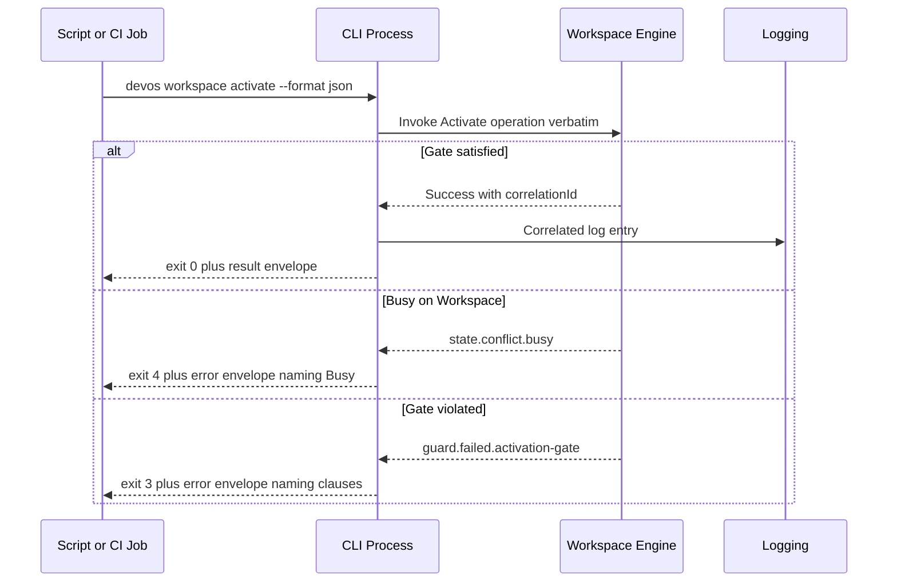

# 058 – CLI API

**Document ID:** DEVOS-SPEC-058

**Version:** 0.1

**Status:** Draft

**Category:** SDK

**Depends On:**

- DEVOS-SPEC-005 – Guiding Principles
- DEVOS-SPEC-006 – Terminology
- DEVOS-SPEC-007 – Scope
- DEVOS-SPEC-011 – Domain Model
- DEVOS-SPEC-014 – State Model
- DEVOS-SPEC-020 – Workspace Specification
- DEVOS-SPEC-028 – Secret Specification
- DEVOS-SPEC-029 – Workspace Manifest
- DEVOS-SPEC-030 – System Architecture
- DEVOS-SPEC-031 – Workspace Engine
- DEVOS-SPEC-040 – CLI
- DEVOS-SPEC-044 – Workspace Lifecycle
- DEVOS-SPEC-050 – SDK Overview
- DEVOS-SPEC-055 – API Specification

**Referenced By:**

- DEVOS-SPEC-037 – Event System
- DEVOS-SPEC-040 – CLI
- DEVOS-SPEC-046 – Health System
- DEVOS-SPEC-050 – SDK Overview
- DEVOS-SPEC-055 – API Specification

---

# Abstract

This document defines the CLI API, the Integration-tier contract that fixes the command-line grammar, the machine-readable response envelope, the canonical exit-code enumeration, and the reason-code registry that scripts and tools depend on.

It elaborates the behavioral contract of the CLI defined in DEVOS-SPEC-040 into exact, stable automation surfaces.

Everything here serves one audience: callers who cannot afford ambiguity, including humans in terminals, shell scripts, and continuous-integration systems.

Identical input state produces identical grammar behavior, output ordering, and exit codes.

---

# Purpose

This specification answers the following question:

> **What exactly do commands look like, what does their output contain, and how does automation read outcomes reliably?**

Commands follow one grammar over fixed groups.

Machine output uses one envelope distinguishing success from failure.

Exit codes carry stable outcome classes.

Reason codes come from owned registries.

Non-interactive runs never prompt and never hang.

---

# Goals

This specification aims to:

- Define the command grammar model over conceptual groups.
- Define canonical verbs per group for Version 0.1.
- Define the machine-mode response envelope.
- Define the canonical exit-code enumeration with sub-code semantics.
- Own the CLI reason-code registry and its mapping rules.
- Define deterministic output ordering declarations.
- Define non-interactive auto-decline behavior precisely.

---

# Non Goals

This specification does not define:

- Terminal colors, progress rendering, or interactive wizard flows
- Shell completion contracts, deferred to Future Extensions of DEVOS-SPEC-040
- Engine behavior behind commands, owned by engine specifications
- Dashboard interaction, owned by DEVOS-SPEC-041
- Configuration layer semantics, owned by DEVOS-SPEC-045

---

# Grammar Model

Every invocation follows one conceptual shape.

```text
devos <group> <verb> [selector] [options]
```

| Element  | Required | Description                                                        |
| -------- | -------- | -------------------------------------------------------------------- |
| group    | Yes      | One fixed group name from the table below.                            |
| verb     | Yes      | One canonical verb within the group.                                  |
| selector | No       | Object reference such as a profile or connection name where sensible. |
| options  | No       | Declared options including `--format json` for machine mode.          |

Groups and verbs are lowercase, hyphenated where needed, and stable identifiers under DEVOS-SPEC-059.

Adding a verb is additive; renaming or removing one is breaking.

---

# Command Catalog

Version 0.1 fixes the groups below, recapitulating the conceptual groups of DEVOS-SPEC-040 with their canonical verbs.

| Group      | Canonical Verbs                                             | Delegation Target                          |
| ---------- | ------------------------------------------------------------- | ------------------------------------------ |
| workspace  | init, import, export, validate, activate, archive, delete      | Workspace Engine per DEVOS-SPEC-031.        |
| project    | show, set                                                      | Workspace Engine per DEVOS-SPEC-031.        |
| profile    | add, switch, default                                           | Workspace Engine per DEVOS-SPEC-031.        |
| env        | get, set, list                                                 | Configuration System per DEVOS-SPEC-045.    |
| connection | add, test, list                                                | Connection Engine per DEVOS-SPEC-034.       |
| provider   | add, list, status                                              | Provider Engine per DEVOS-SPEC-033.         |
| plugin     | install, enable, disable, update, list                         | Plugin Engine per DEVOS-SPEC-032.           |
| template   | list, new                                                      | Template Engine per DEVOS-SPEC-035.         |
| secret     | set, rotate, list                                              | Security Engine per DEVOS-SPEC-036.         |
| workflow   | run, status, list                                              | Workspace Engine per DEVOS-SPEC-031.        |
| doctor     | run                                                            | Health System per DEVOS-SPEC-046.           |
| config     | get                                                            | Configuration System per DEVOS-SPEC-045.    |

Rules:

- Verbs map one-to-one onto delegated capabilities; the CLI invents no local preconditions, restating the thin-layer rule of DEVOS-SPEC-040.
- Lifecycle verbs expose exactly the operations of DEVOS-SPEC-044 verbatim.
- The `doctor` verb consumes the health answer without recomputing aggregation locally.

---

# Response Envelope

Machine mode emits exactly one JSON object per invocation.

```text
{
  outcome: success | error,
  result: <command-specific payload>,        // present when outcome is success
  error: {                                    // present when outcome is error
    reasonCode,
    message,
    objectRef,
    details[],
    suggestedAction
  },
  correlationId
}
```

Envelope rules:

- The envelope distinguishes outcomes structurally through `outcome`, never by convention, consistent with DEVOS-SPEC-055.
- `reasonCode` values draw from the registries defined below.
- `correlationId` matches the identifier recorded across events and logs for the same operation, enabling trace joins per DEVOS-SPEC-049.
- Human mode MAY render freely; only machine mode carries the envelope contract.

---

# Exit Code Contract

The CLI communicates outcome class to automation primarily through exit codes.

The summary classes below are fixed by DEVOS-SPEC-040; this document owns the canonical enumeration semantics.

| Code | Class              | Meaning                                                        |
| ---- | ------------------ | ---------------------------------------------------------------- |
| 0    | Success            | The requested operation completed as asked.                       |
| 1    | Runtime error      | Execution failed, such as a probe error.                          |
| 2    | Usage error        | Invocation was malformed or referenced unknown syntax.            |
| 3    | Validation failed  | Validation produced blocking findings per DEVOS-SPEC-029.         |
| 4    | State conflict     | A mutating request met Busy per DEVOS-SPEC-044.                   |
| 5    | Permission denied  | Authorization refused the action.                                 |
| 6    | Dependency missing | A required engine, plugin, or external tool is unavailable.       |

Sub-code rules:

- Fine-grained detail lives in the envelope `error.reasonCode`, not in new exit numbers.
- Implementations MUST NOT introduce additional top-level codes in Version 0.1.
- Continuous-integration gates depend on these classes remaining stable; changing them requires a major version bump under DEVOS-SPEC-059.

---

# Reason-Code Registry

This document owns the CLI reason-code registry and its mapping duties.

Sources:

| Family Origin                    | Example Codes                                        | Usage                                     |
| -------------------------------- | ------------------------------------------------------ | ----------------------------------------- |
| Workspace Engine families        | `validation.relationship.unresolved-reference`, `state.conflict.busy` | Mapped verbatim into envelopes. |
| Other engine families            | Engine-owned dotted codes                              | Mapped verbatim into envelopes.           |
| CLI-local family                 | `usage.unknown-command`, `usage.missing-required-option`, `usage.declined-noninteractive` | Raised by the CLI itself for invocation problems. |

Registry rules:

- Engine-owned codes pass through unmodified; the CLI MUST NOT rebase them into its own namespace.
- CLI-local codes live exclusively under the `usage.*` family.
- Adding codes is additive; reusing a code with new meaning is breaking per DEVOS-SPEC-059.
- Every surfaced code resolves to documentation through help text naming its family owner.

---

# Output Ordering

Deterministic ordering makes diffable output possible.

Rules:

- List-style commands declare one order each, documented in help text, and produce it identically for identical input state.
- The default order SHOULD be stable-name ascending unless a command declares otherwise explicitly.
- Filtering and selection options refine results but never reorder them implicitly.
- Human-mode tables and machine-mode payloads share the same underlying order.

Silent reordering between releases is a defect; ordering changes are announced as behavioral changes under DEVOS-SPEC-059.

---

# Non-Interactive Contract

Automation depends on runs that never block.

Contract:

- A non-interactive run completes without a TTY and never waits on human input.
- A command that would prompt MUST auto-decline the pending choice and fail with the CLI-local code `usage.declined-noninteractive`.
- The failure message MUST name the option, environment answer, or file edit that would have supplied the decision.
- Interactive sessions MAY offer wizards; every wizard step retains its documented non-interactive equivalent per DEVOS-SPEC-040.

Auto-decline is honest refusal, not guessed continuation; no flag combination silently answers safety-relevant questions on the caller's behalf.

---

# Secret Safety Surface

Secret handling follows the absolute rules of DEVOS-SPEC-028 through every command.

Surface rules:

- Secret values are masked by default in both human and machine modes.
- Revealing a value REQUIRES an explicit opt-in flag on the specific command plus an explicit confirmation step, restating DEVOS-SPEC-040 normatively.
- Reveal moments emit audit events feeding the direction of DEVOS-SPEC-065 so exposure stays attributable.
- Values never appear in errors, help text, logs governed by DEVOS-SPEC-049, or completion candidates.
- Redaction remains the responsibility of the Security Engine defined in DEVOS-SPEC-036; the CLI implements none of its own.

Scripts SHOULD treat masked placeholders as data and request explicit reveals only inside controlled, audited contexts.

---

# Interaction Flow

One diagram shows an automated invocation end to end.



Every branch keeps envelope shape, reason codes, and exit classes aligned.

---

# Conformance Checklist

An implementation claiming "DevOS SDK compatible v0" CLI conformance MUST satisfy every item below.

- [ ] Implements the fixed groups and canonical verbs with delegated-only behavior.
- [ ] Emits the response envelope structurally distinguishing success and error outcomes.
- [ ] Produces exactly the seven exit classes with no additional top-level codes.
- [ ] Maps engine error classes to exit classes including state-conflict to 4.
- [ ] Surfaces reason codes verbatim from owned registries plus `usage.*` locals only.
- [ ] Guarantees declared output ordering for identical input state.
- [ ] Completes without a TTY, auto-declining prompts with actionable messages.
- [ ] Masks secrets everywhere by default and gates reveals behind flag plus confirmation.

---

# CLI API Invariants

The following invariants MUST always hold.

- Commands delegate; they never decide business rules locally.
- Identical input state yields identical grammar acceptance, ordering, envelope, and exit code.
- Machine output always parses as one envelope object.
- Exit classes remain stable across MINOR releases.
- Non-interactive invocations always terminate without human input.
- Secret values never surface outside explicit audited reveal flows.

---

# Future Extensions

Future CLI API specifications may add support for:

- Shell completion contracts with deterministic candidate ordering
- Watch modes streaming filtered events into terminals
- Structured sub-command versioning for large groups
- Batch files describing multi-command transactions

These extensions MUST preserve the thin-layer rule, the envelope, the exit-class stability, and offline capability without an approved ADR.

They MUST NOT break the single Workspace aggregate model.

---

# References

- DEVOS-SPEC-005 – Guiding Principles
- DEVOS-SPEC-006 – Terminology
- DEVOS-SPEC-007 – Scope
- DEVOS-SPEC-011 – Domain Model
- DEVOS-SPEC-014 – State Model
- DEVOS-SPEC-020 – Workspace Specification
- DEVOS-SPEC-028 – Secret Specification
- DEVOS-SPEC-029 – Workspace Manifest
- DEVOS-SPEC-030 – System Architecture
- SPECIFICATION_RULES.md – Repository rule set (Rules 7, 18)
- DEVOS-SPEC-031 – Workspace Engine
- DEVOS-SPEC-032 – Plugin Engine
- DEVOS-SPEC-033 – Provider Engine
- DEVOS-SPEC-034 – Connection Engine
- DEVOS-SPEC-035 – Template Engine
- DEVOS-SPEC-036 – Security Engine
- DEVOS-SPEC-040 – CLI
- DEVOS-SPEC-044 – Workspace Lifecycle
- DEVOS-SPEC-045 – Configuration System
- DEVOS-SPEC-046 – Health System
- DEVOS-SPEC-049 – Logging
- DEVOS-SPEC-050 – SDK Overview
- DEVOS-SPEC-055 – API Specification
- DEVOS-SPEC-059 – Versioning Policy
- DEVOS-SPEC-065 – Audit System

---

# Revision History

| Version | Date | Author             | Notes         |
| ------- | ---- | ------------------ | ------------- |
| 0.1     | TBD  | DevOS Contributors | Initial Draft |
