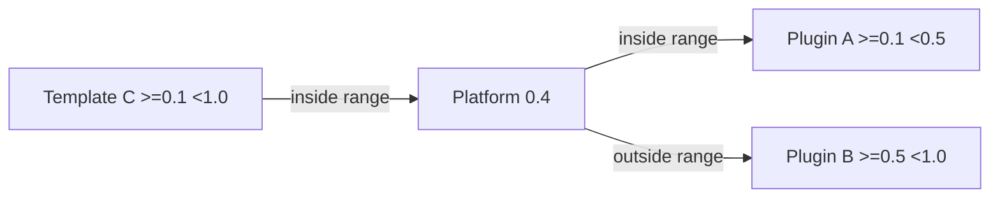
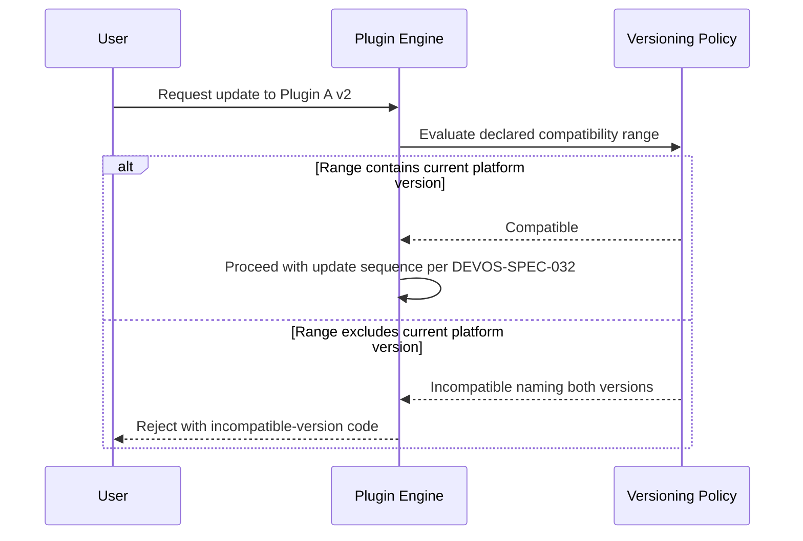

# 059 – Versioning Policy

**Document ID:** DEVOS-SPEC-059

**Version:** 0.1

**Status:** Draft

**Category:** SDK

**Depends On:**

- DEVOS-SPEC-005 – Guiding Principles
- DEVOS-SPEC-006 – Terminology
- DEVOS-SPEC-007 – Scope
- DEVOS-SPEC-011 – Domain Model
- DEVOS-SPEC-020 – Workspace Specification
- DEVOS-SPEC-029 – Workspace Manifest
- DEVOS-SPEC-030 – System Architecture
- DEVOS-SPEC-037 – Event System
- DEVOS-SPEC-050 – SDK Overview

**Referenced By:**

- DEVOS-SPEC-026 – Plugin Specification
- DEVOS-SPEC-027 – Template Specification
- DEVOS-SPEC-029 – Workspace Manifest
- DEVOS-SPEC-032 – Plugin Engine
- DEVOS-SPEC-045 – Configuration System
- DEVOS-SPEC-047 – Settings
- DEVOS-SPEC-048 – Update System
- All SDK specifications (DEVOS-SPEC-051 through DEVOS-SPEC-058)

---

# Abstract

This document defines the Versioning Policy governing compatibility and change across every versioned surface of DevOS.

It fixes the version number semantics, the catalog of versioned artifacts, the classification of breaking versus additive changes per artifact type, compatibility range grammar, deprecation notice requirements, and the compatibility matrix that binds extensions to platform versions.

Rule 18 of SPECIFICATION_RULES.md demands migration discipline for breaking changes; this document supplies its mechanics.

Predictable evolution is what allows independent implementations, plugins, templates, and workspaces to coexist across time.

---

# Purpose

This specification answers the following question:

> **What carries a version, what does each change class mean for it, and when may what break?**

Everything callers depend on carries a version.

Breaking changes require major bumps, migrations, and notices.

Additive changes ride minor bumps without harming older consumers.

Deprecation always precedes removal by a declared window.

---

# Goals

This specification aims to:

- Define the three-part version semantics applied uniformly.
- Catalog every versioned artifact class in DevOS.
- Define breaking versus additive changes per artifact class.
- Define compatibility range grammar used in manifests and packages.
- Define deprecation notice requirements and window obligations.
- Define the compatibility matrix binding plugins, templates, and bindings to platform versions.
- Align stability rungs of DEVOS-SPEC-050 with change classes.

---

# Non Goals

This specification does not define:

- Release cadence or distribution channels, owned by DEVOS-SPEC-048
- Document numbering, which is permanent under Rule 11 of SPECIFICATION_RULES.md
- Specific tool syntax for version comparison
- License or governance versioning, owned by their own documents
- Marketplace listing policies, deferred to DEVOS-SPEC-070

---

# Version Semantics

Every versioned artifact uses three ascending numeric parts.

| Part   | Increments When                                                   | Consumer Expectation                        |
| ------ | ------------------------------------------------------------------- | --------------------------------------------- |
| MAJOR  | A breaking change lands on a published surface.                     | Migration required before upgrading safely.    |
| MINOR  | Additive capability lands; existing consumers remain compatible.     | Upgrade is safe and reversible in practice.    |
| PATCH  | Defect fixes land with no contract change of any kind.               | Upgrade unconditionally.                       |

Rules:

- Version zero, as in 0.x, marks explicit pre-stability where MINOR releases MAY carry breaking changes only with prominent notice and a documented migration path, honoring the draft status of Version 0.1.
- A MAJOR bump to 1.0 and beyond restores full strictness: breaking changes never ride MINOR or PATCH.
- Version numbers compare component-wise; no other ordering exists.
- Every artifact states its version explicitly; implicit versions do not exist.

---

# Versioned Artifact Catalog

The following classes carry versions and obey this policy.

| Artifact Class              | Where Declared                                    | Governing Notes                                        |
| --------------------------- | --------------------------------------------------- | -------------------------------------------------------- |
| Specification set           | Repository CHANGELOG per document Revision History. | Document numbers never change per Rule 11.                |
| Canonical schemas           | Schema files under `https://devos.dev/schemas/v0/`. | Schema precedence per Rule 17 of SPECIFICATION_RULES.md.  |
| Workspace manifest format   | `metadata.schemaVersion` per DEVOS-SPEC-029.         | Older valid manifests MUST remain readable per Rule 18.   |
| Platform                    | Reported by interfaces such as the CLI.              | The anchor for all compatibility ranges.                  |
| Plugins                     | Package manifest version plus compatibility range.    | Evaluated at install and update per DEVOS-SPEC-032.       |
| Templates                   | Manifest version plus compatibility range.            | Deterministic outputs bind to declared ranges.            |
| Provider adapters           | Adapter version inside its compatibility range.       | Normalization contracts evolve per DEVOS-SPEC-052.        |
| SDK surfaces                | Per-surface stability rung per DEVOS-SPEC-050.        | Bindings claim conformance per claimed tier.              |
| Event topics                | Topic strings per DEVOS-SPEC-037.                     | Renames are breaking; additions are additive.             |
| Hook points                 | Point names per DEVOS-SPEC-056.                       | Removals and renames are breaking.                        |

An artifact class added later joins this catalog through governance per DEVOS-SPEC-000.

---

# Change Classification

Classification is per artifact class, decided by observable consumer impact.

## Breaking Changes

A change is BREAKING when any conformant consumer can observe a behavioral difference without taking explicit upgrade action.

| Artifact Class        | Breaking Examples                                                     |
| --------------------- | ----------------------------------------------------------------------- |
| Schemas and manifests | Removing or narrowing required fields; tightening validation silently.   |
| Event topics          | Renaming a topic; changing envelope field meaning; removing fields.      |
| Hook points           | Removing a point; changing context shape; redefining decision semantics. |
| SDK capabilities      | Changing result shapes; removing capabilities; weakening guarantees.     |
| Commands and verbs    | Renaming verbs; changing exit classes; altering envelope structure.       |
| Reason codes          | Reusing an existing code with new meaning.                               |
| Plugin contracts      | Narrowing permission grammar; changing callback invocation guarantees.    |

Breaking changes REQUIRE all of the following, restating Rule 18 normatively:

1. An RFC describing the change and its motivation.
2. An ADR approving the architectural impact where one is required.
3. A migration strategy executable by affected consumers.
4. A MAJOR version bump of the affected artifact.
5. A deprecation notice published ahead of removal where an old form persists.

## Additive Changes

A change is ADDITIVE when previously conformant artifacts remain fully conformant and previously correct consumers remain correct.

Examples include new optional fields, new topics, new hook points, new verbs, new reason codes within owned families, and new optional manifest blocks.

Additive changes MAY ride MINOR bumps without migration duties.

Implementations SHOULD ignore unrecognized additive content where formats permit, enabling forward compatibility.

---

# Compatibility Range Grammar

Extensions declare which platform versions they support using interval expressions.

Grammar elements:

| Element      | Meaning                                            | Example        |
| ------------ | ---------------------------------------------------- | -------------- |
| `>=x`        | Platform version at or above x qualifies.            | `>=0.3`        |
| `<x`         | Platform version below x qualifies.                  | `<1.0`         |
| Combined     | Space-separated constraints AND together.            | `">=0.1 <1.0"` |
| Exact        | A bare version admits exactly that version.          | `0.4.0`        |

Range rules:

- Ranges evaluate against the platform version reported at evaluation time.
- An absent or unparseable range is invalid, not permissive; operations reject it, consistent with DEVOS-SPEC-032.
- Upper bounds are RECOMMENDED so extensions opt into future majors deliberately.
- Ranges describe platform compatibility only; they carry no meaning about other extensions.

---

# Compatibility Matrix

The compatibility matrix binds each extension instance to the platform versions it accepts.

Evaluation rules:

- Install, update, enablement, and template instantiation recheck ranges before proceeding, consistent with DEVOS-SPEC-032.
- Outside-range results reject with incompatible-version reporting naming both versions.
- The Update System consults the matrix before offering upgrades, per DEVOS-SPEC-048, withholding updates that would strand installed extensions.
- Bindings claiming conformance name the platform ranges they satisfy, feeding the conformance claims of DEVOS-SPEC-050.

---

# Deprecation Policy

Deprecation separates retirement from removal.

Policy rules:

- Deprecated surfaces remain functional and supported until removal completes.
- Every deprecation notice MUST name the replacement capability or state that none exists.
- Notices MUST appear in release documentation and remain visible wherever the deprecated surface is used, including diagnostics where practical.
- The notice window MUST span at least one MINOR release cycle after announcement before removal MAY occur, giving consumers a concrete migration interval.
- Removal itself follows the breaking-change checklist above, including its major bump.

Silent removal is prohibited in every case, including version zero.

---

# Stability Alignment

Stability rungs from DEVOS-SPEC-050 map onto change classes directly.

| Rung         | Change Class Allowed                                | Notice Obligation                    |
| ------------ | ------------------------------------------------------- | -------------------------------------- |
| Experimental | Any, including breaks without notice.                    | MUST be marked experimental visibly.    |
| Stable       | Additive freely; breaking only via full checklist.       | Full Rule 18 discipline applies.        |
| Deprecated   | None; frozen pending removal.                            | Replacement named; window running.      |

Movement stays upward-only: promotion, then deprecation, then removal.

A capability MUST NOT fall from Stable back to Experimental without an approved ADR, consistent with DEVOS-SPEC-050.

---

# Design Decisions

| Decision                      | Choice                                              | Rationale                                          |
| ----------------------------- | ----------------------------------------------------- | ---------------------------------------------------- |
| Uniform three-part versions   | One semantics across all artifact classes.             | Consumers learn versioning once.                      |
| Strict interpretation of zero | 0.x may break with notice only.                        | Preserves honest draft status while bounding churn.    |
| Invalid means rejected        | Unparseable ranges fail closed.                         | Ambiguity must never widen access silently.            |
| Envelope absorbs detail       | Exit classes stay coarse; reason codes stay fine.       | Keeps automation stable while diagnostics evolve.      |
| Minimum deprecation window    | At least one minor cycle before removal.                | Makes migration plannable rather than reactive.        |

Changing any decision requires an approved ADR.

---

# Interaction Flow

One diagram shows a plugin update evaluated against the matrix.

The same evaluation guards installs, enablement, template instantiation, and update offers.

---

# Versioning Policy Invariants

The following invariants MUST always hold.

- Every consumer-facing surface declares an explicit version.
- Breaking changes never bypass the five-step checklist.
- Additive changes never invalidate previously conformant artifacts.
- Unparseable or absent compatibility data rejects rather than permits.
- Deprecated surfaces outlive their notices and die only after their windows.
- Stability rungs never regress silently.
- Document numbers remain permanent regardless of content evolution, per Rule 11.

---

# Future Extensions

Future versioning specifications may add support for:

- Machine-readable capability manifests replacing prose conformance claims
- Coordinated multi-artifact release trains
- Long-term-support branches with backport policies
- Automated compatibility verification integrated with the Update System

These extensions MUST preserve the uniform semantics, the breaking-change checklist, and deprecation windows without an approved ADR.

They MUST NOT break the single Workspace aggregate model.

---

# References

- DEVOS-SPEC-000 – Specification Governance
- DEVOS-SPEC-005 – Guiding Principles
- DEVOS-SPEC-006 – Terminology
- DEVOS-SPEC-007 – Scope
- DEVOS-SPEC-011 – Domain Model
- DEVOS-SPEC-020 – Workspace Specification
- DEVOS-SPEC-026 – Plugin Specification
- DEVOS-SPEC-027 – Template Specification
- DEVOS-SPEC-029 – Workspace Manifest
- DEVOS-SPEC-030 – System Architecture
- SPECIFICATION_RULES.md – Repository rule set (Rules 11, 17, 18, 19)
- DEVOS-SPEC-032 – Plugin Engine
- DEVOS-SPEC-037 – Event System
- DEVOS-SPEC-040 – CLI
- DEVOS-SPEC-048 – Update System
- DEVOS-SPEC-050 – SDK Overview
- DEVOS-SPEC-051 – Plugin SDK
- DEVOS-SPEC-052 – Provider SDK
- DEVOS-SPEC-053 – Template SDK
- DEVOS-SPEC-054 – Workspace SDK
- DEVOS-SPEC-055 – API Specification
- DEVOS-SPEC-056 – Hooks API
- DEVOS-SPEC-057 – Events API
- DEVOS-SPEC-058 – CLI API
- https://devos.dev/schemas/v0/ – Reserved schema namespace

---

# Revision History

| Version | Date | Author             | Notes         |
| ------- | ---- | ------------------ | ------------- |
| 0.1     | TBD  | DevOS Contributors | Initial Draft |
