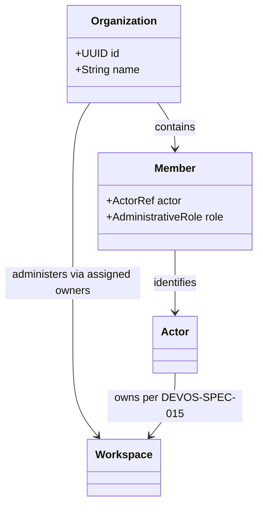
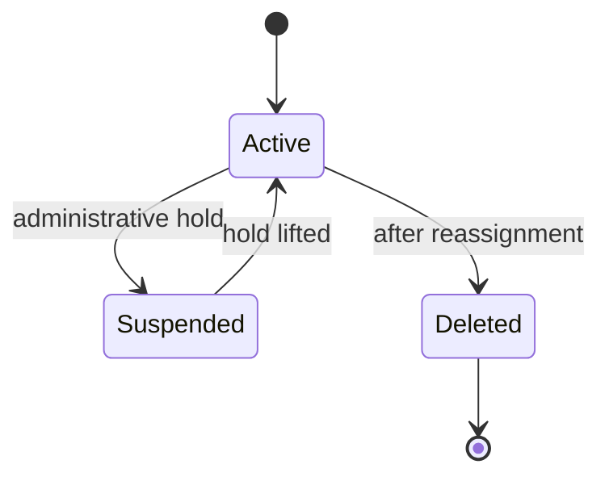

# 060 – Organizations

**Document ID:** DEVOS-SPEC-060

**Version:** 0.1

**Status:** Draft

**Category:** Enterprise

**Depends On:**

- DEVOS-SPEC-006 – Terminology
- DEVOS-SPEC-011 – Domain Model
- DEVOS-SPEC-013 – Object Lifecycle
- DEVOS-SPEC-015 – Object Ownership
- DEVOS-SPEC-020 – Workspace Specification
- DEVOS-SPEC-030 – System Architecture

**Referenced By:**

- All Enterprise specifications (DEVOS-SPEC-061 through DEVOS-SPEC-069)

---

# Abstract

This document defines the Organization, the forward-looking Enterprise concept that groups Actors and their Workspaces under one administrative boundary.

It extends the ownership model of Version 0.1 with a collective owner above the Actor while preserving every aggregate invariant of DEVOS-SPEC-015.

Organizations introduce membership, administrative delegation, and fleet-level visibility.

This specification is forward-looking: it activates only through an approved RFC and ADR and imposes no obligations on Version 0.1 implementations.

---

# Purpose

This specification answers the following question:

> **How can many people share responsibility for many Workspaces without breaking single-owner aggregates?**

The Organization sits entirely outside Workspace aggregates.

It groups Actors, never objects.

Every Workspace keeps exactly one owner; an organization changes who that owner may be and how ownership is administered, never how many owners exist.

---

# Goals

This specification aims to:

- Define the Organization as an administrative grouping above Actors.
- Define membership as the only path from Actor to Organization.
- Define workspace assignment semantics preserving single ownership.
- Define administrative roles distinct from domain permissions.
- Define lifecycle for organizations including deletion with workspace reassignment.
- Preserve Offline First behavior for individual workspaces.

---

# Non Goals

This specification does not define:

- Role and permission mechanics inside workspaces, deferred to DEVOS-SPEC-062
- Policy evaluation, deferred to DEVOS-SPEC-063
- Synchronization between organizations, deferred to DEVOS-SPEC-064
- Billing, invoicing, or payment processing
- Identity provider protocols or federation mechanics
- Organizational analytics or reporting

---

# Definition

An Organization is a named administrative grouping of Actors established to manage Workspaces collectively.

The dashed boundary holds: Workspaces remain owned by exactly one Actor each.

The Organization administers through its members; it never becomes a second owner.

---

# Membership

Membership links one Actor to one Organization with one administrative role.

| Rule             | Requirement                                                            |
| ---------------- | ------------------------------------------------------------------------ |
| Explicit join    | Membership exists only through explicit grant by an administrator.        |
| One org minimum  | An Actor MAY belong to many organizations simultaneously.                 |
| Removable        | Membership revocation MUST NOT strand owned Workspaces without an owner.  |
| Auditable        | Every membership change produces an audit event per DEVOS-SPEC-065.       |
| No silent powers | Membership alone grants nothing inside any Workspace aggregate.           |

Administrative roles govern organization management itself: admitting members, assigning workspace ownership, and configuring enterprise capabilities.

They are distinct from workspace-level permissions defined in DEVOS-SPEC-062.

---

# Workspace Assignment

Assignment transfers or designates ownership of a Workspace within organizational scope.

Rules:

- Assignment names one receiving Actor whose ownership replaces the prior owner atomically.
- The lifecycle of DEVOS-SPEC-013 is unaffected; assignment changes ownership metadata only.
- Assignment MUST preserve all object references, secrets custody, and validation status.
- Unassigned Workspaces remain validly owned by their current Actor; organizations do not hold orphan pools.
- Cross-organization moves are transfers of ownership between two valid Actors, never shared custody.

Assignment operations run through the same engine boundaries as every other mutation, inheriting exclusivity and event emission.

---

# Lifecycle

Organizations follow a deliberately small lifecycle aligned with the state model of DEVOS-SPEC-014.

Deletion requires every formerly assigned Workspace to hold a valid Actor owner first.

An Organization MUST NOT be deleted while it is the sole administrator path for any unowned capability.

Deleted organizations leave no residue inside any Workspace.

---

# Relationship to Version 0.1

Version 0.1 excludes organizations deliberately, as recorded in DEVOS-SPEC-011 Future Extensions and DEVOS-SPEC-007.

This document guides direction only.

Activation requires:

1. An RFC describing the adoption surface.
2. An approved ADR confirming no aggregate model change.
3. Schema additions living beside, never inside, existing canonical schemas.

Until activated, conformant Version 0.1 implementations MUST NOT ship partial organization behavior.

---

# Enterprise Extension Invariants

The following invariants MUST hold when activated.

- Every Workspace retains exactly one Actor owner regardless of organizational context.
- Organizations group Actors and administer; they never co-own aggregates.
- Membership alone confers zero authority inside any Workspace.
- All membership and assignment changes are auditable events.
- Individual Workspaces continue to operate fully offline.
- Deleting an organization requires valid ownership everywhere first.

These MUST NOT break the single Workspace aggregate model.

---

# Security Requirements

When activated, this extension enforces:

- Administrative role checks evaluated deny-by-default through the Security Engine defined in DEVOS-SPEC-036.
- Membership changes attributable to acting administrators through audit events per DEVOS-SPEC-065.
- No bulk secret access created by organizational context; custody rules of DEVOS-SPEC-028 remain absolute.
- Assignment flows revalidating ownership metadata before commit per DEVOS-SPEC-031 transactional guarantees.

---

# Future Extensions

Future specifications may add support for:

- Nested organizational hierarchies
- Delegated administration with scoped administrator grants
- Just-in-time membership through federated identity claims
- Organization-wide policy inheritance aligned with DEVOS-SPEC-063

These extensions require their own RFCs and ADRs and MUST preserve the invariants above.

---

# References

- DEVOS-SPEC-006 – Terminology
- DEVOS-SPEC-007 – Scope
- DEVOS-SPEC-011 – Domain Model
- DEVOS-SPEC-013 – Object Lifecycle
- DEVOS-SPEC-014 – State Model
- DEVOS-SPEC-015 – Object Ownership
- DEVOS-SPEC-020 – Workspace Specification
- SPECIFICATION_RULES.md – Repository rule set (Rule 2)
- DEVOS-SPEC-028 – Secret Specification
- DEVOS-SPEC-030 – System Architecture
- DEVOS-SPEC-031 – Workspace Engine
- DEVOS-SPEC-036 – Security Engine
- DEVOS-SPEC-061 – Teams
- DEVOS-SPEC-062 – RBAC
- DEVOS-SPEC-063 – Policy Engine
- DEVOS-SPEC-064 – Cloud Sync
- DEVOS-SPEC-065 – Audit System

---

# Revision History

| Version | Date | Author             | Notes         |
| ------- | ---- | ------------------ | ------------- |
| 0.1     | TBD  | DevOS Contributors | Initial Draft |
