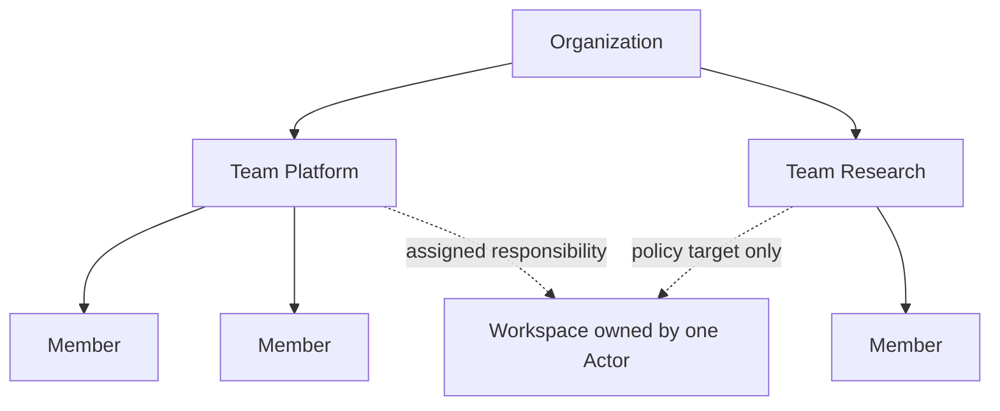
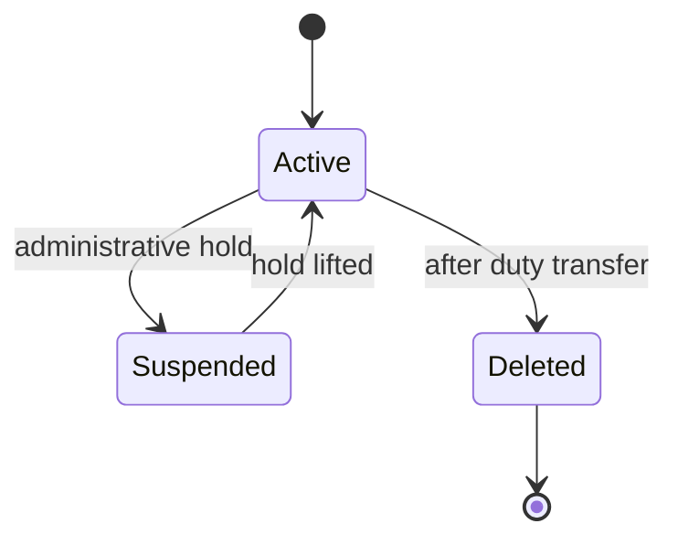

# 061 – Teams

**Document ID:** DEVOS-SPEC-061

**Version:** 0.1

**Status:** Draft

**Category:** Enterprise

**Depends On:**

- DEVOS-SPEC-006 – Terminology
- DEVOS-SPEC-011 – Domain Model
- DEVOS-SPEC-015 – Object Ownership
- DEVOS-SPEC-020 – Workspace Specification
- DEVOS-SPEC-030 – System Architecture
- DEVOS-SPEC-060 – Organizations

**Referenced By:**

- DEVOS-SPEC-062 – RBAC
- DEVOS-SPEC-063 – Policy Engine
- DEVOS-SPEC-066 – Workspace Sharing

---

# Abstract

This document defines the Team, the forward-looking Enterprise concept that subdivides an Organization into named groups of Members for scoped administration and collaboration.

Teams give organizations a unit for assigning workspace responsibility, targeting policy, and organizing sharing without touching aggregate ownership.

This specification is forward-looking: it activates only through an approved RFC and ADR and imposes no obligations on Version 0.1 implementations.

---

# Purpose

This specification answers the following question:

> **How do organizations divide people into manageable groups whose boundaries have operational meaning?**

A Team is a membership subset with a name and a purpose.

It receives assignments, policies, and shares as a unit so administration scales with structure instead of individual grants.

---

# Goals

This specification aims to:

- Define the Team as a named Member subset inside one Organization.
- Define team-scoped workspace assignment.
- Define team-targeted policy attachment hooks aligned with DEVOS-SPEC-063.
- Define team lifecycle including dissolution with reassignment duties.
- Preserve the rule that teams never own aggregates.

---

# Non Goals

This specification does not define:

- Permission mechanics attached to roles, deferred to DEVOS-SPEC-062
- Policy evaluation semantics, deferred to DEVOS-SPEC-063
- Sharing grant mechanics, deferred to DEVOS-SPEC-066
- Chat, presence, or communication features
- Cross-organization teams in Version 0.1 of this extension

---

# Definition

A Team is a named, administratively managed subset of one Organization's Members.

Solid arrows denote containment.

Dashed arrows denote administrative relationships that never become ownership.

---

# Membership Rules

Team membership derives from Organization membership.

| Rule            | Requirement                                                            |
| ---------------- | ------------------------------------------------------------------------ |
| Subset only      | Every Team member MUST already be a Member of the owning Organization.    |
| Multi-team       | A Member MAY join many Teams simultaneously.                              |
| Explicit adds    | Membership changes occur through explicit administrative acts only.        |
| Auditable        | Every change emits an audit event per DEVOS-SPEC-065.                     |
| No inheritance   | Team membership confers nothing by itself; authority arrives via 062/063. |

Removing a Member from an Organization removes that Member from every Team automatically.

---

# Team-Scoped Administration

Teams receive responsibilities as units.

Assignment rules recapitulated from DEVOS-SPEC-060:

- Workspace assignment MAY name a Team as the responsible group while naming exactly one receiving Actor as owner.
- Responsibility is administrative bookkeeping; it never multiplies owners.
- Reassignment duties on member departure follow Organization rules, applied at team granularity first.

Policy targeting rules aligned with DEVOS-SPEC-063:

- Policies MAY attach to Teams as their subject scope.
- Policy evaluation always resolves against effective membership at decision time.
- Dissolving a Team detaches its policy attachments without deleting shared policies.

---

# Lifecycle

Teams exist only inside an active Organization.

Deletion rules:

- A Team MUST NOT be deleted while it carries sole responsibility for any assignment; duties transfer first.
- Deletion removes memberships, attachments, and audit-visible identity references without touching any Workspace object.
- Deleted Teams leave no residue inside Workspaces or policies beyond historical audit records.

---

# Relationship to Version 0.1

Teams are excluded from Version 0.1 per DEVOS-SPEC-007 and DEVOS-SPEC-011 Future Extensions.

Activation requires an RFC, an approved ADR preserving aggregate invariants, and schema additions beside existing canonical schemas.

Until activated, implementations MUST NOT ship partial Team behavior.

---

# Enterprise Extension Invariants

The following invariants MUST hold when activated.

- Teams subdivide Organizations and exist nowhere else.
- Team membership implies Organization membership, never the reverse.
- No Team owns, co-owns, or outlives any Workspace object.
- All membership and dissolution events are auditable.
- Policy targeting resolves against live membership at decision time.
- Individual Workspaces remain fully offline-capable regardless of Teams.

These MUST NOT break the single Workspace aggregate model.

---

# Security Requirements

When activated, this extension enforces:

- Team administration through deny-by-default checks in the Security Engine defined in DEVOS-SPEC-036.
- Full attribution of membership changes through audit events per DEVOS-SPEC-065.
- No aggregation of secret access via teams; custody remains governed by DEVOS-SPEC-028.
- Duty transfer validation before any dissolution commit per DEVOS-SPEC-031 guarantees.

---

# Future Extensions

Future specifications may add support for:

- Dynamic teams driven by federated identity groups
- Temporary teams with automatic expiry
- Cross-organization collaboration teams under dual governance
- Team-scoped memory boundaries aligned with DEVOS-SPEC-038

These extensions require their own RFCs and ADRs and MUST preserve the invariants above.

---

# References

- DEVOS-SPEC-006 – Terminology
- DEVOS-SPEC-007 – Scope
- DEVOS-SPEC-011 – Domain Model
- DEVOS-SPEC-015 – Object Ownership
- DEVOS-SPEC-020 – Workspace Specification
- SPECIFICATION_RULES.md – Repository rule set (Rule 2)
- DEVOS-SPEC-028 – Secret Specification
- DEVOS-SPEC-030 – System Architecture
- DEVOS-SPEC-031 – Workspace Engine
- DEVOS-SPEC-036 – Security Engine
- DEVOS-SPEC-038 – Memory Engine
- DEVOS-SPEC-060 – Organizations
- DEVOS-SPEC-062 – RBAC
- DEVOS-SPEC-063 – Policy Engine
- DEVOS-SPEC-065 – Audit System
- DEVOS-SPEC-066 – Workspace Sharing

---

# Revision History

| Version | Date | Author             | Notes         |
| ------- | ---- | ------------------ | ------------- |
| 0.1     | TBD  | DevOS Contributors | Initial Draft |
