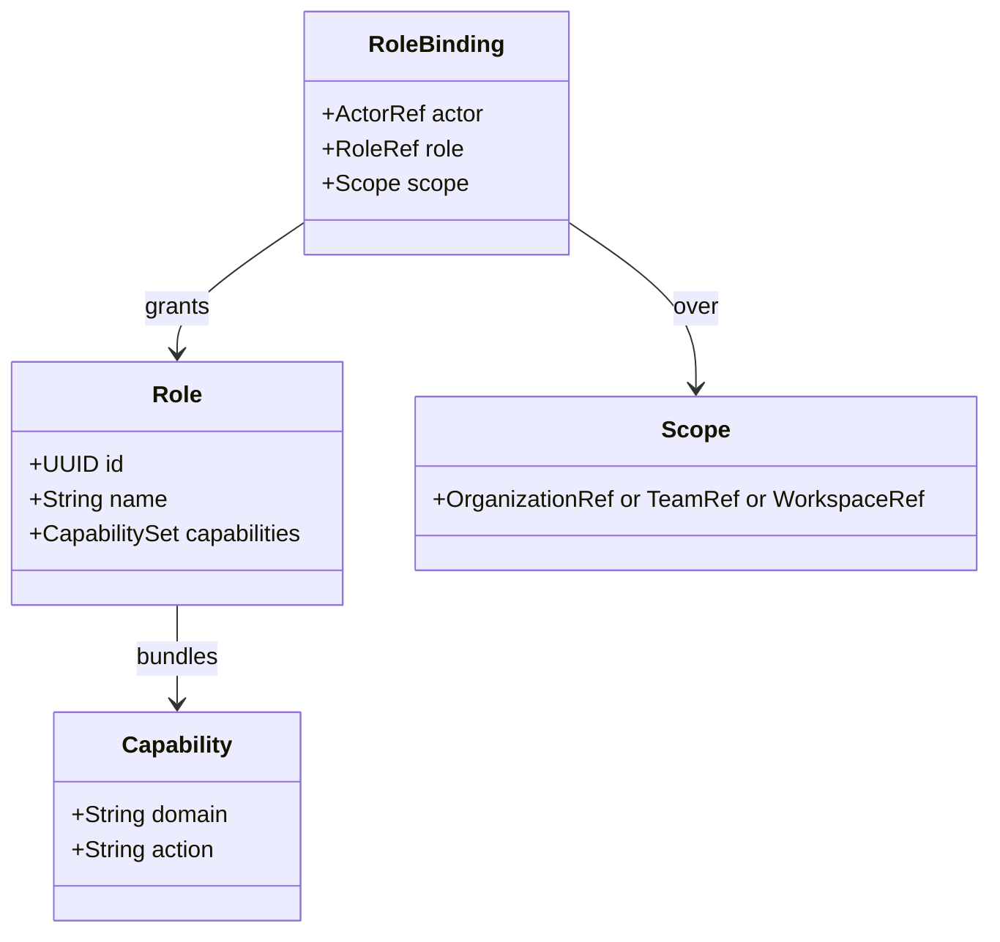
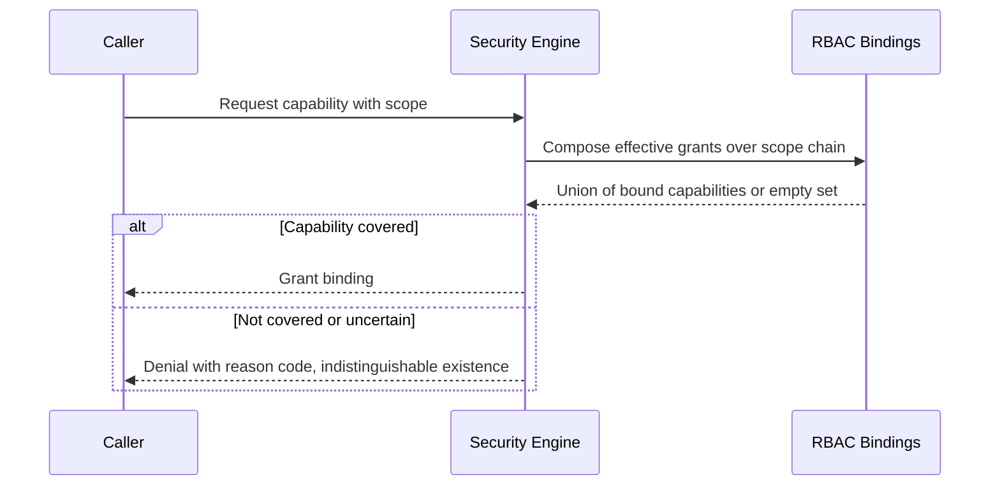

# 062 – RBAC

**Document ID:** DEVOS-SPEC-062

**Version:** 0.1

**Status:** Draft

**Category:** Enterprise

**Depends On:**

- DEVOS-SPEC-006 – Terminology
- DEVOS-SPEC-011 – Domain Model
- DEVOS-SPEC-015 – Object Ownership
- DEVOS-SPEC-020 – Workspace Specification
- DEVOS-SPEC-026 – Plugin Specification
- DEVOS-SPEC-030 – System Architecture
- DEVOS-SPEC-036 – Security Engine
- DEVOS-SPEC-054 – Workspace SDK
- DEVOS-SPEC-060 – Organizations
- DEVOS-SPEC-061 – Teams

**Referenced By:**

- DEVOS-SPEC-036 – Security Engine
- DEVOS-SPEC-050 – SDK Overview
- DEVOS-SPEC-054 – Workspace SDK
- DEVOS-SPEC-063 – Policy Engine
- DEVOS-SPEC-065 – Audit System

---

# Abstract

This document defines RBAC, the forward-looking Enterprise model for role-based access control across organizational Workspaces.

It defines roles as named grant bundles, bindings of roles to Actors over scopes, and evaluation semantics that extend the deny-by-default kernel of the Security Engine defined in DEVOS-SPEC-036 without replacing it.

This specification is forward-looking: it activates only through an approved RFC and ADR and imposes no obligations on Version 0.1 implementations.

---

# Purpose

This specification answers the following question:

> **How do many people gain differentiated, revocable authority over shared Workspaces while deny-by-default stays absolute?**

Roles bundle capabilities; bindings grant roles over scopes; evaluation composes bindings into effective grants.

Uncertainty still denies.

Ownership still stays singular.

The kernel remains the only evaluator.

---

# Goals

This specification aims to:

- Define roles as named, versioned capability bundles.
- Define role bindings over organizational, team, and workspace scopes.
- Define evaluation composition with single-kernel enforcement.
- Define revocation propagation duties.
- Preserve least privilege and auditability throughout.

---

# Non Goals

This specification does not define:

- Organizational or team structure, owned by DEVOS-SPEC-060 and DEVOS-SPEC-061
- Policy conditions beyond static grants, deferred to DEVOS-SPEC-063
- Attribute-based or relationship-based access models
- Federated identity mapping mechanics
- Concrete role catalogs shipped by implementations

---

# Model

Capabilities reuse the permission grammar established for plugins in DEVOS-SPEC-026, so one vocabulary serves human and extension authorization alike.

---

# Binding and Evaluation

Evaluation extends the Security Engine rather than bypassing it.

Rules:

- The engine remains the sole evaluator; RBAC supplies inputs, never verdicts.
- Effective capability equals the union of granted role capabilities within the applicable scope chain: organization, then team, then workspace.
- Deny-by-default is unchanged: absent, ambiguous, or expired bindings resolve to denial per DEVOS-SPEC-036.
- Scoping narrows only; a workspace-scoped grant never exceeds an organization-scoped equivalent.
- Every evaluation outcome participates in existing audit flows per DEVOS-SPEC-065.

---

# Revocation Propagation

Revocation must be timely and complete.

| Rule                  | Requirement                                                                  |
| --------------------- | ------------------------------------------------------------------------------ |
| Immediate effect      | Revoked bindings stop covering subsequent evaluations without grace periods.     |
| Membership cascade    | Organization or Team removal cascades binding loss through scope invalidation.  |
| Session honesty       | Long-lived handles report staleness honestly per DEVOS-SPEC-054 reference discipline. |
| Audit completeness    | Every revocation emits an attributable event per DEVOS-SPEC-065.                |
| Owner immunity        | Ownership rights of DEVOS-SPEC-015 are never diminished by binding changes.     |

Revocation never deletes objects; it removes authority paths only.

---

# Relationship to Version 0.1

Version 0.1 has exactly one authority path: the owning Actor plus explicit plugin grants evaluated by the Security Engine.

This document layers collective administration on top.

Activation requires an RFC, an approved ADR preserving aggregate invariants, and schema additions beside existing canonical schemas.

Until activated, implementations MUST NOT ship partial RBAC behavior.

---

# Enterprise Extension Invariants

The following invariants MUST hold when activated.

- The Security Engine remains the only evaluator of every capability request.
- Deny-by-default semantics are identical before and after activation.
- Roles bundle capabilities; they never create new capability kinds.
- Effective authority is always derivable from visible bindings.
- Revocation takes precedence over any prior approval, restating DEVOS-SPEC-036 normatively.
- Workspace ownership remains singular under all binding configurations.

These MUST NOT break the single Workspace aggregate model.

---

# Security Requirements

When activated, this extension enforces:

- Least privilege as the default posture for every catalogued role, restating Rule 8 of SPECIFICATION_RULES.md.
- Full attribution of role and binding administration through audit events per DEVOS-SPEC-065.
- No path by which a role grants secret-value access outside authorized transient resolution per DEVOS-SPEC-028.
- Evaluation locality preserving offline operation per Rule 7.

---

# Future Extensions

Future specifications may add support for:

- Time-bound and just-in-time role activations
- Separation-of-duties constraints across conflicting roles
- Delegated administration with bounded grant authority
- Policy-conditioned bindings aligned with DEVOS-SPEC-063

These extensions require their own RFCs and ADRs and MUST preserve the invariants above.

---

# References

- DEVOS-SPEC-006 – Terminology
- DEVOS-SPEC-007 – Scope
- DEVOS-SPEC-011 – Domain Model
- DEVOS-SPEC-015 – Object Ownership
- DEVOS-SPEC-020 – Workspace Specification
- DEVOS-SPEC-026 – Plugin Specification
- SPECIFICATION_RULES.md – Repository rule set (Rules 2, 7, 8)
- DEVOS-SPEC-028 – Secret Specification
- DEVOS-SPEC-030 – System Architecture
- DEVOS-SPEC-036 – Security Engine
- DEVOS-SPEC-050 – SDK Overview
- DEVOS-SPEC-054 – Workspace SDK
- DEVOS-SPEC-060 – Organizations
- DEVOS-SPEC-061 – Teams
- DEVOS-SPEC-063 – Policy Engine
- DEVOS-SPEC-065 – Audit System

---

# Revision History

| Version | Date | Author             | Notes         |
| ------- | ---- | ------------------ | ------------- |
| 0.1     | TBD  | DevOS Contributors | Initial Draft |
